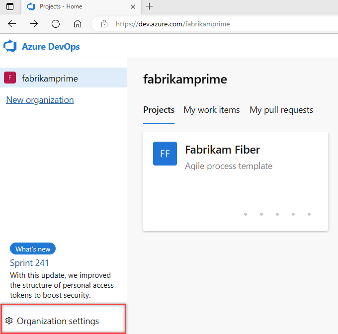
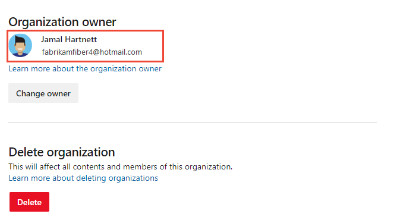
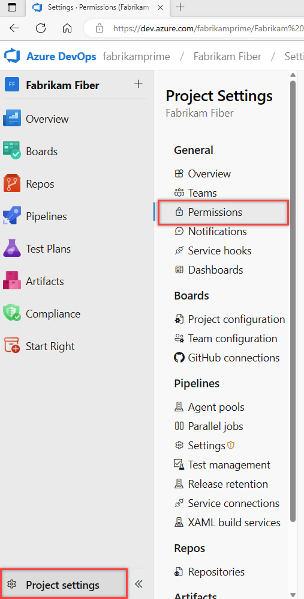
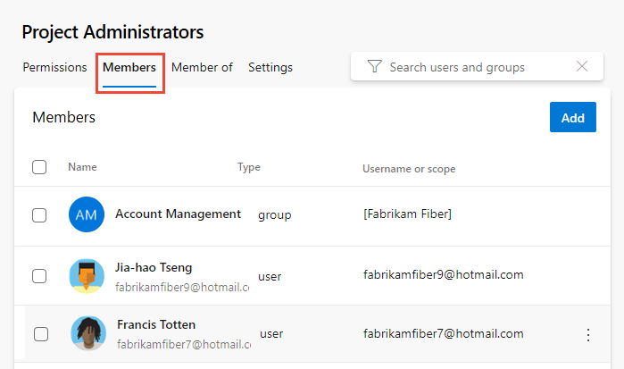
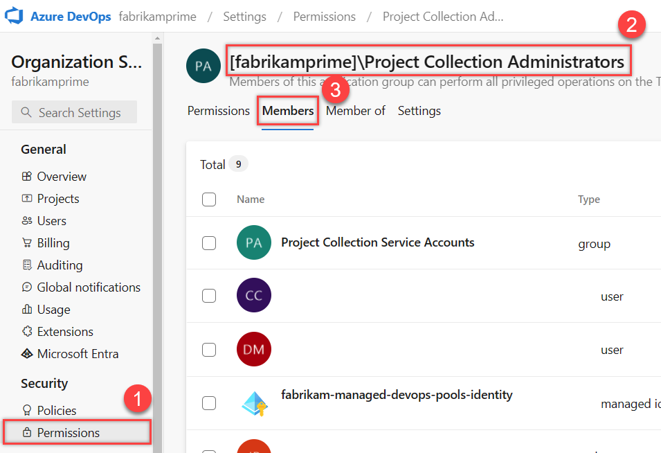
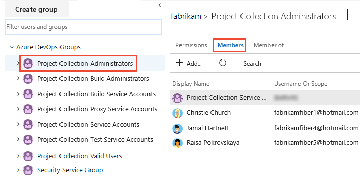
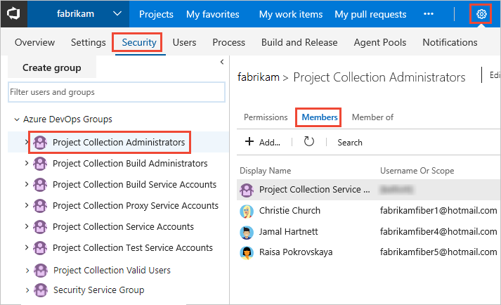

# Increase permission levels, find an admin 

[!INCLUDE [version-all](../../includes/version-all.md)]

 
To get access to features you don't have, you need to request an increase to your permissions or be added to a security role. Typically you need to request permissions from a member of the Project Administrators group or Project Collection Administrators group. To find a member of one of these groups, follow the steps provided in this article. 

To determine what level a permission is defined, see the [Permissions lookup guide](permissions-lookup-guide.md). For an overview of built-in security groups and default permission assignments, see [Default permissions and access](permissions-access.md).

## Prerequisites

* You must be a member of the Project Valid Users Group or Project Collection Valid Users Group to view permissions. Users added to a project are automatically added to these security groups. 

::: moniker range="azure-devops"  
> [!NOTE]  
> Users added to the **Project-Scoped Users** group won't be able to access **Organization Settings** other than the **Overview** section if the **Limit user visibility for projects** preview feature is enabled for the organization. To learn more, see [About projects and scaling your organization, Project-scoped Users group ](../projects/about-projects.md#project-scoped-user-group). 

::: moniker-end  

::: moniker range="azure-devops"

## Look up the organization owner 

The organization owner can provide permissions at any level within the organization or project. 

1. Choose the Azure DevOps logo :::image type="icon" source="/azure/devops/media/icons/project-icon.png" border="false"::: to open **Projects**, and then choose :::image type="icon" source="../../media/icons/gear-icon.png" border="false"::: **Organization settings**. 

	  

2. Choose **Overview** and scroll down to show the **Organization owner**.

   > [!div class="mx-imgBorder"]  
   > 

   To change the owner, see [Change organization owner](../accounts/change-organization-ownership.md). 

::: moniker-end

## Show members of the Project Administrators group

For permissions managed at the project-level, request them from a member of the [Project Administrators group](set-project-collection-level-permissions.md). Project collection administrators manage features and functions that impact all projects. 

Choose the Project Administrators group from the **Project Settings > Permissions** page to see members. If you want to be a Project Administrator, have your current administrator add you. 

::: moniker range="azure-devops"

> [!NOTE]   
> To enable the new user interface for the Project Permissions Settings Page, see [Enable preview features](../../project/navigation/preview-features.md).

#### [Preview page](#tab/preview-page) 

1. Open the web portal and choose your project. To choose another project, see [Switch project, repository, team](../../project/navigation/go-to-project-repo.md).

2. Choose **Project settings**, and then **Permissions**.

	

3. Choose **Project Administrators** group, and then **Members**.  

	> [!div class="mx-imgBorder"]  
	>  

4. Enter the name of the user account into the text box and then select from the match that appears. You can enter several identities recognized by the system into the **Add users and/or groups** box. The system automatically searches for matches. Choose the matches that meet your choices. 

	> [!div class="mx-imgBorder"]  
	>   

	> [!NOTE]   
	> Users that have limited access, such as Stakeholders, won't be able to access select features even if granted permissions to those features. To learn more, see [Permissions and access](permissions-access.md).

5. Choose **Save**. 

#### [Current page](#tab/current-page) 

1. Open the web portal and choose your project. To choose another project, see [Switch project, repository, team](../../project/navigation/go-to-project-repo.md).

2. Choose **Project Settings**, and then **Security**.

	*To see the full image, click to expand*.

	 

3. Choose **Project Administrators** group, and then the **Members** tab.  The list of members is shown.   

	> [!div class="mx-imgBorder"]  
	>  

* * *

::: moniker-end    

::: moniker range="azure-devops-2019 || azure-devops-2020"

1. Open the web portal and choose your project. To choose another project, see [Switch project, repository, team](../../project/navigation/go-to-project-repo.md).

2. Choose **Project Settings**, and then **Security**.

	*To see the full image, click to expand*.

	 

3. Choose the **Members** tab. The list of members is shown. 

	> [!div class="mx-imgBorder"]  
	>  

::: moniker-end  

::: moniker range="<= tfs-2018"  

1. Open the web portal and choose your project. To choose another project, see [Switch project, repository, team](../../project/navigation/go-to-project-repo.md).  

2. Choose the :::image type="icon" source="../../media/icons/gear-icon.png" border="false"::: gear icon to open **Project Settings**.

     

3. Choose the **Security** page, **Project Administrators** group, and then the **Members** tab.  

	The list of members is shown. 

	> [!div class="mx-imgBorder"]  
	>  

::: moniker-end

## Show members of the Project Collection Administrators group

For permissions managed at the organization or collection-level, request them from a member of the [Project Collection Administrators group](set-project-collection-level-permissions.md). Project collection administrators manage features and functions that impact all projects. 

::: moniker range="azure-devops"

To find out who is a member of the Project Collection Administrators group, check the **Permissions** settings at the collection level. 

> [!NOTE]   
> To enable the new user interface for the **Organization Permissions Settings Page v2**, see [Enable preview features](../../project/navigation/preview-features.md). The preview page provides a group settings page that the current page does not. 

1. Choose the :::image type="icon" source="../../media/icons/project-icon.png" border="false"::: Azure DevOps logo to open your projects, and then choose :::image type="icon" source="../../media/icons/gear-icon.png" border="false"::: **Organization settings**.  

	

2. Choose **Permissions** under the Security group, and then **Project Collection Administrators** > **Members** tab. 

	> [!div class="mx-imgBorder"]  
	>   

::: moniker-end   

::: moniker range="azure-devops-2019 || azure-devops-2020"

To find out who is a member, check the **Security** settings at the collection level. 

1. Choose the :::image type="icon" source="../../media/icons/project-icon.png" border="false"::: Azure DevOps logo to open **Projects**, and then choose **Organization settings**. 

   

2. Choose **Security**, the **Project Collection Administrators** group, and then **Members**. 

	> [!div class="mx-imgBorder"]  
	>   

::: moniker-end  

::: moniker range="<= tfs-2018"

1. Choose the :::image type="icon" source="../../media/icons/project-icon.png" border="false"::: settings icon and choose **Collection settings**.

	> [!div class="mx-imgBorder"]  
	>   

2. Choose **Security**, **Project Collection Administrators** group, and then **Members**. 

   

::: moniker-end

## Next steps

> [!div class="nextstepaction"]
> [Add users to a project or team](add-users-team-project.md) 

