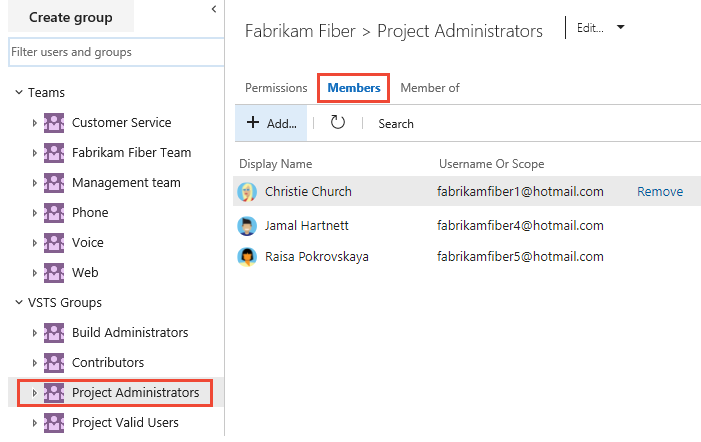
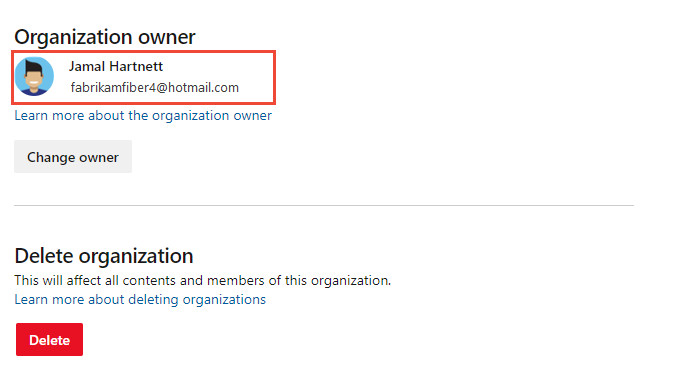

::: moniker range="azure-devops"
# Look up administrators and organization owner 
::: moniker-end

::: moniker range="<= azure-devops-2019"
# Look up administrators 
::: moniker-end

[!INCLUDE [temp](../../_shared/version-vsts-tfs-all-versions.md)]

When you need to have your permissions changed or you need to get access to select features or functions, you may need to find out who can grant them. Usually it is an administrator or the account owner.

For an overview of built-in security groups and default permission assignments, see [Default permissions and access](permissions-access.md).

## Prerequisites

* You must have a project. If you don't have a project yet, [create one](../projects/create-project.md).  
* You must be a member of the Project Valid Users Group or Project Collection Valid Users Group to view permissions.  

## Show members of the Project Administrators group

If you aren't a project administrator, and you need to be, find someone who is, and have them add you. You can find who is a member of the Project Administrators group by choosing that group from the **Project Settings>Security** page and seeing who are members. 

::: moniker range=">= azure-devops-2019"

1. Open the web portal and choose the project where you want to add users or groups. To choose another project, see [Switch project, repository, team](../../project/navigation/go-to-project-repo.md).

2. Choose **Project Settings** and then **Security**.

	*To see the full image, click to expand*.

	 

0. Choose the **Members** tab.  

	> [!div class="mx-imgBorder"]  
	>  

::: moniker-end  

::: moniker range="<= tfs-2018"  

0. Open the web portal and choose the project where you want to add users or groups. To choose another project, see [Switch project, repository, team](../../project/navigation/go-to-project-repo.md).  

0.  Choose the  gear icon to open **Project Settings**.

     

0. Choose the **Security** page, **Project Administrators** group, and the **Members** tab.  

	> [!div class="mx-imgBorder"]  
	>  

::: moniker-end

## Show members of the Project Collection Administrators group

If you need elevated permissions, you'll have to request them from a member of the [Project Collection Administrators group](set-project-collection-level-permissions.md). Project collection administrators manage features and functions that impact all projects. 

To find out who is a member, check the **Security** settings at the collection level. 

::: moniker range=">= azure-devops-2019"

0. Choose the  Azure DevOps logo to open **Projects**. Then choose **Admin settings**. 

	> [!div class="mx-imgBorder"]  
	>   

0. Choose **Security**, the **Project Collection Administrators** group, and then **Members**. 

	> [!div class="mx-imgBorder"]  
	>   

::: moniker-end  

::: moniker range="<= tfs-2018"

0. Choose the  settings icon and select **Organization settings** or **Collection settings**.

	> [!div class="mx-imgBorder"]  
	>   

0.	Choose **Security**, **Project Collection Administrators** group, and then **Members**. 

	

::: moniker-end

::: moniker range="azure-devops"

## Show who is the organization owner 

0. Choose the  Azure DevOps logo to open **Projects**. Then choose **Admin settings**. 

	> [!div class="mx-imgBorder"]  
	>   

0.	Choose **Overview** to find the current owner.

	> [!div class="mx-imgBorder"]  
	> 

	To change the owner, see [Change organization owner](../accounts/change-organization-ownership.md). 

::: moniker-end

## Try this next
> [!div class="nextstepaction"]
> [Add users to a project or team](add-users-team-project.md) 

