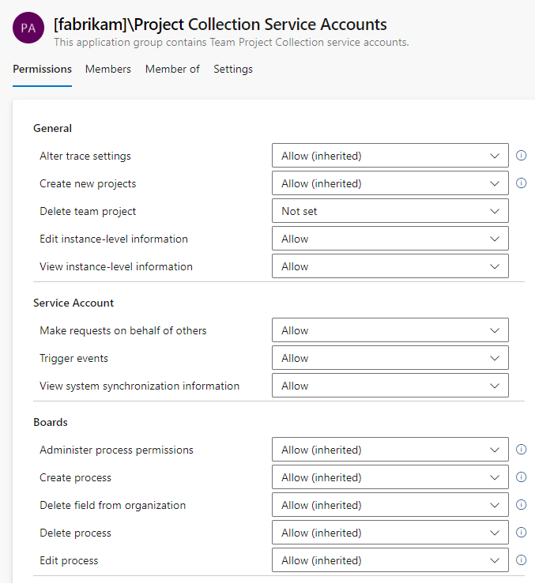

:::row:::
   :::column span="1":::
  **Users and groups**
  ::: moniker range="azure-devops"
  -[Add users to an administrator role](set-project-collection-level-permissions.md)  
  -[Add users to an organization](../accounts/add-organization-users.md)  
  -[Add users to a project or a team](add-users-team-project.md)  
  -[Add a team admin](../settings/add-team-administrator.md)  
  ::: moniker-end
  ::: moniker range="< azure-devops"
  -[Add a server-level administrator](/azure/devops/server/admin/add-administrator)  
  -[Add users to an administrator role](set-project-collection-level-permissions.md)  
  -[Add users to a project or team](add-users-team-project.md)  
  -[Add a team admin](../settings/add-team-administrator.md)  
  ::: moniker-end
  ---
  **Wiki**  

  -[README & Wiki](../../project/wiki/manage-readme-wiki-permissions.md)  
   :::column-end:::
   :::column span="1":::
  **DevOps**  

  -[Git branch](../../repos/git/branch-permissions.md)  
  -[Git repositories](../../repos/git/set-git-repository-permissions.md)  
  -[TFVC](../../repos/tfvc/set-tfvc-repository-permissions.md)  
  -[Build and release pipelines](../../pipelines/policies/set-permissions.md)  
  -[Approvals and approvers](../../pipelines/release/approvals/index.md)  
  -[Task groups](../../pipelines/policies/set-permissions.md)   
  -[Variable groups](../../pipelines/policies/set-permissions.md)  
  -[Role-based resources](../../pipelines/policies/set-permissions.md)  
   :::column-end:::
   :::column span="1":::
  **Work tracking**
  ::: moniker range=">= tfs-2017"
  -[Area and iteration paths](set-permissions-access-work-tracking.md)  
  -[Queries and folders](../../boards/queries/set-query-permissions.md)  
  -[Plan permissions](../../boards/plans/edit-delivery-plan-permissions.md)  
  -[Customize process](set-permissions-access-work-tracking.md#process-permissions)  
  ::: moniker-end
  ::: moniker range="< tfs-2017"
  -[Area and iteration paths](set-permissions-access-work-tracking.md)  
  -[Queries and folders](../../boards/queries/set-query-permissions.md)  
  -[Customize process](set-permissions-access-work-tracking.md#process-permissions)  
  ::: moniker-end
  ---
  **Reporting**
  ::: moniker range="azure-devops"
  -[Dashboard permissions](../../report/dashboards/dashboard-permissions.md#set-permissions)  
  -[Analytics](../../report/powerbi/analytics-security.md)  
  -[Analytics views](../../report/powerbi/analytics-security.md)  
  ::: moniker-end
  ::: moniker range="> tfs-2018 < azure-devops"
  -[Dashboard permissions](../../report/dashboards/dashboard-permissions.md#set-permissions)  
  -[Analytics](../../report/powerbi/analytics-security.md)  
  -[Analytics views](../../report/powerbi/analytics-security.md) 
  -[SQL Server Reports](../../report/admin/grant-permissions-to-reports.md) 
  ::: moniker-end
  ::: moniker range="<= tfs-2018"
  -[Dashboard permissions](../../report/dashboards/dashboard-permissions.md#set-permissions)  
  -[SQL Server Reports](../../report/admin/grant-permissions-to-reports.md) 
  ::: moniker-end
   :::column-end:::
:::row-end:::

     

>[!NOTE]  
> The images you see from your web portal may differ from the images you see in this topic. These differences result from updates made to Azure DevOps. However, the basic functionality available to you remains the same unless explicitly mentioned. 

   

## Service accounts

   There are a few service accounts that are generated by the system to support specific operations. These include those described in the following table. These user accounts are added at the organization or collection level. 

| User name | Description |  
| ----------| ----------- |  
| Agent Pool Service | Has permission to listen to the message queue for the specific pool to receive work. In most cases, you should not have to manage members of this group. The agent registration process takes care of it for you. The service account you specify for the agent (commonly Network Service) is automatically added when you register the agent. Responsible for performing Azure Boards read/write operations and updating work items when GitHub objects are updated.   |  
| Azure Boards | Added when Azure Boards is [connected to GitHub](../../boards/github/connect-to-github.md). You should not have to manage members of this group. Responsible for managing the link creation between GitHub and Azure Boards. |  
| PipelinesSDK | Added as needed to support the Pipelines policy service scope tokens. This user account is similar to the build service identities but supports locking down permissions separately. In practice, the tokens that involve this identity are granted read-only permissions to pipeline resources and the one-time ability to approve policy requests. This account should be treated in the same way that the build service identities are treated.   |  
| *ProjectName* Build Service | Has permissions to run build services for the project. This is a legacy user used for XAML builds. It is added to the Security Service Group, which is used to store users who have been granted permissions, but not added to any other security group.  |  
| Project Collection Build Service | Has permissions to run build services for the collection. It is added to the Security Service Group, which is used to store users who have been granted permissions, but not added to any other security group.  |  

   

## Groups

   Permissions can be granted directly to an individual, or to a group.
   Using groups makes things a lot simpler. 
   The system provides several built-in groups for that purpose.
   These groups and the default permissions they're assigned are defined at different levels:
   server (on-premises deployment only), project collection, project, and specific objects.
   You can also create your own groups and grant them the specific set of permissions
   that are appropriate for certain roles in your organization.

::: moniker range="azure-devops"

[!INCLUDE [version-all](./includes/hidden-security-groups.md)]

::: moniker-end

   <!---
   Team Foundation Administrators
   Team Foundation Proxy Service Accounts
   Team Foundation Service Accounts
   Team Foundation Valid Users
   Project Server Integration Service Accounts
   SharePoint Web Application Services
-->

   

::: moniker range="< azure-devops"

## Server-level groups 

   When you install Azure DevOps Server, the system creates default groups that have [deployment-wide, server-level permissions](#server-permissions). You can not remove or delete the built-in server-level groups.

::: moniker-end

::: moniker range="azure-devops-2019 || azure-devops-2020"

> [!div class="mx-imgBorder"]  
>  

::: moniker-end

::: moniker range="< azure-devops-2019"

::: moniker-end

::: moniker range="< azure-devops"

   You can't remove or delete the default server level groups.

::: moniker-end

::: moniker range=">= azure-devops-2019 < azure-devops"

:::row:::
   :::column span="1":::
   **Group name**
   :::column-end:::
   :::column span="1":::
   **Permissions**
   :::column-end:::
   :::column span="2":::
   **Membership**
   :::column-end:::
:::row-end:::
:::row:::
   :::column span="1":::
   Azure DevOps Service Accounts
   :::column-end:::
   :::column span="1":::
   Has service-level permissions for the server instance.
   :::column-end:::
   :::column span="2":::
   Contains the service account that was supplied during installation  

   This group should contain only service accounts
   and not user accounts or groups that contain user accounts.
   By default, this group is a member of **Team Foundation Administrators**.  

   If you need to add an account to this group after you install Azure DevOps Server or TFS, you can do so using
   the TFSSecurity.exe utility in the **Tools** subfolder of your TFS installation directory.
   The command to do this is `TFSSecurity /g+ "[TEAM FOUNDATION]\Team Foundation Service Accounts" n:domain\username /server:http(s)://tfsservername`
   :::column-end:::
:::row-end:::
:::row:::
   :::column span="1":::
   Azure DevOps Valid Users
   :::column-end:::
   :::column span="1":::   
   Has permission to view server instance-level information.
   :::column-end:::
   :::column span="2":::   
   Contains all users known to exist in the server instance.
   You can&#39;t modify the membership of this group.
   :::column-end:::
:::row-end:::
:::row:::
   :::column span="1":::
   Team Foundation Administrators
   :::column-end:::
   :::column span="1":::   
   Has permissions to perform all server-level operations.
   :::column-end:::
   :::column span="2":::
   **Local Administrators** group (BUILTIN\Administrators)
   for any server that hosts Azure DevOPs/Team Foundation application services.  

   *Server* **\Team Foundation Service Accounts** group
   and the members of the **\Project Server Integration Service Accounts** group.  

   This group should be restricted to the smallest possible number of users
   who need total administrative control over server-level operations.

   > If your deployment uses SharePoint or Reporting, consider [adding the members of this group](/azure/devops/server/admin/add-administrator) to the Farm Administrators and Site Collection Administrators groups in SharePoint and the Team Foundation Content Managers groups in Reporting Services.
   :::column-end:::
:::row-end:::

::: moniker-end

::: moniker range="< azure-devops-2019"

:::row:::
   :::column span="1":::
   **Group name**
   :::column-end:::
   :::column span="1":::
   **Permissions**
   :::column-end:::
   :::column span="1":::
   **Membership**
   :::column-end:::
:::row-end:::
:::row:::
   :::column span="1":::
   Team Foundation Administrators
   :::column-end:::
   :::column span="1":::   
   Has permissions to perform all server-level operations.
   :::column-end:::
   :::column span="1":::   
   **Local Administrators** group (BUILTIN\Administrators)
   for any server that hosts Azure DevOPs/Team Foundation application services.  

   *Server* **\Team Foundation Service Accounts** group
   and the members of the **\Project Server Integration Service Accounts** group.  

   This group should be restricted to the smallest possible number of users
   who need total administrative control over server-level operations.  

   > If your deployment uses SharePoint or Reporting, consider [adding the members of this group](/azure/devops/server/admin/add-administrator) to the Farm Administrators and Site Collection Administrators groups in SharePoint and the Team Foundation Content Managers groups in Reporting Services.

   :::column-end:::
:::row-end:::
:::row:::
   :::column span="1":::
   Team Foundation Proxy Service Accounts
   :::column-end:::
   :::column span="1":::   
   Has service level permissions for Team Foundation Server Proxy,
   and some service-level permissions.

   > Created when you install the TFS proxy service.
   :::column-end:::
   :::column span="1":::   
   This group should contain only service accounts and not user accounts or groups
   that contain user accounts.

   :::column-end:::
:::row-end:::
:::row:::
   :::column span="1":::
   Team Foundation Service Accounts
   :::column-end:::
   :::column span="1":::
   Has service-level permissions for the server instance.
   :::column-end:::
   :::column span="1":::
   Contains the service account that was supplied during installation  

   This group should contain only service accounts
   and not user accounts or groups that contain user accounts.
   By default, this group is a member of **Team Foundation Administrators**.  

   If you need to add an account to this group after you install Azure DevOps Server or TFS, you can do so using
   the TFSSecurity.exe utility in the **Tools** subfolder of your TFS installation directory.
   The command to do this is `TFSSecurity /g+ "[TEAM FOUNDATION]\Team Foundation Service Accounts" n:domain\username /server:http(s)://tfsservername`
   :::column-end:::
:::row-end:::
:::row:::
   :::column span="1":::
   Team Foundation Valid Users
   :::column-end:::
   :::column span="1":::
   
   Has permission to view server instance-level information.

   > If you set the **View instance-level information** permission to **Deny** or **Not set** for this group, no users will be able to access the deployment.
   :::column-end:::
   :::column span="1":::
   
   Contains all users known to exist in the server instance.
   You can&#39;t modify the membership of this group.

   :::column-end:::
:::row-end:::
:::row:::
   :::column span="1":::
   Project Server Integration Service Accounts   
   :::column-end:::
   :::column span="1":::
   
   Has service level permissions for the Project Server deployments
   that are configured for inter-operation with the server instance
   and some TFS service level permissions.

   > Created when you install Project Service integration.
   :::column-end:::
   :::column span="1":::   
   This group should contain only service accounts
   and not user accounts or groups that contain user accounts.
   By default, this group is a member of **Team Foundation Administrators**.
   :::column-end:::
:::row-end:::
:::row:::
   :::column span="1":::
   SharePoint Web Application Services
   :::column-end:::
   :::column span="1":::
   
   Has service level permissions for the SharePoint Web applications
   that are configured for use with TFS
   and some service level permissions for TFS.

   :::column-end:::
   :::column span="1":::
   
   This group should contain only service accounts
   and not user accounts or groups that contain user accounts.
   Unlike the Service Accounts group, this group is not a member
   of **Team Foundation Administrators**.

   :::column-end:::
:::row-end:::

::: moniker-end

::: moniker range="< azure-devops"

> The full name of each of these groups is **[Team Foundation]\\{group name}**.
> So the full name of the server level administrators group is
> **[Team Foundation]\\Team Foundation Administrators**.

::: moniker-end

   

## Collection-level groups

   When you create an organization or project collection in Azure DevOps, the system creates collection-level groups that have [permissions in that collection](#collection-level). You can not remove or delete the built-in collection-level groups.

   <!---
   Project Collection Administrators
   Project Collection Build Administrators
   Project Collection Build Service Accounts
   Project Collection Proxy Service Accounts
   Project Collection Service Accounts
   Project Collection Test Service Accounts
   Project Collection Valid Users
   Security Service Group
-->

::: moniker range="azure-devops"

> [!NOTE]   
> To enable the new user interface for the Organizations Permissions Settings Page v2, see [Enable preview features](../../project/navigation/preview-features.md). The preview page provides a group settings page that the current page does not.  

> [!div class="mx-imgBorder"]  
> 

::: moniker-end

::: moniker range="< azure-devops"

> [!div class="mx-imgBorder"]  
> 

::: moniker-end

   The full name of each of these groups is **[{collection name}]\\{group name}**. 
   So the full name of the administrator group for the default collection is 
**[Default Collection]\\Project Collection Administrators**.

:::row:::
   :::column span="1":::
  **Group name**
   :::column-end:::
   :::column span="1":::
  **Permissions**
   :::column-end:::
   :::column span="2":::
  **Membership**
   :::column-end:::
:::row-end:::
:::row:::
   :::column span="1":::
  Project Collection Administrators
   :::column-end:::
   :::column span="1":::
  Has permissions to perform all operations for the collection.
   :::column-end:::
   :::column span="2":::
   Contains the **Local Administrators** group (BUILTIN\Administrators)
   for the server where the application-tier services have been installed.
   Also, contains the members of the *CollectionName*/**Service Accounts** group.
   This group should be restricted to the smallest possible number of users who need total administrative control over the collection. For Azure DevOps, assign to administrators who customize work tracking. 
   ::: moniker range="< azure-devops"
   > [!NOTE]
   > If your deployment uses Reporting Services, consider adding the members of this group to the [Team Foundation Content Managers groups in Reporting Services](../../report/admin/grant-permissions-to-reports.md).
   ::: moniker-end
   :::column-end:::
:::row-end:::
:::row:::
   :::column span="1":::
   Project Collection Build Administrators
   :::column-end:::
   :::column span="1":::
   Has permissions to administer build resources and permissions for the collection.
   :::column-end:::
   :::column span="2":::
   Limit this group to the smallest possible number of users who need total administrative control over build servers and services for this collection.
   :::column-end:::
:::row-end:::
:::row:::
   :::column span="1":::
   Project Collection Build Service Accounts
   :::column-end:::
   :::column span="1":::
   Has permissions to run build services for the collection.
   :::column-end:::
   :::column span="2":::
   Limit this group to service accounts and groups that contain only service accounts. This is a legacy group used for XAML builds. Use the Project Collection Build Service ({your organization}) user for managing permissions for current builds. 
   :::column-end:::
:::row-end:::
:::row:::
   :::column span="1":::
   Project Collection Proxy Service Accounts
   :::column-end:::
   :::column span="1":::
   Has permissions to run the proxy service for the collection.
   :::column-end:::
   :::column span="2":::
   Limit this group to service accounts and groups that contain only service accounts.
   :::column-end:::
:::row-end:::
:::row:::
   :::column span="1":::
   Project Collection Service Accounts
   :::column-end:::
   :::column span="1":::
   Has service level permissions for the collection and for Azure DevOps Server.
   :::column-end:::
   :::column span="2":::
   Contains the service account that was supplied during installation. This group should contain only service accounts and groups that contain only service accounts. By default, this group is a member of the Administrators group.
   :::column-end:::
:::row-end:::
:::row:::
   :::column span="1":::
   Project Collection Test Service Accounts
   :::column-end:::
   :::column span="1":::
   Has test service permissions for the collection.
   :::column-end:::
   :::column span="2":::
   Limit this group to service accounts and groups that contain only service accounts.
   :::column-end:::
:::row-end:::
:::row:::
   :::column span="1":::
   Project Collection Valid Users
   :::column-end:::
   :::column span="1":::
   Has permissions to access team projects and view information in the collection.
   :::column-end:::
   :::column span="2":::
   Contains all users and groups that have been added anywhere within the collection. You cannot modify the membership of this group.
   :::column-end:::
:::row-end:::
::: moniker range="azure-devops"
:::row:::
   :::column span="1":::
   Project-Scoped Users <a id="project-scoped-user-group" />
   :::column-end:::
   :::column span="1":::
   Has limited access to view organization settings and projects other than those projects they are specifically added to. Also, people picker options are limited to those users and groups that have been explicitly added to the project the user is connected to.
   :::column-end:::
   :::column span="2":::
   Add users to this group when you want to limit their visibility and access to those projects that you explicitly add them to. Do not add users to this group if they are also added to the Project Collection Administrators group.  
   > [!NOTE]   
   > The **Project-Scoped Users** group becomes available with restricted access when the organization-level preview feature, **Limit user visibility for projects** is enabled. To learn more, see [About projects, Limit user visibility for projects](../projects/about-projects.md#project-scoped-user-group).
   :::column-end:::
:::row-end:::
::: moniker-end
:::row:::
   :::column span="1":::
   Security Service Group
   :::column-end:::
   :::column span="1":::
   Used to store users who have been granted permissions, but not added to any other security group. 
   :::column-end:::
   :::column span="2":::
   Don't assign users to this group. If you are removing users from all security groups, check if you need to remove them from this group.   
   :::column-end:::
:::row-end:::

 

   <!---
   Build Administrators
   Contributors
   Endpoint Administrators - cloud
   Project Administrators
   Project Valid Users
   Readers
   Release Administrators (TFS 2017, Azure DevOps)
[team name]
-->

   <a id="project-level-groups" />

## Project-level groups

   For each project that you create, the system creates the followings project-level groups. These groups are assigned [project-level permissions](#team-project-level-permissions).

::: moniker range="azure-devops"

> [!NOTE]   
> To enable the new user interface for the Project Permissions Settings Page, see [Enable preview features](../../project/navigation/preview-features.md).

#### [Preview page](#tab/preview-page) 

#### [Current page](#tab/current-page) 

*To see the full image, click to expand*.

 

* * * 

::: moniker-end

::: moniker range="< azure-devops"

*To see the full image, click to expand*.

 

::: moniker-end

> [!TIP]  
> The full name of each of these groups is **[{project name}]\\{group name}**. 
> For example, the contributors group for a project called "My Project" is 
> **[My Project]\\Contributors**.

:::row:::
   :::column span="1":::
  **Group name**
   :::column-end:::
   :::column span="1":::
  **Permissions**
   :::column-end:::
   :::column span="2":::
  **Membership**
   :::column-end:::
:::row-end:::
:::row:::
   :::column span="1":::
  Build Administrators
   :::column-end:::
   :::column span="1":::
  Has permissions to administer build resources and build permissions for the project. Members can manage test environments, create test runs, and manage builds.
   :::column-end:::
   :::column span="2":::
   Assign to users who define and manage build pipelines.
   :::column-end:::
:::row-end:::
:::row:::
   :::column span="1":::
   Contributors
   :::column-end:::
   :::column span="1":::
   Has permissions to contribute fully to the project code base and work item tracking. The main permissions they don't have are those that manage or administer resources.
   :::column-end:::
   :::column span="2":::
   By default, the team group created when you create a project is added to this group, and any user you add to the team or project is a member of this group. In addition, any team you create for a project is added to this group.
   :::column-end:::
:::row-end:::
:::row:::
   :::column span="1":::
   Readers
   :::column-end:::
   :::column span="1":::
   Has permissions to view project information, the code base, work items, and other artifacts but not modify them.
   :::column-end:::
   :::column span="2":::
   Assign to members of your organization or collection who you want to provide view-only permissions to a project. These users can view backlogs, boards, dashboards, and more, but not add or edit anything.  
   :::column-end:::
:::row-end:::
:::row:::
   :::column span="1":::
   Project Administrators<a id="project-administrator-group" />
   :::column-end:::
   :::column span="1":::
   Has permissions to administer all aspects of teams and project, although they can't create team projects.
   :::column-end:::
   :::column span="2":::
  Assign to users who manage user permissions, create or edit teams, modify team settings, define area an iteration path, or customize work item tracking. Members of the Project Administrators group are granted permissions to perform the following tasks: 
  - Add and remove users from project membership 
  - Add and remove custom security groups from a project 
  - Add and administer all project teams and team-related features  
  - Edit project level permission ACLs  
  - Edit [event subscriptions (email or SOAP)](#alerts) for teams or project-level events.  
   :::column-end:::
:::row-end:::
:::row:::
   :::column span="1":::
   Project Valid Users
   :::column-end:::
   :::column span="1":::
   Has permissions to access and view project information.
   :::column-end:::
   :::column span="2":::
   Contains all users and groups that have been added anywhere to the project. You cannot modify the membership of this group.
   > [!NOTE]  
   > We recommend that you don't change the default permissions for this group. 
   :::column-end:::
:::row-end:::
::: moniker range=">= tfs-2017"
:::row:::
   :::column span="1":::
   Release Administrators
   :::column-end:::
   :::column span="1":::
   Has permissions to manage all release operations.
   :::column-end:::
   :::column span="2":::
   Assign to users who define and manage release pipelines.
   > [!NOTE]   
   > The Release Administrator group is created at the same time the first release pipeline is defined. It isn't created by default when the project is created. Valid for TFS-2017 and later versions.
   :::column-end:::
:::row-end:::
::: moniker-end
:::row:::
   :::column span="1":::
   *TeamName* <a id="team-group" /> 
   :::column-end:::
   :::column span="1":::
   Has permissions to contribute fully to the project code base and work item tracking.  The default Team group is created when you create a project, and by default is added to the Contributors group for the project. Any new teams you create will also have a group created for them and added to the Contributors group.
   :::column-end:::
   :::column span="2":::
   Add members of the team to this group. To grant access to configure team settings, [add a team member to the team administrator role](../settings/add-team-administrator.md).
   :::column-end:::
:::row-end:::

   <!---
   Create and manage team alerts
   Create and manage team rooms
   Configure team backlogs
   Customize the Kanban board (Add columns, Swimlanes, Customize Cards, Definition of Done ...
   Manage team dashboards
   Select team area paths
   Select team sprints
   Set working days off
   Show bugs on backlogs and boards
-->

## Team administrator role

   For each team that you add, you can assign one or more team members as administrators. The team admin role isn't a group with a set of defined permissions. Instead, the team admin role is tasked with managing  team assets. To learn more, see [Manage teams and configure team tools](../settings/manage-teams.md). To add a user as a team administrator, see [Add a team administrator](../settings/add-team-administrator.md).

> [!NOTE]   
> Project Administrators can manage all team administrative areas for all teams. 

## Permissions

   The system manages permissions at different levels&mdash;server, collection, project, or object&mdash;and by default assigns them to one or more built-in groups. You manage most permissions through the web portal.

   
   

::: moniker range="< azure-devops"

## Server-level permissions 

   You manage server-level permissions through the [Team Foundation Administration Console](/azure/devops/server/admin/add-administrator) or [TFSSecurity command-line tool](/azure/devops/server/command-line/tfssecurity-cmd#permissions). Team Foundation Administrators are granted all server-level permissions. Other server-level groups have select permission assignments.

> [!div class="mx-imgBorder"]  
>  

:::row:::
   :::column span="1":::
   **Permission**
   :::column-end:::
   :::column span="2":::
   **Description**
   :::column-end:::
:::row-end:::
:::row:::
   :::column span="1":::
    Administer warehouse
   :::column-end:::
   :::column span="2":::
   Can process or change settings for the data warehouse or SQL Server Analysis cube
   by using the [Warehouse Control Web Service](../../report/admin/manage-reports-data-warehouse-cube.md).  

   Additional permissions may be required to fully process
   or [rebuild the data warehouse and Analysis cube](../../report/admin/rebuild-data-warehouse-and-cube.md).
   :::column-end:::
:::row-end:::
:::row:::
   :::column span="1":::
    Create project collection
   :::column-end:::
   :::column span="2":::
   Can create and administer collections.
   :::column-end:::
:::row-end:::
:::row:::
   :::column span="1":::
    Delete project collection
   :::column-end:::
   :::column span="2":::   
   Can delete a collection from the deployment.

   > [!NOTE]  
   > Deleting a collection won't delete the collection database from SQL Server.

   :::column-end:::
:::row-end:::
:::row:::
   :::column span="1":::
    Edit instance-level information
   :::column-end:::
   :::column span="2":::
   
   Can edit server-level permissions for users and groups,
   and add or remove server level groups from the collection.
   > **Edit instance-level information** includes the ability to perform these tasks for all team projects defined in all collections defined for the instance:  
   >
   > - Create and modify areas and iterations
   > - Edit check-in policies
   > - Edit shared work item queries
   > - Edit project level and collection level permission ACLs
   > - Create and modify global lists
   > - Edit [event subscriptions](#alerts) (email or SOAP).
   >
   > When set through the menus, the **Edit instance-level information** permission also implicitly allows the user to modify version control permissions. To grant all these permissions at a command prompt, you must use the `tf.exe Permission` command to grant the **AdminConfiguration** and **AdminConnections** permissions in addition to GENERIC_WRITE.
   :::column-end:::
:::row-end:::
:::row:::
   :::column span="1":::
    Make requests on behalf of others
   :::column-end:::
   :::column span="2":::
   Can perform operations on behalf of other users or services. Only assign to service accounts.
   :::column-end:::
:::row-end:::
:::row:::
   :::column span="1":::
    Trigger events
   :::column-end:::
   :::column span="2":::
   
   Can trigger server-level alert events.
   Only assign to service accounts and members of the Team Foundation Administrators group.

   :::column-end:::
:::row-end:::
:::row:::
   :::column span="1":::
    Use full Web Access features
   :::column-end:::
   :::column span="2":::
   
   Can use all on-premises Web portal features. This permission has been deprecated with Azure DevOps Server 2019 and later versions. 

   > If the **Use full Web Access** features permission is set to Deny, the user will only see those features permitted for the **Stakeholder** group (see [Change access levels](change-access-levels.md)). A Deny will override any implicit Allow, even for accounts that are members of administrative groups such as Team Foundation Administrators.
   :::column-end:::
:::row-end:::
:::row:::
   :::column span="1":::
    View instance-level information
   :::column-end:::
   :::column span="2":::
   
   Can view server level group membership and the permissions of those users.

   > The **View instance-level information** permission is also assigned to the Team Foundation Valid Users group.
   :::column-end:::
:::row-end:::

::: moniker-end

   
   

::: moniker range="azure-devops"

## Organization-level permissions

   You manage organization-level permissions through the [web portal admin context](../../project/navigation/go-to-service-page.md#collection-admin-context) or with the [az devops security group](add-manage-security-groups.md) commands. Project Collection Administrators are granted all organization-level permissions. Other organization-level groups have select permission assignments.

> [!NOTE]   
> To enable the new user interface for the Organizations Permissions Settings Page v2, see [Enable preview features](../../project/navigation/preview-features.md). The preview page provides a group settings page that the current page does not.  

> [!div class="mx-imgBorder"]  
>    

:::row:::
   :::column span="1":::
   **Permission**
   :::column-end:::
   :::column span="2":::
   **Description**
   :::column-end:::
:::row-end:::
:::row:::
   :::column span="3":::
   #### General
   :::column-end:::

:::row-end:::
:::row:::
   :::column span="1":::
    Alter trace settings
   :::column-end:::
   :::column span="2":::
   
   Can [change the trace settings](/previous-versions/ms400797%28v%3dvs.80%29) for gathering more detailed diagnostic information about Azure DevOps Web services.

   :::column-end:::
:::row-end:::
:::row:::
   :::column span="1":::
    Create new projects (formerly Create new team projects)
   :::column-end:::
   :::column span="2":::
   
   Can [add a project](../projects/create-project.md) to an organization or project collection. Additional permissions may be required depending on your on-premises deployment. 

   :::column-end:::
:::row-end:::
:::row:::
   :::column span="1":::
    Delete team project
   :::column-end:::
   :::column span="2":::
   
   Can [delete a project](../projects/delete-project.md).

   > Deleting a project will delete all data that is associated with the project. You cannot undo the deletion of a project except by restoring the collection to a point before the project was deleted.
   :::column-end:::
:::row-end:::
:::row:::
   :::column span="1":::
    Edit instance-level information
   :::column-end:::
   :::column span="2":::
   
   Can add users and groups, and edit organization-level permissions for users and groups.
   > Edit instance-level information includes the ability to perform these tasks for all projects defined in a collection:
   > 
   > - Add and administer teams and all team-related features
   > - Edit instance-level permissions for users and groups in the collection
   > - Add or remove instance-level security groups from the collection
   > - Implicitly allows the user to modify version control permissions 
   > - Edit project level and instance-level permission ACLs
   > - Edit [event subscriptions](#alerts) (email or SOAP) on project or collection level events.
   > 
   > When you set **Edit instance-level information** to **Allow**, users can add or remove collection-level groups and implicitly allows these users to modify version control permissions.
   :::column-end:::
:::row-end:::
:::row:::
   :::column span="1":::
    View instance-level information  
   or View collection-level information
   :::column-end:::
   :::column span="2":::
   Can view project collection-level group membership and permissions.
   
   > If you set the **View instance-level information** permission to **Deny** or **Not set** for this group, no users will be able to access projects in the organization or project collection.
   :::column-end:::
:::row-end:::
:::row:::
   :::column span="1":::
   #### Service Account
   :::column-end:::
   :::column span="2":::
   &nbsp;&nbsp; 
   :::column-end::: 
:::row-end:::
:::row:::
   :::column span="1":::
    Make requests on behalf of others
   :::column-end:::
   :::column span="2":::
   
   Can perform operations on behalf of other users or services.
   Assign this permission only to on-premises [service accounts](/azure/devops/server/admin/service-accounts-dependencies).

   :::column-end:::
:::row-end:::
:::row:::
   :::column span="1":::
    Trigger events
   :::column-end:::
   :::column span="2":::
   
   Can trigger project alert events within the collection. Assign only to service accounts.
   
   > Users with this permission can&#39;t remove built-in collection level groups such as Project Collection Administrators.
   :::column-end:::
:::row-end:::
:::row:::
   :::column span="1":::
    View system synchronization information
   :::column-end:::
   :::column span="2":::
   Can call the synchronization application programming interfaces. Assign only to service accounts.
   :::column-end:::
:::row-end:::
:::row:::
   :::column span="1":::
   #### Boards
   :::column-end:::
   :::column span="2":::
    &nbsp;
   :::column-end::: 
:::row-end:::
:::row:::
   :::column span="1":::
    Administer process permissions
   :::column-end:::
   :::column span="2":::
   
   Can modify permissions for customizing work tracking by creating and customizing [inherited processes](../settings/work/inheritance-process-model.md). 
   
   - [Customize a project](../settings/work/customize-process.md)
   - [Add and manage processes](../settings/work/manage-process.md)
   :::column-end:::
:::row-end:::
:::row:::
   :::column span="1":::
    Create process
   :::column-end:::
   :::column span="2":::
   
   Can [create an inherited process](../settings/work/manage-process.md) used to customize work tracking and Azure Boards. Users  granted Basic and Stakeholder access are granted this permission by default. 

   :::column-end:::
:::row-end:::
:::row:::
   :::column span="1":::
    Delete field from organization
   :::column-end:::
   :::column span="2":::
   
   Can [delete a custom field that was added to a process](../settings/work/customize-process-field.md).

   :::column-end:::
:::row-end:::
:::row:::
   :::column span="1":::
    Delete process
   :::column-end:::
   :::column span="2":::
   
   Can [delete an inherited process](../settings/work/manage-process.md) used to customize work tracking and Azure Boards. 

   :::column-end:::
:::row-end:::
:::row:::
   :::column span="1":::
    Edit process
   :::column-end:::
   :::column span="2":::
   
   Can edit a [custom inherited process](../settings/work/customize-process.md).

   :::column-end:::
:::row-end:::
:::row:::
   :::column span="1":::
   #### Repos
   :::column-end:::
   :::column span="2":::
    &nbsp;&nbsp;
   :::column-end::: 
:::row-end:::
:::row:::
   :::column span="1":::
    Administer shelved changes
   :::column-end:::
   :::column span="2":::
   
   Can delete [shelvesets created by other users](../../repos/tfvc/suspend-your-work-manage-your-shelvesets.md). Applies when TFVC is used as the source control. 

   :::column-end:::
:::row-end:::
:::row:::
   :::column span="1":::
    Administer workspaces
   :::column-end:::
   :::column span="2":::
   Can [create and delete workspaces for other users](../../repos/tfvc/create-work-workspaces.md). Applies when TFVC is used as the source control. 
   :::column-end:::
:::row-end:::
:::row:::
   :::column span="1":::
    Create a workspace
   :::column-end:::
   :::column span="2":::
   
   Can create a version control workspace. Applies when TFVC is used as the source control. 
   
   > The **Create a workspace** permission is granted to all users as part of their membership within the Project Collection Valid Users group.
   :::column-end:::
:::row-end:::
:::row:::
   :::column span="1":::
   #### Pipelines
   :::column-end:::
   :::column span="2":::
    &nbsp;&nbsp;
   :::column-end::: 
:::row-end:::
:::row:::
   :::column span="1":::
    Administer build resource permissions
   :::column-end:::
   :::column span="2":::
   Can modify permissions for build pipelines at the organization or project collection-level. This includes: 
   
   - [Set retention policies](../../pipelines/policies/retention.md)
   - [Set resource limits for pipelines](/azure/devops/pipelines/licensing/concurrent-jobs)
   - [Add and manage agent pools](../../pipelines/agents/pools-queues.md)
   - [Add and manage deployment pools](../../pipelines/release/deployment-groups/index.md)
   

   :::column-end:::
:::row-end:::
:::row:::
   :::column span="1":::
    Manage build resources
   :::column-end:::
   :::column span="2":::
   Can manage build computers, build agents, and build controllers.
   :::column-end:::
:::row-end:::
:::row:::
   :::column span="1":::
    Use build resources
   :::column-end:::
   :::column span="2":::
   Can reserve and allocate build agents. Assign only to service accounts for build services.
   :::column-end:::
:::row-end:::
:::row:::
   :::column span="1":::
    View build resources
   :::column-end:::
   :::column span="2":::
   Can view, but not use, build controllers and build agents that are configured for an organization or project collection.
   :::column-end:::
:::row-end:::
:::row:::
   :::column span="1":::
   #### Test Plans
   :::column-end:::
   :::column span="2":::
    
   :::column-end::: 
:::row-end:::
:::row:::
   :::column span="1":::
    Manage test controllers
   :::column-end:::
   :::column span="2":::
   Can register and de-register test controllers.
   :::column-end:::
:::row-end:::
:::row:::
   :::column span="1":::
    
   #### Auditing
   :::column-end:::
   :::column span="2":::
    
   :::column-end::: 
:::row-end:::
:::row:::
   :::column span="1":::
    Delete audit streams
   :::column-end:::
   :::column span="2":::
   Can delete an audit stream. Audit streams are in preview. For details, see [Create audit streaming](../audit/auditing-streaming.md). 
   :::column-end:::
:::row-end:::
:::row:::
   :::column span="1":::
    Manage audit streams
   :::column-end:::
   :::column span="2":::
   Can add an audit stream. Audit streams are in preview. For details, see [Create audit streaming](../audit/auditing-streaming.md).
   :::column-end:::
:::row-end:::
:::row:::
   :::column span="1":::
    View audit log
   :::column-end:::
   :::column span="2":::
   Can view and export audit logs. Audit logs are in preview. For details, see [Access, export, and filter audit logs](../audit/azure-devops-auditing.md). 
   :::column-end:::
:::row-end:::
:::row:::
   :::column span="1":::
   #### Policies
   :::column-end:::
   :::column span="2":::
    
   :::column-end::: 
:::row-end:::
:::row:::
   :::column span="1":::
    Manage enterprise policies
   :::column-end:::
   :::column span="2":::
   Can enable and disable application connection policies as described in [Change application connection policies](../accounts/change-application-access-policies.md).
   :::column-end:::
:::row-end:::
 
::: moniker-end
 

::: moniker range="< azure-devops"

## Collection-level permissions

::: moniker-end

::: moniker range=">= azure-devops-2020 < azure-devops"

   You manage collection-level permissions through the [web portal admin context](../../project/navigation/go-to-service-page.md#collection-admin-context), with the [az devops security group](add-manage-security-groups.md) commands, or the [TFSSecurity command-line tool](/azure/devops/server/command-line/tfssecurity-cmd#collection-level-permissions). Project Collection Administrators are granted all collection-level permissions. Other collection-level groups have select permission assignments.
::: moniker-end

::: moniker range="<= azure-devops-2019"

   You manage collection-level permissions through the [web portal admin context](../../project/navigation/go-to-service-page.md#collection-admin-context) or the [TFSSecurity command-line tool](/azure/devops/server/command-line/tfssecurity-cmd#collection-level-permissions). Project Collection Administrators are granted all collection-level permissions. Other collection-level groups have select permission assignments.

::: moniker-end

::: moniker range=">= azure-devops-2019 < azure-devops"

   The permissions available for Azure DevOps Server 2019 and later versions vary depending on the process model configured for the collection. For an overview of process models, see [Customize work tracking](../../reference/customize-work.md). 

:::row:::
   :::column span="2":::
  **Inherited process model**
   :::column-end:::
   :::column span="2":::
  **On-premises XML process model**
   :::column-end:::
:::row-end:::
:::row:::
   :::column span="2":::
  > [!div class="mx-imgBorder"]  
  > 
   :::column-end:::
   :::column span="2":::
  > [!div class="mx-imgBorder"]  
  > 
   :::column-end:::
:::row-end:::
::: moniker-end

::: moniker range="<= tfs-2018"

> [!div class="mx-imgBorder"]  
>    

::: moniker-end

::: moniker range="< azure-devops"
:::row:::
   :::column span="":::
  **Permission**
   :::column-end:::
   :::column span="3":::
  **Description**
   :::column-end:::
:::row-end:::
:::row:::
   :::column span="":::
  <a id="administer-build-resource-permissions-permission" />Administer build resource permissions
   :::column-end:::
   :::column span="3":::
  Can modify permissions for build pipelines at the project collection-level. This includes the following artifacts: 
  - [Set retention policies](../../pipelines/policies/retention.md)
  - [Set resource limits for pipelines](../../pipelines/licensing/concurrent-jobs.md) 
  - [Add and manage agent pools](../../pipelines/agents/pools-queues.md) 
  - [Add and manage deployment pools](../../pipelines/release/deployment-groups/index.md) 
   :::column-end:::
:::row-end:::
::: moniker-end
::: moniker range=">= azure-devops-2019 < azure-devops"
:::row:::
   :::column span="":::
  <a id="administer-process-permissions-permission" />Administer process permissions
   :::column-end:::
   :::column span="3":::
  Can modify permissions for customizing work tracking by creating and customizing [inherited processes](../settings/work/inheritance-process-model.md). Requires the collection to be configured to support the Inherited process model. See also: 
  - [Customize a project](../settings/work/customize-process.md) 
  - [Add and manage processes](../settings/work/manage-process.md) 
   :::column-end:::
:::row-end:::
::: moniker-end
::: moniker range="<= tfs-2017"
:::row:::
   :::column span="":::
  <a id="administer-Project-Server-integration-permission" />Administer Project Server integration
   :::column-end:::
   :::column span="3":::
  Can [configure the integration of TFS and Project Server](/previous-versions/azure/devops/reference/tfs-ps-sync/synchronize-tfs-project-server) to enable data synchronization between the two server products. Applies to TFS 2017 and earlier versions only.
   :::column-end:::
:::row-end:::
::: moniker-end
::: moniker range="< azure-devops"
:::row:::
   :::column span="":::
  <a id="administer-shelved-changes-permission" />Administer shelved changes
   :::column-end:::
   :::column span="3":::
  Can delete [shelvesets created by other users](../../repos/tfvc/suspend-your-work-manage-your-shelvesets.md). Applies when TFVC is used as the source control. 
   :::column-end:::
:::row-end:::
:::row:::
   :::column span="":::
  <a id="administer-workspaces-permission" />Administer workspaces
   :::column-end:::
   :::column span="3":::
  Can [create and delete workspaces for other users](../../repos/tfvc/create-work-workspaces.md). Applies when TFVC is used as the source control.
   :::column-end:::
:::row-end:::
:::row:::
   :::column span="":::
  <a id="alter-trace-settings-permission" />Alter trace settings
   :::column-end:::
   :::column span="3":::
  Can [change the trace settings](/previous-versions/ms400797%28v%3dvs.80%29) for gathering more detailed diagnostic information about Azure DevOps Web services.
   :::column-end:::
:::row-end:::
:::row:::
   :::column span="":::
  <a id="create-a-workspace-permission" />Create a workspace
   :::column-end:::
   :::column span="3":::
  Can create a version control workspace. Applies when TFVC is used as the source control. This permission is granted to all users as part of their membership within the Project Collection Valid Users group.
   :::column-end:::
:::row-end:::
:::row:::
   :::column span="":::
  <a id="create-new-team-projects-permission" />Create new projects (formerly Create new team projects)
   :::column-end:::
   :::column span="3":::
  Can [add projects to a project collection](../projects/create-project.md). Additional permissions may be required depending on your on-premises deployment. 
   :::column-end:::
:::row-end:::
:::row:::
   :::column span="":::
  <a id="create-new-team-projects-permission" />Create new projects (formerly Create new team projects)
   :::column-end:::
   :::column span="3":::
  Can [add projects to a project collection](../projects/create-project.md). Additional permissions may be required depending on your on-premises deployment. 
   :::column-end:::
:::row-end:::
::: moniker-end
::: moniker range=">= azure-devops-2019 < azure-devops"
:::row:::
   :::column span="":::
  <a id="create-process-permission" />Create process
   :::column-end:::
   :::column span="3":::
  Can [create an inherited process](../settings/work/manage-process.md)"> used to customize work tracking and Azure Boards. Requires the collection to be configured to support the Inherited process model.  
   :::column-end:::
:::row-end:::
:::row:::
   :::column span="":::
  <a id="delete-field-permission" />Delete field from organization (formerly Delete field from account )
   :::column-end:::
   :::column span="3":::
  Can [delete a custom field that was added to a process](../settings/work/customize-process-field.md). For on-premises deployments, requires the collection to be configured to support Inherited process model.  
   :::column-end:::
:::row-end:::
:::row:::
   :::column span="":::
  <a id="delete-process-permission /">Delete process
   :::column-end:::
   :::column span="3":::
  Can [delete an inherited process](../settings/work/manage-process.md) used to customize work tracking and Azure Boards. Requires the collection to be configured to support Inherited process model. 
   :::column-end:::
:::row-end:::
::: moniker-end
::: moniker range="< azure-devops"
:::row:::
   :::column span="":::
  <a id="delete-team-project-permission" />Delete team project
   :::column-end:::
   :::column span="3":::
  Can [delete a project](../projects/delete-project.md).
  > [!NOTE]  
  > Deleting a project deletes all data that is associated with the project. You cannot undo the deletion of a project except 
  by restoring the collection to a point before the project was deleted.  
   :::column-end:::
:::row-end:::
:::row:::
   :::column span="":::
  <a id="edit-collection-level-information-permission">Edit collection-level information
   :::column-end:::
   :::column span="3":::
  Can add users and groups, and edit collection-level permissions for users and groups.
  Edit collection-level information includes the ability to perform these tasks 
  for all projects defined in a collection:
  - Add and administer teams and all team-related features
  - Edit collection-level permissions for users and groups in the collection
  - Add or remove collection-level security groups from the collection
  - Implicitly allows the user to modify version control permissions
  - Edit project level and collection level permission ACLs
  - Edit [event subscriptions or alerts](#alerts) (email or SOAP) for teams, projects, or collection level events.
  When you set **Edit collection-level information** to **Allow**,
  users can add or remove collection-level groups and implicitly
  allows these users to modify version control permissions.
  To grant all these permissions at a command prompt,
  you must use the `tf.exe permission` command to grant the **AdminConfiguration** and **AdminConnections** permissions,
  in addition to GENERIC_WRITE.
   :::column-end:::
:::row-end:::
::: moniker-end
::: moniker range=">= azure-devops-2019 < azure-devops"
:::row:::
   :::column span="":::
  <a id="edit-process-permission" />Edit process
   :::column-end:::
   :::column span="3":::
  Can edit a [custom inherited process](../settings/work/customize-process.md). Requires the collection to be configured to support the Inherited process model. 
   :::column-end:::
:::row-end:::
::: moniker-end
::: moniker range="< azure-devops"
:::row:::
   :::column span="":::
  <a id="make-requests-on-behalf-of-others-permission" />Make requests on behalf of others
   :::column-end:::
   :::column span="3":::
  Can perform operations on behalf of other users or services. 
  Assign this permission only to on-premises [service accounts](/azure/devops/server/admin/service-accounts-dependencies). 
   :::column-end:::
:::row-end:::
:::row:::
   :::column span="":::
  <a id="manage-build-resources-permission" />Manage build resources
   :::column-end:::
   :::column span="3":::
  Can manage build computers, build agents, and build controllers. 
   :::column-end:::
:::row-end:::
:::row:::
   :::column span="":::
  <a id="manage-process-template-permission" />Manage process template
   :::column-end:::
   :::column span="3":::
  Can [download, create, edit, and upload process templates](../../boards/work-items/guidance/manage-process-templates.md). A process template defines the building blocks of the work item tracking system as well as other subsystems you access through Azure Boards. Requires the collection to be configured to support ON=premises XML process model.  
   :::column-end:::
:::row-end:::
:::row:::
   :::column span="":::
  <a id="manage-test-controllers-permission" />Manage test controllers
   :::column-end:::
   :::column span="3":::
  Can register and de-register test controllers. 
   :::column-end:::
:::row-end:::
:::row:::
   :::column span="":::
  <a id="trigger-events-permission" />Trigger events
   :::column-end:::
   :::column span="3":::
  Can trigger project alert events within the collection. Assign only to service accounts. Users with this permission can't remove built-in collection level groups such as Project Collection Administrators. 
   :::column-end:::
:::row-end:::
:::row:::
   :::column span="":::
  <a id="use-build-resources-permission" />Use build resources
   :::column-end:::
   :::column span="3":::
  Can reserve and allocate build agents. Assign only to service accounts for build services.
   :::column-end:::
:::row-end:::
:::row:::
   :::column span="":::
  <a id="view-build-resources-permission" />View build resources
   :::column-end:::
   :::column span="3":::
  Can view, but not use, build controllers and build agents that are configured for an organization or project collection.  
   :::column-end:::
:::row-end:::
:::row:::
   :::column span="":::
  <a id="view-collection-level-information-permission" />View instance-level information  
  or View collection-level information
   :::column-end:::
   :::column span="3":::
  Can view project collection-level group membership and permissions.
   :::column-end:::
:::row-end:::
:::row:::
   :::column span="":::
  <a id="view-system-synchronization-information-permission" />View system synchronization information
   :::column-end:::
   :::column span="3":::
  Can call the synchronization application programming interfaces. Assign only to service accounts. 
   :::column-end:::
:::row-end:::
::: moniker-end

   <a name="project-level" />
   
   
   <a name="project-level-permissions" />

## Project-level permissions

::: moniker range="azure-devops"

   You manage project-level permissions through the [web portal admin context](set-project-collection-level-permissions.md#project-level) or with the [az devops security group](add-manage-security-groups.md) commands. Project Administrators are granted all project-level permissions. Other project-level groups have select permission assignments.
 
> [!NOTE]   
> To enable the new user interface for the Project Permissions Settings Page, see [Enable preview features](../../project/navigation/preview-features.md).

#### [Preview page](#tab/preview-page) 

> [!div class="mx-imgBorder"]
> 

#### [Current page](#tab/current-page) 

> [!div class="mx-imgBorder"]
> 

* * *  

::: moniker-end
 

::: moniker range=">= azure-devops-2020 < azure-devops"

   You manage project-level permissions through the [web portal admin context](set-project-collection-level-permissions.md#project-level), with the [az devops security group](add-manage-security-groups.md) commands, or the [TFSSecurity command-line tool](/azure/devops/server/command-line/tfssecurity-cmd#collection-level-permissions). Project Administrators are granted all project-level permissions. Other project-level groups have select permission assignments.
::: moniker-end

::: moniker range="<= azure-devops-2019"

   You manage project-level permissions through the [web portal admin context](set-project-collection-level-permissions.md#project-level) or the [TFSSecurity command-line tool](/azure/devops/server/command-line/tfssecurity-cmd#collection-level-permissions). Project Administrators are granted all project-level permissions. Other project-level groups have select permission assignments.

> [!NOTE]
> Several permissions are granted to members of the [Project Administrators group](#project-administrator-group) and aren't surfaced within the user interface.  

::: moniker-end

::: moniker range="azure-devops"

#### [Preview page](#tab/preview-page) 

:::row:::
   :::column span="1":::
   **Permission**
   :::column-end:::
   :::column span="2":::
   **Description**
   :::column-end:::
:::row-end:::
:::row:::
   :::column span="1":::
   #### General
   :::column-end:::
   :::column span="2":::
    
   :::column-end::: 
:::row-end:::
:::row:::
   :::column span="1":::
    Delete team project
   :::column-end:::
   :::column span="2":::
   Can [delete a project](../projects/delete-project.md) from an organization or project collection.
   :::column-end:::
:::row-end:::
:::row:::
   :::column span="1":::
    Edit project-level information
   :::column-end:::
   :::column span="2":::
   
   Can edit [project description](../projects/project-vision-status.md) and [project services visibility](../settings/set-services.md).

   :::column-end:::
:::row-end:::
:::row:::
   :::column span="1":::
    Manage project properties
   :::column-end:::
   :::column span="2":::
   
   Can provide or edit metadata for a project. For example, a user can provide high-level information about the contents of a project. Changing metadata is supported through the [Set project properties REST API](/rest/api/azure/devops/core/projects/set%20project%20properties). 

   :::column-end:::
:::row-end:::
:::row:::
   :::column span="1":::
    Rename project
   :::column-end:::
   :::column span="2":::
   Can [change the name of the project](../projects/rename-project.md).
   :::column-end:::
:::row-end:::
:::row:::
   :::column span="1":::
    Suppress notifications for work item updates
   :::column-end:::
   :::column span="2":::
   Users with this permission can update work items without generating notifications. This is useful when performing migrations of bulk updates by tools and want to skip generating notifications.  
   
   Consider granting this permission to service accounts or users who have been granted the **Bypass rules on work item updates** permission. You can set the `suppressNotifications` parameter to `true` when updating working via [Work Items - update REST API](/rest/api/azure/devops/wit/work-items/update).
   :::column-end:::
:::row-end:::
:::row:::
   :::column span="1":::
    Update project visibility
   :::column-end:::
   :::column span="2":::
   Can [change the project visibility](../public/make-project-public.md) from private to public or public to private. Applies to Azure DevOps Services only.
   :::column-end:::
:::row-end:::
:::row:::
   :::column span="1":::
    View project-level information
   :::column-end:::
   :::column span="2":::
   Can view project-level information, including security information group membership and permissions.
   :::column-end:::
:::row-end:::
:::row:::
   :::column span="1":::
   #### Boards
   :::column-end:::
   :::column span="2":::
    
   :::column-end::: 
:::row-end:::
:::row:::
   :::column span="1":::
    Bypass rules on work item updates
   :::column-end:::
   :::column span="2":::
   Users with this permission can save a work item that ignores rules, such as [copy, constraint, or conditional rules](../settings/work/rule-reference.md), defined for the work item type. Scenarios where this is useful are migrations where you don't want to update the by/date fields on import, or when you want to skip the validation of a work item.  
   
   Rules can be bypassed in one of two ways. The first is through the [Work Items - update REST API](/rest/api/azure/devops/wit/work-items/update) and setting the `bypassRules` parameter to `true`. The second is through the client object model, by initializing in bypassrules mode (initialize `WorkItemStore` with `WorkItemStoreFlags.BypassRules`).
   :::column-end:::
:::row-end:::
:::row:::
   :::column span="1":::
    Change process of project
   :::column-end:::
   :::column span="2":::
   When combined with the 'Edit project-level information' permission, allows users to change the Inheritance process for a project. To learn more, see [Create and manage inherited processes](../settings/work/manage-process.md).  
   :::column-end:::
:::row-end:::
:::row:::
   :::column span="1":::
    Create tag definition
   :::column-end:::
   :::column span="2":::
   [Can add tags to a work item](../../boards/queries/add-tags-to-work-items.md). By default, all members of the Contributors group have this permission.  

   > All users granted Stakeholder access for a private project can only add existing tags, not add new tags, even if the **Create tag definition** permission is set to Allow. This is part of the Stakeholder access settings. Azure DevOps Services users granted Stakeholder access for a public project are granted this permission by default.
   :::column-end:::
:::row-end:::
:::row:::
   :::column span="1":::
    
   Delete and restore work items  
   
   or Delete work items in this project
   :::column-end:::
   :::column span="2":::
   Can [mark work items in the project as deleted](../../boards/backlogs/remove-delete-work-items.md). Azure DevOps Services users granted Stakeholder access for a public project are granted this permission by default.
   :::column-end:::
:::row-end:::
:::row:::
   :::column span="1":::
    Move work items out of this project
   :::column-end:::
   :::column span="2":::
   Can [move a work item from one project to another project](../../boards/backlogs/remove-delete-work-items.md) within the collection.
   :::column-end:::
:::row-end:::
:::row:::
   :::column span="1":::
    Permanently delete work items in this project
   :::column-end:::
   :::column span="2":::
   Can [permanently delete work items](../../boards/backlogs/remove-delete-work-items.md) from this project. 
   :::column-end:::
:::row-end:::
:::row:::
   :::column span="1":::
   #### Analytics
   :::column-end:::
   :::column span="2":::
    
   :::column-end::: 
:::row-end:::
:::row:::
   :::column span="1":::
    Delete shared Analytics view
   :::column-end:::
   :::column span="2":::
   Can delete [Analytics views](../../report/powerbi/analytics-views-manage.md)
   that have been saved under the Shared area.   
   :::column-end:::
:::row-end:::
:::row:::
   :::column span="1":::
    Edit shared Analytics view
   :::column-end:::
   :::column span="2":::
   Can create and modify [shared Analytics views](../../report/powerbi/analytics-views-manage.md).   
   :::column-end:::
:::row-end:::
:::row:::
   :::column span="1":::
    View analytics
   :::column-end:::
   :::column span="2":::
   Can access data available from the [Analytics service](../../report/powerbi/what-is-analytics.md). For details, see [Permissions required to access the Analytics service](../../report/powerbi/analytics-security.md).   
   :::column-end:::
:::row-end:::
:::row:::
   :::column span="1":::
   #### Test Plans
   :::column-end:::
   :::column span="2":::
    
   :::column-end::: 
:::row-end:::
:::row:::
   :::column span="1":::
    Create test runs
   :::column-end:::
   :::column span="2":::
   Can add and remove test results and add or modify test runs. To learn more, see [Control how long to keep test results](../../test/how-long-to-keep-test-results.md) and [Run manual tests](../../test/run-manual-tests.md). 
   :::column-end:::
:::row-end:::
:::row:::
   :::column span="1":::
    Delete test runs
   :::column-end:::
   :::column span="2":::
   Can [delete a test run](../../boards/backlogs/delete-test-artifacts.md). 
   :::column-end:::
:::row-end:::
:::row:::
   :::column span="1":::
    Manage test configurations
   :::column-end:::
   :::column span="2":::
   Can create and delete [test configurations](../../test/test-different-configurations.md).
   :::column-end:::
:::row-end:::
:::row:::
   :::column span="1":::
    Manage test environments
   :::column-end:::
   :::column span="2":::
   Can create and delete [test environments](../../test/test-different-configurations.md).
   :::column-end:::
:::row-end:::
:::row:::
   :::column span="1":::
    View test runs
   :::column-end:::
   :::column span="2":::
   Can view test plans under the project area path.
   :::column-end:::
:::row-end:::

#### [Current page](#tab/current-page) 

:::row:::
   :::column span="1":::
   **Permission**
   :::column-end:::
   :::column span="2":::
   **Description**
   :::column-end:::
:::row-end:::
:::row:::
   :::column span="1":::
    Bypass rules on work item updates
   :::column-end:::
   :::column span="2":::
   Users with this permission can save a work item that ignores rules, such as [copy, constraint, or conditional rules](../settings/work/rule-reference.md), defined for the work item type. Scenarios where this is useful are migrations where you don&#39;t want to update the by/date fields on import, or when you want to skip the validation of a work item.  
   
   Rules can be bypassed in one of two ways. The first is through the [Work Items - update REST API](/rest/api/azure/devops/wit/work-items/update) and setting the `bypassRules` parameter to `true`. The second is through the client object model, by initializing in bypassrules mode (initialize `WorkItemStore` with `WorkItemStoreFlags.BypassRules`).
   :::column-end:::
:::row-end:::
:::row:::
   :::column span="1":::
    Change process of project
   :::column-end:::
   :::column span="2":::
   When combined with the 'Edit project-level information' permission, allows users to change the Inheritance process for a project. To learn more, see [Create and manage inherited processes](../settings/work/manage-process.md).  
   :::column-end:::
:::row-end:::
:::row:::
   :::column span="1":::
    Create tag definition
   :::column-end:::
   :::column span="2":::
   [Can add tags to a work item](../../boards/queries/add-tags-to-work-items.md). By default, all members of the Contributors group have this permission.  

   > All users granted Stakeholder access for a private project can only add existing tags, not add new tags, even if the **Create tag definition** permission is set to Allow. This is part of the Stakeholder access settings. Azure DevOps Services users granted Stakeholder access for a public project are granted this permission by default.  
   :::column-end:::
:::row-end:::
:::row:::
   :::column span="1":::
    Create test runs
   :::column-end:::
   :::column span="2":::
   Can add and remove test results and add or modify test runs. To learn more, see [Control how long to keep test results](../../test/how-long-to-keep-test-results.md) and [Run manual tests](../../test/run-manual-tests.md). 
   :::column-end:::
:::row-end:::
:::row:::
   :::column span="1":::
    
   Delete and restore work items  
   
   or Delete work items in this project
   :::column-end:::
   :::column span="2":::
   Can [mark work items in the project as deleted](../../boards/backlogs/remove-delete-work-items.md). Azure DevOps Services users granted Stakeholder access for a public project are granted this permission by default.
   
   - For Azure DevOps and TFS 2015.1 and later versions, the Contributors group has **Delete and restore work items** at the project-level set to **Allow** by default. 
   - For TFS 2015 and earlier versions, the Contributors group has **Delete work items in this project** at the project-level set to **Not set** by default. This setting causes the Contributors group to inherit the value from the closest parent that has it explicitly set.
   :::column-end:::
:::row-end:::
:::row:::
   :::column span="1":::
    Delete shared Analytics view
   :::column-end:::
   :::column span="2":::
   Can delete [Analytics views](../../report/powerbi/analytics-views-manage.md)
   that have been saved under the Shared area.   
   :::column-end:::
:::row-end:::
:::row:::
   :::column span="1":::
    Delete project
   :::column-end:::
   :::column span="2":::
   Can [delete a project](../projects/delete-project.md) from an organization or project collection.
   :::column-end:::
:::row-end:::
:::row:::
   :::column span="1":::
    Delete test runs
   :::column-end:::
   :::column span="2":::
   Can delete a test run.
   :::column-end:::
:::row-end:::
:::row:::
   :::column span="1":::
    Edit project-level information
   :::column-end:::
   :::column span="2":::
   
   Can edit project level permissions for users and groups.
   
   > **Edit project-level information** includes the ability to perform these tasks for the project:
   > 
   > - Create and modify areas and iterations
   > - Edit check-in policies
   > - Edit shared work item queries
   > - Edit project level permission ACLs
   > - Manage process templates
   > - Customize a project
   > - Create and modify global lists
   > - Edit [event subscriptions](#alerts) (email or SOAP) on project level events.
   > - When combined with the 'Change process of project' permission, allows users to change the Inheritance process for a project.
   :::column-end:::
:::row-end:::
:::row:::
   :::column span="1":::
    Edit shared Analytics view
   :::column-end:::
   :::column span="2":::
   Can create and modify [shared Analytics views](../../report/powerbi/analytics-views-manage.md).  
   :::column-end:::
:::row-end:::
:::row:::
   :::column span="1":::
    Manage project properties
   :::column-end:::
   :::column span="2":::
   
   Can provide or edit metadata for a project. For example, a user can provide high-level information about the contents of a project. Changing metadata is supported through the [Set project properties REST API](/rest/api/azure/devops/core/projects/set%20project%20properties). 

   :::column-end:::
:::row-end:::
:::row:::
   :::column span="1":::
    Manage test configurations
   :::column-end:::
   :::column span="2":::
   Can create and delete [test configurations](../../test/test-different-configurations.md).
   :::column-end:::
:::row-end:::
:::row:::
   :::column span="1":::
    Manage test environments
   :::column-end:::
   :::column span="2":::
   Can create and delete [test environments](../../test/test-different-configurations.md).
   :::column-end:::
:::row-end:::
:::row:::
   :::column span="1":::
    Move work items out of this project
   :::column-end:::
   :::column span="2":::
   Can [move a work item from one project to another project](../../boards/backlogs/remove-delete-work-items.md) within the collection. 

   :::column-end:::
:::row-end:::
:::row:::
   :::column span="1":::
    Permanently delete work items in this project
   :::column-end:::
   :::column span="2":::
   Can [permanently delete work items](../../boards/backlogs/remove-delete-work-items.md) from this project. 
   :::column-end:::
:::row-end:::
:::row:::
   :::column span="1":::
    Rename project
   :::column-end:::
   :::column span="2":::
   Can [change the name of the project](../projects/rename-project.md).
   :::column-end:::
:::row-end:::
:::row:::
   :::column span="1":::
    Suppress notifications for work item updates
   :::column-end:::
   :::column span="2":::
   Users with this permission can update work items without generating notifications. This is useful when performing migrations of bulk updates by tools and want to skip generating notifications.  
   
   Consider granting this permission to service accounts or users who have been granted the **Bypass rules on work item updates** permission. You can set the `suppressNotifications` parameter to `true` when updating working via [Work Items - update REST API](/rest/api/azure/devops/wit/work-items/update).
   :::column-end:::
:::row-end:::
:::row:::
   :::column span="1":::
    Update project visibility
   :::column-end:::
   :::column span="2":::
   Can [change the project visibility](../public/make-project-public.md) from private to public or public to private. Applies to Azure DevOps Services only.
   :::column-end:::
:::row-end:::
:::row:::
   :::column span="1":::
    View analytics
   :::column-end:::
   :::column span="2":::
   Can access data available from the [Analytics service](../../report/powerbi/what-is-analytics.md). For details, see [Permissions required to access the Analytics service](../../report/powerbi/analytics-security.md).  
   :::column-end:::
:::row-end:::
:::row:::
   :::column span="1":::
    View project-level information
   :::column-end:::
   :::column span="2":::
   Can view project level group membership and permissions.
   :::column-end:::
:::row-end:::
:::row:::
   :::column span="1":::
    View test runs
   :::column-end:::
   :::column span="2":::
   Can [delete a test run](../../boards/backlogs/delete-test-artifacts.md). 
   :::column-end:::
:::row-end:::

* * *

::: moniker-end

::: moniker range=">= azure-devops-2019 < azure-devops"

   The project-level permissions available for Azure DevOps Server 2019 and later versions vary depending on the process model used by the project. For an overview of process models, see [Customize work tracking](../../reference/customize-work.md). 

:::row:::
   :::column span="2":::
  **Inherited process model**
   :::column-end:::
   :::column span="2":::
  **On-premises XML process model**
   :::column-end:::
:::row-end:::
:::row:::
   :::column span="2":::
  > [!div class="mx-imgBorder"]  
  > 
   :::column-end:::
   :::column span="2":::
  > [!div class="mx-imgBorder"]  
  > 
   :::column-end:::
:::row-end:::
::: moniker-end

::: moniker range="<= tfs-2018"

> [!div class="mx-imgBorder"]
> 

::: moniker-end

::: moniker range="< azure-devops"
:::row:::
   :::column span="":::
  **Permission**
   :::column-end:::
   :::column span="3":::
  **Description**
   :::column-end:::
:::row-end:::
:::row:::
   :::column span="":::
  <a id="bypass-rules-permission" />Bypass rules on work item updates
   :::column-end:::
   :::column span="3":::
  Users with this permission can save a work item that ignores rules, such as [copy, constraint, or conditional rules](../settings/work/rule-reference.md), defined for the work item type. Scenarios where this is useful are migrations where you don't want to update the by/date fields on import, or when you want to skip the validation of a work item.  
  Rules can be bypassed in one of two ways. The first is through the [Work Items - update REST API](/rest/api/azure/devops/wit/work-items/update) and setting the `bypassRules` parameter to `true`. The second is through the client object model, by initializing in bypassrules mode (initialize `WorkItemStore` with `WorkItemStoreFlags.BypassRules`).  
   :::column-end:::
:::row-end:::
::: moniker-end
::: moniker range=">= azure-devops-2019 < azure-devops"
:::row:::
   :::column span="":::
  <a id="change-process-team-project-permission" />Change process of project
   :::column-end:::
   :::column span="3":::
  When combined with the 'Edit project-level information' permission, allows users to change the Inheritance process for a project. To learn more, see [Create and manage inherited processes](../settings/work/manage-process.md). Requires the project uses the Inherited process model. 
   :::column-end:::
:::row-end:::
::: moniker-end
::: moniker range="< azure-devops"
:::row:::
   :::column span="":::
  <a id="create-tag-definition-permission" />Create tag definition
   :::column-end:::
   :::column span="3":::
  [Can add tags to a work item](../../boards/queries/add-tags-to-work-items.md) By default, all members of the Contributors group have this permission.  
  > [!NOTE]   
  > All users granted Stakeholder access can only add existing tags, not add new tags, even if the **Create tag definition** permission is set to **Allow**. This is part of the Stakeholder access settings.  
  > Although the **Create tag definition**  permission appears
  > in the security settings at the project-level,
  > tagging permissions are actually collection level permissions that are scoped
  > at the project level when they appear in the user interface.
  > To scope tagging permissions to a single project when using the **TFSSecurity** command,
  > you must provide the GUID for the project as part of the command syntax.
  > Otherwise, your change will apply to the entire collection.
  > Keep this in mind when changing or setting these permissions.
   :::column-end:::
:::row-end:::
:::row:::
   :::column span="":::
  <a id="create-test-runs-permission">Create test runs
   :::column-end:::
   :::column span="3":::
  Can add and remove test results and add or modify test runs. To learn more, see [Control how long to keep test results](../../test/how-long-to-keep-test-results.md)  and  [Run manual tests](../../test/run-manual-tests.md). 
   :::column-end:::
:::row-end:::
:::row:::
   :::column span="":::
  <a id="delete-work-items-in-this-project-permission" />Delete and restore work items or  
  Delete work items in this project
   :::column-end:::
   :::column span="3":::
  Can [mark work items in the project as deleted](../../boards/backlogs/remove-delete-work-items.md).
  - For TFS 2015.1 and later versions, the Contributors group has **Delete and restore work items**  at the project-level set to **Allow** by default.
  - For TFS 2015 and earlier versions, the Contributors group has  **Delete work items in this project**  at the project-level set to **Not set** by default. This setting causes the Contributors group to inherit the value from the closest parent that has it explicitly set. 
   :::column-end:::
:::row-end:::
:::row:::
   :::column span="":::
  <a id="alter-trace-settings-permission" />Alter trace settings
   :::column-end:::
   :::column span="3":::
  Can [change the trace settings](/previous-versions/ms400797%28v%3dvs.80%29) for gathering more detailed diagnostic information about Azure DevOps Web services.
   :::column-end:::
:::row-end:::
::: moniker-end
::: moniker range=">= azure-devops-2019 < azure-devops"
:::row:::
   :::column span="":::
  <a id="delete-shared-analytic-views-permission" />Delete shared Analytics view
   :::column-end:::
   :::column span="3":::
  Can delete [Analytics views](../../report/powerbi/analytics-views-manage.md) that have been saved under the Shared area. Requires the project uses the Inherited process model. 
   :::column-end:::
:::row-end:::
::: moniker-end
::: moniker range="< azure-devops"
:::row:::
   :::column span="":::
  <a id="delete-team-project-permission" />Delete project
   :::column-end:::
   :::column span="3":::
  Can [delete the project](../projects/delete-project.md) from the project collection. 
   :::column-end:::
:::row-end:::
:::row:::
   :::column span="":::
  <a id="delete-test-runs-permission" />Delete test runs
   :::column-end:::
   :::column span="3":::
  Can delete a test run.
   :::column-end:::
:::row-end:::
:::row:::
   :::column span="":::
  <a id="edit-team-project-level-information-permission" />Edit project-level information
   :::column-end:::
   :::column span="3":::
   Can edit project level permissions for users and groups. This permission includes the ability  to perform these tasks for the project:
   - Add and administer teams and all team-related features
   - Edit project-level permissions for users and groups in the project
   - Add or remove project-level security groups  
   - Edit project level permission ACLs
   - Edit [event subscriptions](#alerts) or alerts for teams or the project 
   :::column-end:::
:::row-end:::
::: moniker-end
::: moniker range=">= azure-devops-2019 < azure-devops"
:::row:::
   :::column span="":::
  <a id="edit-shared-analytic-views-permission" />Edit shared Analytics view
   :::column-end:::
   :::column span="3":::
  Can create and modify [shared Analytics views](../../report/powerbi/analytics-views-manage.md). Requires the project uses the Inherited process model. 
   :::column-end:::
:::row-end:::
::: moniker-end
::: moniker range="< azure-devops"
:::row:::
   :::column span="":::
  <a id="manage-team-project-property-permission" />Manage project properties
   :::column-end:::
   :::column span="3":::
  Can provide or edit metadata for a project. For example, a user can provide high-level information about the contents of a project. Changing metadata is supported through the [Set project properties REST API](/rest/api/azure/devops/core/projects/set%20project%20properties).
   :::column-end:::
:::row-end:::
::: moniker-end
::: moniker range="< azure-devops"
:::row:::
   :::column span="":::
  <a id="manage-test-configurations-permission" />Manage test configurations
   :::column-end:::
   :::column span="3":::
  Can create and delete [test configurations](../../test/test-different-configurations.md). 
   :::column-end:::
:::row-end:::
:::row:::
   :::column span="":::
  <a id="manage-test-environments-permission" />Manage test environments
   :::column-end:::
   :::column span="3":::
  Can create and delete [test environments](../../test/test-different-configurations.md).
   :::column-end:::
:::row-end:::
::: moniker-end
::: moniker range=">= azure-devops-2019 < azure-devops"
:::row:::
   :::column span="":::
  <a id="move-work-items-out-of-this-project-permission" />Move work items out of this project
   :::column-end:::
   :::column span="3":::
  Can [move a work item from one project to another project](../../boards/backlogs/remove-delete-work-items.md) within the collection. Requires the project uses the Inherited process model.
   :::column-end:::
:::row-end:::
::: moniker-end
::: moniker range="< azure-devops"
:::row:::
   :::column span="":::
  <a id="permanently-delete-work-items-in-this-project-permission" />Permanently delete work items in this project
   :::column-end:::
   :::column span="3":::
  Can [permanently delete work items](../../boards/backlogs/remove-delete-work-items.md) from this project. 
   :::column-end:::
:::row-end:::
:::row:::
   :::column span="":::
  <a id="rename-team-project-permission" />Rename project
   :::column-end:::
   :::column span="3":::
  Can [change the name of the project](../projects/rename-project.md).
   :::column-end:::
:::row-end:::
:::row:::
   :::column span="":::
  <a id="suppress-notifications-for-work-item-updates-permission" />Suppress notifications for work item updates
   :::column-end:::
   :::column span="3":::
  Users with this permission can update work items without generating notifications. This is useful when performing migrations of bulk updates by tools and want to skip generating notifications.  
  Consider granting this permission to service accounts or users who have been granted the **Bypass rules on work item updates** permission. You can set the `suppressNotifications` parameter to `true` when updating working via the [Work Items - update REST API](/rest/api/azure/devops/wit/work-items/update).  
   :::column-end:::
:::row-end:::
::: moniker-end
::: moniker range=">= azure-devops-2019 < azure-devops"
:::row:::
   :::column span="":::
  <a id="view-analytics-permission" />View analytics
   :::column-end:::
   :::column span="3":::
  Can access data available from the [Analytics service](../../report/powerbi/what-is-analytics.md). For details, see [Permissions required to access the Analytics service](../../report/powerbi/analytics-security.md). Requires the project uses the Inherited process model.  
   :::column-end:::
:::row-end:::
::: moniker-end
::: moniker range="< azure-devops"
:::row:::
   :::column span="":::
  <a id="view-team-project-level-information-permission" />View project-level information
   :::column-end:::
   :::column span="3":::
  Can view project level group membership and permissions.
   :::column-end:::
:::row-end:::
:::row:::
   :::column span="":::
  <a id="view-test-runs-permission">View test runs
   :::column-end:::
   :::column span="3":::
  Can view test plans under the project area path.  
   :::column-end:::
:::row-end:::
::: moniker-end

 

::: moniker range=">= azure-devops-2019"

   

## Analytics views (object-level)  

   With shared Analytics views, you can grant specific permissions to view, edit, or delete a view that you create.  You manage the security of Analytics views from the [web portal](../../report/powerbi/analytics-security.md).  

> [!div class="mx-imgBorder"]
>   

   The following permissions are defined for each shared Analytics view. All valid users are automatically granted all permissions to manage Analytics views. Consider granting select permissions to specific shared views to other team members or security group that you create. See also, [What are Analytics views](../../report/powerbi/what-are-analytics-views.md)?  

:::row:::
   :::column span="1":::
   **Permission**
   :::column-end:::
   :::column span="2":::
   **Description**
   :::column-end:::
:::row-end:::
:::row:::
   :::column span="1":::
    Delete shared Analytics views
   :::column-end:::
   :::column span="2":::
   
   Can delete the shared Analytics view.

   :::column-end:::
:::row-end:::
:::row:::
   :::column span="1":::
    Edit shared Analytics views
   :::column-end:::
   :::column span="2":::
   
   Can change the parameters of the shared Analytics view.

   :::column-end:::
:::row-end:::
:::row:::
   :::column span="1":::
    View shared Analytics views
   :::column-end:::
   :::column span="2":::
   
   Can view and use the shared Analytics view from Power BI desktop. 

   :::column-end:::
:::row-end:::

::: moniker-end

   

::: moniker range=">= tfs-2017"

## Dashboards (object-level)  

::: moniker-end

::: moniker range="azure-devops"
   Permissions for team and project dashboards can be set individually. The default permissions for a team can be set for a project. You manage the security of dashboards from the web portal.

### Project dashboard permissions

> [!div class="mx-imgBorder"]  
>   

   By default, the creator of the project dashboard is the dashboard owner and granted all permissions for that dashboard. 

|Permission | Description |
|-----------| ----------- |
|Delete dashboard | Can delete the project dashboard. |
|Edit dashboard |  Can add widgets to and change the layout of the project dashboard. |
|Manage Permissions | Can manage permissions for the project dashboard. |

::: moniker-end

::: moniker range=">= tfs-2017 < azure-devops"
   Permissions for team dashboards can be set individually. The default permissions for a team can be set for a project. You manage the security of dashboards from the web portal.
::: moniker-end

::: moniker range=">= tfs-2017"

### Team dashboard default permissions

> [!div class="mx-imgBorder"]  
>  

   By default, team administrators are granted all permissions for their team dashboards, including managing default and individual dashboard permissions. 

|Permission | Description |
|-----------| ----------- |
|Create dashboards | Can create a team dashboard. |
|Edit dashboards |  Can add widgets to and change the layout of a team dashboard. |
|Delete dashboards | Can delete a team dashboard. |

### Individual team dashboard permissions

::: moniker-end

::: moniker range="tfs-2017"

> [!NOTE] 
> Requires TFS 2017.1 or later version.  

::: moniker-end 

::: moniker range=">= tfs-2017"

> [!div class="mx-imgBorder"]  
>  

   Team administrators can change the permissions for individual team dashboards by changing the following two permissions.  

|Permission | Description |
|-----------| ----------- |
|Delete dashboard | Can delete the specific team dashboard. |
|Edit dashboard |  Can add widgets to and change the layout of the specific team dashboard. |

::: moniker-end

   
   

## Build (object-level)

   You manage build permissions [for each build defined in the web portal](../../pipelines/policies/set-permissions.md) or using the [TFSSecurity command-line tool](/azure/devops/server/command-line/tfssecurity-cmd#build-permissions). Project Administrators are granted all build permissions and Build Administrators are assigned most of these permissions. You can set build permissions for all build definitions or for each build definition.

::: moniker range=">= azure-devops-2019"

> [!div class="mx-imgBorder"]  
> 

::: moniker-end

::: moniker range="< azure-devops-2019"

> [!div class="mx-imgBorder"]  
> 

::: moniker-end

   Permissions in Build follow a hierarchical model. Defaults for all the permissions can be set at the project level and can be overridden on an individual build definition.

   To set the permissions at project level for all build definitions in a project, choose **Security** from the action bar on the main page of Builds hub.

   To set or override the permissions for a specific build definition, choose **Security** from the context menu of the build definition.

   The following permissions are defined in Build. All of these can be set at both the levels.

:::row:::
   :::column span="1":::
   **Permission**
   :::column-end:::
   :::column span="2":::
   **Description**
   :::column-end:::
:::row-end:::
:::row:::
   :::column span="1":::
    Administer build permissions
   :::column-end:::
   :::column span="2":::
   Can administer the build permissions for other users.
   :::column-end:::
:::row-end:::
:::row:::
   :::column span="1":::
    Delete build definition
   :::column-end:::
   :::column span="2":::
   Can delete build definitions for this project.
   :::column-end:::
:::row-end:::
:::row:::
   :::column span="1":::
    Delete builds
   :::column-end:::
   :::column span="2":::
   Can delete a completed build. Builds that are deleted are [retained](../../pipelines/policies/retention.md) in the **Deleted** tab for a period of time before they are destroyed.
   :::column-end:::
:::row-end:::
:::row:::
   :::column span="1":::
    Destroy builds
   :::column-end:::
   :::column span="2":::
   Can permanently delete a completed build.
   :::column-end:::
:::row-end:::
:::row:::
   :::column span="1":::
    Edit build pipeline
   :::column-end:::
   :::column span="2":::
   Can save any changes to a build pipeline, including configuration variables, triggers, repositories, and retention policy. Available with Azure DevOps Services, Azure DevOps Server 2019 1.1, and later versions. 
   :::column-end:::
:::row-end:::
:::row:::
   :::column span="1":::
   
    Edit build pipeline Edit build definition
   :::column-end:::
   :::column span="2":::
   
   **Edit build pipeline** Can save any changes to a build pipeline, including configuration variables, triggers, repositories, and retention policy. Available with Azure DevOps Services, Azure DevOps Server 2019 1.1, and later versions. Replaces Edit build definition.  
   **Edit build definition** Can create and modify build definitions for this project.
   
   > You turn Inheritance Off for a build definition when you want to control permissions for specific build definitions.
   >
   > When inheritance is On, the build definition respects the build permissions defined at the project level or a group or user. For example, a custom Build Managers group has permissions set to manually queue a build for project Fabrikam. Any build definition with inheritance On for project Fabrikam would allow a member of the Build Managers group the ability to manually queue a build.
   >
   > However, by turning Inheritance Off for project Fabrikam, you can set permissions that only allow Project Administrators to manually queue a build for a specific build definition. This would then allow me to set permissions for that build definition specifically.

   :::column-end:::
:::row-end:::
:::row:::
   :::column span="1":::
    Edit build quality
   :::column-end:::
   :::column span="2":::
   Can add information about the quality of the build through Team Explorer or the web portal.
   :::column-end:::
:::row-end:::
:::row:::
   :::column span="1":::
    Manage build qualities
   :::column-end:::
   :::column span="2":::
   Can add or remove build qualities. *Only applies to XAML builds*.
   :::column-end:::
:::row-end:::
:::row:::
   :::column span="1":::
    Manage build queue
   :::column-end:::
   :::column span="2":::
   Can cancel, reprioritize, or postpone queued builds. *Only applies to XAML builds*.
   :::column-end:::
:::row-end:::
:::row:::
   :::column span="1":::
    Override check-in validation by build
   :::column-end:::
   :::column span="2":::
   
   Can commit a TFVC change set that affects a gated build definition
   without triggering the system to shelve and build their changes first.
   
   > Assign the Override check-in validation by build permission only to service accounts for build services and to build administrators who are responsible for the quality of the code. Applies to [TFVC gated check-in builds](../../pipelines/build/triggers.md). This does not apply to PR builds. For more information, see [Check in to a folder that is controlled by a gated check-in build process](../../repos/tfvc/check-folder-controlled-by-gated-check-build-process.md).
   :::column-end:::
:::row-end:::
:::row:::
   :::column span="1":::
    Queue builds
   :::column-end:::
   :::column span="2":::
   
   Can put a build in the queue through the interface for Team Foundation Build or at a command prompt.
   They can also stop the builds that they have queued.

   :::column-end:::
:::row-end:::
:::row:::
   :::column span="1":::
    Retain indefinitely
   :::column-end:::
   :::column span="2":::
   Can toggle the retain indefinitely flag on a build. This feature marks a build so that the system won&#39;t automatically delete it based on any applicable retention policy.
   :::column-end:::
:::row-end:::
:::row:::
   :::column span="1":::
    Stop builds
   :::column-end:::
   :::column span="2":::
   Can stop any build that is in progress, including builds queued and started by another user.
   :::column-end:::
:::row-end:::
:::row:::
   :::column span="1":::
    Update build information
   :::column-end:::
   :::column span="2":::
   
   Can add build information nodes to the system, and can also add information about the quality of a build.
   Assign only to service accounts.

   :::column-end:::
:::row-end:::
:::row:::
   :::column span="1":::
    View build definition
   :::column-end:::
   :::column span="2":::
   Can view the build definitions that have been created for the project.
   :::column-end:::
:::row-end:::
:::row:::
   :::column span="1":::
    View builds
   :::column-end:::
   :::column span="2":::
   Can view the queued and completed builds for this project.
   :::column-end:::
:::row-end:::

   
   
   
   

## Git repository (object-level)

   <!---
   Contribute 
   Create Branch 
   Create Repository 
   Create Tag 
   Delete Repository 
   Edit Policies 
   Exempt From Policy Enforcement 
   Force Push (Rewrite History and Delete Branches) 
   Manage Notes 
   Manage Permissions 
   Read 
   Remove Others' Locks 
   Rename Repository 
-->

   You manage the security of each [Git repository](../../repos/git/set-git-repository-permissions.md) or [branch](../../repos/git/branch-permissions.md) from the web portal, the [TF command line tool](../../repos/tfvc/git-permission-command.md), or using the [TFSSecurity command-line tool](/azure/devops/server/command-line/tfssecurity-cmd#git-repo-permissions). Project Administrators are granted most of these permissions (which appear only for a project that's been configured with a Git repository). You can manage these permissions for all Git repositories, or for a specific Git repo.

::: moniker range="<= tfs-2017" 
> [!NOTE] 
> These permissions have changed in TFS 2017 Update 1 and Azure DevOps.
> If you are using an earlier version of TFS, see the [previous list of permissions](../../repos/git/set-git-repository-permissions.md).
::: moniker-end

::: moniker range="azure-devops" 

> [!div class="mx-imgBorder"]  
> 

::: moniker-end 

::: moniker range=">=tfs-2015 <= tfs-2018" 

> [!div class="mx-imgBorder"]  
>  

::: moniker-end 

   Set permissions across all Git repositories by making changes to the top-level **Git repositories** entry.  

   Individual repositories inherit permissions from  the top-level **Git Repositories** entry. Branches inherit permissions from assignments made at the repository level.   

   By default, the project level Readers groups have only Read permissions.

:::row:::
   :::column span="1":::
   **Permission**
   :::column-end:::
   :::column span="2":::
   **Description**
   :::column-end:::
:::row-end:::
:::row:::
   :::column span="1":::
    Bypass policies when completing pull requests
   :::column-end:::
   :::column span="2":::
   
   Can opt in to override branch policies by checking **Override branch policies and enable merge** when completing a PR.
   
   > Bypass policies when completing pull requests and **Bypass policies when pushing** replace **Exempt From Policy Enforcement**. Applies to Azure DevOps Server 2019 and later versions. </blockquote>

   :::column-end:::
:::row-end:::
:::row:::
   :::column span="1":::
    Bypass policies when pushing
   :::column-end:::
   :::column span="2":::
   
   Can push to a branch that has branch policies enabled. When a user with this permission makes a push that would override branch policy, the push automatically bypasses branch policy with no opt-in step or warning.
   
   > Bypass policies when completing pull requests and **Bypass policies when pushing** replace **Exempt From Policy Enforcement**. Applies to Azure DevOps Server 2019 and later versions.</blockquote> 

   :::column-end:::
:::row-end:::
:::row:::
   :::column span="1":::
    Contribute
   :::column-end:::
   :::column span="2":::
   
   At the repository level, can push their changes to existing branches in the repository and can complete pull requests. Users who lack this permission but who have the **Create branch** permission may push changes to new branches. Does not override restrictions in place from [branch policies](../../repos/git/branch-policies.md).  
   
   At the branch level, can push their changes to the branch and lock the branch. Locking a branch blocks any new commits from being added to the branch by others and prevents other users from changing the existing commit history.
   :::column-end:::
:::row-end:::
:::row:::
   :::column span="1":::
    Contribute to pull requests
   :::column-end:::
   :::column span="2":::
   Can create, comment on, and vote on pull requests.
   :::column-end:::
:::row-end:::
:::row:::
   :::column span="1":::
    Create branch
   :::column-end:::
   :::column span="2":::
   
   Can create and publish branches in the repository. 
   Lack of this permission does not limit users from creating branches in their local repository; it merely prevents them from publishing local branches to the server.  
   
   > **NOTE**: When a user creates a new branch on the server, they have Contribute, Edit Policies, Force Push, Manage Permissions, and Remove Others&#39; Locks permissions for that branch by default. This means that users can add new commits to the repo via their branch.
   :::column-end:::
:::row-end:::
:::row:::
   :::column span="1":::
    Create repository
   :::column-end:::
   :::column span="2":::
   
   Can create new repositories. This permission is only available from the Security dialog for the top-level **Git repositories** object. 

   :::column-end:::
:::row-end:::
:::row:::
   :::column span="1":::
    Create tag
   :::column-end:::
   :::column span="2":::
   
   Can push tags to the repository.

   :::column-end:::
:::row-end:::
:::row:::
   :::column span="1":::
    Delete repository
   :::column-end:::
   :::column span="2":::
   
   Can delete the repository. At the top-level **Git repositories** level, can delete any repository.

   :::column-end:::
:::row-end:::
:::row:::
   :::column span="1":::
    Edit policies
   :::column-end:::
   :::column span="2":::
   
   Can edit policies for the repository and its branches.

   :::column-end:::
:::row-end:::
:::row:::
   :::column span="1":::
    Exempt From policy enforcement
   :::column-end:::
   :::column span="2":::
   
   Can bypass branch policies and perform the following two actions:  
   
  - Override branch policies and complete PRs that don&#39;t satisfy branch policy
  - Push directly to branches that have branch policies set
   
   > Applies to TFS 2015 through TFS 2018 Update 2. (In Azure DevOps it is replaced with the following two permissions: **Bypass policies when completing pull requests** and **Bypass policies when pushing**.

   :::column-end:::
:::row-end:::
:::row:::
   :::column span="1":::
    Force push (rewrite history, delete branches and tags)
   :::column-end:::
   :::column span="2":::
   
   Can force an update to a branch, delete a branch, and modify the commit history of a branch. Can delete tags and notes.

   :::column-end:::
:::row-end:::
:::row:::
   :::column span="1":::
    Manage notes
   :::column-end:::
   :::column span="2":::
   Can push and edit Git notes.
   :::column-end:::
:::row-end:::
:::row:::
   :::column span="1":::
    Manage permissions
   :::column-end:::
   :::column span="2":::
   Can set permissions for the repository.
   :::column-end:::
:::row-end:::
:::row:::
   :::column span="1":::
    Read
   :::column-end:::
   :::column span="2":::
   
   Can clone, fetch, pull, and explore the contents of the repository.

   :::column-end:::
:::row-end:::
:::row:::
   :::column span="1":::
    Remove others&#39; locks
   :::column-end:::
   :::column span="2":::
   
   Can remove [branch locks](../../repos/git/lock-branches.md) set by other users. Locking a branch blocks any new commits from being added to the branch by others and prevents other users from changing the existing commit history. 

   :::column-end:::
:::row-end:::
:::row:::
   :::column span="1":::
    Rename repository
   :::column-end:::
   :::column span="2":::
   
   Can change the name of the repository. When set at the top-level **Git repositories** entry, can change the name of any repository.

   :::column-end:::
:::row-end:::

> [!NOTE]  
> Set permissions across all Git repositories by making changes to the top-level **Git repositories** entry. Individual repositories inherit permissions from  the top-level **Git repositories** entry. Branches inherit permissions from assignments made at the repository level. By default, the project level Readers groups only have Read permissions.

   To manage Git repo and branch permissions, see [Set branch permissions](../../repos/git/branch-permissions.md).

   

## TFVC (object-level)

   You manage the security of each TFVC branch from the [web portal](../../repos/tfvc/set-tfvc-repository-permissions.md) or using the [TFSSecurity command-line tool](/azure/devops/server/command-line/tfssecurity-cmd#tfvc-permissions). Project Administrators are granted most of these permissions which appear only for a project that's been configured to use Team Foundation Version Control as a source control system. In version control permissions, explicit deny takes precedence over administrator group permissions.

   These permissions appear only for a project setup to use Team Foundation Version Control as the source control system.

> [!div class="mx-imgBorder"]  
> 

   In version control permissions, explicit deny takes precedence over administrator group permissions.

:::row:::
   :::column span="1":::
   **Permission**
   :::column-end:::
   :::column span="2":::
   **Description**
   :::column-end:::
:::row-end:::
:::row:::
   :::column span="1":::
   
   Administer labels

   :::column-end:::
   :::column span="2":::
   
   Can edit or delete labels created by another user.

   :::column-end:::
:::row-end:::
:::row:::
   :::column span="1":::
   Check in
   :::column-end:::
   :::column span="2":::
   
   Can check in items and revise any committed change set comments.
   Pending changes are committed at check-in.

   > Consider adding these permissions to any manually added users or groups that contributes to the development of the project; any users who should be able to check in and check out changes, make a pending change to items in a folder, or revise any committed change set comments.
   :::column-end:::
:::row-end:::
:::row:::
   :::column span="1":::   
   Check in other users&#39; changes
   :::column-end:::
   :::column span="2":::
   
   Can check in changes that were made by other users.
   Pending changes are committed at check-in. 

   :::column-end:::
:::row-end:::
:::row:::
   :::column span="1":::
   Check out (up through TFS 2015)  
   
   Pend a change in a server workspace (TFS 2017 and higher)

   :::column-end:::
   :::column span="2":::
   
   Can check out and make a pending change to items in a folder.
   Examples of pending changes include adding, editing, renaming, deleting,
   undeleting, branching, and merging a file.
   Pending changes must be checked in,
   so users will also need the Check-in permission
   to share their changes with the team. 
   
   > Consider adding these permissions to any manually added users or groups that contributes to the development of the project; any users who should be able to check in and check out changes, make a pending change to items in a folder, or revise any committed change set comments.
   :::column-end:::
:::row-end:::
:::row:::
   :::column span="1":::   
   Label 
   :::column-end:::
   :::column span="2":::
      Can label items. 
   :::column-end:::
:::row-end:::
:::row:::
   :::column span="1":::   
   Lock
   :::column-end:::
   :::column span="2":::
   
   Can lock and unlock folders or files. A folder or file tracked can be locked or unlocked to deny or restore a user&#39;s privileges. Privileges include checking out an item for edit into a different workspace or checking in Pending Changes to an item from a different workspace. For more information, see [Lock command](../../repos/tfvc/lock-command.md).

   :::column-end:::
:::row-end:::
:::row:::
   :::column span="1":::
   
   Manage branch 

   :::column-end:::
   :::column span="2":::
   
   Can convert any folder under that path into a branch,
   and also take the following actions on a branch:
   edit its properties, reparent it, and convert it to a folder.
   Users who have this permission can branch this branch
   only if they also have the Merge permission for the target path.
   Users cannot create branches from a branch
   for which they do not have the Manage Branch permission.

   :::column-end:::
:::row-end:::
:::row:::
   :::column span="1":::
   
   Manage permissions

   :::column-end:::
   :::column span="2":::
   
   Can manage other users&#39; permissions for folders and files in version control. 

   > Consider adding this permission to any manually added users or groups that contributes to the development of the project and that must be able to create private branches, unless the project is under more restrictive development practices.
   :::column-end:::
:::row-end:::
:::row:::
   :::column span="1":::
    
   Merge

   :::column-end:::
   :::column span="2":::
   
   Can merge changes into this path. 
   
   > Consider adding this permission to any manually added users or groups that contribute to the development of the project and that must be able to merge source files, unless the project is under more restrictive development practices.
   :::column-end:::
:::row-end:::
:::row:::
   :::column span="1":::
   
   Read 

   :::column-end:::
   :::column span="2":::
   
   Can read the contents of a file or folder.
   If a user has Read permissions for a folder,
   the user can see the contents of the folder and the properties of the files in it,
   even if the user does not have permission to open the files. 

   :::column-end:::
:::row-end:::
:::row:::
   :::column span="1":::
   
   Revise other users&#39; changes

   :::column-end:::
   :::column span="2":::
   
   Can edit the comments on checked-in files, even if another user checked in the file. 
   
   > Consider adding this permission to any manually added users or groups that are responsible for supervising or monitoring the project and that might or must change the comments on checked-in files, even if another user checked in the file.
   :::column-end:::
:::row-end:::
:::row:::
   :::column span="1":::
   
   Undo other users&#39; changes Merge

   :::column-end:::
   :::column span="2":::
   
   Can undo a pending change made by another user. 

   > Consider adding this permission to any manually added users or groups that are responsible for supervising or monitoring the project and that might or must change the comments on checked-in files, even if another user checked in the file.
   :::column-end:::
:::row-end:::
:::row:::
   :::column span="1":::
   
   Unlock other users&#39; changes

   :::column-end:::
   :::column span="2":::
   
   Can unlock files locked by other users.

   > Consider adding this permission to any manually added users or groups that are responsible for supervising or monitoring the project and that might or must change the comments on checked-in files, even if another user checked in the file.
   :::column-end:::
:::row-end:::

   
   

## Area path (object-level) 

   Area path permissions grant or restrict access to branches of the area hierarchy
   and to the work items in those areas.
   You manage the security of each area path from the [web portal](../../organizations/security/set-permissions-access-work-tracking.md) or using the [TFSSecurity command-line tool](/azure/devops/server/command-line/tfssecurity-cmd#area). Area permissions grant or restrict access to create and manage area paths as well as create and modify work items defined under area paths.

   Members of the Project Administrators group are automatically granted permissions to manage area paths for a project. Consider granting team administrators or team leads permissions to create, edit, or delete area nodes.

> [!NOTE]  
> Multiple teams may contribute to a project.
> When that's the case, you can set up teams that are associated with an area.
> Permissions for the team's work items are assigned by assigning permissions to the area.
> There are other [team settings](../settings/manage-teams.md)
> that configure the team's agile planning tools.

> [!div class="mx-imgBorder"]  
>   

:::row:::
   :::column span="1":::
   **Permission**
   :::column-end:::
   :::column span="2":::
   **Description**
   :::column-end:::
:::row-end:::
:::row:::
   :::column span="1":::
    Create child nodes
   :::column-end:::
   :::column span="2":::
   
   Can create area nodes.
   Users who have both this permission and the **Edit this node** permission
   can move or reorder any child area nodes.  

   > Consider adding this permission to any manually added users or groups that may need to delete, add, or rename area nodes.
   :::column-end:::
:::row-end:::
:::row:::
   :::column span="1":::
    Delete this node
   :::column-end:::
   :::column span="2":::
   
   Users who have both this permission and the **Edit this node** permission for another node
   can delete area nodes and reclassify existing work items from the deleted node. 
   If the deleted node has child nodes, those nodes are also deleted.

   > Consider adding this permission to any manually added users or groups that may need to delete, add, or rename area nodes.
   :::column-end:::
:::row-end:::
:::row:::
   :::column span="1":::
    Edit this node
   :::column-end:::
   :::column span="2":::
   
   Can set permissions for this node and rename area nodes. 

   > Consider adding this permission to any manually added users or groups that may need to delete, add, or rename area nodes.
   :::column-end:::
:::row-end:::
:::row:::
   :::column span="1":::
    Edit work items in this node
   :::column-end:::
   :::column span="2":::
   
   Can edit work items in this area node.

   > Consider adding this permission to any manually added users or groups that may need to edit work items under the area node.
   :::column-end:::
:::row-end:::
:::row:::
   :::column span="1":::
    Manage test plans
   :::column-end:::
   :::column span="2":::
   
   Can modify test plan properties such as build and test settings.

   > Consider adding Manage test suites permissions to any manually added users or groups that may need to manage test plans or test suites under this area node.
   :::column-end:::
:::row-end:::
:::row:::
   :::column span="1":::
    Manage test suites
   :::column-end:::
   :::column span="2":::
   
   Can create and delete test suites,
   add, and remove test cases from test suites,
   change test configurations associated with test suites,
   and modify suite hierarchy (move a test suite).
   
   > Consider adding Manage test suites permissions to any manually added users or groups that may need to manage test plans or test suites under this area node.
   :::column-end:::
:::row-end:::
:::row:::
   :::column span="1":::
    View permissions for this node
   :::column-end:::
   :::column span="2":::
   Can view the security settings for this node.
   :::column-end:::
:::row-end:::
:::row:::
   :::column span="1":::
    View work items in this node
   :::column-end:::
   :::column span="2":::
   
   Can view, but not change, work items in this area node.
   
   > If you set the **View work items in this node** to **Deny**, the user will not be able to see any work items in this area node. A **Deny** will override any implicit allow, even for users that are members of an administrative groups.
   :::column-end:::
:::row-end:::

   

## Iteration Path (object-level) 

   Iteration path permissions grant or restrict access to create and manage iteration paths, also referred to as sprints.

   You manage the security of each iteration path from the [web portal](../../organizations/security/set-permissions-access-work-tracking.md) or using the [TFSSecurity command-line tool](/azure/devops/server/command-line/tfssecurity-cmd#iteration-permissions). 

   Members of the Project Administrators group are automatically granted these permissions for each iteration defined for a project. Consider granting team administrators, scrum masters, or team leads permissions to create, edit, or delete iteration nodes.  

> [!div class="mx-imgBorder"]  
> 

:::row:::
   :::column span="1":::
   **Permission**
   :::column-end:::
   :::column span="2":::
   **Description**
   :::column-end:::
:::row-end:::
:::row:::
   :::column span="1":::
    Create child nodes
   :::column-end:::
   :::column span="2":::
   
   Can create iteration nodes.
   Users who have both this permission and the **Edit this node** permission
   can move or reorder any child iteration nodes.

   > Consider adding this permission to any manually added users or groups that might need to delete, add, or rename iteration nodes.
   :::column-end:::
:::row-end:::
:::row:::
   :::column span="1":::
    Delete this node
   :::column-end:::
   :::column span="2":::
   
   Users who have both this permission and the **Edit this node** permission for another node
   can delete iteration nodes and reclassify existing work items from the deleted node.
   If the deleted node has child nodes, those nodes are also deleted.
   
   > Consider adding this permission to any manually added users or groups that might need to delete, add, or rename iteration nodes.
   :::column-end:::
:::row-end:::
:::row:::
   :::column span="1":::
    Edit this node
   :::column-end:::
   :::column span="2":::
   
   Can set permissions for this node and rename iteration nodes.
   
   > Consider adding this permission to any manually added users or groups that might need to delete, add, or rename iteration nodes.
   :::column-end:::
:::row-end:::
:::row:::
   :::column span="1":::
    View permissions for this node
   :::column-end:::
   :::column span="2":::
   
   Can view the security settings for this node.
   
   > Members of the Project Collection Valid Users, Project Valid Users, or any user or group that has **View collection-level information** or **View project-level information** can view permissions of any iteration node.
   :::column-end:::
:::row-end:::

   

## Work item query and query folder (object-level)

   You manage query and query folder permissions through the [web portal](../../boards/queries/set-query-permissions.md). Project Administrators are granted all of these permissions. Contributors are granted Read permissions only. Consider granting the Contribute permissions to users or groups that require the ability to create and share work item queries for the project.

> [!div class="mx-imgBorder"]  
> 

   Consider granting the Contribute permissions to users or groups that require the ability to create and share work item queries for the project. To learn more, see [Set permissions on queries](../../boards/queries/set-query-permissions.md).

> To create query charts [you need Basic access](change-access-levels.md).

:::row:::
   :::column span="1":::
   **Permission**
   :::column-end:::
   :::column span="2":::
   **Description**
   :::column-end:::
:::row-end:::
:::row:::
   :::column span="1":::
    Contribute
   :::column-end:::
   :::column span="2":::
   Can view and modify this query or query folder.
   :::column-end:::
:::row-end:::
:::row:::
   :::column span="1":::
    Delete
   :::column-end:::
   :::column span="2":::
   Can delete a query or query folder and its contents.
   :::column-end:::
:::row-end:::
:::row:::
   :::column span="1":::
    Manage permissions
   :::column-end:::
   :::column span="2":::
   Can manage the permissions for this query or query folder.
   :::column-end:::
:::row-end:::
:::row:::
   :::column span="1":::
    Read
   :::column-end:::
   :::column span="2":::
   
   Can view and use the query or the queries in a folder,
   but cannot modify the query or query folder contents.

   :::column-end:::
:::row-end:::

   

::: moniker range=">= tfs-2017"

## Delivery Plans (object-level)   

   You manage plan permissions through the [web portal](set-permissions-access-work-tracking.md#plan-permissions). You manage permissions for each plan through its Security dialog. Project Administrators are granted all permissions to create, edit, and manage plans. Valid users are granted View (read-only) permissions. 
::: moniker-end

::: moniker range=">= tfs-2017 <= tfs-2018"

> [!NOTE]  
> For TFS 2017.2 and later versions, you can access plans by installing the [Delivery Plans Marketplace extension](https://marketplace.visualstudio.com/items?itemName=ms.vss-plans).

::: moniker-end

::: moniker range=">= tfs-2017"

:::row:::
   :::column span="1":::
   **Permission**
   :::column-end:::
   :::column span="2":::
   **Description**
   :::column-end:::
:::row-end:::
:::row:::
   :::column span="1":::
    Delete
   :::column-end:::
   :::column span="2":::
   Can delete the selected plan.
   :::column-end:::
:::row-end:::
:::row:::
   :::column span="1":::
    Edit
   :::column-end:::
   :::column span="2":::
   Can edit the configuration and settings defined for the selected plan.
   :::column-end:::
:::row-end:::
:::row:::
   :::column span="1":::
    Manage
   :::column-end:::
   :::column span="2":::
   Can manage the permissions for the selected plan.
   :::column-end:::
:::row-end:::
:::row:::
   :::column span="1":::
    View
   :::column-end:::
   :::column span="2":::
   Can view the lists of plans, open, and interact with a plan, but cannot modify the plan configuration or settings.
   :::column-end:::
:::row-end:::

::: moniker-end

   

::: moniker range="azure-devops"

## Process (object-level)   

   You can manage the permissions for each inherited process that you create  through the [web portal](set-permissions-access-work-tracking.md#process-permissions). You manage permissions for each process through its Security dialog. Project Collection Administrators are granted all permissions to create, edit, and manage processes. Valid users are granted View (read-only) permissions. 

:::row:::
   :::column span="1":::
   **Permission**
   :::column-end:::
   :::column span="2":::
   **Description**
   :::column-end:::
:::row-end:::
:::row:::
   :::column span="1":::
    Administer process permissions
   :::column-end:::
   :::column span="2":::
   Can set or change the permissions for an inherited process.  
   :::column-end:::
:::row-end:::
:::row:::
   :::column span="1":::
    Delete process
   :::column-end:::
   :::column span="2":::
   Can delete the inherited process.  
   :::column-end:::
:::row-end:::
:::row:::
   :::column span="1":::
    Edit process
   :::column-end:::
   :::column span="2":::
   Can create an inherited process from a system process, or copy or modify an inherited process.  
   :::column-end:::
:::row-end:::

::: moniker-end

   

## Work item tags

   You manage tagging permissions mostly from the [TFSSecurity command-line tool](/azure/devops/server/command-line/tfssecurity-cmd#tagging-permissions). Contributors can add tags to work items and use them to quickly filter a backlog, board, or query results view.

:::row:::
   :::column span="1":::
   **Permission**
   :::column-end:::
   :::column span="2":::
   **Description**
   :::column-end:::
:::row-end:::
:::row:::
   :::column span="1":::
    Create tag definition
   :::column-end:::
   :::column span="2":::
   
   [.Can create new tags and apply them to work items.](../../boards/queries/add-tags-to-work-items.md)
   Users without this permission can only select from the existing set of tags for the project.
   
   > By default, Contributors are assinged the **Create tag definition** permission.  
   >
   > Although the **Create tag definition** permission appears in the security settings at the project-level, tagging permissions are actually collection level permissions that are scoped at the project level when they appear in the user interface. To scope tagging permissions to a single project when using the TFSSecurity command, you must provide the GUID for the project as part of the command syntax. Otherwise, your change will apply to the entire collection. Keep this in mind when changing or setting these permissions.
   :::column-end:::
:::row-end:::
:::row:::
   :::column span="1":::
    Delete tag definition
   :::column-end:::
   :::column span="2":::
   
   Can remove a tag from the list of available tags for that project.
   
   > This permissions does not appear in the UI. It can only be set by using the [TFSSecurity](/azure/devops/server/command-line/tfssecurity-cmd) command.
   > 
   > There is also no UI to explicitly delete a tag. Instead, when a tag has not been in use for 3 days, TFS automatically deletes it.
   :::column-end:::
:::row-end:::
:::row:::
   :::column span="1":::
    Enumerate tag definition
   :::column-end:::
   :::column span="2":::   
   Can view a list of tags available for the work item within the project.
   Users without this permission will not have a list of available tags
   from which to choose in the work item form or in the query editor.
   
   > This permissions does not appear in the UI. It can only be set by using the [TFSSecurity](/azure/devops/server/command-line/tfssecurity-cmd) command.
   > 
   > The **View project-level information** implicitly allows users to view existing tags.
   :::column-end:::
:::row-end:::
:::row:::
   :::column span="1":::
    Update tag definition
   :::column-end:::
   :::column span="2":::
   
   Can rename a tag by using the REST API.
   
   > This permissions does not appear in the UI. It can only be set by using the [TFSSecurity](/azure/devops/server/command-line/tfssecurity-cmd) command.
   :::column-end:::
:::row-end:::

   <!---
   Administer release permissions
   Create releases
   Delete release definition
   Delete release environment
   Delete releases
   Edit release pipeline
   Edit release environment
   Manage deployments
   Manage release approvers
   Manage releases
   View release definition
   View releases
-->

   
   

::: moniker range=">= tfs-2015"

## Release (object-level) 

::: moniker-end

::: moniker range=">= tfs-2017"
 
   You manage permissions [for each release defined in the web portal](../../pipelines/policies/set-permissions.md). Project Administrators and Release Administrators are granted all release management permissions. These permissions can be granted or denied in a hierarchical model at the project level, for a specific release pipeline, or for a specific environment in a release pipeline. Within this hierarchy, permissions can be inherited from the parent or overridden.

:::image type="content" source="media/permissions/release-object-level-permissions.png" alt-text="Releases object-level permissions.":::

> [!NOTE]   
> The project-level Release Administrator's group is created at the same time the first release pipeline is defined. 

   In addition, you can assign approvers to specific steps within a release pipeline to ensure that the applications being deployed meet quality standards.

   The following permissions are defined in Release Management. The scope column explains whether the permission can be set at the project, release pipeline, or environment level.

:::row:::
   :::column span="1":::
   **Permission**
   :::column-end:::
   :::column span="2":::
   **Description**
   :::column-end:::
   :::column span="1":::
   **Scopes**
   :::column-end:::
:::row-end:::
:::row:::
   :::column span="1":::
    Administer release permissions
   :::column-end:::
   :::column span="2":::
   
   Can change any of the other permissions listed here.

   :::column-end:::
   :::column span="1":::
   
   Project, Release pipeline, Environment

   :::column-end:::
:::row-end:::
:::row:::
   :::column span="1":::
    Create releases
   :::column-end:::
   :::column span="2":::
   
   Can create new releases.

   :::column-end:::
   :::column span="1":::
   
   Project, Release pipeline

   :::column-end:::
:::row-end:::
:::row:::
   :::column span="1":::
    Delete release pipeline
   :::column-end:::
   :::column span="2":::
   
   Can delete release pipeline(s).

   :::column-end:::
   :::column span="1":::
   
   Project, Release pipeline

   :::column-end:::
:::row-end:::
:::row:::
   :::column span="1":::
    Delete release environment
   :::column-end:::
   :::column span="2":::
   
   Can delete environment(s) in release pipeline(s).

   :::column-end:::
   :::column span="1":::
   
   Project, Release pipeline, Environment

   :::column-end:::
:::row-end:::
:::row:::
   :::column span="1":::
    Delete releases
   :::column-end:::
   :::column span="2":::
   
   Can delete releases for a pipeline.  

   :::column-end:::
   :::column span="1":::
   
   Project, Release pipeline

   :::column-end:::
:::row-end:::
:::row:::
   :::column span="1":::
    Edit release pipeline
   :::column-end:::
   :::column span="2":::
   
   Can add and edit a release pipeline, including configuration variables, triggers, artifacts, and retention policy as well as configuration within an environment of the release pipeline. To make changes to a specific environment in a release pipeline, the user also needs **Edit release environment** permission. 

   :::column-end:::
   :::column span="1":::
   
   Project, Release pipeline 

   :::column-end:::
:::row-end:::
:::row:::
   :::column span="1":::
    Edit release environment
   :::column-end:::
   :::column span="2":::
   
   Can edit environment(s) in release pipeline(s). To save the changes to the release pipeline, the user also needs **Edit release pipeline** permission. This permission also controls whether a user can edit the configuration inside the environment of a specific release instance. The user also needs **Manage releases** permission to save the modified release.

   :::column-end:::
   :::column span="1":::
   
   Project, Release pipeline, Environment  

   :::column-end:::
:::row-end:::
:::row:::
   :::column span="1":::
    Manage deployments
   :::column-end:::
   :::column span="2":::
   
  Can initiate a direct deployment of a release to an environment. This permission is only for direct deployments that are manually initiated by selecting the **Deploy** action in a release. If the condition on an environment is set to any type of automatic deployment, the system automatically initiates deployment without checking the permission of the user that created the release.  

   :::column-end:::
   :::column span="1":::
   
   Project, Release pipeline, Environment

   :::column-end:::
:::row-end:::
:::row:::
   :::column span="1":::
    Manage release approvers
   :::column-end:::
   :::column span="2":::
   
   Can add or edit approvers for environment(s) in release pipeline(s). This permission also controls whether a user can edit the approvers inside the environment of a specific release instance.  

   :::column-end:::
   :::column span="1":::
   
   Project, Release pipeline, Environment

   :::column-end:::
:::row-end:::
:::row:::
   :::column span="1":::
    Manage releases
   :::column-end:::
   :::column span="2":::
   
   Can edit a release configuration, such as stages, approvers, and variables. To edit the configuration of a specific environment in a release instance, the user also needs **Edit release environment** permission.  

   :::column-end:::
   :::column span="1":::
   
   Project, Release pipeline

   :::column-end:::
:::row-end:::
:::row:::
   :::column span="1":::
    View release pipeline
   :::column-end:::
   :::column span="2":::
   
   Can view release pipeline(s). 

   :::column-end:::
   :::column span="1":::
   
   Project, Release pipeline 

   :::column-end:::
:::row-end:::
:::row:::
   :::column span="1":::
    View releases
   :::column-end:::
   :::column span="2":::
   
   Can view releases belonging to release pipeline(s).  

   :::column-end:::
   :::column span="1":::
   
   Project, Release pipeline 

   :::column-end:::
:::row-end:::

   Default values for all of these permissions are set for team
   project collections and project groups. For example,
**Project Collection Administrators**, **Project Administrators**, and
**Release Administrators** are given all of the above permissions by
   default. **Contributors** are given all permissions except
**Administer release permissions**. **Readers**, by default,
   are denied all permissions except **View release pipeline** and
**View releases**.

::: moniker-end

   

## Task group (Build and Release) permissions

   You manage permissions [for task groups from the **Build and Release** hub](../../pipelines/policies/set-permissions.md) of the web portal. Project, Build, and Release Administrators are granted all permissions. Task group permissions follow a hierarchical model. Defaults for all the permissions can be set at the project
   level and can be overridden on an individual task group definition.

   You use task groups to encapsulate a sequence of tasks already defined in a build or a release definition into a single reusable task. You [define and manage task groups](../../pipelines/library/task-groups.md) in the **Task groups** tab of the **Build and Release** hub.

> [!div class="tdCol2BreakAll"]  
> | Permission | Description | 
> |------------|-------------| 
> | **Administer task group permissions** | Can add and remove users or groups to task group security. |
> | **Delete task group** | Can delete a task group. | 
> | **Edit task group** | Can create, modify, or delete a task group. | 

::: moniker range="<= tfs-2015"

   

## Lab Management 

   Visual Studio Lab Management permissions are specific to virtual machines, environments, and other resources. In addition, the creator of an object in Lab Management is automatically granted all permissions on that object.
   You can set these permissions by using the [TFSLabConfig permissions command-line tool](/azure/devops/server/command-line/tfslabconfig-cmd).

   By default, the project Readers groups have only View lab resources (Read) permissions.

> [!NOTE]  
> Lab Management is deprecated for TFS 2017. We recommend that you [use Build and Release Management instead of Lab Management for automated testing](/visualstudio/test/lab-management/use-build-or-rm-instead-of-lab-management).

:::row:::
   :::column span="1":::
   **Permission**
   :::column-end:::
   :::column span="2":::
   **Description**
   :::column-end:::
:::row-end:::
:::row:::
   :::column span="1":::
   Delete Environment and Virtual Machines
   :::column-end:::
   :::column span="2":::
   Can delete environments and templates. The permission is checked for the object that is being deleted.

   :::column-end:::
:::row-end:::
:::row:::
   :::column span="1":::
   Delete Environment and Virtual Machines
   :::column-end:::
   :::column span="2":::
   Can delete environments and templates. The permission is checked for the object that is being deleted.

   :::column-end:::
:::row-end:::
:::row:::
   :::column span="1":::
   Delete Lab Locations
   :::column-end:::
   :::column span="2":::
   Can delete the locations for Lab Management resources, which include collection host groups, collection library shares, project host groups, and project library shares. To delete a location, you must have the **Delete Lab Location** permission for that location.

   :::column-end:::
:::row-end:::
:::row:::
   :::column span="1":::
   Edit Environment and Virtual Machines
   :::column-end:::
   :::column span="2":::
   Can edit environments and templates. The permission is checked for the object that is being edited.

   :::column-end:::
:::row-end:::
:::row:::
   :::column span="1":::
   Environment Operations
   :::column-end:::
   :::column span="2":::
   Can start, stop, pause, and manage snapshots, in addition to performing other operations on an environment.

   :::column-end:::
:::row-end:::
:::row:::
   :::column span="1":::
   Import Virtual Machine
   :::column-end:::
   :::column span="2":::
   Can import a virtual machine from a VMM library share. This permission differs from Write because it only creates an object in Lab Management and does not write anything to the Virtual Machine Manager host group or library share. 

   :::column-end:::
:::row-end:::
:::row:::
   :::column span="1":::
   Manage Child Permissions
   :::column-end:::
   :::column span="2":::
   
   Can change the permissions of all the child Lab Management objects. For example, if a user has **Manage Child Permission** for a project host group, the user can change permissions for all the environments under that project host group. 

   :::column-end:::
:::row-end:::
:::row:::
   :::column span="1":::
   Manage Lab Locations
   :::column-end:::
   :::column span="2":::
   
 Can edit the locations of Lab Management resources, which include collection host groups, collection library shares, project host groups, and project library shares. To edit a specific location, you must have the **Manage Lab Location** permission for that location. This permission for collection level locations (collection host groups and collection library shares) also allows you to create project level locations (project host group and project library share).

   :::column-end:::
:::row-end:::
:::row:::
   :::column span="1":::
   Manage Permissions
   :::column-end:::
   :::column span="2":::
   Can modify the permissions for a Lab Management object. This permission is checked for the object whose permissions are being modified.

   :::column-end:::
:::row-end:::
:::row:::
   :::column span="1":::
   Manage Snapshots
   :::column-end:::
   :::column span="2":::
   Can perform all snapshot management tasks for an environment, which include taking a snapshot, reverting to a snapshot, renaming a snapshot, deleting a snapshot, and reading a snapshot.

   :::column-end:::
:::row-end:::
:::row:::
   :::column span="1":::
   Pause Environment
   :::column-end:::
   :::column span="2":::
   Can pause an environment.
   :::column-end:::
:::row-end:::
:::row:::
   :::column span="1":::
   Start
   :::column-end:::
   :::column span="2":::
   Can start an environment.
   :::column-end:::
:::row-end:::
:::row:::
   :::column span="1":::
   Stop
   :::column-end:::
   :::column span="2":::
   Can stop an environment.
   :::column-end:::
:::row-end:::
:::row:::
   :::column span="1":::
   View Lab Resources
   :::column-end:::
   :::column span="2":::
   Can view information for the various Lab Management resources, which include collection host groups, project host groups, and environment. To view information about a specific lab resource, you must have the **View Lab Resources** permission for that resource.
   :::column-end:::
   :::row-end:::
:::row:::
   :::column span="1":::
   Write Environment and Virtual Machines
   :::column-end:::
   :::column span="2":::
   Can create environments for a project host group. Users who have this permission for a project library share can store environments and templates.

   :::column-end:::
:::row-end:::

::: moniker-end

   

## Notifications or alerts

   There are no UI permissions associated with [managing email notifications or alerts](../../notifications/manage-your-personal-notifications.md). Instead, they can be managed using the [TFSSecurity command line tool](/azure/devops/server/command-line/tfssecurity-cmd#collection-level-permissions).

- By default, members of the project level **Contributors** group can subscribe to alerts for themselves.
- Members of the **Project Collection Administrators** group,
  or users who have the **Edit collection-level information**
  can set alerts in that collection for others or for a team.
- Members of the **Project Administrators** group,
  or users who have the **Edit project-level information**
  can set alerts in that project for others or for a team.

::: moniker range="< azure-devops"

   You can manage alert permissions using [TFSSecurity](/azure/devops/server/command-line/tfssecurity-cmd).

:::row:::
   :::column span="":::
  **TFSSecurity Action**
   :::column-end:::
   :::column span="":::
  **TFSSecurity Namespace**
   :::column-end:::
   :::column span="":::
  **Description**
   :::column-end:::
   :::column span="":::
  **Project Collection Administrators &**  
  **Project Collection Service Accounts**
   :::column-end:::
:::row-end:::
:::row:::
   :::column span="":::
  `CREATE_SOAP_SUBSCRIPTION`
   :::column-end:::
   :::column span="":::
  `EventSubscription`
   :::column-end:::
   :::column span="":::
  Can create a SOAP-based web service subscription.
   :::column-end:::
   :::column span="":::
   
   :::column-end:::
:::row-end:::
:::row:::
   :::column span="":::
  `GENERIC_READ` 
   :::column-end:::
   :::column span="":::
  `EventSubscription`
   :::column-end:::
   :::column span="":::
  Can view subscription events defined for a project.
   :::column-end:::
   :::column span="":::
   
   :::column-end:::
:::row-end:::
:::row:::
   :::column span="":::
  `GENERIC_WRITE` 
   :::column-end:::
   :::column span="":::
  `EventSubscription`
   :::column-end:::
   :::column span="":::
  Can create alerts for other users or for a team.
   :::column-end:::
   :::column span="":::
   
   :::column-end:::
:::row-end:::
:::row:::
   :::column span="":::
  `UNSUBSCRIBE`
   :::column-end:::
   :::column span="":::
 `EventSubscription`
   :::column-end:::
   :::column span="":::
  Can unsubscribe from an event subscription.
   :::column-end:::
   :::column span="":::
   
   :::column-end:::
:::row-end:::

::: moniker-end

## Related articles

- [About permissions](about-permissions.md)  
- [Security and permission management tools](security-tools-reference.md)  
- [Service accounts and dependencies](/azure/devops/server/admin/service-accounts-dependencies)  
- [Add users to an organization (Azure DevOps Services)](../accounts/add-organization-users.md)  
- [Add users to a team or a project](../../organizations/security/add-users-team-project.md)   
- [Add users to an administrator role](/azure/devops/server/admin/add-administrator)   
- [Make a user a team admin](../settings/manage-teams.md)  
- [Troubleshoot permissions](troubleshoot-permissions.md)