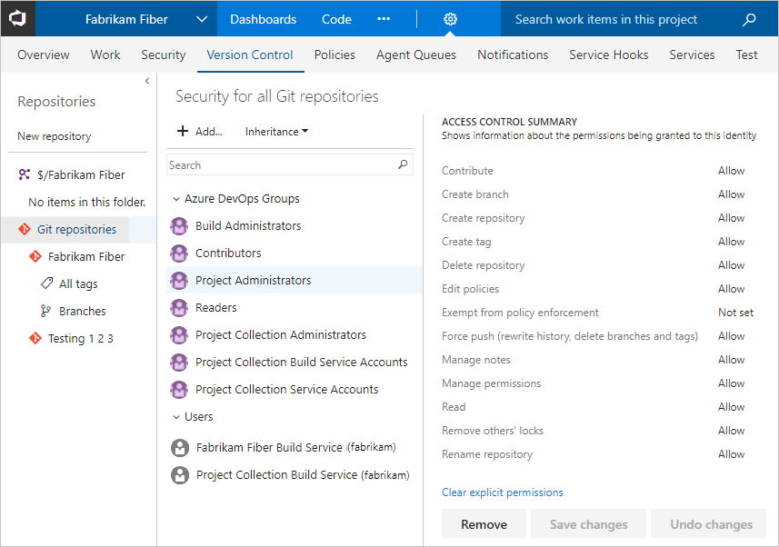
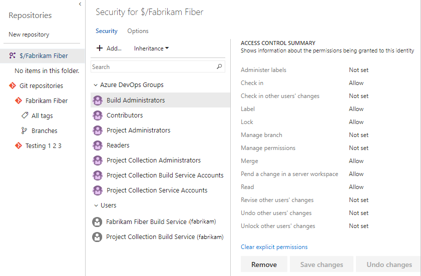

# Permissions and groups in Azure DevOps

[!INCLUDE [temp](../../_shared/version-vsts-tfs-all-versions.md)]

This article provides a comprehensive reference for each built-in group and permission. It's a lot of information describing each built-in security group as well as each permission. 

For a quick reference to default assignments, see [Default permissions and access](permissions-access.md). For an overview of how permissions and security are managed, see [About permissions and groups](about-permissions.md). In addition to security groups, there are also [security roles](about-security-roles.md) which provide permissions for select areas. 

To learn how to add users to a group or set a specific permission that you can manage through the web portal, see the following resources:  

::: moniker range="azure-devops"

> [!div class="mx-tdBreakAll"]  
> |Users and groups  |DevOps permissions  |Work tracking, dashboard, & analytics permissions  |  
> |-------------|----------|---------|   
> |- [Add users to an administrator role](set-project-collection-level-permissions.md) - [Add users to an account](../accounts/add-team-members.md) - [Add users to a project or a team](add-users-team-project.md)  - [Make a user a team admin](../../organizations/settings/add-team-administrator.md)  **Miscellaneous**
- [README & Wiki](../../project/wiki/manage-readme-wiki-permissions.md) |- [Git branch](../../repos/git/branch-permissions.md) - [Git repositories](set-git-tfvc-repository-permissions.md) - [TFVC](set-git-tfvc-repository-permissions.md) - [Builds](../../pipelines/policies/set-permissions.md) - [Releases](../../pipelines/policies/set-permissions.md) - [Approvals and approvers](../../pipelines/release/approvals/index.md) - [Task groups](../../pipelines/policies/set-permissions.md#task-group) - [Variable groups](../../pipelines/policies/set-permissions.md#variable-group) - [Role-based resources](../../pipelines/policies/set-permissions.md) | - [Area and iteration paths](../../organizations/security/set-permissions-access-work-tracking.md) - [Work item query and folder](../../boards/queries/set-query-permissions.md) - [Plan permissions](../../boards/plans/edit-delivery-plan-permissions.md)  - [Dashboard permissions](../../report/dashboards/dashboard-permissions.md#set-permissions) - [Analytics service](../../report/powerbi/analytics-security.md) - [Analytics views](../../report/powerbi/analytics-security.md) - [Customize process](set-permissions-access-work-tracking.md#process-permissions) |    

::: moniker-end

::: moniker range="azure-devops-2019"

> [!div class="mx-tdBreakAll"]  
> |Users and groups  |DevOps permissions  |Work tracking, dashboard, & analytics permissions  |  
> |-------------|----------|---------|   
> |- [Add users to an administrator role](set-project-collection-level-permissions.md) - [Add users to a project or a team](add-users-team-project.md)  - [Make a user a team admin](../../organizations/settings/add-team-administrator.md)  **Miscellaneous**
- [README & Wiki](../../project/wiki/manage-readme-wiki-permissions.md) - [SQL Server Reports](../../report/admin/grant-permissions-to-reports.md) |- [Git branch](../../repos/git/branch-permissions.md) - [Git repositories](set-git-tfvc-repository-permissions.md) - [TFVC](set-git-tfvc-repository-permissions.md) - [Builds](../../pipelines/policies/set-permissions.md) - [Releases](../../pipelines/policies/set-permissions.md) - [Approvals and approvers](../../pipelines/release/approvals/index.md) - [Task groups](../../pipelines/policies/set-permissions.md#task-group) - [Variable groups](../../pipelines/policies/set-permissions.md#variable-group) - [Role-based resources](../../pipelines/policies/set-permissions.md) | - [Area and iteration paths](../../organizations/security/set-permissions-access-work-tracking.md) - [Work item query and folder](../../boards/queries/set-query-permissions.md) - [Plan permissions](../../boards/plans/edit-delivery-plan-permissions.md) - [Dashboard permissions](../../report/dashboards/dashboard-permissions.md#set-permissions) - [Analytics service](../../report/powerbi/analytics-security.md) - [Analytics views](../../report/powerbi/analytics-security.md) - [Customize process](set-permissions-access-work-tracking.md#process-permissions) |    

::: moniker-end

::: moniker range="tfs-2018"

> [!div class="mx-tdBreakAll"]  
> |Users and groups  |DevOps permissions  |Work tracking & dashboard permissions  |  
> |-------------|----------|---------|   
> |- [Add users to an administrator role](set-project-collection-level-permissions.md) - [Add users to a project or a team](add-users-team-project.md)  - [Make a user a team admin](../../organizations/settings/add-team-administrator.md)  **Miscellaneous**
- [README & Wiki](../../project/wiki/manage-readme-wiki-permissions.md) - [SQL Server Reports](../../report/admin/grant-permissions-to-reports.md) |- [Git branch](../../repos/git/branch-permissions.md) - [Git repositories](set-git-tfvc-repository-permissions.md) - [TFVC](set-git-tfvc-repository-permissions.md) - [Builds](../../pipelines/policies/set-permissions.md) - [Releases](../../pipelines/policies/set-permissions.md) - [Approvals and approvers](../../pipelines/release/approvals/index.md) - [Task groups](../../pipelines/policies/set-permissions.md#task-group) - [Variable groups](../../pipelines/policies/set-permissions.md#variable-group) - [Role-based resources](../../pipelines/policies/set-permissions.md) | - [Area and iteration paths](../../organizations/security/set-permissions-access-work-tracking.md) - [Work item query and folder](../../boards/queries/set-query-permissions.md) - [Plan permissions](../../boards/plans/edit-delivery-plan-permissions.md) - [Dashboard permissions](../../report/dashboards/dashboard-permissions.md#set-permissions) |    

::: moniker-end

::: moniker range="<= tfs-2017"

> [!div class="mx-tdBreakAll"]  
> |Users and groups  |DevOps permissions  |Work tracking & dashboard permissions  |  
> |-------------|----------|---------|   
> |- [Add users to an administrator role](set-project-collection-level-permissions.md) - [Add users to a project or a team](add-users-team-project.md)  - [Make a user a team admin](../../organizations/settings/add-team-administrator.md)  **Miscellaneous**
- [README & Wiki](../../project/wiki/manage-readme-wiki-permissions.md) - [SharePoint integration](set-sharepoint-permissions.md) - [SQL Server Reports](../../report/admin/grant-permissions-to-reports.md) |- [Git branch](../../repos/git/branch-permissions.md) - [Git repositories](set-git-tfvc-repository-permissions.md) - [TFVC](set-git-tfvc-repository-permissions.md) - [Builds](../../pipelines/policies/set-permissions.md) - [Releases](../../pipelines/policies/set-permissions.md) - [Approvals and approvers](../../pipelines/release/approvals/index.md) - [Task groups](../../pipelines/policies/set-permissions.md#task-group) - [Variable groups](../../pipelines/policies/set-permissions.md#variable-group) - [Role-based resources](../../pipelines/policies/set-permissions.md) | - [Area and iteration paths](../../organizations/security/set-permissions-access-work-tracking.md) - [Work item query and folder](../../boards/queries/set-query-permissions.md) - [Plan permissions](../../boards/plans/edit-delivery-plan-permissions.md)  - [Dashboard permissions](../../report/dashboards/dashboard-permissions.md#set-permissions) |    

::: moniker-end

  

>[!NOTE]  
> The images you see from your web portal may differ from the images you see in this topic. These differences result from updates made to Azure DevOps. However, the basic functionality available to you remains the same unless explicitly mentioned. 

## Groups

Permissions can be granted directly to an individual, or to a group.
Using groups can make things a lot simpler. 
The system provides several built-in groups for that purpose.
These groups and the default permissions they're assigned are defined at different levels:
server (on-premises deployment only), project collection, project, and specific objects.
You can also create your own groups and grant them the specific set of permissions
that are appropriate for certain roles in your organization.

<!---
Team Foundation Administrators
Team Foundation Proxy Service Accounts
Team Foundation Service Accounts
Team Foundation Valid Users
Project Server Integration Service Accounts
SharePoint Web Application Services
-->

::: moniker range=">= tfs-2013 <= tfs-2018"

## Server-level groups 

When you install Azure DevOps Server or TFS, the system creates default groups that have [deployment-wide, server-level permissions](#server-permissions). You can neither remove nor delete the built-in server-level groups.

You can't remove or delete the default server level groups.

<table valign="top" width="100%">
<tbody valign="top">
	<tr valign="top">
		<th width="20%">Group name</th>
		<th width="30%">Permissions</th>
		<th width="50%">Membership</th>
	</tr>
	<tr>
		<td>Team Foundation Administrators</td>
		<td>
			Has permissions to perform all server-level operations.
		</td>
		<td>
			

				<strong>Local Administrators</strong> group (BUILTIN\Administrators)
				for any server that hosts Azure DevOPs/Team Foundation application services.
			

			

				<em>Server</em> <strong>\Team Foundation Service Accounts</strong> group
				and the members of the <strong>\Project Server Integration Service Accounts</strong> group.
			

			

				This group should be restricted to the smallest possible number of users
				who need total administrative control over server-level operations.
			

			<blockquote>
				If your deployment uses SharePoint or Reporting,
				consider [adding the members of this group](/azure/devops/server/admin/add-administrator-tfs)
				to the Farm Administrators and Site Collection Administrators groups in SharePoint
				and the Team Foundation Content Managers groups in Reporting Services.
			</blockquote>
		</td>
	</tr>
	<tr>
		<td>Team Foundation Proxy Service Accounts</td>
		<td>
			Has service level permissions for Team Foundation Server Proxy,
			and some service-level permissions.
			<blockquote>
				Created when you install the TFS proxy service.
			</blockquote>
		</td>
		<td>
			This group should contain only service accounts and not user accounts or groups
			that contain user accounts.
		</td>
	</tr>
	<tr>
		<td>Team Foundation Service Accounts</td>
		<td>
Has service-level permissions for the server instance.
</td>
		<td>
			

				Contains the service account that was supplied during installation
			

			

				This group should contain only service accounts
				and not user accounts or groups that contain user accounts.
				By default, this group is a member of <strong>Team Foundation Administrators</strong>.
			

			

				If you need to add an account to this group after you install Azure DevOps Server or TFS, you can do so using
				the TFSSecurity.exe utility in the **Tools** subfolder of your TFS installation directory.
				The command to do this is `TFSSecurity /g+ "[TEAM FOUNDATION]\Team Foundation Service Accounts" n:domain\username /server:http(s)://tfsservername`
			

		</td>
	</tr>
	<tr>
		<td>Team Foundation Valid Users</td>
		<td>
			Has permission to view server instance-level information.
			<blockquote>
				If you set the <strong>View instance-level information</strong>
				permission to <strong>Deny</strong> or <strong>Not set</strong> for this group,
				no users will be able to access the deployment.
			</blockquote>
		</td>
		<td>
			Contains all users known to exist in the server instance.
			You can't modify the membership of this group.
		</td>
	</tr>
	<tr>
		<td>Project Server Integration Service Accounts   </td>
		<td>
			Has service level permissions for the Project Server deployments
			that are configured for inter-operation with the server instance
			and some TFS service level permissions.
			<blockquote>
				Created when you install Project Service integration.
			</blockquote>
		</td>
		<td>
			This group should contain only service accounts
			and not user accounts or groups that contain user accounts.
			By default, this group is a member of <strong>Team Foundation Administrators</strong>.
		</td>
	</tr>
	<tr>
		<td>SharePoint Web Application Services</td>
		<td>
			Has service level permissions for the SharePoint Web applications
			that are configured for use with TFS
			and some service level permissions for TFS.
		</td>
		<td>
			This group should contain only service accounts
			and not user accounts or groups that contain user accounts.
			Unlike the Service Accounts group, this group is not a member
			of <strong>Team Foundation Administrators</strong>.
		</td>
	</tr>
</tbody>
</table>

> The full name of each of these groups is **[Team Foundation]/{group name}**.
> So the full name of the server level administrators group is
> **[Team Foundation]/Team Foundation Administrators**.

::: moniker-end

## Collection-level groups

When you create an organization or project collection in Azure DevOps, the system creates collection-level groups that have [permissions in that collection](#collection-level). You can neither remove nor delete the built-in collection-level groups.

<!---
Project Collection Administrators
Project Collection Build Administrators
Project Collection Build Service Accounts
Project Collection Proxy Service Accounts
Project Collection Service Accounts
Project Collection Test Service Accounts
Project Collection Valid Users
Security Service Group
-->

> [!div class="mx-imgBorder"]  
> 

<table valign="top" width="100%">
<tbody valign="top">
	<tr valign="top">
		<th width="20%">Group name</th>
		<th width="30%">Permissions</th>
		<th width="50%">Membership</th>
	</tr>
	<tr>
		<td>Project Collection Administrators</td>
		<td>
Has permissions to perform all operations for the collection.
</td>
		<td>
			

				Contains the <strong>Local Administrators</strong> group (BUILTIN\Administrators)
				for the server where the application-tier services have been installed.
				Also, contains the members of the
				<em>CollectionName</em><strong>\Service Accounts</strong> group.
			

			

				This group should be restricted to the smallest possible number of users
				who need total administrative control over the collection. For Azure DevOps, assign to administrators who customize work tracking. 
			

			<blockquote>
				If your deployment uses SharePoint or Reporting,
				consider [adding the members of this group](../../organizations/security/set-project-collection-level-permissions.md)
				to the Site Collection Administrators group in SharePoint
				and the Team Foundation Content Managers groups in Reporting Services.
			</blockquote>
		</td>
	</tr>
	<tr>
		<td>Project Collection Build Administrators</td>
		<td>
Has permissions to administer build resources and permissions for the collection.
</td>
		<td>
			

				Limit this group to the smallest possible number of users
				who need total administrative control over build servers and services for this collection.
			

		</td>
	</tr>
	<tr>
		<td>Project Collection Build Service Accounts</td>
		<td>
			
Has permissions to run build services for the collection.

		</td>
		<td>Limit this group to service accounts and groups that contain only service accounts.</td>
	</tr>
	<tr>
		<td>Project Collection Proxy Service Accounts</td>
		<td>
Has permissions to run the proxy service for the collection.
</td>
		<td>
Limit this group to service accounts and groups that contain only service accounts.
</td></tr>
	<tr>
		<td>Project Collection Service Accounts</td>
		<td>
Has service level permissions for the collection and for Azure DevOps Server.
</td>
		<td>
			

				Contains the service account that was supplied during installation.
				This group should contain only service accounts and groups that contain only service accounts.
				By default, this group is a member of <strong>Team Foundation Administrators</strong>
				and <strong>Team Foundation Service Accounts</strong>.
			

		</td>
	</tr>
	<tr>
		<td>Project Collection Test Service Accounts</td>
		<td>
Has test service permissions for the collection.
</td>
		<td>
Limit this group to service accounts and groups that contain only service accounts.
</td>
	</tr>
	<tr>
		<td>Project Collection Valid Users</td>
		<td>
Has permissions to access team projects and view information in the collection.

		</td>
		<td>
			

				Contains all users and groups that have been added anywhere within the collection.
				You cannot modify the membership of this group.
			

		</td>
	</tr>
</tbody>
</table>

> The full name of each of these groups is **[{collection name}]/{group name}**.
> So the full name of the administrator group for the default collection is
> **[Default Collection]/Project Collection Administrators**.

<!---
Build Administrators
Contributors
Project Administrators
Project Valid Users
Readers
Release Administrators (TFS 2017, Azure DevOps)
[team name]
-->

<a id="project-level-groups" />

## Project-level groups

For each project that you create, the system creates the followings project-level groups. These groups are assigned [project-level permissions](#team-project-level-permissions).

> The full name of each of these groups is **[{project name}]\{group name}**.
> For example, the contributors group for a project called "My Project" is 
> **[My Project]/Contributors**.

<table valign="top" width="100%">
<tbody valign="top">
	<tr valign="top">
		<th width="20%">Group name</th>
		<th width="40%">Permissions</th>
		<th width="40%">Membership</th>
	</tr>
	<tr>
		<td>Build Administrators</td>
		<td>Has permissions to administer build resources and build permissions for the project. Members can manage test environments, create test runs, and manage builds.</td>
		<td></td>
	</tr>
	<tr>
		<td>Contributors</td>
		<td>Has permissions to contribute fully to the project code base and work item tracking. The main permissions they don't have or those that manage or administer resources.</td>
		<td>By default, the team group created when you create a project is added to this group, and any user you add to the team will be a member of this group. In addition, any team you create for a project will be added to this group by default, unless you choose a different group from the list.</td>
	</tr>
	<tr>
		<td>Readers</td>
		<td>Has permissions to view project information, the code base, work items, and other artifacts but not modify them.</td>
		<td>
			Assign to members of your organization who you want to provide view-only permissions to a project. These users will be able to view backlogs, boards, dashboards, and more, but not add or edit anything. Typically, these are members who aren't granted an access level ([Basic, Stakeholder, or other level](../../organizations/security/access-levels.md)) within the organization or on-premises deployment.
			who want to be able to view work in progress.
		</td>
	</tr>
	<tr>
		<td>Project Administrators</td>
		<td>Has permissions to administer all aspects of teams and project, although they can't create team projects.</td>
		<td>Assign to users who manage user permissions, create or edit teams, modify team settings, define area an iteration paths, or customize work item tracking.</td>
	</tr>
	<tr>
		<td>Project Valid Users</td>
		<td>
Has permissions to access the project.

			<blockquote>
				If you set the <strong>View collection-level information</strong> permission
				to <strong>Deny</strong> or <strong>Not set</strong> for this group,
				no users will be able to access the project.
			</blockquote>
		</td>
		<td>
			

				Contains all users and groups that have been added anywhere within the project.
				You cannot modify the membership of this group.
			

		</td>
	</tr>
	<tr>
		<td id="team-group">{team name}</td>
		<td>
			Has permissions to contribute fully to the project code base and work item tracking.
			The default Team group is created when you create a project,
			and by default is added to the Contributors group for the project.
			Any new teams you create will also have a group created for them and added to the Contributors group.
			<blockquote>
				You can grant permissions to administer team assets by
				[adding members to the team administrator role](../../organizations/settings/add-team-administrator.md).
			</blockquote>
		</td>
		<td>Add members of the team to this group.</td>
	</tr>
</tbody>
</table>

<!---
Create and manage team alerts
Create and manage team rooms
Configure team backlogs
Customize the Kanban board (Add columns, Swimlanes, Customize Cards, Definition of Done ...
Manage team dashboards
Select team area paths
Select team sprints
Set working days off
Show bugs on backlogs and boards
-->

## Team administrator role

For each team that you add, you can assign one or more team members as administrators. The team admin role isn't a group with a set of defined permissions. Instead, the team admin role is tasked with managing  team assets. To learn more, see [Manage teams and configure team tools](../settings/manage-teams.md). To add a user as a team administrator, see [Add a team administrator](../settings/add-team-administrator.md).

> [!NOTE]   
> Project Administrators can manage all team administrative areas for all teams. 

## Permissions

The system manages permissions at different levels&mdash;server, collection, project, or object&mdash;and by default assigns them to one or more built-in groups. You manage most permissions through the web portal.

::: moniker range="<= azure-devops-2019"

## Server-level permissions 

You manage server-level permissions through the [Team Foundation Administration Console](/azure/devops/server/admin/add-administrator-tfs) or [TFSSecurity command-line tool](/azure/devops/server/ref/command-line/tfssecurity-cmd#permissions). Team Foundation Administrators are granted all server-level permissions. Other server-level groups have select permission assignments.

<table valign="top" width="100%">
<tbody valign="top">
	<tr>
		<th width="30%">Permission</th>
		<th width="70%">Description</th>
	</tr>
	<tr>
		<td id="administer-warehouse-permission">Administer warehouse</td>
		<td>
			

				Can process or change settings for the data warehouse or SQL Server Analysis cube
				by using the [Warehouse Control Web Service](../../report/admin/manage-reports-data-warehouse-cube.md).
			

			

				Additional permissions may be required to fully process
				or [rebuild the data warehouse and Analysis cube](../../report/admin/rebuild-data-warehouse-and-cube.md).
			

		</td>
	</tr>
	<tr>
		<td id="create-team-project-collection-permission">Create project collection</td>
		<td>Can create and administer collections.</td>
	</tr>
	<tr>
		<td id="delete-team-project-collection-permission">Delete project collection</td>
		<td>
			Can delete a collection from the deployment.
			<blockquote>
				Deleting a collection will not delete the collection database from SQL Server.
			</blockquote>
		</td>
	</tr>
	<tr>
		<td id="edit-instance-level-information-permission">Edit instance-level information</td>
		<td>
			Can edit server-level permissions for users and groups,
			and add or remove server level groups from the collection.
			<blockquote>
				

					**Edit instance-level information** includes the ability to perform these tasks
					for all team projects defined in all collections defined for the instance:
				

				<ul>
					<li>Create and modify areas and iterations</li>
					<li>Edit check-in policies</li>
					<li>Edit shared work item queries</li>
					<li>Edit project level and collection level permission ACLs</li>
					<li>Create and modify global lists</li>
					<li>Edit [event subscriptions](#alerts) (email or SOAP).</li>
				</ul>
				

					When set through the menus, the **Edit instance-level information** permission
					also implicitly allows the user to modify version control permissions.
					To grant all these permissions at a command prompt,
					you must use the `tf.exe Permission` command
					to grant the **AdminConfiguration** and **AdminConnections** permissions
					in addition to GENERIC\_WRITE.
				

			</blockquote>
		</td>
	</tr>
	<tr>
		<td id="make-requests-on-behalf-of-others-permission">Make requests on behalf of others</td>
		<td>Can perform operations on behalf of other users or services. Only assign to service accounts.</td>
	</tr>
	<tr>
		<td id="trigger-events-permission">Trigger events</td>
		<td>
			Can trigger server-level alert events.
			Only assign to service accounts and members of the Team Foundation Administrators group.
		</td>
	</tr>
	<tr>
		<td id="use-full-web-access-features-permission">Use full Web Access features</td>
		<td>
			Can use all on-premises Web portal features.
			<blockquote>
				If the **Use full Web Access** features permission is set to Deny, the user will only see
				those features permitted for the **Stakeholder** group
				(see [Change access levels](change-access-levels.md)).
				A Deny will override any implicit Allow,
				even for accounts that are members of administrative groups
				such as Team Foundation Administrators.
			</blockquote>
		</td>
	</tr>
	<tr>
		<td id="view-instance-level-information-permission">View instance-level information</td>
		<td>
			Can view server level group membership and the permissions of those users.
			<blockquote>
				The **View instance-level information** permission is also assigned to the Team Foundation Valid Users group.
			</blockquote>
		</td>
	</tr>
</tbody>
</table>

::: moniker-end

## Collection-level permissions

You manage collection-level permissions through the [web portal admin context](../../project/navigation/go-to-service-page.md#collection-admin-context) or [TFSSecurity command-line tool](/azure/devops/server/ref/command-line/tfssecurity-cmd#collection-level-permissions). Project Collection Administrators are granted all collection-level permissions. Other collection-level groups have select permission assignments.

> [!div class="mx-imgBorder"]  
>    

<table valign="top" width="100%">
<tbody valign="top">
	<tr>
		<th width="30%">Permission</th>
		<th width="70%">Description</th>
	</tr>
	<tr>
		<td id="administer-build-resource-permissions-permission">Administer build resource permissions</td>
		<td>Can modify permissions for build pipelines at the organization or project collection-level. This includes: 
			<ul>
			<li>[Set retention policies](../../pipelines/policies/retention.md)</li>
			<li>[Set resource limits for pipelines](../../pipelines/licensing/concurrent-pipelines-ts.md)</li>
			<li>[Add and manage agent pools](../../pipelines/agents/pools-queues.md)</li>
			<li>[Add and manage deployment pools](../../pipelines/release/deployment-groups/index.md)</li>
			</ul>
			</td>
	</tr>
	<tr>
		<td id="administer-process-permissions-permission">Administer process permissions</td>
		<td>
			Can modify permissions for customizing work tracking by creating and customizing [inherited processes](../settings/work/inheritance-process-model.md). 
			<ul>
			<li>[Customize a project](../settings/work/customize-process.md)</li>
			<li>[Add and manage processes](../settings/work/manage-process.md)</li>
			</ul>
			
Applies to Azure DevOps Services and Azure DevOps Server 2019. For Azure DevOps Services, users granted Basic and Stakeholder access are granted this permission by default. >/p>
		</td>
	</tr>
	<tr>
		<td id="administer-Project-Server-integration-permission">Administer Project Server integration</td>
		<td>
			Can [configure the integration of Azure DevOps Server and Project Server](../../reference/tfs-ps-sync/synchronize-tfs-project-server.md) to enable data synchronization between the two server products. Applies to TFS 2017 and earlier versions only.
		</td>
	</tr>
	<tr>
		<td id="administer-shelved-changes-permission">Administer shelved changes</td>
		<td>
			Can delete [shelvesets created by other users](../../repos/tfvc/suspend-your-work-manage-your-shelvesets.md). Applies when TFVC is used as the source control. 
		</td>
	</tr>
	<tr>
		<td id="administer-workspaces-permission">Administer workspaces</td>
		<td>Can [create and delete workspaces for other users](../../repos/tfvc/create-work-workspaces.md). Applies when TFVC is used as the source control. </td>
	</tr>
	<tr>
		<td id="alter-trace-settings-permission">Alter trace settings</td>
		<td>
			Can [change the trace settings](https://docs.microsoft.com/previous-versions/ms400797%28v%3dvs.80%29) for gathering more detailed diagnostic information about Azure DevOps Web services.
		</td>
	</tr>
	<tr>
		<td id="create-a-workspace-permission">Create a workspace</td>
		<td>
			Can create a version control workspace. Applies when TFVC is used as the source control. 
			<blockquote>
				The **Create a workspace** permission is granted to all users
				as part of their membership within the Project Collection Valid Users group.
			</blockquote>
		</td>
	</tr>
	<tr>
		<td id="create-new-team-projects-permission">Create new projects (formerly Create new team projects)</td>
		<td>
			Can [add Azure DevOps projects](../projects/create-project.md) to an organization or project collection. Additional permissions may be required depending on your on-premises deployment. 
		</td>
	</tr>
	<tr>
		<td id="create-process-permission">Create process</td>
		<td>
			Can [create an inherited process](../settings/work/manage-process.md) used to customize work tracking and Azure Boards. Applies to Azure DevOps Services and Azure DevOps Server 2019 and later versions. Azure DevOps Services users granted Basic and Stakeholder access are granted this permission by default. 
		</td>
	</tr>
	<tr>
		<td id="delete-field-permission">Delete field from account</td>
		<td>
			Can [delete a custom field that was added to a process](../settings/work/customize-process-field.md). Applies to Azure DevOps Services and Azure DevOps Server 2019 and later versions. Azure DevOps Services users granted Basic and Stakeholder access are granted this permission by default. 
		</td>
	</tr>
	<tr>
		<td id="delete-process-permission">Delete process</td>
		<td>
			Can [delete an inherited process](../settings/work/manage-process.md) used to customize work tracking and Azure Boards. Applies to Azure DevOps Services and Azure DevOps Server 2019. Azure DevOps Services users granted Basic and Stakeholder access for Azure DevOps Services are granted this permission by default. 
		</td>
	</tr>
	<tr>
		<td id="delete-team-project-permission">Delete team project</td>
		<td>
			Can [delete Azure DevOps projects](../projects/delete-project.md).
			<blockquote>
				Deleting a project will delete all data that is associated with the project.
				You cannot undo the deletion of a project except
				by restoring the collection to a point
				before the project was deleted.
			</blockquote>
		</td>
	</tr>
	<tr>
		<td id="edit-collection-level-information-permission">Edit collection-level information</td>
		<td>
			Can add users and groups, and edit collection-level permissions for users and groups.
			<blockquote>
				

					Edit collection-level information includes the ability to perform these tasks
					for all projects defined in a collection:
				

				<ul>
					<li>Add and administer teams and all team-related features</li>
					<li>Create and modify areas and iterations</li>
					<li>Edit check-in policies</li>
					<li>Edit shared work item queries</li>
					<li>Edit project level and collection level permission ACLs</li>
					<li>Manage process templates</li>
					<li>Customize a project or process</li>
					<li>Create and modify global lists</li>
					<li>Edit [event subscriptions](#alerts) (email or SOAP) on project or collection level events.</li>
				</ul>

				

					When you set **Edit collection-level information** to **Allow**,
					users can add or remove collection-level groups and implicitly
					allows these users to modify version control permissions.
					To grant all these permissions at a command prompt,
					you must use the `tf.exe Permission` command to grant
					the **AdminConfiguration** and **AdminConnections** permissions,
					in addition to GENERIC\_WRITE.
				

			</blockquote>
		</td>
	</tr>
	<tr>
		<td id="edit-process-permission">Edit process</td>
		<td>
			Can edit a [custom inherited process](../settings/work/customize-process.md). Applies to Azure DevOps Services and Azure DevOps Server 2019. Azure DevOps Services users  granted Basic and Stakeholder access for Azure DevOps Services are granted this permission by default. 
		</td>
	</tr>
	<tr>
		<td id="make-requests-on-behalf-of-others-permission">Make requests on behalf of others</td>
		<td>
			Can perform operations on behalf of other users or services.
			You should assign this permission only to on-premises [service accounts](/azure/devops/server/admin/service-accounts-dependencies-tfs).
		</td>
	</tr>
	<tr>
		<td id="manage-build-resources-permission">Manage build resources</td>
		<td>Can manage build computers, build agents, and build controllers.</td>
	</tr>
	<tr>
		<td id="manage-process-template-permission">Manage process template</td>
		<td>
			Can [download, create, edit, and upload process templates](../../boards/work-items/guidance/manage-process-templates.md). A process template defines the building blocks of the work item tracking system as well as other sub-systems you access through Azure Boards. Applies to Azure DevOps Servers only. 
		</td>
	</tr>
	<tr>
		<td id="manage-test-controllers-permission">Manage test controllers</td>
		<td>Can register and de-register test controllers.</td>
	</tr>
	<tr>
		<td id="trigger-events-permission">Trigger events</td>
		<td>
			Can trigger project alert events within the collection. Assign only to service accounts.
			<blockquote>
				Users with this permission can't remove built-in collection level groups
				such as Project Collection Administrators.
			</blockquote>
		</td>
	</tr>
	<tr>
		<td id="use-build-resources-permission">Use build resources</td>
		<td>Can reserve and allocate build agents. Assign only to service accounts for build services.</td>
	</tr>
	<tr>
		<td id="view-build-resources-permission">View build resources</td>
		<td>Can view, but not use, build controllers and build agents that are configured for an organization or project collection.</td>
	</tr>
	<tr>
		<td id="view-collection-level-information-permission">View instance-level information or View collection-level information</td>
		<td>Can view project collection-level group membership and permissions.
			<blockquote>
				If you set the <strong>View instance-level information</strong> permission
				to <strong>Deny</strong> or <strong>Not set</strong> for this group,
				no users will be able to access projects in the organization or project collection.
			</blockquote></td>
	</tr>
	<tr>
		<td id="view-system-synchronization-information-permission">View system synchronization information</td>
		<td>Can call the synchronization application programming interfaces. Assign only to service accounts.</td>
	</tr>
</tbody>
</table>

<a name="project-level" />

<a name="project-level-permissions" />

## Project-level permissions

You manage project-level permissions from the [web portal admin context](set-project-collection-level-permissions.md) or using the [TFSSecurity command-line tool](/azure/devops/server/ref/command-line/tfssecurity-cmd#team-project-level-permissions). Project Administrators are assigned all project-level permissions. Other project-level groups are assigned a subset of these permissions.

> [!div class="mx-imgBorder"]
> 

<table valign="top" width="100%">
<tbody valign="top">
	<tr>
		<th width="30%">Permission</th>
		<th width="70%">Description</th>
	</tr>
	<tr>
		<td id="bypass-rules-permission">Bypass rules on work item updates</td>
		<td>
Users with this permission can save a work item that ignores rules, such as [assign value rules or conditional rules](../../reference/xml/apply-rule-work-item-field.md), defined for the work item type. Scenarios where this is useful are migrations where you don't want to update the by/date fields on import, or when you want to skip the validation of a work item.

Rules can be bypassed in one of two ways. The first is through the [Work Items - update REST API](/rest/api/azure/devops/wit/work%20items/update) and setting the `bypassRules` parameter to `true`. The second is through the client object model, by initializing in bypassrules mode (initialize `WorkItemStore` with `WorkItemStoreFlags.BypassRules`).

		
Users granted Basic and Stakeholder access are granted this permission by default. 
</td>
	</tr>
	<tr>
		<td id="change-process-team-project-permission">Change process of project</td>
		<td>Can change the Inheritance process for a project. To learn more, see [Create and manage inherited processes](../settings/work/manage-process.md). Applies to Azure DevOps Services and Azure DevOps Server 2019. Azure DevOps Services users granted Basic and Stakeholder access are granted this permission by default. </td>
	</tr>
	<tr>
		<td id="create-tag-definition-permission">Create tag definition</td>
		<td>[Can add tags to a work item](../../boards/queries/add-tags-to-work-items.md). By default, all members of the Contributors group have this permission. 

		<blockquote>
		All users granted Stakeholder access for a private project can only add existing tags, not add new tags, even if the **Create tag definition** permission is set to Allow. This is part of the Stakeholder access settings. Azure DevOps Services users granted Stakeholder access for a public project are granted this permission by default. 
		<blockquote></td>
	</tr>
	<tr>
		<td id="create-test-runs-permission">Create test runs</td>
		<td>Can add and remove test results and add or modify test runs. To learn more, see [Control how long to keep test results](../../test/how-long-to-keep-test-results.md) and [Run manual tests](../../test/run-manual-tests.md). </td>
	</tr>
	<tr>
		<td id="delete-work-items-in-this-project-permission">

Delete and restore work items

or Delete work items in this project
</td>
		<td>Can [mark work items in the project as deleted](../../boards/backlogs/remove-delete-work-items.md). Azure DevOps Services users granted Stakeholder access for a public project are granted this permission by default.
<ul>
<li>For Azure DevOps and TFS 2015.1 and later versions, the Contributors group has **Delete and restore work items** at the project-level set to "Allow" by default.</li> 
<li>For TFS 2015 and earlier versions, the Contributors group has **Delete work items in this project** at the project-level set to "Not set" by default. This setting causes the Contributors group to inherit the value from the closest parent that has it explicitly set. </li>    
</ul>
</td>
	</tr>
	<tr>
		<td id="delete-shared-analytic-views-permission">Delete shared Analytics view</td>
		<td>Can delete [Analytics views](../../report/powerbi/analytics-views-manage.md)
that have been saved under the Shared area. Applies to Azure DevOps Services and Azure DevOps Server 2019. </td>
	</tr>
	<tr>
		<td id="delete-team-project-permission">Delete project</td>
		<td>Can [delete a project](../projects/delete-project.md) from an organization or project collection.</td>
	</tr>
	<tr>
		<td id="delete-test-runs-permission">Delete test runs</td>
		<td>Can delete a test run.</td>
	</tr>
	<tr>
		<td id="edit-team-project-level-information-permission">Edit project-level information</td>
		<td>
			Can edit project level permissions for users and groups.
			<blockquote>
				

					**Edit project-level information** includes the ability
					to perform these tasks for the project:
				

				<ul>
					<li>Create and modify areas and iterations</li>
					<li>Edit check-in policies</li>
					<li>Edit shared work item queries</li>
					<li>Edit project level permission ACLs</li>
					<li>Manage process templates</li>
					<li>Customize a project</li>
					<li>Create and modify global lists</li>
					<li>Edit [event subscriptions](#alerts) (email or SOAP) on project level events.</li>
				</ul>
			</blockquote>
		</td>
	</tr>
	<tr>
		<td id="edit-shared-analytic-views-permission">Edit shared Analytics view</td>
		<td>Can create and modify [shared Analytics views](../../report/powerbi/analytics-views-manage.md). Applies to Azure DevOps Services and Azure DevOps Server 2019. </td>
	</tr>
	<tr>
		<td id="manage-team-project-property-permission">Manage project properties</td>
		<td>
			Can provide or edit metadata for a project. For example, a user can provide high-level information about the contents of a project. Changing metadata is supported through the [Set project properties REST API](/rest/api/azure/devops/core/projects/set%20project%20properties). 
		</td>
	</tr>
	<tr>
		<td id="manage-test-configurations-permission">Manage test configurations</td>
		<td>Can create and delete [test configurations](../../test/test-different-configurations.md).</td>
	</tr>
	<tr>
		<td id="manage-test-environments-permission">Manage test environments</td>
		<td>Can create and delete [test environments](../../test/test-different-configurations.md).</td>
	</tr>
	<tr>
		<td id="move-work-items-out-of-this-project-permission">Move work items out of this project</td>
		<td>Can [move a work item from one project to another project](../../boards/backlogs/remove-delete-work-items.md) within the collection. Applies to Azure DevOps Services and Azure DevOps Server 2019. Users granted Stakeholder access for a public project are granted this permission by default.
		</td>
	</tr>
	<tr>
		<td id="permanently-delete-work-items-in-this-project-permission">Permanently delete work items in this project</td>
		<td>Can [permanently delete work items](../../boards/backlogs/remove-delete-work-items.md) from this project. Azure DevOps Services users granted Stakeholder access for a public project are granted this permission by default.</td>
	</tr>
	<tr>
		<td id="rename-team-project-permission">Rename project</td>
		<td>Can [change the name of the project](../projects/rename-project.md).</td>
	</tr>
	<tr>
		<td id="suppress-notifications-for-work-item-updates-permission">Suppress notifications for work item updates</td>
		<td>
Users with this permission can update work items without generating notifications. This is useful when performing migrations of bulk updates by tools and want to skip generating notifications.

Consider granting this permission to service accounts or users who have been granted the **Bypass rules on work item updates** permission. You can set the `suppressNotifications` parameter to `true` when updating working via [Work Items - update REST API](/rest/api/azure/devops/wit/work%20items/update).

		
Users granted Stakeholder access for a public project are granted this permission by default.
</td>
	</tr>
	<tr>
		<td id="update-project-visibility">Update project visibility</td>
		<td>Can [change the project visibility](../public/make-project-public.md) from private to public or public to private. Applies to Azure DevOps Services only.</td>
	</tr>
	<tr>
		<td id="view-analytics-permission">View analytics</td>
		<td>Can access data available from the [Analytics service](../../report/powerbi/what-is-analytics.md). For details, see [Permissions required to access the Analytics service](../../report/powerbi/analytics-security.md). Applies to Azure DevOps Services and Azure DevOps Server 2019. </td>
	</tr>
	<tr>
		<td id="view-team-project-level-information-permission">View project-level information</td>
		<td>Can view project level group membership and permissions.</td>
	</tr>
	<tr>
		<td id="view-test-runs-permission">View test runs</td>
		<td>Can view test plans under the project area path.</td>
	</tr>
</tbody>
</table>

::: moniker range=">= azure-devops-2019"

## Analytics views (object-level)     

With shared Analytics views, you can grant specific permissions to view, edit, or delete a view that you create.  You manage the security of Analytics views from the [web portal](../../report/powerbi/analytics-security.md). 

> [!div class="mx-imgBorder"]
>   

The following permissions are defined for each shared Analytics view. All valid users are automatically granted all permissions to manage Analytics views. Consider granting select permissions to specific shared views to other team members or security group that you create. See also, [What are Analytics views](../../report/powerbi/what-are-analytics-views.md)?  

<table valign="top" width="100%">
<tbody valign="top">
	<tr>
		<th width="30%">Permission</th>
		<th width="70%">Description</th>
	</tr>
	<tr>
		<td id="av-delete-permission">Delete shared Analytics views</td>
		<td>
			Can delete the shared Analytics view.
		</td>
	</tr>
	<tr>
		<td id="av-edit-permission">Edit shared Analytics views</td>
		<td>
			Can change the parameters of the shared Analytics view.
		</td>
	</tr>
	<tr>
		<td id="av-view-permission">View shared Analytics views</td>
		<td>
			Can view and use the shared Analytics view from Power BI desktop. 
		</td>
	</tr>
</tbody>
</table>

::: moniker-end

## Build (object-level)

You manage build permissions [for each build defined in the web portal](../../pipelines/policies/set-permissions.md) or using the [TFSSecurity command-line tool](/azure/devops/server/ref/command-line/tfssecurity-cmd#build-permissions). Project Administrators are granted all build permissions and Build Administrators are assigned most of these permissions. You can set build permissions for all build definitions or for each build definition.

> [!div class="mx-imgBorder"]  
> 

Permissions in Build follow a hierarchical model. Defaults for all the permissions can be set at the project level and can be overridden on an individual build definition.

To set the permissions at project level for all build definitions in a project, choose **Security** from the action bar on the main page of Builds hub.

To set or override the permissions for a specific build definition, choose **Security** from the context menu of the build definition.

The following permissions are defined in Build. All of these can be set at both the levels.

<!---
Commenting this section out as it duplicates that defined in the following table.
| Permission | Description |
|------------|-------------|
| **Administer build permissions** | Can change any of the other permissions listed here. |
| **Queue builds** | Can queue new builds. |
| **Delete build definition** | Can delete build definition(s). |
| **Delete builds** | Can delete builds for a definition. Builds that are deleted are [retained](../../pipelines/policies/retention.md) in the **Deleted** tab for a period of time before they are destroyed. |
| **Destroy builds** | Can delete builds from the **Deleted** tab. |
| **Edit build definition** | Can save any changes to a build definition, including configuration variables, triggers, repositories, and retention policy. |
| **Edit build quality** | Can add tags to a build. |
| **Override check-in validation by build** | Applies to [TFVC gated check-in builds](../../pipelines/build/triggers.md). This does not apply to PR builds. |
| **Retain indefinitely** | Can toggle the retain indefinitely flag on a build. |
| **Stop builds** | Can stop builds queued by other team members or by the system.  |
| **View build definition** | Can view build definition(s). |
| **View builds** | Can view builds belonging to build definition(s). |
| **Update build information** | It is recommended to leave this alone. It's intended to enable service accounts, not team members. |
| **Manage build qualities** | _Only applies to XAML builds_ |
| **Manage build queue** | _Only applies to XAML builds_ |

-->

<table valign="top" width="100%">
<tbody valign="top">
	<tr>
		<th width="30%">Permission</th>
		<th width="70%">Description</th>
	</tr>
	<tr>
		<td id="administer-build-permissions-permission">Administer build permissions</td>
		<td>Can administer the build permissions for other users.</td>
	</tr>
	<tr>
		<td id="delete-build-definition-permission">Delete build definition</td>
		<td>Can delete build definitions for this project.</td>
	</tr>
	<tr>
		<td id="delete-builds-permission">Delete builds</td>
		<td>Can delete a completed build. Builds that are deleted are [retained](../../pipelines/policies/retention.md) in the **Deleted** tab for a period of time before they are destroyed.</td>
	</tr>
	<tr>
		<td id="destroy-builds-permission">Destroy builds</td>
		<td>Can permanently delete a completed build.</td>
	</tr>
	<tr>
		<td id="edit-build-definition-permission">Edit build definition</td>
		<td>
			Can create and modify build definitions for this project.
			<blockquote>
				

					You turn Inheritance Off for a build definition
					when you want to control permissions for specific build definitions.
				

				

					When inheritance is On, the build definition respects the build permissions
					defined at the project level or a group or user.
					For example, a custom Build Managers group has permissions set to manually queue a build for project Fabrikam.
					Any build definition with inheritance On for project Fabrikam would allow a member of the Build Managers group
					the ability to manually queue a build.
				

				

					However, by turning Inheritance Off for project Fabrikam,
					you can set permissions that only allow Project Administrators
					to manually queue a build for a specific build definition.
					This would then allow me to set permissions for that build definition specifically.
				

			</blockquote>
		</td>
	</tr>
	<tr>
		<td id="edit-build-quality-permission">Edit build quality</td>
		<td>Can add information about the quality of the build through Team Explorer or the web portal.</td>
	</tr>
	<tr>
		<td id="manage-build-qualities-permission">Manage build qualities</td>
		<td>Can add or remove build qualities. <i>Only applies to XAML builds</i>.</td>
	</tr>
	<tr>
		<td id="manage-build-queue-permission">Manage build queue</td>
		<td>Can cancel, re-prioritize, or postpone queued builds. <i>Only applies to XAML builds</i>./td>
	</tr>
	<tr>
		<td id="override-check-in-validation-by-build-permission">Override check-in validation by build</td>
		<td>
			Can commit a TFVC change set that affects a gated build definition
			without triggering the system to shelve and build their changes first.
			<blockquote>
				Assign the Override check-in validation by build permission
				only to service accounts for build services
				and to build administrators who are responsible for the quality of the code. Applies to [TFVC gated check-in builds](../../pipelines/build/triggers.md). This does not apply to PR builds.
				For more information, see
				[Check in to a folder that is controlled by a gated check-in build process](../../repos/tfvc/check-folder-controlled-by-gated-check-build-process.md).
			</blockquote>
		</td>
	</tr>
	<tr>
		<td id="queue-builds-permission">Queue builds</td>
		<td>
			Can put a build in the queue through the interface for Team Foundation Build or at a command prompt.
			They can also stop the builds that they have queued.
		</td>
	</tr>
	<tr>
		<td id="retain-indefinitely-permission">Retain indefinitely</td>
		<td>Can toggle the retain indefinitely flag on a build. This feature marks a build so that the system won't automatically delete it based on any applicable retention policy.</td>
	</tr>
	<tr>
		<td id="stop-builds-permission">Stop builds</td>
		<td>Can stop any build that is in progress, including builds queued and started by another user.</td>
	</tr>
	<tr>
		<td id="update-build-information-permission">Update build information</td>
		<td>
			Can add build information nodes to the system, and can also add information about the quality of a build.
			Assign only to service accounts.
		</td>
	</tr>
	<tr>
		<td id="view-build-definition-permission">View build definition</td>
		<td>Can view the build definitions that have been created for the project.</td>
	</tr>
	<tr>
		<td id="view-builds-permission">View builds</td>
		<td>Can view the queued and completed builds for this project.</td>
	</tr>
</tbody>
</table>

## Git repository (object-level)

<!---
Contribute 
Create Branch 
Create Repository 
Create Tag 
Delete Repository 
Edit Policies 
Exempt From Policy Enforcement 
Force Push (Rewrite History and Delete Branches) 
Manage Notes 
Manage Permissions 
Read 
Remove Others' Locks 
Rename Repository 
-->

You manage the security of each [Git repository](set-git-tfvc-repository-permissions.md) or [branch](../../repos/git/branch-permissions.md) from the web portal, the [TF command line tool](../../repos/tfvc/git-permission-command.md), or using the [TFSSecurity command-line tool](/azure/devops/server/ref/command-line/tfssecurity-cmd#git-repo-permissions). Project Administrators are granted most of these permissions (which appear only for a project that's been configured with a Git repository). You can manage these permissions for all Git repositories, or for a specific Git repo.

::: moniker range="<= tfs-2017" 
> [!NOTE] 
> These permissions have changed in TFS 2017 Update 1 and Azure DevOps.
> If you are using an earlier version of TFS, see the [previous list of permissions](git-permissions-before-2017.md).
::: moniker-end

::: moniker range="azure-devops" 

> [!div class="mx-imgBorder"]  
> 

::: moniker-end 

::: moniker range=">=tfs-2015 <= tfs-2018" 

> [!div class="mx-imgBorder"]  
>  

::: moniker-end 

Set permissions across all Git repositories by making changes to the top-level **Git repositories** entry.  

Individual repositories inherit permissions from  the top-level **Git Repositories** entry. Branches inherit permissions from assignments made at the repository level.   

By default, the project level Readers groups have only Read permissions.

<table valign="top" width="100%">
<tbody valign="top">
	<tr>
		<th width="30%">Permission</th>
		<th width="70%">Description</th>
	</tr>
<!--- REMOVED 
	<tr>
		<td id="git-administer-permission">Administer</td>
		<td>
			Can rename and delete the repository. If assigned to the top-level **Git repositories** entry, can add additional repositories.
			  
			At the branch level, users can set permissions for the branch and unlock the branch.
			<blockquote>
				<b>TFS 2013, TFS 2015</b>: The Administer permission set on a individual Git repository does not grant the ability to rename or delete the repository. These tasks require
				Administer permissions at the top-level **Git repositories** entry. 
			</blockquote>
		</td>
	</tr>
-->
	<tr>
		<td id="git-bypass-policies-when-completing-pull-requests">Bypass policies when completing pull requests</td>
		<td>
		Can opt-in to override branch policies by checking **Override branch policies and enable merge** when completing a PR.  
        <b>Bypass policies when completing pull requests</b> and <b>Bypass policies when pushing</b> replace <b>Exempt From Policy Enforcement</b>. Applies to Azure DevOps Services and Azure DevOps Server 2019. 
		</td>
	</tr>
	<tr>
		<td id="git-bypass-policies-when-pushing">Bypass policies when pushing</td>
		<td>
		Can push to a branch that has branch policies enabled. Note that when a user with this permission makes a push that would override branch policy, the push automatically bypasses branch policy with no opt-in step or warning.  
        <b>Bypass policies when completing pull requests</b> and <b>Bypass policies when pushing</b> replace <b>Exempt From Policy Enforcement</b>. Applies to Azure DevOps Services and Azure DevOps Server 2019. 
		</td>
	</tr>
	<tr>
		<td id="git-contribute-permission">Contribute</td>
		<td>
		At the repository level, can push their changes to existing branches in the repository and can complete pull requests. Users who lack this permission but who have the **Create branch** permission may push changes to new branches. Does not override restrictions in place from [branch policies](../../repos/git/branch-policies.md).
		
At the branch level, can push their changes to the branch and lock the branch. Locking a branch blocks any new commits from being added to the branch by others and prevents other users from changing the existing commit history. 

		</td>
	</tr>

	<tr>
		<td id="git-contribute-to-pull-requests-permission">Contribute to pull requests</td>
		<td>Can create, comment on, and vote on pull requests.</td>
	</tr>

	<tr>
		<td id="git-create-branch-permission">Create branch</td>
		<td>
			Can create and publish branches in the repository. 
			Lack of this permission does not limit users from creating branches in their local repository; it merely prevents them from publishing local branches to the server.
			When a user creates a new branch on the server, they have Contribute, Edit Policies, Force Push, Manage Permissions, and Remove Others' Locks permissions for that branch by default.
		</td>
	</tr>
	<tr>
		<td id="git-create-repository-permission">Create repository</td>
		<td>
		Can create new repositories. This permission is only available from the Security dialog for the top-level **Git repositories** object. 
		</td>
	</tr>
	<tr>
		<td id="git-create-tag-permission">Create tag</td>
		<td>
			Can push tags to the repository.
		</td>
	</tr>
	<tr>
		<td id="git-delete-repository-permission">Delete repository</td>
		<td>
		Can delete the repository. At the top-level **Git repositories** level, can delete any repository.
		</td>
	</tr>
	<tr>
		<td id="git-edit-policies-permission">Edit policies</td>
		<td>
		Can edit policies for the repository and its branches.
		</td>
	</tr>
	<tr>
		<td id="git-exempt-from-policy-permission">Exempt From policy enforcement</td>
		<td>
		Can bypass branch policies and perform the following two actions: 
        <ul>
          <li>Override branch policies and complete PRs that don't satisfy branch policy</li>
          <li>Push directly to branches that have branch policies set</li>
        </ul>
         
        <b>Applies to TFS 2015 through TFS 2018 Update 2. (In Azure DevOps it is replaced with the following two permissions](/azure/devops/release-notes/2018/jul-10-vsts#allow-bypassing-branch-policies-without-giving-up-push-protection); **Bypass policies when completing pull requests** and **Bypass policies when pushing**.)</b>
		</td>
	</tr>
	<tr>
		<td id="git-force-push-permission">Force push (rewrite history, delete branches and tags)</td>
		<td>
		Can force an update to a branch, delete a branch, and modify the commit history of a branch. Can delete tags and notes.
		</td>
	</tr>
	<tr>
		<td id="git-note-management-permission">Manage notes</td>
		<td>
			Can push and edit Git notes.  
		</td>
	</tr>
		<td id="git-create-repository-permission">Manage permissions</td>
		<td>
		Can set permissions for the repository.
		</td>
	</tr>
	<tr>
		<td id="git-read-permission">Read</td>
		<td>
			Can clone, fetch, pull, and explore the contents of the repository.
		</td>
	</tr>
	<tr>
		<td id="git-remove-others-locks-permission">Remove others' locks</td>
		<td>
			Can remove [branch locks](../../repos/git/lock-branches.md) set by other users. Locking a branch blocks any new commits from being added to the branch by others and prevents other users from changing the existing commit history. 
		</td>
	</tr>
	<tr>
		<td id="git-rename-repository-permission">Rename repository</td>
		<td>
			Can change the name of the repository. When set at the top-level **Git repositories** entry, can change the name of any repository.
		</td>
	</tr>
</tbody>
</table>

>[!NOTE]  
> Set permissions across all Git repositories by making changes to the top-level **Git repositories** entry. Individual repositories inherit permissions from  the top-level **Git repositories** entry. Branches inherit permissions from assignments made at the repository level. By default, the project level Readers groups only have Read permissions.

To manage Git repo and branch permissions, see [Set branch permissions](../../repos/git/branch-permissions.md).

## TFVC (object-level)

You manage the security of each TFVC branch from the [web portal](set-git-tfvc-repository-permissions.md) or using the [TFSSecurity command-line tool](/azure/devops/server/ref/command-line/tfssecurity-cmd#tfvc-permissions). Project Administrators are granted most of these permissions which appear only for a project that's been configured to use Team Foundation Version Control as a source control system. In version control permissions, explicit deny takes precedence over administrator group permissions.

These permissions appear only for a project set up to use Team Foundation Version Control as the source control system.

> [!div class="mx-imgBorder"]  
> 

In version control permissions, explicit deny takes precedence over administrator group permissions.

<table valign="top" width="100%" Responsive="true">
<tbody valign="top">
	<tr>
		<th width="30%">Permission</th>
		<th width="70%">Description</th>
	</tr>
	<tr>
		<td data-th="Permission" id="administer-labels-permission">
			Administer labels
		</td>
		<td data-th="Description">
			Can edit or delete labels created by another user.
		</td>
	</tr>
	<tr>
		<td data-th="Permission" id="check-in-permission">
			Check in
		</td>
		<td data-th="Description">
			Can check in items and revise any committed change set comments.
			Pending changes are committed at check-in.
			<blockquote>
				Consider adding these permissions to any manually added users or groups
				that contributes to the development of the project;
				any users who should be able to check in and check out changes,
				make a pending change to items in a folder,
				or revise any committed change set comments.
			</blockquote>
		</td>
	</tr>
	<tr>
		<td data-th="Permission" id="check-in-other-users-changes-permission">
			Check in other users' changes   
		</td>
		<td data-th="Description">
			Can check in changes that were made by other users.
			Pending changes are committed at check-in. 
		</td>
	</tr>
	<tr>
		<td data-th="Permission" id="check-out-permission">
			Check out
		</td>
		<td data-th="Description">
			Can check out and make a pending change to items in a folder.
			Examples of pending changes include adding, editing, renaming, deleting,
			undeleting, branching, and merging a file.
			Pending changes must be checked in,
			so users will also need the Check in permission
			to share their changes with the team. 
			<blockquote>
				Consider adding these permissions to any manually added users or groups
				that contributes to the development of the project;
				any users who should be able to check in and check out changes,
				make a pending change to items in a folder,
				or revise any committed change set comments.
			</blockquote>
		</td>
	</tr>
	<tr>
		<td data-th="Permission" id="label-permission">
			Label 
		</td>
		<td data-th="Description">
			Can label items. 
		</td>
	</tr>
	<tr>
		<td  id="lock-permission">
			Lock  
		</td>
		<td data-th="Description">
			Can lock and unlock folders or files. A folder or file tracked can be locked or unlocked to deny or restore a user's privileges. Privileges include checking out an item for edit into a different workspace or checking in Pending Changes to an item from a different workspace. For more information, see [Lock command](../../repos/tfvc/lock-command.md).
		</td>
	</tr>
	<tr>
		<td  id="manage-branch-permission">
			Manage branch 
		</td>
		<td data-th="Description" id="-permission">
			Can convert any folder under that path into a branch,
			and also take the following actions on a branch:
			edit its properties, re-parent it, and convert it to a folder.
			Users who have this permission can branch this branch
			only if they also have the Merge permission for the target path.
			Users cannot create branches from a branch
			for which they do not have the Manage Branch permission.
		</td>
	</tr>
	<tr>
		<td  id="manage-permissions-permission">
			Manage permissions
		</td>
		<td data-th="Description">
			Can manage other users' permissions for folders and files in version control. 
			<blockquote>
				Consider adding this permission to any manually added users or groups
				that contributes to the development of the project
				and that must be able to create private branches,
				unless the project is under more restrictive development practices.
			</blockquote>
		</td>
	</tr>
	<tr>
		<td id="merge-permission">
			Merge
		</td>
		<td data-th="Description">
			Can merge changes into this path. 
			<blockquote>
				Consider adding this permission to any manually added users or groups
				that contribute to the development of the project
				and that must be able to merge source files,
				unless the project is under more restrictive development practices.
			</blockquote>
		</td>
	</tr>
	<tr>
		<td  id="read-permission">
			Read 
		</td>
		<td data-th="Description">
			Can read the contents of a file or folder.
			If a user has Read permissions for a folder,
			the user can see the contents of the folder and the properties of the files in it,
			even if the user does not have permission to open the files. 
		</td>
	</tr>
	<tr>
		<td  id="revise-other-users-changes-permission">
			Revise other users' changes
		</td>
		<td data-th="Description">
			Can edit the comments on checked-in files, even if another user checked in the file. 
			<blockquote>
				Consider adding this permission to any manually added users or groups
				that are responsible for supervising or monitoring the project
				and that might or must change the comments on checked-in files,
				even if another user checked in the file.
			</blockquote>
		</td>
	</tr>
	<tr>
		<td  id="undo-other-users-changes-merge-permission">
			Undo other users' changes Merge
		</td>
		<td data-th="Description">
			Can undo a pending change made by another user. 
			<blockquote>
				Consider adding this permission to any manually added users or groups
				that are responsible for supervising or monitoring the project
				and that might or must change the comments on checked-in files,
				even if another user checked in the file.
			</blockquote>
		</td>
	</tr>
	<tr>
		<td  id="unlock-other-users-changes-permission">
			Unlock other users' changes
		</td>
		<td data-th="Description">
			Can unlock files locked by other users.
			<blockquote>
				Consider adding this permission to any manually added users or groups
				that are responsible for supervising or monitoring the project
				and that might or must change the comments on checked-in files,
				even if another user checked in the file.
			</blockquote>
		</td>
	</tr>
</tbody>
</table>

## Area path (object-level)     

Area path permissions grant or restrict access to branches of the area hierarchy
and to the work items in those areas.
You manage the security of each area path from the [web portal](../../organizations/security/set-permissions-access-work-tracking.md) or using the [TFSSecurity command-line tool](/azure/devops/server/ref/command-line/tfssecurity-cmd#area). Area permissions grant or restrict access to create and manage area paths as well as create and modify work items defined under area paths.

Members of the Project Administrators group are automatically granted permissions to manage area paths for a project. Consider granting team administrators or team leads permissions to create, edit, or delete area nodes.

> [!NOTE]  
> Multiple teams may contribute to a project.
> When that's the case, you can set up teams that are associated with an area.
> Permissions for the team's work items are assigned by assigning permissions to the area.
> There are other [team settings](../settings/manage-teams.md)
> that configure the team's agile planning tools.

> [!div class="mx-imgBorder"]  
>   

<table valign="top" width="100%">
<tbody valign="top">
	<tr>
		<th width="30%">Permission</th>
		<th width="70%">Description</th>
	</tr>
	<tr>
		<td id="area-create-child-nodes-permission">Create child nodes</td>
		<td>
			Can create area nodes.
			Users who have both this permission and the <strong>Edit this node</strong> permission
			can move or re-order any child area nodes. Azure DevOps Services users granted Basic and Stakeholder access are granted this permission by default for both public and private projects.
			<blockquote>
				Consider adding this permission to any manually added users or groups
				that may need to delete, add, or rename area nodes.
			</blockquote>
		</td>
	</tr>
	<tr>
		<td id="area-delete-this-node-permission">Delete this node</td>
		<td>
			Users who have both this permission and the <strong>Edit this node</strong> permission for another node
			can delete area nodes and reclassify existing work items from the deleted node. 
			If the deleted node has child nodes, those nodes are also deleted.
			
Azure DevOps Services users granted Basic and Stakeholder access are granted this permission by default for both public and private projects.

			<blockquote>
				Consider adding this permission to any manually added users or groups
				that may need to delete, add, or rename area nodes.
			</blockquote>
		</td>
	</tr>
	<tr>
		<td id="area-edit-this-node-permission">Edit this node</td>
		<td>
			Can set permissions for this node and rename area nodes. Azure DevOps Services users granted Basic and Stakeholder access are granted this permission by default for both public and private projects. 
			<blockquote>
				Consider adding this permission to any manually added users or groups
				that may need to delete, add, or rename area nodes.
			</blockquote>
		</td>
	</tr>
	<tr>
		<td id="area-edit-work-items-in-this-node-permission">Edit work items in this node</td>
		<td>
			Can edit work items in this area node. Azure DevOps Services users granted Basic and Stakeholder access are granted this permission by default for both public and private projects.
			<blockquote>
				Consider adding this permission to any manually added users or groups
				that may need to edit work items under the area node.
			</blockquote>
		</td>
	</tr>
	<tr>
		<td id="area-manage-test-plans-permission">Manage test plans</td>
		<td>
			Can modify test plan properties such as build and test settings.
			<blockquote>
				Consider adding Manage test suites permissions to any manually added users or groups
				that may need to manage test plans or test suites under this area node.
			</blockquote>
		</td>
	</tr>
	<tr>
		<td id="area-manage-test-suites-permission">Manage test suites</td>
		<td>
			Can create and delete test suites,
			add and remove test cases from test suites,
			change test configurations associated with test suites,
			and modify suite hierarchy (move a test suite).
			<blockquote>
				Consider adding Manage test suites permissions to any manually added users or groups
				that may need to manage test plans or test suites under this area node.
			</blockquote>
		</td>
	</tr>
	<tr>
		<td id="area-view-permissions-for-this-node-permission">View permissions for this node</td>
		<td>Can view the security settings for this node.</td>
	</tr>
	<tr>
		<td id="area-view-work-items-in-this-node-permission">View work items in this node</td>
		<td>
			Can view, but not change, work items in this area node. Azure DevOps Services users granted Basic and Stakeholder access are granted this permission by default for both public and private projects.
			<blockquote>
				If you set the View work items in this node to Deny,
				the user will not be able to see any work items in this area node.
				A Deny will override any implicit allow, even for accounts
				that are members of administrative groups such as Team Foundation Administrators.
			</blockquote>
		</td>
	</tr>
</tbody>
</table>

## Iteration Path (object-level) 

Iteration path permissions grant or restrict access to create and manage iteration paths.

Multiple teams may contribute to a project. 
When that's the case, you can set up teams that are associated with an area. 
Permissions for the team's work items are assigned by assigning permissions to the area. 
There are other [team settings](../settings/manage-teams.md) 
that configure the team's agile planning tools.
To learn more, see [Set permissions to restrict access to work items](../../organizations/security/set-permissions-access-work-tracking.md).

You manage the security of each iteration path from the [web portal](../../organizations/security/set-permissions-access-work-tracking.md) or using the [TFSSecurity command-line tool](/azure/devops/server/ref/command-line/tfssecurity-cmd#iteration-permissions). 

Members of the Project Administrators group are automatically granted these permissions for each iteration defined for a project. Consider granting team administrators, scrum masters, or team leads permissions to create, edit, or delete iteration nodes.  

> [!div class="mx-imgBorder"]  
> 

Consider granting team administrators, scrum masters, or team leads
permissions to create, edit, or delete iteration nodes.

<table valign="top" width="100%">
<tbody valign="top">
	<tr>
		<th width="30%">Permission</th>
		<th width="70%">Description</th>
	</tr>
	<tr>
		<td id="iteration-create-child-nodes-permission">Create child nodes</td>
		<td>
			Can create iteration nodes.
			Users who have both this permission and the <strong>Edit this node</strong> permission
			can move or re-order any child iteration nodes.
			<blockquote>
				Consider adding this permission to any manually added users or groups that might need to
				delete, add, or rename iteration nodes.
			</blockquote>
		</td>
	</tr>
	<tr>
		<td id="iteration-delete-this-node-permission">Delete this node</td>
		<td>
			Users who have both this permission and the <strong>Edit this node</strong> permission for another node
			can delete iteration nodes and reclassify existing work items from the deleted node.
			If the deleted node has child nodes, those nodes are also deleted.
			<blockquote>
				Consider adding this permission to any manually added users or groups that might need to
				delete, add, or rename iteration nodes.
			</blockquote>
		</td>
	</tr>
	<tr>
		<td id="iteration-edit-this-node-permission">Edit this node</td>
		<td>
			Can set permissions for this node and rename iteration nodes.
			<blockquote>
				Consider adding this permission to any manually added users or groups that might need to
				delete, add, or rename iteration nodes.
			</blockquote>
		</td>
	</tr>
	<tr>
		<td id="iteration-view-permissions-for-this-node-permission">View permissions for this node</td>
		<td>
			Can view the security settings for this node.
			<blockquote>
				Members of the Project Collection Valid Users, Project Valid Users, or any user or group
				that has **View collection-level information** or **View project-level information**
				can view permissions of any iteration node.
			</blockquote>
		</td>
	</tr>
</tbody>
</table>

## Work item query and folder (object-level)

You manage query and query folder permissions through the [web portal](../../boards/queries/set-query-permissions.md). Project Administrators are granted all of these permissions. Contributors are granted Read permissions only. Consider granting the Contribute permissions to users or groups that require the ability to create and share work item queries for the project.

> [!div class="mx-imgBorder"]  
> 

Consider granting the Contribute permissions to users or groups that require the ability to create and share work item queries for the project. To learn more, see [Set permissions on queries](../../boards/queries/set-query-permissions.md).

> To create query charts [you need Basic access](change-access-levels.md).

<table valign="top" width="100%">
<tbody valign="top">
	<tr>
		<th width="30%">Permission</th>
		<th width="70%">Description</th>
	</tr>
	<tr>
		<td id="workitemqueryfolders-contribute-permission">Contribute</td>
		<td>Can view and modify this query or query folder.</td>
	</tr>
	<tr>
		<td id="workitemqueryfolders-delete-permission">Delete</td>
		<td>Can delete a query or query folder and its contents.</td>
	</tr>
	<tr>
		<td id="workitemqueryfolders-manage-permissions-permission">Manage permissions</td>
		<td>Can manage the permissions for this query or query folder.</td>
	</tr>
	<tr>
		<td id="workitemqueryfolders-read-permission">Read</td>
		<td>
			Can view and use the query or the queries in a folder,
			but cannot modify the query or query folder contents.
		</td>
	</tr>
</tbody>
</table>

::: moniker range=">= tfs-2017"

## Delivery Plans (object-level)   

You manage plan permissions through the [web portal](set-permissions-access-work-tracking.md#plan-permissions). You manage permissions for each plan through it's Security dialog. Project Administrators are granted all permissions to create, edit, and manage plans. Valid users are granted View (read-only) permissions. 
::: moniker-end

::: moniker range=">= tfs-2017 <= tfs-2018"
> [!NOTE]  
> For TFS 2017.2 and later versions, you can access plans by installing the [Delivery Plans Marketplace extension](https://marketplace.visualstudio.com/items?itemName=ms.vss-plans).
::: moniker-end

::: moniker range=">= tfs-2017"
<table valign="top" width="100%">
<tbody valign="top">
	<tr>
		<th width="30%">Permission</th>
		<th width="70%">Description</th>
	</tr>
	<tr>
		<td id="delete-plan-permission">Delete</td>
		<td>Can delete the selected plan.</td>
	</tr>
	<tr>
		<td id="edit-plan-permission">Edit</td>
		<td>Can edit the configuration and settings defined for the selected plan.</td>
	</tr>
	<tr>
		<td id="manage-plan-permission">Manage</td>
		<td>Can manage the permissions for the selected plan.</td>
	</tr>
	<tr>
		<td id="view-plan-permission">View</td>
		<td>Can view the lists of plans, open and interact with a plan, but cannot modify the plan configuration or settings.</td>
	</tr>
</tbody>
</table>

::: moniker-end

::: moniker range="azure-devops"

## Process (object-level)   
You can manage the permissions for each inherited process that you create  through the [web portal](set-permissions-access-work-tracking.md#process-permissions). You manage permissions for each process through it's Security dialog. Project Collection Administrators are granted all permissions to create, edit, and manage processes. Valid users are granted View (read-only) permissions. 

<table valign="top" width="100%">
<tbody valign="top">
	<tr>
		<th width="30%">Permission</th>
		<th width="70%">Description</th>
	</tr>
	<tr>
		<td id="admin-process-permission">Administer process permissions</td>
		<td>Can set or change the permissions for an inherited process.  </td>
	</tr>
	<tr>
		<td id="delete-process-permission">Delete process</td>
		<td>Can delete the inherited process.  </td>
	</tr>
	<tr>
		<td id="edit-process-permission">Edit process</td>
		<td>Can create an inherited process from a system process, or copy or modify an inherited process.  </td>
	</tr>
</tbody>
</table>
::: moniker-end

## Work item tags

You manage tagging permissions mostly from the [TFSSecurity command-line tool](/azure/devops/server/ref/command-line/tfssecurity-cmd#tagging-permissions). Contributors can add tags to work items and use them to quickly filter a backlog, board, or query results view.

<table valign="top" width="100%">
<tbody valign="top">
	<tr>
		<th width="30%">Permission</th>
		<th width="70%">Description</th>
	</tr>
	<tr>
		<td id="create-tag-definition-permission">Create tag definition</td>
		<td>
			Can create new tags and apply them to work items.
			Users without this permission can only select from the existing set of tags for the project.
			<blockquote>
				

					Readers and Contributors inherit the **Create tag definition** permission
					as it is set explicitly to Allow for the Project Valid Users group.
				

				

					Although the **Create tag definition** permission appears
					in the security settings at the project level,
					tagging permissions are actually collection level permissions that are scoped
					at the project level when they appear in the user interface.
					To scope tagging permissions to a single project when using the TFSSecurity command,
					you must provide the GUID for the project as part of the command syntax.
					Otherwise, your change will apply to the entire collection.
					Keep this in mind when changing or setting these permissions.
				

			</blockquote>
		</td>
	</tr>
	<tr>
		<td id="delete-tag-definition-permission">Delete tag definition</td>
		<td>
			Can remove a tag from the list of available tags for that project.
			<blockquote>
				

					This permissions does not appear in the UI.
					It can only be set by using the [TFSSecurity](/azure/devops/server/ref/command-line/tfssecurity-cmd) command.
				

				

					There is also no UI to explicitly delete a tag.
					Instead, when a tag has not been in use for 3 days,
					TFS automatically deletes it.
				

			</blockquote>
		</td>
	</tr>
	<tr>
		<td id="enumerate-tag-definition-permission">Enumerate tag definition</td>
		<td>
			Can view a list of tags available for the work item within the project.
			Users without this permission will not have a list of available tags
			from which to choose in the work item form or in the query editor.
			<blockquote>
				

					This permissions does not appear in the UI.
					It can only be set by using the [TFSSecurity](/azure/devops/server/ref/command-line/tfssecurity-cmd) command.
				

				

					The **View project-level information** 
					implicitly allows users to view existing tags.
				

			</blockquote>
		</td>
	</tr>
	<tr>
		<td id="update-tag-definition-permission">Update tag definition</td>
		<td>
			Can rename a tag by using the REST API.
			<blockquote>
				This permissions does not appear in the UI.
				It can only be set by using the [TFSSecurity](/azure/devops/server/ref/command-line/tfssecurity-cmd) command.
			</blockquote>
		</td>
	</tr>
</tbody>
</table>

<!---
Administer release permissions
Create releases
Delete release definition
Delete release environment
Delete releases
Edit release definition
Edit release environment
Manage deployments
Manage release approvers
Manage releases
View release definition
View releases
-->

::: moniker range="tfs-2015"

## Release (object-level) 

If you are working with the Release Management client and server supported for TFS 2015, see [Automate deployments with Release Management](../../release/previous-version/release-management-overview.md).

::: moniker-end

::: moniker range=">= tfs-2017"

## Release (object-level) 

You manage permissions [for each release defined in the web portal](../../pipelines/policies/set-permissions.md). Project Administrators and Release Administrators are granted all release management permissions. These permissions can be granted or denied in a hierarchical model at the project level, for a specific release pipeline, or for a specific environment in a release pipeline. Within this hierarchy, permissions can be inherited from the parent or overridden.

In addition, you can assign approvers to specific steps within a release pipeline to ensure that the applications being deployed meet quality standards.

The following permissions are defined in Release Management. The scope column explains whether the permission can be set at the project, release pipeline, or environment level.

>  [!div class="mx-tdCol2BreakAll"] 
> | Permission | Description | Scopes |
> |------------|-------------|--------|
> | **Administer release permissions** | Can change any of the other permissions listed here. | Project, Release pipeline, Environment |
> | **Create releases** | Can create new releases. | Project, Release pipeline |
> | **Delete release pipeline** | Can delete release pipeline(s). | Project, Release pipeline |
> | **Delete release environment** | Can delete environment(s) in release pipeline(s). | Project, Release pipeline, Environment |
> | **Delete releases** | Can delete releases for a pipeline. | Project, Release pipeline |
> | **Edit release pipeline** | Can save any changes to a release pipeline, including configuration variables, triggers, artifacts, and retention policy as well as configuration within an environment of the release pipeline. To make changes to a specific environment in a release pipeline, the user also needs **Edit release environment** permission. | Project, Release pipeline |
> | **Edit release environment** | Can edit environment(s) in release pipeline(s). To save the changes to the release pipeline, the user also needs **Edit release definition** permission. This permission also controls whether a user can edit the configuration inside the environment of a specific release instance. The user also needs **Manage releases** permission to save the modified release. | Project, Release pipeline, Environment |
> | **Manage deployments** | Can initiate a direct deployment of a release to an environment. This permission is only for direct deployments that are manually initiated by selecting the **Deploy** action in a release. If the condition on an environment is set to any type of automatic deployment, the system automatically initiates deployment without checking the permission of the user that created the release. | Project, Release pipeline, Environment |
> | **Manage release approvers** | Can add or edit approvers for environment(s) in release pipeline(s). This permission also controls whether a user can edit the approvers inside the environment of a specific release instance. | Project, Release pipeline, Environment |
> | **Manage releases** | Can edit the configuration in releases. To edit the configuration of a specific environment in a release instance, the user also needs **Edit release environment** permission. | Project, Release pipeline |
> | **View release pipeline** | Can view release pipeline(s). | Project, Release pipeline |
> | **View releases** | Can view releases belonging to release pipeline(s). | Project, Release pipeline |

Default values for all of these permissions are set for team
project collections and project groups. For example,
**Project Collection Administrators**, **Project Administrators**, and
**Release Administrators** are given all of the above permissions by
default. **Contributors** are given all permissions except
**Administer release permissions**. **Readers**, by default,
are denied all permissions except **View release pipeline** and
**View releases**.

::: moniker-end

## Task group (Build and Release) permissions

You manage permissions [for task groups from the **Build and Release** hub](../../pipelines/policies/set-permissions.md#task-group) of the web portal. Project, Build, and Release Administrators are granted all permissions. Task group permissions follow a hierarchical model. Defaults for all the permissions can be set at the project
level and can be overridden on an individual task group definition.

You use task groups to encapsulate a sequence of tasks already defined in a build or a release definition into a single reusable task. You [define and manage task groups](../../pipelines/library/task-groups.md) in the **Task groups** tab of the **Build and Release** hub.

| Permission | Description | 
|------------|-------------| 
| **Administer task group permissions** | Can add and remove users or groups to task group security. |
| **Delete task group** | Can delete a task group. | 
| **Edit task group** | Can create, modify, or delete a task group. | 

::: moniker range=">= tfs-2013 <= tfs-2015"

## Lab Management 

Visual Studio Lab Management permissions are specific to virtual machines, environments, and other resources. In addition, the creator of an object in Lab Management is automatically granted all permissions on that object.
You can set these permissions by using the [TFSLabConfig permissions command-line tool](/azure/devops/server/ref/command-line/tfslabconfig-cmd#permissions).

By default, the project Readers groups have only View lab resources (Read) permissions.

> [!NOTE]  
> Lab Management is deprecated for TFS 2017. We recommend that you [use Build and Release Management instead of Lab Management for automated testing](/visualstudio/test/lab-management/use-build-or-rm-instead-of-lab-management).

<table valign="top" width="100%">
<tbody valign="top">
	<tr>
		<th width="30%">Permission</th>
		<th width="70%">Description</th>
	</tr>

	<tr>
		<td>Delete Environment and Virtual Machines</td>
		<td>Can delete environments and templates. The permission is checked for the object that is being deleted.
		</td>
	</tr>

	<tr>
		<td>Delete Environment and Virtual Machines</td>
		<td>Can delete environments and templates. The permission is checked for the object that is being deleted.
		</td>
	</tr>

	<tr>
		<td>Delete Lab Locations</td>
		<td>Can delete the locations for Lab Management resources, which include collection host groups, collection library shares, project host groups, and project library shares. To delete a location, you must have the **Delete Lab Location** permission for that location.
		</td>
	</tr>

	<tr>
		<td>Edit Environment and Virtual Machines</td>
		<td>Can edit environments and templates. The permission is checked for the object that is being edited.
		</td>
	</tr>
	<tr>
		<td>Environment Operations</td>
		<td>Can start, stop, pause, and manage snapshots, in addition to performing other operations on an environment.
		</td>
	</tr>
	<tr>
		<td>Import Virtual Machine</td>
		<td>Can import a virtual machine from a VMM library share.This permission differs from Write because it only creates an object in Lab Management and does not write anything to the Virtual Machine Manager host group or library share. 
		</td>
	</tr>

	<tr>
		<td>Manage Child Permissions</td>
		<td>
			Can change the permissions of all the child Lab Management objects. For example, if a user has **Manage Child Permission** for a project host group, the user can change permissions for all the environments under that project host group. 
		</td>
	</tr>

	<tr>
		<td>Manage Lab Locations</td>
		<td>
			 Can edit the locations of Lab Management resources, which include collection host groups, collection library shares, project host groups, and project library shares. To edit a specific location, you must have the **Manage Lab Location** permission for that location. This permission for collection level locations (collection host groups and collection library shares) also allows you to create project level locations (project host group and project library share).
		</td>
	</tr>

	<tr>
		<td>Manage Permissions</td>
		<td>Can modify the permissions for a Lab Management object. This permission is checked for the object whose permissions are being modified.
		</td>
	</tr>

	<tr>
		<td>Manage Snapshots</td>
		<td>Can perform all snapshot management tasks for an environment, which include taking a snapshot, reverting to a snapshot, renaming a snapshot, deleting a snapshot, and reading a snapshot.
		</td>
	</tr>

	<tr>
		<td>Pause Environment</td>
		<td>Can pause an environment.</td>
	</tr>
	<tr>
		<td>Start</td>
		<td>Can start an environment.</td>
	</tr>
	<tr>
		<td>Stop</td>
		<td>Can stop an environment.</td>
	</tr>
	<tr>
		<td>View Lab Resources</td>
		<td>Can view information for the various Lab Management resources, which include collection host groups, project host groups, and environment. To view information about a specific lab resource, you must have the **View Lab Resources** permission for that resource.	
	<tr>
		<td>Write Environment and Virtual Machines</td>
		<td>Can create environments for a project host group. Users who have this permission for a project library share can store environments and templates.
		</td>
	</tr>

</tbody>
</table>

::: moniker-end

## Notifications or alerts

There are no UI permissions associated with [managing email notifications or alerts](../../boards/queries/alerts-and-notifications.md). Instead, they can be managed using the [TFSSecurity command line tool](/azure/devops/server/ref/command-line/tfssecurity-cmd#collection-level-permissions).

- By default, members of the project level **Contributors** group can subscribe to alerts for themselves.
- Members of the **Project Collection Administrators** group,
  or users who have the **Edit collection-level information**
  can set alerts in that collection for others or for a team.
- Members of the **Project Administrators** group,
  or users who have the **Edit project-level information**
  can set alerts in that project for others or for a team.

You can manage alert permissions using [TFSSecurity](/azure/devops/server/ref/command-line/tfssecurity-cmd).

|TFSSecurity Action|TFSSecurity Namespace|Description|Project Collection Administrators and Project Collection Service Accounts|
|---|---|---|:---:|
|CREATE_SOAP_SUBSCRIPTION|EventSubscription|Can create a SOAP-based web service subscription.||
|GENERIC_READ|EventSubscription|Can view subscription events defined for a project.||
|GENERIC_WRITE|EventSubscription|Can create alerts for other users or for a team.||
|UNSUBSCRIBE|EventSubscription|Can unsubscribe from an event subscription.||

## Related articles

- [About permissions](about-permissions.md)  
- [Add users to a project](../accounts/add-team-members.md) (Azure DevOps)   
- [Add users to a project](../../organizations/security/add-users-team-project.md) (TFS)   
- [Add users to an administrator role](/azure/devops/server/admin/add-administrator-tfs)   
- [Make a user a team admin](../settings/manage-teams.md)  
- [Change groups and permissions with TFSSecurity](/azure/devops/server/ref/command-line/tfssecurity-cmd)

