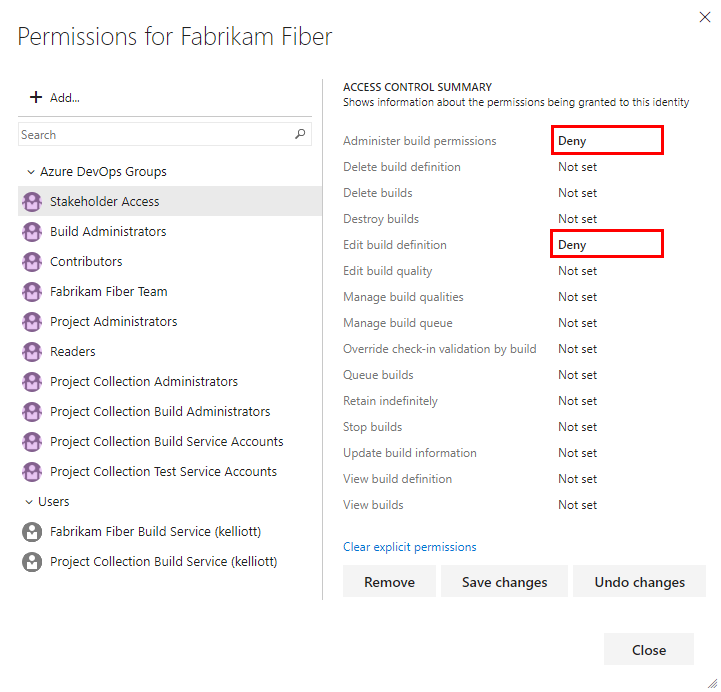
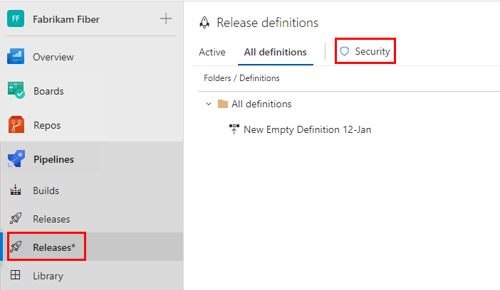
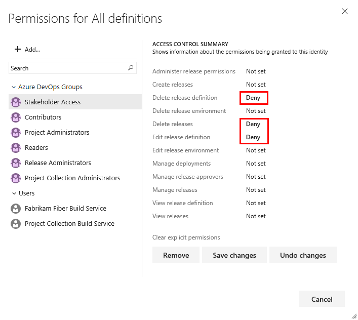

# Provide Stakeholders access to edit build and release pipelines

[!INCLUDE [temp](../../_shared/version-vsts-only.md)]
 
To provide Stakeholders permissions to create, edit, and manage build and release pipelines, you can enable the **Free access to Pipelines for Stakeholders** account-level preview feature. This feature essentially enables an unlimited number of free users to manage and configure pipelines in your projects. 

> [!IMPORTANT]  
> The **Free access to Pipelines for Stakeholders** preview feature is turned on by default for all organizations created after July, 7th 2018. It is only available from Azure DevOps Services.

Without this feature enabled, stakeholders can only [view and approve releases](permissions-access.md#pipelines).

## Turn on Free access to Pipelines for Stakeholders

To enable the **Free access to Pipelines for Stakeholders** feature, see [Enable preview features](../../project/navigation/preview-features.md). You can only enable it at the account level. 

> [!div class="mx-imgBorder"]  
> 

When the feature is turned on, all Stakeholders in your account have full access to **Pipelines** or **Build and Release** and it's associated features. This includes the ability to view, create, and delete automated test runs. For a complete list of associated features and tasks, see [Build and release permissions and roles](../../pipelines/policies/permissions.md). 

Stakeholders are still subject to the permissions set for their security group. For example, if they are in the Project Readers security group they have Read-only access to **Build and Release**.  If you need more fine grained control over what features Stakeholders can access, you can create a custom security group and set more fine grained permissions to certain groups of users as described in the next section. 

## Limit access to select Stakeholders to CI/CD features

After turning on the **Free access to Pipelines for Stakeholders** preview feature, you can limit access to select features or tasks by setting permissions. The general steps are: 

1. Create a custom, project-level, security group in Azure DevOps 
2. Add users to this group 
3. Set permissions to **Deny** or **Not set** for those CI/CD features you want to limit access to. You can set permissions for these CI/CD artifacts:
	- All build pipelines or select build pipelines
	- All release pipelines or select release pipelines 
	- Task groups
0. Add the security group to a Library security role for these artifacts: 
	- Variable groups
	- Secure files
	- Deployment groups 

## Create a custom security group 

Create a custom security group at the project-level or the collection-level. The method for creating a custom security group is the same, no matter at what level you add it. 

> [!TIP]    
> You only need to create a project-level security group if you are going to limit CI/CD tasks at the project level. 

To create a project-level security group, open the web portal and choose the project where you want to add users or groups. 

0. Choose **Project Settings** in the sidebar.

    > [!div class="mx-imgBorder"]  
	> 

0. Open the **Security** page and choose **Create group** to open the dialog for adding a group.

	> [!div class="mx-imgBorder"]  
	> 

0. Enter a name for the group, and optionally a description.

    For example, here we define a *Stakeholder Access* group.

	> [!div class="mx-imgBorder"]  
	>    

0. Choose **Create group**.

## Add members to the custom security group 

0. To add members to the group, choose the security group, choose **Members**, and then choose **Add**.

	> [!div class="mx-imgBorder"]  
	>  

1. Type the name of the user account into the text box. You can enter several identities into the text box, separated by commas. Specify individual emails, groups defined in an existing Azure Active Directory  or existing Azure DevOps groups. The system automatically searches for matches. Choose the match(es) that meets your choice.

    

0.	Choose **Save changes**.

<a id="build-permissions" /> 
## Set permissions for build pipelines

Open the Security dialog for all or a select build pipeline. 

0. To set the permissions for all build pipelines, choose **Pipelines>Builds**, choose the  folder icon, and then, with **All build pipelines** selected, choose the actions icon and select **Security**.

	> [!div class="mx-imgBorder"]  
	>   

0. To set the permissions for a specific build pipeline, open the  actions icon for the specific build and choose **Security**.

	> [!div class="mx-imgBorder"]  
	>   

## Add and set permissions for the custom security group  

0. Choose **Add** to add the *Stakeholder Access* group to the Permissions dialog. 

	> [!div class="mx-imgBorder"]  
	>   

0. In the dialog that opens, enter the group name of the custom security group that you previously added.

	> [!div class="mx-imgBorder"]  
	>   

	 And then choose **Save changes**. 

0. With the *Stakeholder Access* group selected, change the permission settings to **Deny** for those permissions you want to limit access to. 

   For example, here we change the permission for **Edit build definition** for the *Stakeholders Access* group to **Deny**. 

	> [!div class="mx-imgBorder"]  
	>   

0. Save your changes and the choose **Close**. 

<a id="build-permissions" /> 
## Set permissions for release definitions

You can follow the steps provided in the previous two procedures to set permissions for release definitions. 

Open the Security dialog for all or a select release pipeline. 

0. To set the permissions for all release pipelines, open **Build and Release>Releases**, and then choose **Security**.

	> [!div class="mx-imgBorder"]  
	>   

0. To set the permissions for a specific release pipeline, open the  actions icon menu for the build and choose **Security**.

0. Add the custom security group, such as *Stakeholder Access*, to the permissions dialog.

0. With the *Stakeholder Access* group selected, change the permission settings to **Deny** for those permissions you want to limit access to. 

   For example, here we change the permission for **Edit build definition** for the *Stakeholders Access* group to **Deny**. 

	> [!div class="mx-imgBorder"]  
	>   

0. Save your changes and the choose **Cancel**. 

## Limit access to Library resources 

To prevent Stakeholders from editing Library resources, add your custom security group to the Library reader role. To learn how, see [Manage Library roles for variable groups, secure files, and deployment groups](../../pipelines/policies/set-permissions.md#library).

## Limit access to task group 

To prevent Stakeholders from editing task groups, add your custom security group to the task group permissions and set all permissions to **Deny**. To learn how, see [Manage Library roles for variable groups, secure files, and deployment groups](../../pipelines/policies/set-permissions.md#task-group).

## Related articles

- [Set build and release permissions](../../pipelines/policies/set-permissions.md) 
- [Build and release permissions and roles (Security)](../../pipelines/policies/permissions.md) 
- [Get started as a stakeholder](get-started-stakeholder.md)
