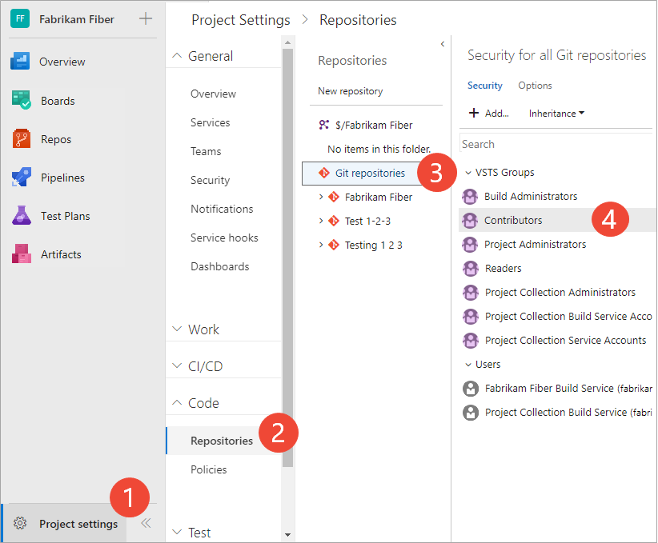
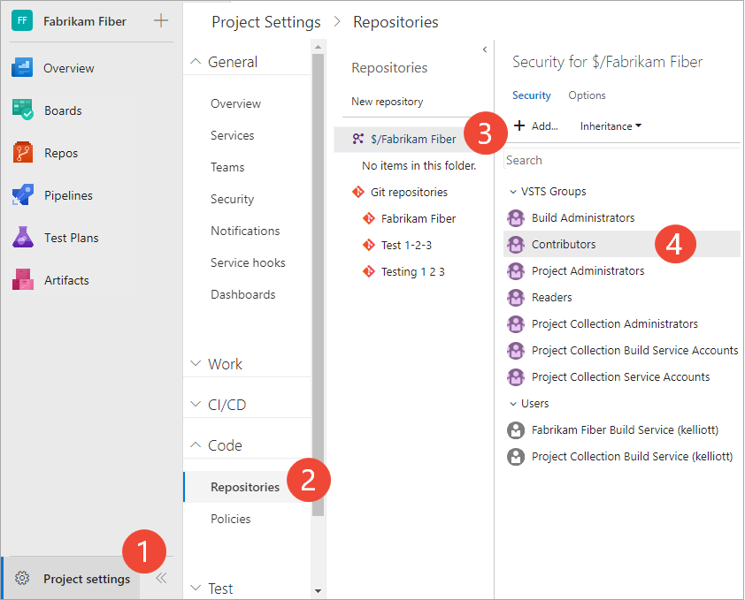

# Set repository permissions for Git or TFVC

[!INCLUDE [temp](../../_shared/version-vsts-tfs-all-versions.md)]

You can grant or restrict access to a repository by setting the permission state to **Allow** or **Deny** for a single user or a security group. For a description of each security group and permission level, see [Permissions and group reference](permissions.md).  

## Prerequisites

* You must have a project. If you don't have a project yet, create one in [Azure DevOps](../../user-guide/sign-up-invite-teammates.md) or set one up in an [on-premises TFS](../projects/create-project.md).
* You must be a member of the [Project Administrators Group](set-project-collection-level-permissions.md) or have your **Manage permissions** set to **Allow** for Git repositories or the TFVC repository.  

## Set Git repository permissions

You can set the permissions for all Git repositories for a project, or for a single repository. 

[!INCLUDE [temp](../../_shared/new-navigation.md)]  

# [New navigation](#tab/new-nav)

::: moniker range="vsts"  

0. Open the web portal and choose the project where you want to add users or groups. To choose another project, see [Switch project, repository, team](../../project/navigation/go-to-project-repo.md).

0. To set the set the permissions for all Git repositories for a project, choose **Git Repositories** and then choose the security group whose permissions you want to manage. 

	For example, here we choose (1) **Project Settings**, (2) **Repositories**, (3) **Git repositories**, (4) the **Contributors** group, and then (5) the permission for **Create repository**.

	 

	Otherwise, choose a specific repository and choose the security group whose permissions you want to manage.   

4. When done, choose **Save changes**. 

::: moniker-end  

::: moniker range=">= tfs-2013  <= tfs-2018"  
[!INCLUDE [temp](../../_shared/new-navigation-not-supported.md)]  
::: moniker-end  

# [Previous navigation](#tab/previous-nav)

0. Open the web portal and choose the project where you want to add users or groups. To choose another project, see [Switch project, repository, team](../../project/navigation/go-to-project-repo.md).  

0. Choose the  gear icon to open the administrative context.

	> [!div class="mx-imgBorder"]  
	>   
	
0. Choose **Version Control**.

0. To set the set the permissions for all Git repositories for a project, (1) choose **Git Repositories** and then (2) choose the security group whose permissions you want to manage. 

	Otherwise, choose a specific repository and choose the security group whose permissions you want to manage.   

3. Choose the setting for the permission you want to change. 

	Here we grant permissions to the Contributors group to (3) create repositories. 

	  

4. When done, choose **Save changes**. 

---

## Set TFVC repository permissions

# [New navigation](#tab/new-nav)

::: moniker range="vsts"  

0. To set the set the permissions for all Git repositories for a project, choose **Git Repositories** and then choose the security group whose permissions you want to manage. 

	For example, here we choose (1) **Project Settings**, (2) **Repositories**, (3) the **TFVC repository**, (4) the **Contributors** group, and then (5) the permission for **Manage branch**.

	 

3. Save your changes.  

::: moniker-end  

::: moniker range=">= tfs-2013  <= tfs-2018"  
[!INCLUDE [temp](../../_shared/new-navigation-not-supported.md)]  
::: moniker-end  

# [Previous navigation](#tab/previous-nav)

0. From the web portal, open the admin context by choosing the  gear Settings icon and choose **Version Control**.

1. Choose the TFVC repository for the project and then choose the security group whose permissions you want to manage.   

2. Change the permission setting to **Allow** or **Deny**. 

	For example, here we change the **Manage branch** permission to Allow for all members of the Contributors group. 

	  

3. Save your changes. 

## Related notes

- [Default Git permissions](default-git-permissions.md)  
- [Default TFVC permissions](default-tfvc-permissions.md)  
- [Git permissions prior to TFS 2017 Update 1](git-permissions-before-2017.md) 
- [Default permissions and access](permissions-access.md) 
- [Permissions and groups reference](permissions.md)  
