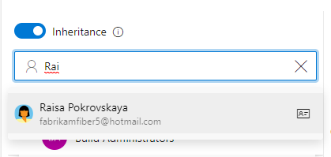
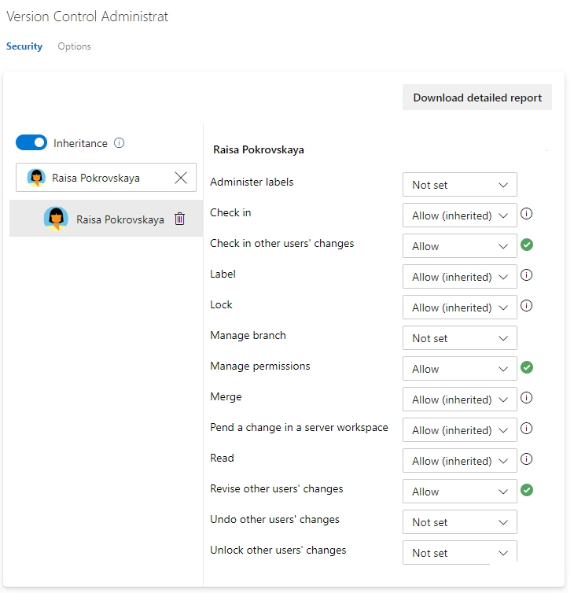

# Set repository permissions for Git or TFVC

[!INCLUDE [version-all](../../includes/version-all.md)]

By default, members of the project Contributors group have permissions to contribute to a repository. However, to create and manage permissions for a repository, you must be a member of the Project Administrators group.  You can grant or restrict access to a repository by setting the permission state to **Allow** or **Deny** for a single user or a security group. 

## Prerequisites

* You must have a project. If you don't have a project yet, create one in [Azure DevOps](../../user-guide/sign-up-invite-teammates.md) or set one up in an [on-premises TFS](../projects/create-project.md).
* You must be a member of the [Project Administrators Group](set-project-collection-level-permissions.md) or have your **Manage permissions** set to **Allow** for Git repositories or the TFVC repository.  

## Default repository permissions  

::: moniker range="azure-devops"

To contribute to the source code, you must be granted **Basic** access level or greater. Users granted **Stakeholder** access for private projects have no access to source code. Users granted **Stakeholder** access for public projects have the same access as Contributors and those granted **Basic** access. To learn more, see [About access levels](access-levels.md).

::: moniker-end

::: moniker range="< azure-devops"

To contribute to the source code, you must be granted **Basic** access level or greater. Users granted **Stakeholder** access have no access to source code. To learn more, see [About access levels](access-levels.md).
::: moniker-end

For a description of each security group and permission level, see [Permissions and group reference](permissions.md).  

::: moniker range=">= tfs-2015"

### Git

You can use Git repositories to host and collaborate on your source code. For an overview of code features and functions, see [Git](../../repos/git/index.yml).

[!INCLUDE [temp](includes/code-git.md)]

::: moniker-end

::: moniker range=">= tfs-2015"

### TFVC 

::: moniker-end

::: moniker range="<= tfs-2015"

[Team Foundation Version Control (TFVC)](../../repos/tfvc/index.yml) provides a centralized version control system to manage your source control. 

::: moniker-end

[!INCLUDE [temp](includes/code-tfvc.md)]

[!INCLUDE [temp](../../includes/ability-to-find-user-once-added.md)]

## Set Git repository permissions

You can set the permissions for all Git repositories for a project, or for a single repository. 

::: moniker range="azure-devops"

1. Open the web portal and choose the project where you want to add users or groups. To choose another project, see [Switch project, repository, team](../../project/navigation/go-to-project-repo.md).

2. Open **Project settings>Repositories**.  

	To set the permissions for all Git repositories, choose **Git Repositories** and then choose the security group whose permissions you want to manage. 

	For example, here we choose (1) **Project settings**, (2) **Repositories**, (3) **Git repositories**, (4) the **Contributors** group, and then (5) the permission for **Bypass policies when pushing**.

	[!INCLUDE [temp](../../includes/lightbox-image.md)] 

	 

	Otherwise, choose a specific repository and choose the security group whose permissions you want to manage.   

3.  To set permissions for a specific user or group, enter the name of the user or group into the search filter and select from the identities that appear.  

	> [!div class="mx-imgBorder"]  
	>   

	Then make the changes to the permission set. 

	> [!NOTE]  
	> To set permissions for a custom security group, you must have defined that group previously. See [Set permissions at the project- or collection-level](set-project-collection-level-permissions.md#project-level)

	If you add a user or group, and don't change any permissions for that user or group, then upon refresh of the permissions page, the user or group you added no longer appears.
 
	The changes are made automatically, no need to save your changes.  

### Enable or disable inheritance for a specific repository

- To enable or disable inheritance for a specific repository, select the repository and then move the **Inheritance** slider to either an on or off position.

	> [!div class="mx-imgBorder"]  
	>   

To learn about inheritance, see [About permissions and groups, Inheritance and security groups](about-permissions.md#inheritance). 

::: moniker-end

::: moniker range="azure-devops-2019 || azure-devops-2020"

1. Open the web portal and choose the project where you want to add users or groups. To choose another project, see [Switch project, repository, team](../../project/navigation/go-to-project-repo.md).

2. To set the permissions for all Git repositories for a project, choose **Git Repositories** and then choose the security group whose permissions you want to manage. 

	For example, here we choose (1) **Project Settings**, (2) **Repositories**, (3) **Git repositories**, (4) the **Contributors** group, and then (5) the permission for **Create repository**.

	[!INCLUDE [temp](../../includes/lightbox-image.md)] 

	 

	Otherwise, choose a specific repository and choose the security group whose permissions you want to manage.   

	> [!NOTE]  
	> If you add a user or group, and don't change any permissions for that user or group, then upon refresh of the permissions page, the user or group you added no longer appears.
 
4. When done, choose **Save changes**. 

::: moniker-end

::: moniker range="<= tfs-2018"

1. Open the web portal and choose the project where you want to add users or groups. To choose another project, see [Switch project, repository, team](../../project/navigation/go-to-project-repo.md).  

1. Choose the  gear icon to open the administrative context.

	> [!div class="mx-imgBorder"]  
	>   
	
2. Choose **Version Control**.

3. To set the set the permissions for all Git repositories for a project, (1) choose **Git Repositories** and then (2) choose the security group whose permissions you want to manage. 

	Otherwise, choose a specific repository and choose the security group whose permissions you want to manage.   

4. Choose the setting for the permission you want to change. 

	Here we grant permissions to the Contributors group to (3) create repositories. 

	  

5. When done, choose **Save changes**. 

::: moniker-end

## Set TFVC repository permissions

::: moniker range="azure-devops"

1. To set the set the permissions for the TFVC repository for a project, choose **TFVC Repository** and then choose the security group whose permissions you want to manage.

	For example, here we choose (1) **Project Settings**, (2) **Repositories**, and then the (3) **TFVC repository**

	![Project Settings>Repositories>TFVC repo}(media/git-tfvc-perm/open-tfvc-repo-settings.png)

1. Next choose the user or security group you want to change permissions. 

1.  To set permissions for a specific user or group, enter their name in the identity box and select their identity. 

	> [!div class="mx-imgBorder"]  
	>   

	Then make the changes to the permission set. 

	> [!div class="mx-imgBorder"]  
	>   

	The changes are made automatically, no need to save your changes.  

	> [!NOTE]  
	> To set permissions for a custom security group, you must have defined that group previously. See [Set permissions at the project- or collection-level](set-project-collection-level-permissions.md#project-level)

	If you add a user or group, and don't change any permissions for that user or group, then upon refresh of the permissions page, the user or group you added no longer appears.

::: moniker-end    

::: moniker range="azure-devops-2019 || azure-devops-2020"

1. To set the set the permissions for the TFVC repository for a project, choose **TFVC Repository** and then choose the security group whose permissions you want to manage.

	For example, here we choose (1) **Project Settings**, (2) **Repositories**, (3) the **TFVC repository**, (4) the **Contributors** group, and then (5) the permission for **Manage branch**.

	[!INCLUDE [temp](../../includes/lightbox-image.md)] 

	 

	> [!NOTE]  
	> If you add a user or group, and don't change any permissions for that user or group, then upon refresh of the permissions page, the user or group you added no longer appears.

1. Save your changes.  

::: moniker-end    

::: moniker range="<= tfs-2018"

1. From the web portal, open the admin context by choosing the  **Settings** and choose **Version Control**.

1. Choose the TFVC repository for the project and then choose the security group whose permissions you want to manage.   

2. Change the permission setting to **Allow** or **Deny**. 

	For example, here we change the **Manage branch** permission to Allow for all members of the Contributors group. 

	  

3. Save your changes. 

::: moniker-end

## Related articles

- [Default Git permissions](default-git-permissions.md)  
- [Default TFVC permissions](default-tfvc-permissions.md)  
- [Default permissions and access](permissions-access.md) 
- [Permissions and groups reference](permissions.md)  

<!---
	 

-->
