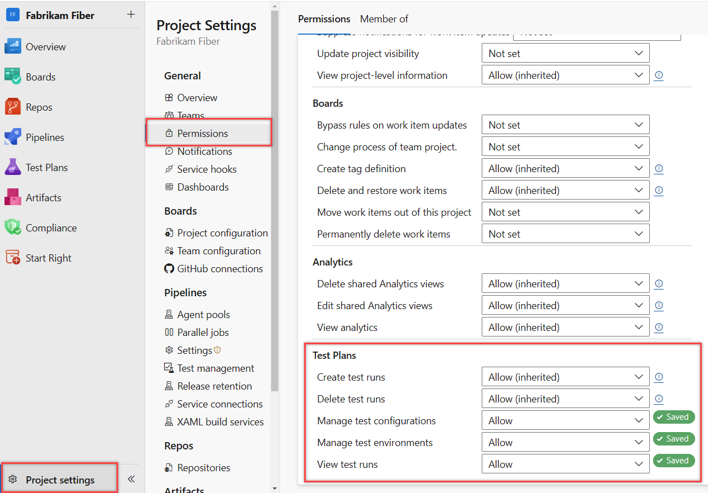
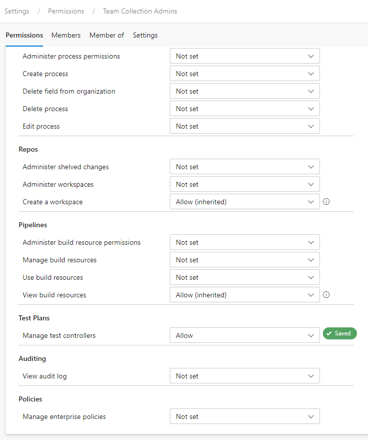
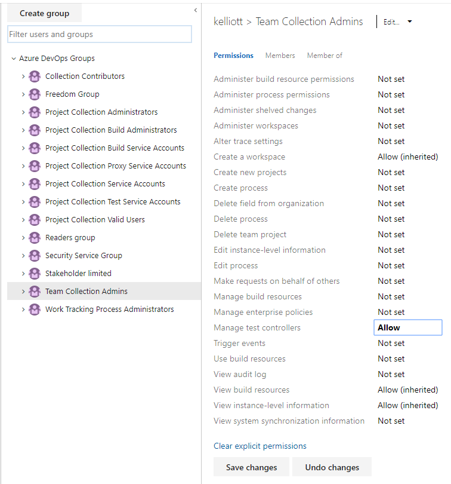

# Set permissions and access for testing

[!INCLUDE [version-all](../../includes/version-all.md)]

You grant or restrict access to various manual test features by granting users or groups specific permissions for an object or project.  

You set manual test permissions for area paths and at the project-level. You set permissions to manage test controllers at the organization or collection level. Test controllers are used in performing load tests.   

::: moniker range=">= tfs-2017"

- **Object-level, Area path level**  
	- Manage test plans
	- Manage test suites
- **Project-level** 
	- Manage test configurations 
	- Manage test environments
	- Create test runs
	- Delete test runs
- **Organization or collection-level** 
	- Manage test controllers 
 
::: moniker-end

::: moniker range="< tfs-2017"

- **Object-level, Area path level**  
	- Manage test plans
	- Manage test suites
- **Project-level** 
	- Manage test configurations 
	- Manage test environments
	- Create test runs
- **Organization or collection-level** 
	- Manage test controllers 

::: moniker-end

## Grant access to manual testing features 

To have full access to the Test feature set, your [access level must be set to Basic + Test Plans](change-access-levels.md). Users with Basic access and with permissions to permanently delete work items and manage test artifacts can only delete orphaned test cases.  

## Manage test plans and test suites under an area path 

Area path permissions let you grant or restrict access to edit or modify test plans or test suites assigned to those areas. You can restrict access to users or groups.  

In addition to the project-level permissions set in the previous section, team members need permissions to manage test artifacts which are set for an area path. 

[Open the **Security** page for area paths](set-permissions-access-work-tracking.md#set-permissions-area-path) and choose the user or group you want to grant permissions. 

  

Set the permissions for **Manage test plans** and **Manage test suites** to **Allow**.  

  

::: moniker range=">= tfs-2017"  

## Set permissions to create and delete test artifacts 

While test artifacts such as test plans, test suites, test cases, and so on are types of work items, the method for deleting them differs from deleting non-test work items. 

> [!IMPORTANT]  
> We only support permanent deletion of test artifacts such as test plans, test suites, test cases, shared steps and shared parameters. Deleted test artifacts won't appear in the recycle bin and cannot be restored. Deletion of test artifacts not only deletes the selected test artifact but also all its associated child items such as child test suites, test points across all configurations, testers (the underlying test case work item doesn't get deleted), test results history, and other associated history.

When you delete test artifacts, the following actions occur:

1.	Removes the deleted test artifact from the test case management (TCM) data store and deletes the underlying work item
2.	Runs a job to delete all the child items both from the TCM side and the underlying work items. This action may take time (up to a few minutes) depending on the number of artifacts to be deleted. 
3.	Causes all information in the work item tracking data store and TCM data store to be deleted and cannot be reactivated nor restored. 

::: moniker-end

::: moniker range=">= azure-devops-2019"

You must be a member of the Project Administrators group or have the [**Delete test artifacts** permission set to **Allow**](../../organizations/security/set-permissions-access-work-tracking.md#delete-test-permissions). You must also have your [access level](../../organizations/security/access-levels.md) set to **Basic + Test Plans** or **Visual Studio Enterprise**, which provides access to the full Test feature set. Users with Basic access and with permissions to permanently delete work items and manage test artifacts can only delete orphaned test cases. That is, they can delete test cases created from **Work** that aren't linked to any test plans or test suites. 

::: moniker-end

::: moniker range=">=tfs-2017 < azure-devops-2019"

You must be a member of the Project Administrators group or have the [**Delete test runs** permission set to **Allow**](../../organizations/security/set-permissions-access-work-tracking.md#delete-test-permissions). You must also have your [access level set to Basic+Test Plans or Advanced](../../organizations/security/change-access-levels.md), which provides access to the full Test feature set. Users with Basic access and with permissions to permanently delete work items and manage test artifacts can only delete orphaned test cases. That is, they can delete test cases created from **Work** that aren't linked to any test plans or test suites. 

For more information, see [Delete test artifacts](../../boards/backlogs/delete-test-artifacts.md). 

As a project admin you can grant a user, team group, or other group you've created to have these permissions. Open the Security page for the project and choose the user or group you want to grant permissions. (To learn how to access project-level **Security**, see [Set permissions at the project-level or project collection-level](set-project-collection-level-permissions.md).)

::: moniker-end

::: moniker range="azure-devops"

> [!NOTE]   
> To enable the new user interface for the Project Permissions Settings Page, see [Enable preview features](../../project/navigation/preview-features.md).

In this example, we grant members assigned to the Test Admin group permissions to create and view test runs and manage test configurations and environments.   

#### [Preview page](#tab/preview-page) 

>   

#### [Current page](#tab/current-page) 

> [!div class="mx-imgBorder"]
>   

::: moniker-end    

* * *

::: moniker range=">= tfs-2017 < azure-devops"

In this example, we grant members assigned to the Test Admin group permissions to delete test runs.   

> [!div class="mx-imgBorder"]  
>   

::: moniker-end    

<a id="test-controllers" /> 

## Set permissions to manage test controllers

Test controllers are used to perform load testing. To learn more, see [Overview of test agents and test controllers for running load tests](/visualstudio/test/configure-test-agents-and-controllers-for-load-tests).

To set permissions for managing test controllers, open **Organization** settings and choose **Security** or **Permissions**. Choose the group you want to grant permissions. To learn how to access organization or collection-level **Security**, see [Set permissions at the project-level or project collection-level](set-project-collection-level-permissions.md).

In this example, we grant members assigned to the Team Collection Admin group permissions to manage test controllers.  

::: moniker range="azure-devops"

> [!NOTE]   
> To enable the new user interface for Organization Permissions Settings Page, see [Enable preview features](../../project/navigation/preview-features.md).
 

#### [Preview page](#tab/preview-page) 

> [!div class="mx-imgBorder"]  
>   

#### [Current page](#tab/current-page) 

> [!div class="mx-imgBorder"]  
>   

* * *

::: moniker-end    

::: moniker range="< azure-devops"

> [!div class="mx-imgBorder"]  
>   

::: moniker-end    

## Related articles 

- [Grant or restrict access](restrict-access.md)   
- [Permissions and access for work tracking](permissions-access-work-tracking.md) 
- [Set permissions and access for work tracking](set-permissions-access-work-tracking.md) 
- [Permissions and groups reference](permissions.md) 
- [Troubleshoot permissions](troubleshoot-permissions.md)
