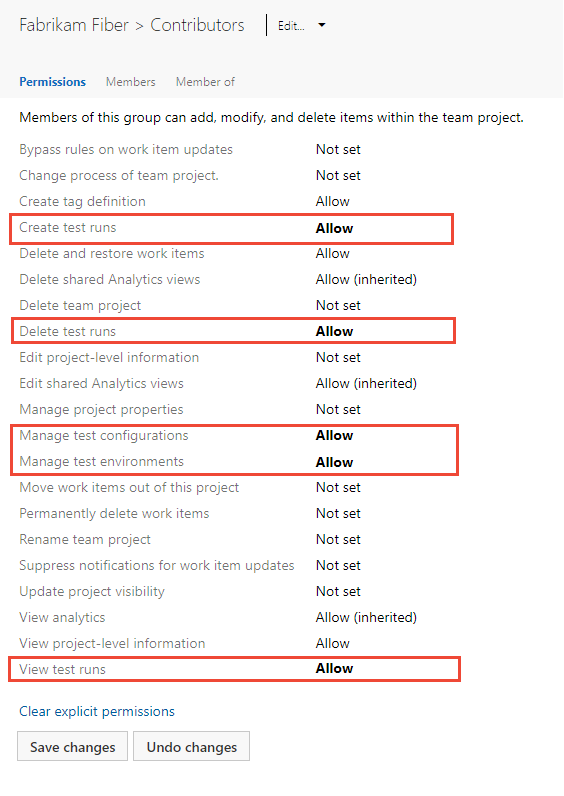

# Set permissions and access for testing

[!INCLUDE [version-all](../../includes/version-all.md)]

To exercise the full features of Azure Test Plans, you mustbe granted [Basic + Test Plans](https://marketplace.visualstudio.com/items?itemName=ms.vss-testmanager-web) access level or have one of the following subscriptions:

- [Enterprise](https://visualstudio.microsoft.com/vs/enterprise/)
- [Test Professional](https://visualstudio.microsoft.com/vs/test-professional/)
- [MSDN Platforms](https://visualstudio.microsoft.com/msdn-platforms/)

In addition, you can grant or restrict access to various manual test features by granting users or groups specific permissions for an object or project. Many test artifacts correspond to test-specific work item types. So, work-tracking permissions apply to test-specific work items, such as test plans, test suites, test cases and more. You set permissions for work items and manual testing features   for area paths and at the project-level. You set permissions to manage test controllers at the organization or collection level. Test controllers are used in performing load tests.   

- **Object-level, Area path level**  
	- **Edit work items in this node**: Add or edit test-specific work items, such as test plans, test suites, test cases, shared steps, or shared parameters. 
	- **Manage test plans**: Modify test plan properties such as build and test settings. 
	- **Manage test suites**: Create and delete test suites, add, and remove test cases from test suites, change test configurations associated with test suites, and modify a test suite hierarchy (move a test suite). 
- **Project-level** 
	::: moniker range=">= tfs-2017"
	- **Manage test configurations**: Add or edit [test configurations and configuration variables](../../test/test-different-configurations.md).  
	- **Manage test environments**: Add or edit [test plan settings](../../test/run-automated-tests-from-test-hub.md).
	- **Create test runs**: [Run manual tests](../../test/run-manual-tests.md) 
	- **Delete and restore work items**: [Delete test-specific work items](../../boards/backlogs/remove-delete-work-items.md)
	- **Delete test runs**: [Delete test results](../../boards/backlogs/delete-test-artifacts.md) 
	- **Manage test configurations**: Add or edit [test configurations and configuration variables](../../test/test-different-configurations.md).  
	- **Manage test environments**: Add or edit [test plan settings](../../test/run-automated-tests-from-test-hub.md).
	- **Move work items out of this project**: [Move work items from one project to another](../../boards/backlogs/move-change-type.md)
	- **Permanently delete work items**: [Permanently delete test-specific work items](../../boards/backlogs/remove-delete-work-items.md)
	::: moniker-end
	::: moniker range="< tfs-2017"
	- **Manage test configurations**: Add or edit [test configurations and configuration variables](../../test/test-different-configurations.md).  
	- **Manage test environments**: Add or edit [test plan settings](../../test/run-automated-tests-from-test-hub.md).
	- **Create test runs**: [Run manual tests](../../test/run-manual-tests.md) 
	- **Delete and restore work items**: [Delete test-specific work items](../../boards/backlogs/remove-delete-work-items.md)
	- **Manage test configurations**: Add or edit [test configurations and configuration variables](../../test/test-different-configurations.md).  
	- **Manage test environments**: Add or edit [test plan settings](../../test/run-automated-tests-from-test-hub.md).
	- **Move work items out of this project**: [Move work items from one project to another](../../boards/backlogs/move-change-type.md)
	- **Permanently delete work items**: [Permanently delete test-specific work items](../../boards/backlogs/remove-delete-work-items.md)
	::: moniker-end
- **Organization or collection-level** 
	- **Manage test controllers**  
 
## Prerequisites 

::: moniker range="azure-devops"
 
- To manage access levels or organization-level permissions, you must be a member of the **Project Collection Administrators** security group, or have your **Edit instance-level information** set to **Allow**. 
- To manage project or object-level test-related permissions, you must be a member of the **Project Administrators** security group. 
 
For more information, see the following articles: 

- [About access levels](access-levels.md)
- [Add organization users and manage access](../accounts/add-organization-users.md)
- [Change access levels for users or groups](change-access-levels.md)  
- [Set permissions at the project- or collection-level](set-project-collection-level-permissions.md)  
::: moniker-end

::: moniker range="< azure-devops"
- To manage access-levels, you must be a member of the **Azure DevOps Server Administrators** group.  
- To manage project or object-level test-related permissions, you must be a member of the **Project Administrators** security group. 
- To manage collection-level permissions or manage access levels, you must be a member of the **Project Collection Administrators** security group, or have your **Edit instance-level information** set to **Allow**.
 

For more information, see the following articles: 

- [About access levels](access-levels.md)
- [Add a server-level administrator](/azure/devops/server/admin/add-administrator) 
- [Change access levels for users or groups](change-access-levels.md)  
- [Set permissions at the project- or collection-level](set-project-collection-level-permissions.md)  
::: moniker-end

## Grant access to manual testing features 

To have full access to the Test feature set, your [access level must be set to Basic + Test Plans](change-access-levels.md). Users with Basic access and with permissions to permanently delete work items and manage test artifacts can only delete orphaned test cases.  

## Manage test plans and test suites under an area path 

Area path permissions let you grant or restrict access to edit or modify test plans or test suites assigned to those areas. You can restrict access to users or groups.  

In addition to the project-level permissions set in the previous section, team members need permissions to manage test artifacts which are set for an area path. 

[Open the **Security** page for area paths](set-permissions-access-work-tracking.md#set-permissions-area-path) and choose the user or group you want to grant permissions. 

  

Set the permissions for **Manage test plans** and **Manage test suites** to **Allow**.  

  

::: moniker range=">= tfs-2017"  

## Set permissions to create and delete test artifacts 

While test artifacts such as test plans, test suites, test cases, and so on are types of work items, the method for deleting them differs from deleting non-test work items. 

> [!IMPORTANT]  
> We only support permanent deletion of test artifacts such as test plans, test suites, test cases, shared steps and shared parameters. Deleted test artifacts won't appear in the recycle bin and cannot be restored. Deletion of test artifacts not only deletes the selected test artifact but also all its associated child items such as child test suites, test points across all configurations, testers (the underlying test case work item doesn't get deleted), test results history, and other associated history.

When you delete test artifacts, the following actions occur:

1.	Removes the deleted test artifact from the test case management (TCM) data store and deletes the underlying work item
2.	Runs a job to delete all the child items both from the TCM side and the underlying work items. This action may take time (up to a few minutes) depending on the number of artifacts to be deleted. 
3.	Causes all information in the work item tracking data store and TCM data store to be deleted and cannot be reactivated nor restored. 

::: moniker-end

::: moniker range=">= azure-devops-2019"

You must be a member of the Project Administrators group or have the [**Delete test artifacts** permission set to **Allow**](../../organizations/security/set-permissions-access-work-tracking.md#delete-test-permissions). You must also have your [access level](../../organizations/security/access-levels.md) set to **Basic + Test Plans** or **Visual Studio Enterprise**, which provides access to the full Test feature set. Users with Basic access and with permissions to permanently delete work items and manage test artifacts can only delete orphaned test cases. That is, they can delete test cases created from **Work** that aren't linked to any test plans or test suites. 

::: moniker-end

::: moniker range=">=tfs-2017 < azure-devops-2019"

You must be a member of the Project Administrators group or have the [**Delete test runs** permission set to **Allow**](../../organizations/security/set-permissions-access-work-tracking.md#delete-test-permissions). You must also have your [access level set to Basic+Test Plans or Advanced](../../organizations/security/change-access-levels.md), which provides access to the full Test feature set. Users with Basic access and with permissions to permanently delete work items and manage test artifacts can only delete orphaned test cases. That is, they can delete test cases created from **Work** that aren't linked to any test plans or test suites. 

For more information, see [Delete test artifacts](../../boards/backlogs/delete-test-artifacts.md). 

As a project admin you can grant a user, team group, or other group you've created to have these permissions. Open the Security page for the project and choose the user or group you want to grant permissions. (To learn how to access project-level **Security**, see [Set permissions at the project-level or project collection-level](set-project-collection-level-permissions.md).)

::: moniker-end

::: moniker range="azure-devops"

> [!NOTE]   
> To enable the new user interface for the Project Permissions Settings Page, see [Enable preview features](../../project/navigation/preview-features.md).

In this example, we grant members assigned to the Team Admin group permissions to create and view test runs and manage test configurations and environments.   

#### [Preview page](#tab/preview-page) 

>   

#### [Current page](#tab/current-page) 

> [!div class="mx-imgBorder"]
>   

::: moniker-end    

* * *

::: moniker range=">= tfs-2017 < azure-devops"

In this example, we grant members assigned to the Test Admin group permissions to delete test runs.   

> [!div class="mx-imgBorder"]  
>   

::: moniker-end    

<a id="test-controllers" /> 

## Set permissions to manage test controllers

Test controllers are used to perform load testing. To learn more, see [Overview of test agents and test controllers for running load tests](/visualstudio/test/configure-test-agents-and-controllers-for-load-tests).

To set permissions for managing test controllers, open **Organization** settings and choose **Security** or **Permissions**. Choose the group you want to grant permissions. To learn how to access organization or collection-level **Security**, see [Set permissions at the project-level or project collection-level](set-project-collection-level-permissions.md).

In this example, we grant members assigned to the Team Collection Admin group permissions to manage test controllers.  

::: moniker range="azure-devops"

> [!NOTE]   
> To enable the new user interface for Organization Permissions Settings Page, see [Enable preview features](../../project/navigation/preview-features.md).
 

#### [Preview page](#tab/preview-page) 

> [!div class="mx-imgBorder"]  
>   

#### [Current page](#tab/current-page) 

> [!div class="mx-imgBorder"]  
>   

* * *

::: moniker-end    

::: moniker range="< azure-devops"

> [!div class="mx-imgBorder"]  
>   

::: moniker-end    

## Related articles 

- [Grant or restrict access](restrict-access.md)   
- [Permissions and access for work tracking](permissions-access-work-tracking.md) 
- [Set permissions and access for work tracking](set-permissions-access-work-tracking.md) 
- [Permissions and groups reference](permissions.md) 
- [Troubleshoot permissions](troubleshoot-permissions.md)
