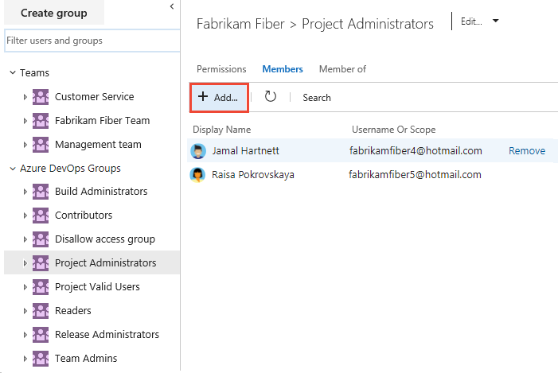
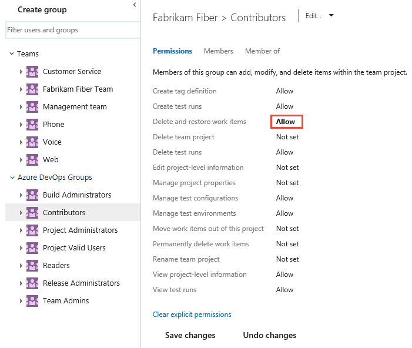
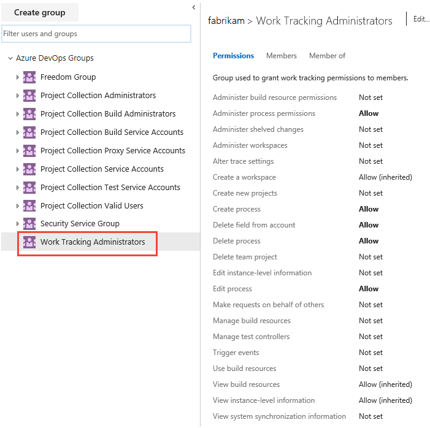

# Set permissions at the project- or collection-level

[!INCLUDE [temp](../../_shared/version-vsts-tfs-all-versions.md)]

Several permissions are set at the project or at the organization/project collection level. You can grant these permissions by adding a user or group to one of the default security groups listed here. Or, you can create a custom security group within a level and add members to that group. You can then change the default permission settings.

::: moniker range="azure-devops"
An organization is the container for several projects that share resources. For more information about projects and project collections, see [Plan your organizational structure](../../user-guide/plan-your-azure-devops-org-structure.md).
::: moniker-end

::: moniker range="<= azure-devops-2019"
A project collection is the container for several projects that share resources. For more information about projects and project collections, see [About projects and scaling your organization](../../organizations/projects/about-projects.md).
::: moniker-end

> [!div class="mx-tdBreakAll"]  
> | Project level | Organization/Collection level| 
> |-------------|----------| 
> |- Build Administrators - Contributors - Project Administrators - Project Valid Users - Readers - Release Administrators - *TeamName* Team |- Project Collection Administrators -  Project Collection Build Administrators - Project Collection Build Service Accounts - Project Collection Proxy Service Accounts - Project Collection Service Accounts - Project Collection Test Service Accounts - Project Collection Valid Users - Security Service Group | 

::: moniker range="<= azure-devops-2019"

> [!Note]  
> The above list indicates the latest groups defined for Azure DevOps and TFS 2017 and later versions. For earlier versions of TFS, the list may differ. Only add service accounts to [TFS service account groups](/azure/devops/server/admin/service-accounts-dependencies-tfs). To understand valid user groups, see [About permissions and groups, Valid user groups](about-permissions.md#validusers). 

::: moniker-end

For a description of each group and each permission, see [Permissions and groups reference, Groups](permissions.md#groups).

> [!TIP] 
> For users tasked with managing project-level features &mdash;such as, teams, area and 
> iteration paths, repositories, service hooks, and service end points&mdash;add them to 
> the Project Administrators group. 
> For users tasked with managing organization or collection-level features 
> &mdash;such as, projects, policies, processes, retention policies, 
> agent and deployment pools, and extensions&mdash;add them to the Project Collection 
> Administrators group. To learn more, see [About user, team, project, and organization-level settings](../settings/about-settings.md). 

## Prerequisites

::: moniker range="azure-devops"  
* You must be a member of a project. If you don't have a project yet, create one in [Azure DevOps](../accounts/set-up-vs.md). If you haven't been added as a team member, [get added now](../accounts/add-organization-users.md). 
  ::: moniker-end  
  ::: moniker range="<= azure-devops-2019"  
* You must be a member of a project. If you don't have a project yet, create one in an [on-premises TFS](../projects/create-project.md). If you haven't been added as a team member, [get added now](../../organizations/security/add-users-team-project.md). 
  ::: moniker-end  
* To manage permissions or groups at the project level, you must be a member of the Project Administrators Group or have your **Edit project-level information** set to Allow. If you created the project, you are automatically added as a member of this group. 
* To manage permissions or groups at the collection or instance level, you must be a member of the Project Collection Administrators Group or have your **Edit instance-level information** set to Allow. If you created the organization or collection, you are automatically added as a member of this group. 

<a id="project-level" />

## Add a user or group to a security group

As roles and responsibilities change, you might need to change the permission levels for individual members of a project. The easiest way to do that is to add the user or a group of users to a pre-defined security group. 

Here we show how to add a user to the built-in Project Administrators group. The method is similar to adding an Azure Active Directory or Active Directory group. 

::: moniker range="azure-devops"

> [!NOTE]   
> To enable the new user interface for the Project Permissions Settings Page, see [Enable preview features](../../project/navigation/preview-features.md).

#### [Preview page](#tab/preview-page) 

1. Open the web portal and choose the project where you want to add users or groups. To choose another project, see [Switch project, repository, team](../../project/navigation/go-to-project-repo.md).

2. Choose **Project Settings** and then **Permissions**.

	> [!div class="mx-imgBorder"]  
	> 

1. Choose **Project Administrators** group, **Members**, and then **Add**.  

	> [!div class="mx-imgBorder"]  
	>  

1. Enter the name of the user account into the text box and then select from the match that appears. You can enter several identities recognized by the system into the **Add users and/or groups** box. The system automatically searches for matches. Choose the matches that meet your choices. 

	> [!div class="mx-imgBorder"]  
	>   

	> [!NOTE]   
	> Users that have limited access, such as Stakeholders, won't be able to access select features even if granted permissions to those features. To learn more, see [Permissions and access](permissions-access.md).

1. Choose **Save**. 

#### [Current page](#tab/current-page) 

1. Open the web portal and choose the project where you want to add users or groups. To choose another project, see [Switch project, repository, team](../../project/navigation/go-to-project-repo.md).

2. Choose **Project Settings** and then **Security**.

	*To see the full image, click to expand*.

	 

1. Choose **Project Administrators** group, **Members**, and then **Add**.  

	> [!div class="mx-imgBorder"]  
	>  

1. Enter the name of the user account into the text box. You can enter several identities into the text box, separated by commas. The system automatically searches for matches. Choose the match(es) that meets your choice. 

	> [!div class="mx-imgBorder"]  
	>   

	> [!NOTE]   
	> Users that have limited access, such as Stakeholders, won't be able to access select features even if granted permissions to those features. To learn more, see [Permissions and access](permissions-access.md).

1. Choose **Save changes**. Choose the  refresh icon to see the additions.  

* * *

::: moniker-end    

::: moniker range="azure-devops-2019"

1. Open the web portal and choose the project where you want to add users or groups. To choose another project, see [Switch project, repository, team](../../project/navigation/go-to-project-repo.md).

2. Choose **Project Settings** and then **Security**.

	*To see the full image, click to expand*.

	 

1. Choose **Project Administrators** group, **Members**, and then **Add**.  

	> [!div class="mx-imgBorder"]  
	>  

1. Enter the name of the user account into the text box. You can enter several identities into the text box, separated by commas. The system automatically searches for matches. Choose the match(es) that meets your choice. 

	> [!div class="mx-imgBorder"]  
	>   

	> [!NOTE]   
	> Users that have limited access, such as Stakeholders, won't be able to access select features even if granted permissions to those features. To learn more, see [Permissions and access](permissions-access.md).

1. Choose **Save changes**. Choose the  refresh icon to see the additions.  
::: moniker-end    

::: moniker range="<= tfs-2018"

1. Open the web portal and choose the project where you want to add users or groups. To choose another project, see [Switch project, repository, team](../../project/navigation/go-to-project-repo.md).  

1. Choose the  gear icon to open the administrative context.

	> [!div class="mx-imgBorder"]  
	>   

2. Choose **Security**, **Project Administrators** group, **Members**, and then **Add**.  

	> [!div class="mx-imgBorder"]  
	>  

3. Enter the name of the user account into the text box. You can enter several identities into the text box, separated by commas. The system automatically searches for matches. Choose the match(es) that meets your choice. 

	> [!div class="mx-imgBorder"]  
	>   

	> [!NOTE]   
	> Users that have limited access, such as Stakeholders, won't be able to access select features even if granted permissions to those features. To learn more, see [Permissions and access](permissions-access.md).

4. Choose **Save changes**. Choose the  refresh icon to see the additions.  

::: moniker-end

## Change the permission level for a project-level group 

::: moniker range="azure-devops"

> [!NOTE]   
> To enable the new user interface for the Project Permissions Settings Page, see [Enable preview features](../../project/navigation/preview-features.md).

#### [Preview page](#tab/preview-page) 

1. From the **Permissions** page, choose the group whose permissions you want to change. 

	For example, here we grant permission to the Contributors group to **Delete and restore work items**.  

	> [!div class="mx-imgBorder"]  
	>   

	Your changes are automatically saved. 

	> [!TIP]   
	> In general, if you add a user to the Contributors group, they can add and modify work items. You can restrict permissions of users or user groups to add and modify work items based on the area path. For details, see [Set permissions and access for work tracking, Modify work items under an area path](set-permissions-access-work-tracking.md#set-permissions-area-path).

	For a description of each permission, see [Permissions and groups reference, project-level permissions](permissions.md#project-level-permissions).

	> [!NOTE]   
	> You can't change the permission settings for the Project Administrators group. This is by design.  
 
#### [Current page](#tab/current-page) 

1. From the **Security** page, choose the group whose permissions you want to change. 

	For example, here we grant permission to the Contributors group to delete and restore work items.  

	> [!div class="mx-imgBorder"]  
	>   

	> [!TIP]   
	> In general, if you add a user to the Contributors group, they can add and modify work items. You can restrict permissions of users or user groups to add and modify work items based on the area path. For details, see [Set permissions and access for work tracking, Modify work items under an area path](set-permissions-access-work-tracking.md#set-permissions-area-path).

	For a description of each permission, see [Permissions and groups reference, project-level permissions](permissions.md#project-level-permissions).

	> [!NOTE]   
	> You can't change the permission settings for the Project Administrators group. This is by design.  

1. Choose **Save changes**.   

* * *

::: moniker-end

::: moniker range="<= azure-devops-2019"

1. From the **Security** page, choose the group whose permissions you want to change. 

	For example, here we grant permission to the Contributors group to delete and restore work items.  

	> [!div class="mx-imgBorder"]  
	>   

	> [!TIP]   
	> In general, if you add a user to the Contributors group, they can add and modify work items. You can restrict permissions of users or user groups to add and modify work items based on the area path. For details, see [Set permissions and access for work tracking, Modify work items under an area path](set-permissions-access-work-tracking.md#set-permissions-area-path).

	For a description of each permission, see [Permissions and groups reference, project-level permissions](permissions.md#project-level-permissions).

	> [!NOTE]   
	> You can't change the permission settings for the Project Administrators group. This is by design.  

1. Choose **Save changes**.   

::: moniker-end

<a id="collection-level" />

## Add a group and change its permissions at the organization or collection-level group 

::: moniker range="azure-devops"

> [!NOTE]   
> To enable the new user interface for the Organization Permissions Settings Page v2, see [Enable preview features](../../project/navigation/preview-features.md). The preview page provides a group settings page that the current page does not. 

1. From your project web portal, choose the  Azure DevOps icon, and then select  **Organization settings**. 

	> [!div class="mx-imgBorder"]  
	>   

1. Under **Security**, choose **Permissions**, and then choose **New group** to open the dialog for adding a group. 

   > [!div class="mx-imgBorder"]  
   >   

2. Enter a name for the group, members of the group, and optionally a description. 
 
	For example, here we define a Work Tracking Administrators group.  

   > [!div class="mx-imgBorder"]  
   >   

	Choose **Create**.  

3. Choose the group name you just created and change the permission levels. For a description of each permission, see [Permissions and groups reference, Collection-level permissions](permissions.md#collection-level).

	Here we grant this group permissions to [manage customizations for the Inheritance process model](../settings/work/manage-process.md). 

	> [!div class="mx-imgBorder"]  
	>    

	Your changes are automatically saved. 

	> [!NOTE]   
	> You can't change the permission settings for the Project Collection Administrators group. This is by design. 

::: moniker-end    

::: moniker range="azure-devops-2019"

1. From your project web portal, choose the  Azure DevOps icon, and then select  **Organization settings**. 

	> [!div class="mx-imgBorder"]  
	>   

1. Choose **Security**, and then choose **Create group** to open the dialog for adding a group. 

   > [!div class="mx-imgBorder"]  
   >   

2. Enter a name for the group, and optionally a description. 
 
	For example, here we define a Work Tracking Administrators group.  
	  
	For a description of each permission, see [Permissions and groups reference, collection-level permissions](permissions.md#collection-level).

3. Choose the group name you just created and change the permission levels. 

	Here we grant this group permissions to [manage customizations for the Inheritance process model](../settings/work/manage-process.md). 

	> [!div class="mx-imgBorder"]  
	>    

4. Choose **Save changes**.   

	> [!NOTE]   
	> You can't change the permission settings for the Project Collection Administrators group. This is by design. 

::: moniker-end    

::: moniker range="<= tfs-2018"

1. Choose the  settings icon and select **Organization settings** (Azure DevOps) or **Collection settings** (on-premises).  
	
	> [!div class="mx-imgBorder"]  
	>   

1. Choose **Security**, and then choose **Create group** to open the dialog for adding a group. 

   > [!div class="mx-imgBorder"]  
   >   

2. Enter a name for the group, and optionally a description. 
 
	For example, here we define a Work Tracking Administrators group.  
	  
	For a description of each permission, see [Permissions and groups reference, collection-level permissions](permissions.md#collection-level).

3. Choose the group name you just created and change the permission levels. 

	Here we grant this group permissions to [manage customizations for the Inheritance process model](../settings/work/manage-process.md). 

	> [!div class="mx-imgBorder"]  
	>    

4. Choose **Save changes**.   

	> [!NOTE]   
	> You can't change the permission settings for the Project Collection Administrators group. This is by design.  

::: moniker-end

## Manage group settings 

::: moniker range="azure-devops" 

> [!NOTE]   
> To enable the new user interface for the **Project Permissions Settings Page** or the **Organization Permissions Settings Page v2**, see [Enable preview features](../../project/navigation/preview-features.md). Both preview pages provide a group settings page that the current page does not. 

#### [Preview page](#tab/preview-page) 

You can change a group description, add a group image, or delete a group through the group **Settings** page. 

From the **Project > Settings > Permissions** or **Organization > Settings > Permissions** page, choose the group you want to manage, and then choose **Settings**.  

For example, here we open the Settings for the Work Tracking Administrators group. 

> [!div class="mx-imgBorder"]  
>  

You can modify the group name, group description, upload an image, or delete the group.  

#### [Current page](#tab/current-page) 

You can change a group description or add a group image by editing the group profile. Or, delete a group through the group **Delete** menu option. 

### Manage project-level groups 

1. From the **Project > Settings > Security** page, choose the group you want to manage, and choose from the **Edit** menu to either **Edit profile** or **Delete**. 
	For example, here we open the **Edit profile** for the Stakeholder Access group.  

	> [!div class="mx-imgBorder"]  
	>    

	. . . and change the description. Note that you can change the name of the group as well. 

	> [!div class="mx-imgBorder"]  
	>    

1. Choose **Save** to save your changes.

### Manage organization-level groups 

1. From the **Organization > Settings > Security** page, choose the group you want to manage, and hover over the context menu and select **Edit Group** or **Delete Group**.  

	For example, here we open the **Edit Group** for the Work Tracking Administrators group.  

	> [!div class="mx-imgBorder"]  
	>    

	. . . and change the description. Note that you can change the name of the group as well. 

	> [!div class="mx-imgBorder"]  
	>    

1. Choose **Save** to save your changes.

::: moniker-end

::: moniker range="<= azure-devops-2019" 

You can change a group name, description, add a group image, or delete a group. 

1. From the **Project > Settings > Security** or **Organization > Settings > Security** page, choose the group you want to manage

1. Choose from the **Edit** menu to either **Edit profile** or **Delete**. 

	For example, here we open the **Edit profile** for the Stakeholder Access group.  

	> [!div class="mx-imgBorder"]  
	>    

	. . . and change the description. Note that you can change the name of the group as well. 

	> [!div class="mx-imgBorder"]  
	>    

1. Choose **Save** to save your changes.

::: moniker-end

::: moniker range="<= azure-devops-2019"  

## On-premises deployments

For on-premises deployments, see these additional topics: 

- [Add a user as a TFS server administrator](/azure/devops/server/admin/add-administrator-tfs) 
- [TFS service account groups](/azure/devops/server/admin/service-accounts-dependencies-tfs)  

::: moniker-end  

::: moniker range="tfs-2018 < azure-devops"

If your on-premises deployment is integrated with SQL Server Reports, you'll need to manage membership for those products separately from their websites. See [Grant permissions to view or create SQL Server reports in TFS](../../report/admin/grant-permissions-to-reports.md).

::: moniker-end 

::: moniker range="<= tfs-2017"
If your on-premises deployment is integrated with a SharePoint product or SQL Server Reports, you'll need to manage membership for those products separately from their websites.

* [Set SharePoint site permissions](../../organizations/security/set-sharepoint-permissions.md)
* [Grant permissions to view or create SQL Server reports in TFS](../../report/admin/grant-permissions-to-reports.md)

::: moniker-end 

## Next steps

> [!div class="nextstepaction"]
> [Manage projects](../projects/index.md)

## Related articles

- [About permissions and groups](about-permissions.md)
- [Permissions lookup reference](permissions-lookup-guide.md)
- [Permissions and groups reference](permissions.md)
- [Manage teams and configure team tools](../../organizations/settings/manage-teams.md)

