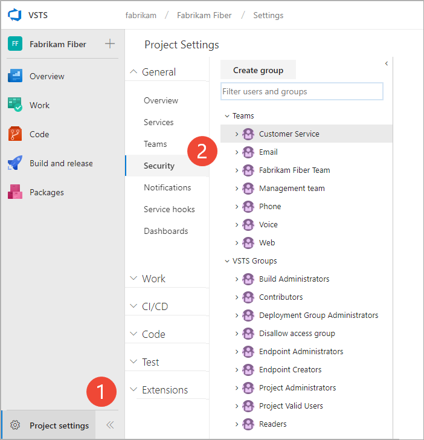
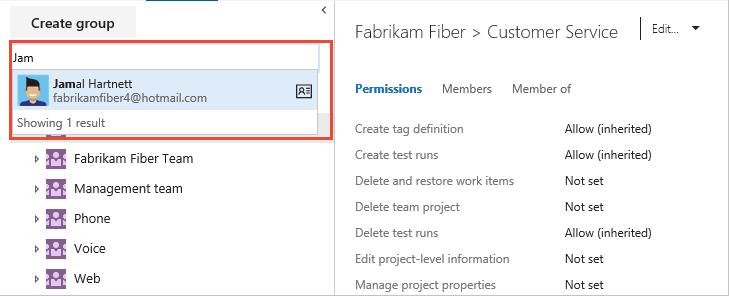
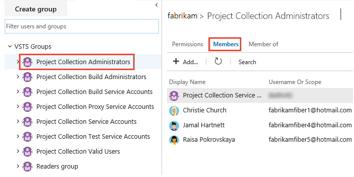
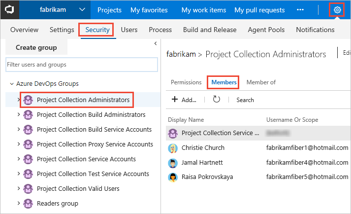

# Quickstart: View permissions for yourself or others

[!INCLUDE [temp](../../_shared/version-vsts-tfs-all-versions.md)]

In this quickstart, you learn how to view your permissions or those defined for another which have been set in Azure DevOps. That way, if you don't have a permission to access a feature or function, you can request it from the right resource.

Permissions are set at the collection, project, and object level as described in [About permissions and groups](about-permissions.md). So to view the permissions you have, you need to open the permissions at the object, project, or collection level.

## Prerequisites

* You must have a project to connect to. If you don't have a project yet, [create one](../projects/create-project.md).
* You must be a member of the Project Valid Users Group or Project Collection Valid Users Group to view permissions.

> [!NOTE]
> This article shows how to view permissions assigned to a user as the project-level or collection-level. However, the steps are similar when you work from the Security dialog of an object.

## View project-level permissions

::: moniker range=">= azure-devops-2019"

1. Choose **Project Settings** and then **Security**.

	*To see the full image, click to expand*.

	

2. Begin entering the name into the *Filter users and groups* box. The system automatically shows the names that begin with the characters you enter.  

	> [!div class="mx-imgBorder"]
	>   

3. Choose the name you want. The project-level permissions you have set are based on the groups you belong to or those specifically set for your account.      

	> [!div class="mx-imgBorder"]
	>   

4. Choose **Member of** to see which security groups the user belongs to.  

	Here we see that *Jamal Hartnett* belongs to several teams as well as the Project Collection Administrators group. 

	> [!div class="mx-imgBorder"]
	>   

::: moniker-end    

::: moniker range="<= tfs-2018"

1. Open **Project Settings**. Choose the  gear settings icon, and choose **Security**. 

	> [!div class="mx-imgBorder"]
	> 

2. Begin entering the name into the *Filter users and groups* box. The system automatically shows the names that begin with the characters you enter.  

	

3. Choose the name you want. The project-level permissions you have set are based on the groups you belong to or those specifically set for your account.      

	> [!div class="mx-imgBorder"]
	>   

	For a description of each permissions, see [Permissions and groups reference](permissions.md#project-level). 

4. Choose **Member of** to see which security groups the user belongs to.  

	Here we see that *Jamal Hartnett* belongs to several teams as well as the Project Collection Administrators group. 

	    

	For a description of each group, see [Permissions and groups reference](permissions.md#project-level-groups). 

::: moniker-end

## View organization or collection-level permissions 

Open admin settings for the organization or a project collection. 

::: moniker range=">= azure-devops-2019"

0. Choose the  Azure DevOps logo to open **Projects**. Then choose **Admin settings**. 

	> [!div class="mx-imgBorder"]  
	>   

0. Choose **Security**, the **Project Collection Administrators** group, and then **Members**. 

	> [!div class="mx-imgBorder"]  
	>   

0.  Follow steps 2 through 4 in the procedure outlined previously for view project-level permissions. 

::: moniker-end    

::: moniker range=">= tfs-2013 <= tfs-2018"

0. Choose the  settings icon and select **Organization settings** or **Collection settings**.  

	> [!div class="mx-imgBorder"]  
	>   

0.	Choose **Security**, **Project Collection Administrators** group, and then **Members**. 

	

0.  Follow steps 2 through 4 in the procedure outlined previously for view project-level permissions. 

::: moniker-end

## View object-level permissions 

You can define the security or permissions for a number of objects. You access them from the context menu of the object. 

From the web portal, open the Security dialog for the object whose permissions you want to set. For specific instructions, see the following articles: 

<table width="80%">
<tbody valign="top">
<tr>
<th width="35%">Area</th>
<th width="65%">Task</th>
</tr>
<tr>
<td>Wiki & Dashboard permissions</td>
<td>
<ul>
<li>[README & Wiki](../../project/wiki/manage-readme-wiki-permissions.md)</li>
<li>[Dashboards](../../report/dashboards/dashboard-permissions.md)</li>

</ul>
</td>
</tr>
<tr>
<td>DevOps (code, build, test, release) permissions </td>
<td>
<ul>
<li>[Git branch](../../repos/git/branch-permissions.md)</li>
<li>[Git repository](set-git-tfvc-repository-permissions.md)</li>
<li>[TFVC](set-git-tfvc-repository-permissions.md)</li>
<li>[Builds](../../pipelines/policies/set-permissions.md)</li>
<li>[Release pipeline security](../../pipelines/policies/set-permissions.md)</li>
<li>[Approvals and approvers](../../pipelines/release/approvals/index.md)</li> 
</ul>
</td>
</tr>
<tr>
<td>Work tracking permissions</td>
<td>
<ul>
<li>[Area and iteration paths](../../organizations/security/set-permissions-access-work-tracking.md)</li>
<li>[Work item query and folder](../../boards/queries/set-query-permissions.md)</li>
<li>[Plan permissions](set-permissions-access-work-tracking.md#plan-permissions)</li>  
</ul>
</td>
</tr>
</tbody>
</table>

## Try this next

> [!div class="nextstepaction"]
> [Look up the organization owner or a project administrator](lookup-organization-owner-admin.md) 

