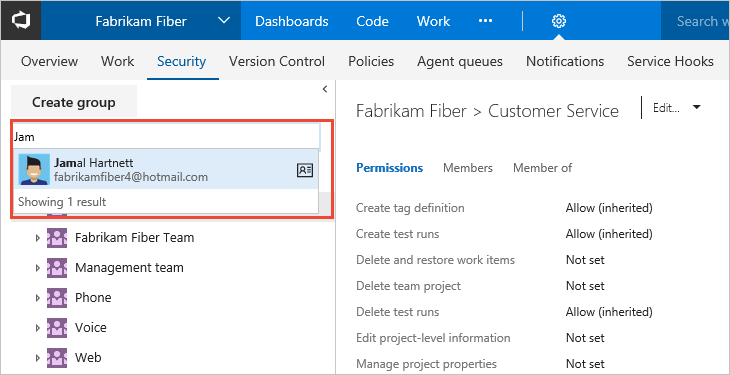

# Quickstart: View permissions for yourself or others

[!INCLUDE [temp](../../_shared/version-vsts-tfs-all-versions.md)]

You can view your permissions or those defined for another which have been set in Visual Studio Team Services (VSTS) or Team Foundation Server (TFS). That way, if you don't have the permission to access a feature or function, you can request it from the right resource.

Permissions are set at the collection, team project, and object level as described in [About permissions and groups](about-permissions.md). So to view the permissions you have, you need to open the permissions at the object, project, or collection level.

## Prerequisites

* You must have a team project to connect to. If you don't have a team project yet, create one in [VSTS](../../user-guide/sign-up-invite-teammates.md) or set one up in an [on-premises TFS](../accounts/create-team-project.md).
* You must be a member of the Project Valid Users Group or Project Collection Valid Users Group to view permissions.

> [!NOTE]
> This topic shows how to view permissions assigned to a user as the project-level. However, the steps are similar whether you work from the Security dialog of an object or at the account/collection level.

## View project-level permissions

1. Open the admin context from the user/team project context. Click the  gear settings icon, and click the **Security** tab. 

2. Begin typing the name into the *Filter users and groups* box. The system will automatically show the names that begin with the characters you type.  

	  

3. Click the name you want. The project-level permissions you have set are based on the groups you belong to or those specifically set for your account.      

	   

4. Click **Member of** to see which security groups the user belongs to.  

	Here we see that the user account, Jamal Hartnett, belongs to several teams as well as the Project Collection Administrators group. 

	    

## View collection-level permissions 

1. Open the admin context from the account context. Click the  gear settings icon, and click the **Security** tab. 

2.  Follow steps 2 through 4 in the procedure outlined previously for view project-level permissions. 

## View object-level permissions 

There are a number of objects that maintain permissions. You access them from the context menu of the object. 

From the web portal, open the Security dialog for the object whose permissions you want to set. For specific instructions, see these topics: 

> [!div class="mx-tdBreakAll"]  
> |Wiki & Dashboard permissions | DevOps permissions  |Agile/Work tracking permissions |  
> |-------------|----------|---------|   
> |- [README & Wiki](../../project/wiki/manage-readme-wiki-permissions.md) - [Dashboards](../../report/dashboards/dashboard-permissions.md)  |- [Git branch](../../git/branch-permissions.md) - [Git repository](set-git-tfvc-repository-permissions.md) - [TFVC](set-git-tfvc-repository-permissions.md) - [Builds](../../pipelines/policies/set-permissions.md) - [Release definition security](../../pipelines/policies/set-permissions.md) - [Approvals and approvers](../../pipelines/release/approvals/index.md) |- [Area and iteration paths](../../organizations/security/set-permissions-access-work-tracking.md) - [Work item query and folder](../../work/track/set-query-permissions.md) - [Plan permissions](set-permissions-access-work-tracking.md#plan-permissions)|  

## Next steps

> [!div class="nextstepaction"]
> [Look up the account owner or a project administrator](lookup-account-owner-admin.md) 

