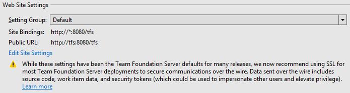
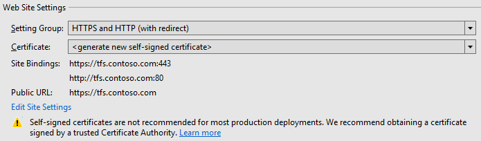

# TFS web site settings and security

**TFS 2017** | **TFS 2015** | **TFS 2013**

## Background

For many releases, the default web site settings for Team Foundation Server have been:
 
* A single HTTP binding for the TFS web site on port 8080, with no host name or IP address specified.
* A public URL (previously referred to as the Notification URL) of the form http://machine-name:8080/tfs. 
 
The primary benefit of these settings is that they are very simple to set up and convenient for end users in most scenarios. In particular:
 
* Using HTTP rather than HTTPS avoids the need to obtain and install certificates. 
* Using 8080 rather than 80 avoids potential conflicts with other sites on the same machine.
* Using "tfs" as the virtual directory for the site makes it easier to host Team Foundation Server and other web sites on the same port on the same server. 
* Using the machine name, rather than the fully-qualified-domain-name (FQDN), in the public URL saves a lot of typing.
* Leaving the host name in the binding unspecified allows for flexibility in connecting - machine name, FQDN, or IP address will all work when users try to connect to their servers. 
 
These settings are not, however, secure by default. In particular, by not using an HTTPS binding, communication to and from Team 
Foundation Server is not encrypted in transit unless other solutions like IPSec are used. They are thus potentially vulnerable to malicious 
actors monitoring or even modifying the contents of the communication. These issues are mitigated to some extent when TFS is deployed on 
an intranet behind a corporate firewall, as the vast majority of TFS instances are. But even in these scenarios, data sent to and from 
TFS includes source code, work item data, and other information which could often benefit from additional security.
 
Additionally, in TFS 2017 new authentication scenarios exist (build/release agent service account authentication, personal access tokens) 
which send bearer tokens over the wire. If these tokens are obtained by malicious users, they can then be used to impersonate the users 
to whom they belong. 
 
Given all of this, we decided the time had come to more strongly advocate for the use of HTTPS bindings in Team Foundation Server 
deployments.

## Setting groups

TFS 2017 presents web site settings configuration options in all server configuration scenarios. Several setting groups are provided, which bundle up combinations of 
site bindings, virtual directories, and public URLs which we recommend and believe will be most commonly used. For scenarios where none of these setting groups are 
appropriate, settings can be fully customized using the Edit Site Settings dialog.

The Default setting group includes the same settings used in previous versions of Team Foundation Server. For all of the reasons listed above, these settings are 
still the default for new TFS deployments. For existing deployments, we will attempt to preserve existing settings, which will often result in the Default setting 
group being selected.

The HTTPS and HTTP (with redirect) setting group provisions two bindings:

* One HTTPS binding on port 443, with the fully-qualified-domain-name (FQDN) of the machine as the Host Name. 
* One HTTP binding on port 80, again with the FQDN of the machine as the Host Name.

The HTTP binding on port 80 is added only as a convenience for end users - a redirect is configured so that all traffic ends up using the HTTPS binding on port 443. 
The Public URL for this setting group is of the form https://fully-qualified-domain-name. By default, this setting group will provision new self-signed 
certificates and use them for the HTTPS binding. We do not typically recommend using self-signed certificates for production TFS deployments. See Certificate 
Options below for more information on when it is appropriate to use self-signed certificates and what other options are available.

The HTTPS only setting group provisions a single HTTPS binding on port 443, with the FQDN of the machine as the Host Name. Again, the Public URL for this setting 
group is of the form https://fully-qualified-domain-name, and self-signed certificates will be provisioned by default. 

The HTTP Only setting group provisions a single HTTP binding on port 80 with no Host Name specified. The Public URL for this setting group is of the form 
http://machine-name.

## Certificate options

Deploying web sites using HTTPS bindings and SSL/TLS encryption is closely related to the broader topic of public key infrastructure (PKI), which is a rich and 
interesting topic for which a wide variety of documentation already exists. We will not attempt to cover all of the complexity here, but rather will focus on high 
level options for configuring HTTPS bindings for Team Foundation Server deployments. Many organizations have specific policies around deploying certificates, so the 
first step in deciding what certificate to use for a TFS deployment is often to talk with an organization-level information technology group.
 
Options include:
 
* Allowing the TFS configuration wizard to generate self-signed certificates for use by the deployment.
* Obtaining a certificate from an internal Certificate Authority. 
* Obtaining a certificate from an external Certificate Authority.

### Self-signed certificates

Self-signed certificates are useful for trial deployments of Team Foundation Server, since they are very easy to provision and use. They are less appropriate for 
production deployments of Team Foundation Server, and we do not recommend they be used for Team Foundation Server deployments exposed to the public internet. 
Generally, self-signed certificates are susceptible to man-in-the-middle attacks. They also cause problems for users, since they will cause certificate warnings 
and errors until their root certificates are installed on each client machine. For example, the Edge browser will show the below error.

When the TFS configuration wizard generates self-signed certificates for your deployment, it will create two - one that is placed in the Trusted Root Certification 
Authorities store on the server, and a second, signed by the first, that is placed in the Personal store on the server and used by TFS. Setting things up in this way 
helps to mitigate the possibility of man-in-the-middle attacks and enables rotation of the certificate used in the HTTPS binding without also needing to distribute a 
new certificate to all clients in order to avoid certificate errors like the one shown above.

To avoid those certificate warnings and errors, you can export the root certificate and install it on client machines. There are several ways to accomplish this,
including:

* Using the Certificates MMC snap-in to manually [export the certificate](https://technet.microsoft.com/library/cc730988.aspx) on the server and then import it on each client.
* Using the [Export-Certificate](/powershell/module/pkiclient/export-certificate) powershell cmdlet, available in Windows 8 / Windows Server 2012 and later 
operating systems, to export the certificate. [Import-Certificate](/powershell/module/pkiclient/import-certificate) can then be used to import it on each client.
* Using [Group Policy](https://technet.microsoft.com/library/dd807084.aspx) to automate distribution to clients. 

### Internal and external Certificate Authorities

Many large organizations have their own public key infrastructure, and are able to issue certificates from their own Certificate Authorities. Typically, when this 
is the case, the trusted root certificates for these authorities will already be distributed to client machines, thus avoiding the need to distribute additional 
certificates for Team Foundation Server. If your organization has its own public key infrastructure, this can be a good option for your TFS deployment.

When other options are not appropriate or available, certificates may be obtained (typically at a cost) from an external Certificate Authority (CA). Instructions for 
this process, which starts with creating a [Certificate Signing Request](https://technet.microsoft.com/library/cc732906(v=ws.10).aspx), can be found on most CA 
websites. Some important notes:
 
* Make sure that the Common Name provided in the certificate request matches up with the host name you want in your public URL - for example, tfs.contoso.com. 
* On the Cryptographic Service Provider Properties, we recommend selecting Microsoft RSA SChannel Cryptographic Provider and a bit length of 2048 or greater.

## Changing your public URL

It should also be noted that when upgrading an existing Team Foundation Server deployment, changing the public URL will impact end users. While we do still 
recommend converting from HTTP to HTTPS bindings, Visual Studio client connections will need to be re-established, old bookmarks will no longer resolve properly, 
and so forth. It is therefore important to coordinate this sort of change with the users of your TFS deployment to avoid significant disruption.

