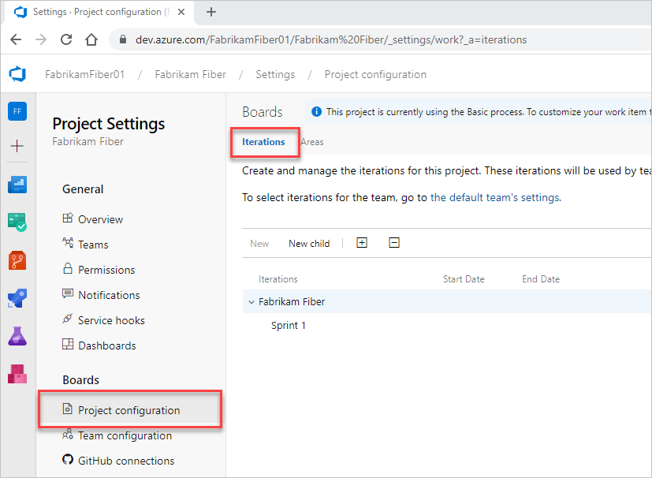
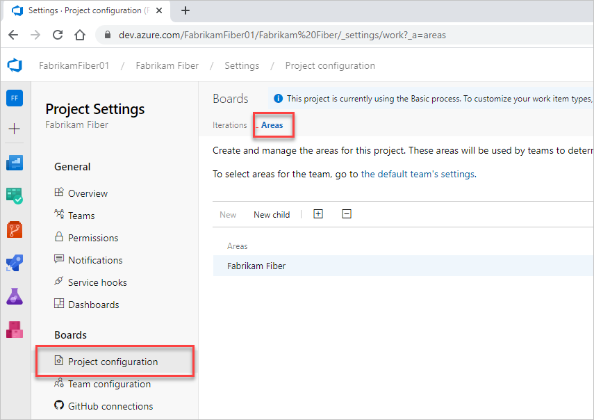

# About area and iteration (sprint) paths 

[!INCLUDE [temp](../../boards/includes/version-all.md)]

Area paths allow you to group work items by team, product, or feature area. Iteration paths allow you to group work into sprints, milestones, or other event-specific or time-related period. Both these fields allow you to define a hierarchy of paths. 

You define area and iteration paths for a project. Teams can then choose which paths are used to support their backlog and other Agile tools. To understand how Agile tools use area and iteration paths, see [Agile tools that rely on areas and iterations](about-teams-and-settings.md).

::: moniker range=">= azure-devops-2020" 

> [!NOTE] 
> Area paths and iteration paths are also referred to as *Classification Nodes*. You can manage them programmatically via the [Classification Nodes (REST API)](/rest/api/azure/devops/wit/classification%20nodes) or the Azure DevOps CLI command [az boards iteration](/cli/azure/boards/iteration).

::: moniker-end

::: moniker range=">= tfs-2018 < azure-devops-2020" 

> [!NOTE] 
> Area paths and iteration paths are also referred to as *Classification Nodes*. You can manage them programmatically via the [Classification Nodes (REST API)](/rest/api/azure/devops/wit/classification%20nodes).

::: moniker-end


The areas and iterations you see depend on the process you used to create your project. Here we show the defaults defined for the Scrum process. No dates are set. You set dates to correspond to your sprint or release schedules.

> [!div class="mx-tdBreakAll"] 
> |Iterations| Areas |
> |-------------|----------| 
> | |  | 


<a id="area-path-guidance" />

## Define and assign area paths

If you're new to managing projects and teams, the most straight forward sequence for configuring your project and teams is as follows.

1. Determine the number and names of area paths that you want to support to categorize your work. At a minimum, add one area path for each team that you define. 
2. Determine the number and names of teams you want to support. For guidance, review [About teams and Agile tools](about-teams-and-settings.md).
3. Open **Project settings > Project configuration** and define the area paths to support steps 1 and 2 at the project level. Follow the steps provided later in this article: [Open Project Settings, Project configuration](set-area-paths.md#open-project-settings) and [Add area paths](set-area-paths.md#add-areas).
4. Define the teams you need to support step 2. For guidance, see [Add a team, move from one default team to several teams](add-teams.md).  
5. Open the team configuration and assign the default and additional area path(s) to each team. Follow the steps provided later in this article: [Open team settings](set-area-paths.md#open-team-settings) and [Set team default area path(s)](set-area-paths.md#team-area-paths).
6. Assign the area path of work items to an area path you defined. Use [bulk modify](../../boards/backlogs/bulk-modify-work-items.md) to modify several work items at once.
 
::: moniker range=">= tfs-2017"

> [!NOTE] 
> While you can assign the same area path to more than one team, this can cause problems if two teams claim ownership over the same set of work items. To learn more, see [About boards and Kanban, Limitations of multi-team Kanban board views](../../boards/boards/kanban-overview.md#limits-multi-team).  

::: moniker-end

As needed, you can do the following actions at any time: 

- Add additional child nodes
- Rename an area path (except the root area path)
- Move a child node under another node 
- Delete a child node 
- Rename a team 
- Change the area path assignments made to a team


## How many areas should a team define?

You add areas to support your team's trace-ability and security requirements. Use areas to represent logical or physical components, and then create child areas to represent specific features.  

Add areas when you have these requirements: 
*	Filter queries based on a product or feature area 
*	Organize or group work items by team or subteams  
*	Restrict access to work items based on their area.  

Each team can create a hierarchy of areas under which the team can organize their backlog items, user stories, requirements, tasks, and bugs.

Avoid creating an area structure that is too complex. You can create areas to partition permissions on work items, but complex trees require significant overhead for permission management. You might find that it's too much work to duplicate the structure and permissions in other projects.


<a id="iteration-path-guidance" />

## Define and assign iteration paths

Use the following guidance to configure iteration paths for your project and teams:  

1. First, define the area paths and teams following the guidance provided in [Define area paths and assign to a team](set-area-paths.md#guidance).  
1. Determine the length of the iteration you want to support. Recommended practice is to have all teams use the same sprint cadence.  
2. Determine if you want a flat structure or hierarchy of sprints and releases.
3. Open **Project settings > Project configuration** and define the iteration paths to support steps 2 and 3 at the project level. Follow the steps provided later in this article: [Open Project Settings, Project configuration](set-iteration-paths-sprints.md#open-project-settings) and [Add iterations and set iteration dates](set-iteration-paths-sprints.md#iterations). 
4. Open the team configuration and assign the default and additional area path(s) to each team. Follow the steps provided later in this article: [Open team settings](set-iteration-paths-sprints.md#open-team-settings) and [Set team default iteration path(s)](set-iteration-paths-sprints.md#activate).
5. Each team should assign the default iteration path they selected to their work items. Those work items show up on their product backlogs and boards. Use [bulk modify](../../boards/backlogs/bulk-modify-work-items.md) to modify several work items at once. See also [Assign backlog items to a sprint](../../boards/sprints/assign-work-sprint.md). 

As needed, you can do the following actions at any time: 
- Add additional child iteration nodes
- Rename an iteration path (except the root path)
- Move a child iteration path under another node 
- Delete a child iteration path 
- Change the default and selected iteration paths assigned to a team

## How many iterations should a team define?

You define as many child iterations as you need to reflect your project lifecycle. These paths represent a series of events, such as sprints, pre-beta and beta results, and other release milestones. A team usually leaves work items assigned to the team's default iteration if they aren't yet scheduled for work or for a release.  

Add iterations to support these requirements:  
* Define sprints your Scrum teams use to [plan and execute their sprints](../../boards/sprints/assign-work-sprint.md)
* Set up more complex multi-release and sprint cycles
* Filter queries based on sprints, milestones, or cycle time for your project 
* Support future work that you're not ready to assign to a target release cycle.  

In the following example, Beta 1, Beta 2, Release 1.0, and Release 2.0 are defined for the MyApplication project.  

  

As you create the backlog of product features and tasks, assign them to milestones. Assign the features and task by which you expect the team to finish.
As your needs change, you can add events under each major milestone that reflect how your team schedules and manages its work.  

As the following example shows, the Beta 1 iteration now contains three child nodes, one for each sprint in the Beta 1 time period.  

  

Iterations don't enforce any rules. For example, you can assign a task to an iteration but not close or complete it during that iteration. At the end of an iteration, you should find all work items that remain active or open for that iteration and take appropriate action. You can, for example, move them to a different iteration or return them to the backlog.


<a name="name-restrictions"></a>

## Naming restrictions 

The **Area Path** and **Iteration Path** fields, [data type=TreePath](../../boards/work-items/work-item-fields.md), consist of multiple node items separated by the backslash (&#92;) character. Minimize the names of nodes and make sure you conform to the following restrictions when you're adding child nodes.


[!INCLUDE [area-iteration-paths](includes/name-restrictions/area-iteration-paths.md)] 


## Related articles 

As you can see, areas and iterations play a major role in supporting Agile tools and managing work items. You can learn more about working with these fields from the following articles. 
 
- [Define area paths and assign to a team](set-area-paths.md)
- [Define iteration (sprint) paths and configure team iterations](set-iteration-paths-sprints.md)
- [Agile tools and sprint definitions](../../boards/sprints/define-sprints.md)  
- [Query by date or current iteration](../../boards/queries/query-by-date-or-current-iteration.md)  


::: moniker range=">= tfs-2013 <= tfs-2018"

<a name="field-rules"></a>

### Supported field rules  

You can [specify only a small subset of rules](../../organizations/settings/work/rule-reference.md#system), such as ```HELPTEXT``` and ```READONLY``` to System.XXX fields. 

<a name="team-field"></a>

### Team field versus team area path  

If your organization has several teams that work from a common backlog and across many product areas, you might want to change how teams are configured. [Add a custom field to represent teams](/previous-versions/azure/devops/reference/upgrade/use-team-fields-instead-area-paths) in your organization. You can reconfigure the agile planning tools and pages to support your teams and decouple assignment to teams and area paths.

::: moniker-end
