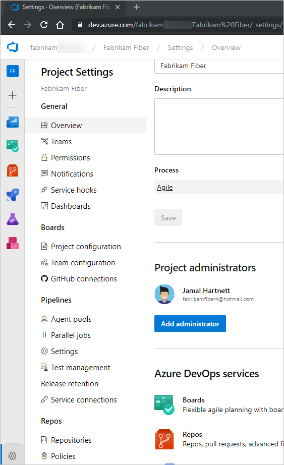
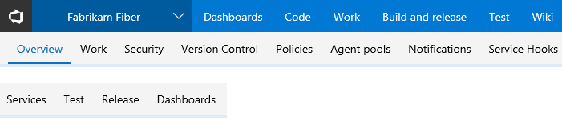
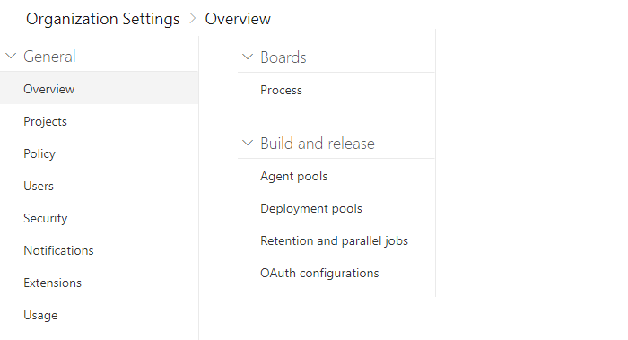
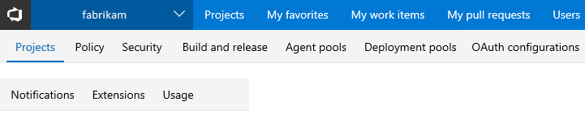

::: moniker range="azure-devops" 
# About user, team, project, and organization-level settings 

[!INCLUDE [temp](../../_shared/version-vsts-tfs-all-versions.md)]

You configure resources either for yourself, your team, a project, or your organization from an administrative **Settings** page. The settings you can configure depend on the security group or administrative role you belong to. 

If you're just getting started as a project administrator, see [Get started as an administrator](../../user-guide/project-admin-tutorial.md).

> [!NOTE]  
> You can delegate several tasks to a user with Stakeholder or Basic access by adding them to the [Project Collection Administrators group](../security/set-project-collection-level-permissions.md). To learn more about Stakeholder access, see [About access levels, Stakeholder access](../security/access-levels.md#stakeholder-access). 

::: moniker-end  

::: moniker range="<= azure-devops-2019"

# About user, team, project, and collection-level settings

[!INCLUDE [temp](../../_shared/version-vsts-tfs-all-versions.md)]

You configure resources either for yourself, your team, a project, or your project collection from a **Settings** page. The settings you can configure depend on the security group or administrative role you belong to.

::: moniker-end  

## User settings

Individual contributors can set their user preferences, enable features that are in preview, and manage their favorites and notifications.

<table>
<tbody valign="top">
<tr>
<th width="15%">Area</th>
<th width="40%">Supported tasks</th>
<th width="45%">Notes</th>
</tr>
<tr>
<td>**General**</td>
<td><ul>
<li>[Set your preferences](set-your-preferences.md)</li> 
<li>[Enable preview features](../../project/navigation/preview-features.md)</li>
</ul></td>
<td>For an overview of default permission assignments by role, see [Default permissions and access](../security/permissions-access.md).</td>
</tr>
<tr>
<td>**Security**</td>
<td><ul>
<li>[View permissions](../security/view-permissions.md)</li>
<li>[Add an alternate account to your Visual Studio subscription](/visualstudio/subscriptions/vs-alternate-identity)</li>
</ul></td>
<td>For an overview of default permission assignments by role, see [Default permissions and access](../security/permissions-access.md).</td>
</tr>
<tr>
<td>**Authentication**</td>
<td><ul>
<li>[Authenticate access with personal access tokens](../accounts/use-personal-access-tokens-to-authenticate.md)</li>
<li>[Authorize access to REST APIs with OAuth 2.0](../../integrate/get-started/authentication/oauth.md)</li>
<li>[Use SSH key authentication](../../repos/git/use-ssh-keys-to-authenticate.md)</li>
</ul></td>
<td>For an overview of supported authentication methods, see [Authentication overview](../../repos/git/auth-overview.md#alternate-credentials).</td>
</tr>
<tr>
<td>**Favorites**</td>
<td><ul>
<li>[Set personal or team favorites](../../project/navigation/set-favorites.md)</li>
</ul></td>
<td>Favorites provide a quick way to navigate to backlogs, boards, dashboards, and more artifacts. Any member of the Contributors group or team member can set their own favorites. Team members can set team favorites. </td>
</tr>
<tr>
<td>**Notifications**</td>
<td><ul>
<li>[View your subscriptions, opt-out as needed](../../notifications/unsubscribe-default-notification.md)</li>
<li>[Change your preferred email address](../../notifications/change-email-address.md)</li>
<li>[Manage personal notifications](../../notifications/howto-manage-personal-notifications.md)</li>
</ul></td>
<td>Notifications alert you through email messages when changes occur to work items, code reviews, pull requests, source control files, builds, and more. When a project is created, a number of notifications are defined. If you want to opt out of these, you can.  </li>
</ul></td>
</tr>
</tbody>
</table>
 

<a id="team" />
## Team administrator role and managing teams

Team administrators are tasked with configuring team resources which mostly correspond to Agile tools and dashboards. To configure team resources, you must be added as a [team administrator for the specific team](../../organizations/settings/add-team-administrator.md), or be a member of the Project Administrators or Project Collection Administrators groups.  

For a complete overview of all Agile tools that you can configure, see [Manage teams and configure team tools](manage-teams.md).  

<table>
<tbody valign="top">
<tr>
<th width="15%">Area</th>
<th width="40%">Supported tasks</th>
<th width="45%">Notes</th>
</tr>
<tr>
<td>**Team profile**</td>
<td><ul>
<li>[Add users to a project or specific team](../security/add-users-team-project.md)</li>
<li>[Add team admins](../../organizations/settings/add-team-administrator.md)</li>
</ul></td>
<td>Members of a team are included within the team group which can be used in queries and **@mentions** in pull requests and work item discussions.</td>
</tr>
<tr>
<td>**Boards, Team configuration**</td>
<td><ul>
<li>[Backlog levels](select-backlog-navigation-levels.md?toc=/azure/devops/organizations/settings/toc.json&bc=/azure/devops/organizations/settings/breadcrumb/toc.json)</li>
<li>[Show bugs on backlogs & boards](show-bugs-on-backlog.md?toc=/azure/devops/organizations/settings/toc.json&bc=/azure/devops/organizations/settings/breadcrumb/toc.json)</li>
<li>[Set working days](set-working-days.md?toc=/azure/devops/organizations/settings/toc.json&bc=/azure/devops/organizations/settings/breadcrumb/toc.json)</li>
<li>[Configure area paths](set-area-paths.md)</li>
<li>[Select active iteration paths (sprints)](set-iteration-paths-sprints.md)</li>
<li>[Define work item templates](../../boards/backlogs/work-item-template.md)</li>
</ul></td>
<td>For an overview of team resources, see [About teams and Agile tools](about-teams-and-settings.md). You configure Kanban boards from the board view: [Columns](../../boards/boards/add-columns.md), [Swimlanes](../../boards/boards/expedite-work.md), [Cards](../../boards/boards/customize-cards.md), [WIP limits](../../boards/boards/wip-limits.md). </td>
</tr>
<tr>
<td>**Dashboards** </td>
<td><ul>
<li>[Create team dashboards](../../report/dashboards/dashboards.md)</li>
<li>[Set default team dashboard permissions, manage dashboard permissions](../../report/dashboards/dashboard-permissions.md)</li>
</ul></td>
<td>New dashboards added to a project are associated with a team. The default permissions allow team members to create and edit dashboards for their team.</td>
</tr>
<tr>
<td> **Notifications** </td>
<td><ul>
<li>[Manage team notifications](../../notifications/howto-manage-team-notifications.md)</li>
</ul></td>
<td>A number of team notifications are automatically defined when a team is added. To learn more about how notifications are managed, see [About notifications](../../notifications/about-notifications.md).   </td>
</tr>
</tbody>
</table>

<a id="project" />

## Project administrator role and managing projects

Members of the [Project Administrators group](../security/set-project-collection-level-permissions.md) are tasked with configuring resources for a project and managing permissions at the project-level. Note that members of the [Project Collection Administrators group](../security/set-project-collection-level-permissions.md) can configure team settings as well.

See also [Get started as an administrator](../../user-guide/project-admin-tutorial.md).

::: moniker range=">= azure-devops-2019"
**Project settings**  
From the administrative **Project settings** pages, you can configure settings available from the tabs shown in the following image. 

 

::: moniker-end

::: moniker range="<= tfs-2018"

**Project-level settings**  
From the administrative **Project settings** pages, you can configure settings available from the tabs shown in the following image.

  
::: moniker-end

::: moniker range=">= tfs-2013 <= tfs-2018"
> [!NOTE]  
> Project settings differ depending on your on-premises TFS version. Some settings aren't available for earlier versions of TFS. 
::: moniker-end

<table>
<tbody valign="top">
<tr>
<th width="15%">Area</th>
<th width="40%">Supported tasks</th>
<th width="45%">Notes</th>
</tr>
<tr>
<td>**General**</td>
<td><ul>
<li>Set project description</li>
<li>[Change the project visibility, public or private](../public/make-project-public.md) (Azure DevOps Services only) </li>
</ul></td>
<td>Update the project description or change it's visibility.
</td>
</tr>
<tr>
<td>**Services** </td>
<td><ul>
<li>[Turn a service on or off ](set-services.md) </li>
</ul></td>
<td>Services that aren't use by project members can be disabled so that they don't appear in the web portal. Turning a service off removes the service from the user interface for all project users. However, data defined for the service is preserved and available if you later decide to turn the service on. 
</td>
</tr>
<tr>
<td>**Teams**</td>
<td><ul>
<li>[Add another team and team members](add-teams.md)</li>
<li>[Add a team administrator](add-team-administrator.md)</li>
</ul></td>
<td>A default team is created when you create a project. You add a team when you want to provide a group of users in your organization a set of Agile tools which they have full ownership to configure and manage. Teams have access to a product backlog, portfolio backlogs, sprint backlogs, dashboards, team-scoped widgets, and more.
For an overview of all tools that support a team, see [About teams and Agile tools](about-teams-and-settings.md).
</td>
</tr>
<tr>
<td>**Security**</td>
<td><ul>
<li>[Add users to a project](../security/add-users-team-project.md)</li>
<li>[Change individual permissions, grant select access to specific functions](../security/change-individual-permissions.md)</li>
<li>[Grant or restrict access to select features](../security/restrict-access.md)</li>
<li>[Add administrators](../security/set-project-collection-level-permissions.md)</li>
<li>[Manage project-level permissions](../security/permissions.md#project-level)</li>
<li>[Set build and release permissions](../../pipelines/policies/set-permissions.md)</li>
</ul></td>
<td>Project Administrators can add users to a project or a team. When you add a user to a team, you automatically add them to the project. Users added to a project can only view and contribute to that specific project. 
For an overview of security concepts, see [About permissions and groups](../security/about-permissions.md) and [About access levels](../security/access-levels.md). For a list of project-level permissions, see [Permissions and groups reference, Project-level permissions](../security/permissions.md#project-level).
 </td>
</tr>
<tr>
<td> **Notifications** </td>
<td><ul>
<li>Manage project-level notifications</li>
</ul></td>
<td>A number of project-level notifications are automatically defined when a project is added. Notifications at the project-level are managed in much the same way as they are at the [team level](../../notifications/howto-manage-team-notifications.md).</td>
</tr>
<tr>
<td>**Service Hooks**</td>
<td><ul>
<li>[Configure service hooks](../../service-hooks/index.md)</li>
</ul></td>
<td>With service hooks, you can automate a task on other services, such as [Campfire](../../service-hooks/services/campfire.md), [Flowdock](../../service-hooks/services/flowdock.md), [HipChat](../../service-hooks/services/hipchat.md), and more. You can use service hooks in custom apps and services to drive activities as events happen. </td>
</tr>
<tr>
<td>**Dashboards** </td>
<td><ul>
<li>[Set default dashboard permissions](../../report/dashboards/dashboard-permissions.md)</li>
</ul></td>
<td>New dashboards added to a project inherit the default dashboard permissions. The default permissions allow team members to create and edit dashboards for their team.</td>
</tr>
<tr>
<td><a id="work" />**Boards, Project configuration**</td>
<td><ul>
<li>[Define area paths](set-area-paths.md)</li>
<li>[Define iteration paths or sprints](set-iteration-paths-sprints.md)</li>
</ul></td>
<td>Area and iteration paths set at the project level are then used to set team defaults. To configure additional product backlogs, Kanban boards, and dashboards, you first [add a team](../../organizations/settings/add-teams.md).   
</td>
</tr>
<tr>
<td><a id="pipelines" />**Build and release (Agent Pools, Release)** </td>
<td><ul>
<li>[Manage Agent queues and agent pools](../../pipelines/agents/pools-queues.md)</li>
<li>[Manage service connections](../../pipelines/library/service-endpoints.md)</li>
<li>[Manage deployment pools and groups](../../pipelines/release/deployment-groups/index.md)</li>
<li>[Set retention policies](../../pipelines/policies/retention.md)</li>
</ul></td>
<td>To build your code or deploy your software you need at least one agent. Agent and deployment pools are build and release resources that you manage across projects. </td>
</tr>
<tr>
<td><a id="repos" />**Repos, Code, version control** </td>
<td><ul>
<li>[Create additional Git repos](../../repos/git/creatingrepo.md)</li>
<li>[Manage repository permissions](../security/set-git-tfvc-repository-permissions.md)</li>
<li>[Manage branch policies](../../repos/git/branch-policies.md)</li>
<li>[Add TFVC Check-In Policies](../../repos/tfvc/add-check-policies.md)</li>
</ul></td>
<td>You can manage code using [Git repositories](../../repos/git/overview.md) or one [Team Foundation Version Control (TFVC) repository](../../repos/tfvc/overview.md). </td>
</tr>
<tr>
<td><a id="test-center" />**Test** </td>
<td><ul>
<li>[Set test retention policies](../../test/how-long-to-keep-test-results.md)</li>
<li>[Manage test-related permissions at project level](../security/set-project-collection-level-permissions.md)</li>
<li>[Set area path-level test permissions](../security/set-permissions-access-work-tracking.md#create-child-nodes-modify-work-items-under-an-area-path)</li>
</ul></td>
<td>Manual testing relies on work item types to create and manage test plans, test suites, test cases, shared steps, and shared parameters. Of these, you can customize the test plans, test suites, and test cases using an inherited process. See [Customize a process](work/customize-process.md).  
</td>
</tr>
<tr>
<td>**Wiki**</td>
<td><ul>
<li>[Create a wiki for your project](../../project/wiki/wiki-create-repo.md)</li>
<li>[Publish a Git repository to a wiki](../../project/wiki/publish-repo-to-wiki.md) </li>
<li>[Manage README and Wiki permissions](../../project/wiki/manage-readme-wiki-permissions.md)</li>
</ul></td>
<td>To share information with your team, you can use Markdown format within a project Wiki, within your project README file, or other repository README file. To learn more, see [About READMes and Wikis](../../project/wiki/about-readme-wiki.md).</td>
</tr>
<tr>
<td>**Extensions**</td>
<td><ul>
<li>[Request a Marketplace extension](../../marketplace/request-extensions.md)</li>
</ul></td>
<td>Individual contributors and project administrators can request a Marketplace extension be installed. Only members of the Project Collection Administrators group can respond to these requests and actually install extensions. </td>
</tr>
</tbody>
</table>

<a id="admin" />
## Project collection administrator role and managing collections of projects 

Members of the [Project Collection Administrators group](../security/set-project-collection-level-permissions.md) are tasked with configuring resources for all projects defined for an organization or collection. They also can perform all tasks to add projects, manage projects, and manage permissions for the collection, a project, or an object.   

::: moniker range=">= azure-devops-2019"   
**Organization settings**  
From the administrative **Organization settings** pages, you can configure settings available from the tabs shown in the following image.

 

::: moniker-end

::: moniker range="<= tfs-2018"  
**Project collection-level settings**  
From the administrative pages for a collection, you can configure the settings shown in the following image. 

> [!NOTE]  
> Project collection settings differ depending on your on-premises TFS version. Some settings aren't available for earlier versions of TFS. 

 
::: moniker-end

::: moniker range="azure-devops" 
For an overview of managing your organization, see [About organization management](../accounts/organization-management.md).

<table>
<tbody valign="top">
<tr>
<th width="15%">Area</th>
<th width="40%">Supported tasks</th>
<th width="45%">Notes</th>
</tr>
<tr>
<td>**Preview features**</td>
<td><ul>
<li>[Enable preview features](../../project/navigation/preview-features.md)</li>
</ul></td>
<td>Organization administrators can enable or disable account-level features that are in preview.</td>
</tr>
<tr>
<td>**Overview (Settings)**</td>
<td><ul>
<li>Add and manage organization information: [change organization owner](../accounts/change-organization-ownership.md), [Rename](../accounts/rename-organization.md), [Delete](../accounts/delete-your-organization.md), [Recover](../accounts/recover-your-organization.md)</li>
<li>[Find or change your organization location](../accounts/change-organization-location.md)</li>
<li>[Set up billing](../billing/set-up-billing-for-your-organization-vs.md)</li>
</ul></td>
<td>From the **Settings** page, you can manage the time zone, owner, region, and other settings that apply to all projects defined under your account.</td>
</tr>
<tr>
<td>**Billing**</td>
<td><ul>
<li>[Set up billing](../billing/set-up-billing-for-your-organization-vs.md)</li>
<li>[Start free trials for paid features and extensions](../billing/try-additional-features-vs.md)</li>
<li>[Pay for users (Basic)](../billing/buy-basic-access-add-users.md)</li>
<li>[Buy CI/CD](../billing/buy-more-build-vs.md)</li>
<li>[Add a user to make purchases](../billing/add-backup-billing-managers.md)</li>
</ul></td>
<td>All billing is managed through Azure. To learn more, see [Billing overview](../billing/overview.md). </td>
</tr>
<tr>
<td>**Projects**</td>
<td><ul>
<li>Add and manage projects: [Create](../projects/create-project.md), [Rename](../projects/rename-project.md), [Delete](../projects/delete-project.md)</li>
<li>[Add users to projects](../security/add-users-team-project.md)</li>
<li>[Save project data](../accounts/save-team-project-data.md)</li>
</ul></td>
<td>A project provides the fundamental resource for storing your code, managing your CI/CD operations, and planning and tracking work for your project. In general, you'll want to minimize the number of projects you create, to keep things simple. Learn more [About projects and scaling your organization](../projects/about-projects.md). </td>
</tr>
<tr>
<td>**Policy**</td>
<td><ul>
<li>[Change application access policies](../accounts/change-application-access-policies.md) </li>
</ul></td>
<td>Set policies to allow or disallow access by other applications or services to the organization. </td>
</tr>
<tr>
<td>**Users**</td>
<td><ul>
<li>[Add users](../accounts/add-organization-users.md)</li>
<li>[Add external users](../accounts/add-external-user.md)</li>
<li>[Manage user access levels](../accounts/manage-users-table-view.md)</li>
<li>[Remove users](../accounts/delete-organization-users.md)</li>
<li>[Assign paid extension access to users](../../marketplace/assign-paid-extensions.md)</li>
</ul></td>
<td>For large organizations with a sizable number of users, we recommend that you [manage user access through Azure Active Directory](../accounts/access-with-azure-ad.md). For a small number of users, you can manage user access by adding their Microsoft Service Account (MSA) email. From the account-level **Users** page, you can also [export the set of users and their access levels](../security/export-users-audit-log.md).  </td>
</tr>
<tr>
<td>**Security**</td>
<td><ul>
<li>[Change individual permissions](../security/change-individual-permissions.md)</li>
<li>[Grant or restrict access to select features ](../security/restrict-access.md)</li>
<li>[Add administrators](../security/set-project-collection-level-permissions.md)</li>
<li>[Add Azure Active Directory groups](../accounts/manage-azure-active-directory-groups.md)</li>
<li>[Connect to Azure Active Directory](../accounts/connect-organization-to-azure-ad.md)</li>
<li>[Manage conditional access](../accounts/manage-conditional-access.md)</li>
</ul></td>
<td>For an overview of security concepts, see [About permissions and groups](../security/about-permissions.md) and [About access levels](../security/access-levels.md). For a list of collection-level permissions, see [Permissions and groups reference, Collection-level permissions](../security/permissions.md#collection-level).
</td>
</tr>
<tr>
<td>**Notifications**</td>
<td><ul>
<li>[Manage collection-level notifications](../../notifications/howto-manage-organization-notifications.md) </li>
</ul></td>
<td>A number of notifications are automatically defined when an organization is added. Notifications at the organization-level are managed in much the same way as they are at the [team level](../../notifications/howto-manage-team-notifications.md). </td>
</tr>
<tr>
<td>**Extensions**</td>
<td><ul>
<li>[Install and manage Marketplace extensions](../../marketplace/install-extension.md)</li>
<li>[Approve extensions](../../marketplace/approve-extensions.md)</li>
<li>[Assign paid extension access to users](../../marketplace/assign-paid-extensions.md)</li>
<li>[Change the number of paid users](../billing/change-number-paid-extension-users.md) </li>
<li>[Grant permissions to manage extensions](../../marketplace/how-to/grant-permissions.md)</li>
<li>[Uninstall or disable extensions](../../marketplace/uninstall-disable-extensions.md)</li>
</ul></td>
<td>An extension is an installable unit that contributes new capabilities to your projects. You can find extensions from within the [Visual Studio Marketplace](https://marketplace.visualstudio.com/azuredevops) in the Azure DevOps tab to support planning and tracking of work items, sprints, scrums, etc.; build and release flows; code testing and tracking; and collaboration among team members.
</td>
</tr>
<tr>
<td>**Usage**</td>
<td><ul>
<li>[Monitor usage](../../integrate/concepts/rate-limits.md)</li>
</ul></td>
<td>Certain rate limits are in place to ensure performance across the cloud service platform.  </td>
</tr>
<tr>
<td>**Boards, Process** </td>
<td><ul>
<li>[Customize a project](./work/customize-process.md)</li>
<li>[Add and manage processes](./work/manage-process.md)</li>
</ul></td>
<td>Process customization applies to Azure Boards only. To customize the Agile tools and work tracking artifacts, you create and customize an inherited process and then update the project to use that process. To learn more, see [About process customization and inherited processes](./work/inheritance-process-model.md). </td>
</tr>
<tr>
<td>**Build and release**</td>
<td><ul>
<li>[Set retention policies](../../pipelines/policies/retention.md)</li>
<li>[Set resource limits for pipelines](../../pipelines/licensing/concurrent-pipelines-ts.md)</li>
<li>[Add and manage agent pools](../../pipelines/agents/pools-queues.md)</li>
<li>[Add and manage deployment pools](../../pipelines/release/deployment-groups/index.md)</li>
</ul></td>
<td>You manage resources that support CI/CD operations for all projects through the **Agent pools**, **Deployment pools**, and **Retention and limits** pages.</td>
</tr>
</tbody>
</table>

::: moniker-end

::: moniker range="azure-devops-2019"
For an overview of managing collections, see [Configure and manage Azure DevOps Server resources](/azure/devops/server/admin/config-tfs-resources).

<table>
<tbody valign="top">
<tr>
<th width="15%">Area</th>
<th width="40%">Supported tasks</th>
<th width="45%">Notes</th>
</tr>
<tr>
<td>**Settings**</td>
<td><ul>
<li>[Change access levels](../security/change-access-levels.md)</li>
</ul></td>
<td>From the **Settings** page, you can manage the time zone, owner, region, and other settings that apply to all projects defined under your account.</td>
</tr>
<tr>
<td>**Projects**</td>
<td><ul>
<li>Add and manage projects: [Create](../projects/create-project.md), [Rename](../projects/rename-project.md), [Delete](../projects/delete-project.md)</li>
<li>[Add users to projects](../security/add-users-team-project.md)</li>
<li>[Save project data](../accounts/save-team-project-data.md)</li>
</ul></td>
<td>A project provides the fundamental resource for storing your code, managing your CI/CD operations, and planning and tracking work for your project. In general, you'll want to minimize the number of projects you create, to keep things simple. Learn more [About projects and scaling your organization](../projects/about-projects.md). </td>
</tr>
<tr>
<td>**Security**</td>
<td><ul>
<li>[Change individual permissions](../security/change-individual-permissions.md)</li>
<li>[Grant or restrict access to select features ](../security/restrict-access.md)</li>
<li>[Add collection-level administrators](../security/set-project-collection-level-permissions.md)</li>
<li>[Set up groups for use in Azure DevOps Server deployments](/azure/devops/server/admin/setup-ad-groups)</li>
<li>[Add administrators to Azure DevOps Server](/azure/devops/server/admin/add-administrator-tfs)</li>
</ul></td>
<td>For an overview of security concepts, see [About permissions and groups](../security/about-permissions.md) and [About access levels](../security/access-levels.md). For a list of collection-level permissions, see [Permissions and groups reference, Collection-level permissions](../security/permissions.md#collection-level).
</td>
</tr>
<tr>
<td>**Notifications**</td>
<td><ul>
<li>Manage collection-level notifications </li>
</ul></td>
<td>A number of notifications are automatically defined when a project collection is added. Notifications at the collection-level are managed in much the same way as they are at the [team level](../../notifications/howto-manage-team-notifications.md). </td>
</tr>
<tr>
<td>**Boards, Process** </td>
<td><ul>
<li>[Customize a project](./work/customize-process.md)</li>
<li>[Add and manage processes](./work/manage-process.md)</li>
</ul></td>
<td>Process customization applies to Azure Boards only. To customize the Agile tools and work tracking artifacts, you create and customize an inherited process and then update the project to use that process. To learn more, see [About process customization and inherited processes](./work/inheritance-process-model.md). </td>
</tr>
<tr>
<td>**Build and release, Agent pools, Deployment pools**</td>
<td><ul>
<li>[Set retention policies](../../pipelines/policies/retention.md)</li>
<li>[Set resource limits for pipelines](../../pipelines/licensing/concurrent-pipelines-ts.md)</li>
<li>[Add and manage agent pools](../../pipelines/agents/pools-queues.md)</li>
<li>[Add and manage deployment pools](../../pipelines/release/deployment-groups/index.md)</li>
</ul></td>
<td>You manage resources that support CI/CD operations for all projects through the **Agent pools**, **Deployment pools**, and **Retention and limits** pages.</td>
</tr>
<tr>
<td>**Extensions**</td>
<td><ul>
<li>[Install and manage Marketplace extensions](../../marketplace/install-extension.md)</li>
<li>[Approve extensions](../../marketplace/approve-extensions.md)</li>
<li>[Assign paid extension access to users](../../marketplace/assign-paid-extensions.md)</li>
<li>[Change the number of paid users](../billing/change-number-paid-extension-users.md) </li>
<li>[Grant permissions to manage extensions](../../marketplace/how-to/grant-permissions.md)</li>
<li>[Uninstall or disable extensions](../../marketplace/uninstall-disable-extensions.md)</li>
</ul></td>
<td>An extension is an installable unit that contributes new capabilities to your projects. You can find extensions from within the [Visual Studio Marketplace](https://marketplace.visualstudio.com/azuredevops) in the Azure DevOps tab to support planning and tracking of work items, sprints, scrums, etc.; build and release flows; code testing and tracking; and collaboration among team members.
</td>
</tr>

</tbody>
</table>

::: moniker-end

::: moniker range="<= tfs-2018"
For an overview of managing collections, see [Configure and manage TFS resources](/azure/devops/server/admin/config-tfs-resources).

<table>
<tbody valign="top">
<tr>
<th width="15%">Area</th>
<th width="40%">Supported tasks</th>
<th width="45%">Notes</th>
</tr>
<tr>
<td>**Settings**</td>
<td><ul>
<li>[Change access levels](../security/change-access-levels.md)</li>
</ul></td>
<td>From the **Settings** page, you can manage the time zone, owner, region, and other settings that apply to all projects defined under your account.</td>
</tr>
<tr>
<td>**Projects**</td>
<td><ul>
<li>Add and manage projects: [Create](../projects/create-project.md), [Rename](../projects/rename-project.md), [Delete](../projects/delete-project.md)</li>
<li>[Add users to projects](../security/add-users-team-project.md)</li>
<li>[Save project data](../accounts/save-team-project-data.md)</li>
</ul></td>
<td>A project provides the fundamental resource for storing your code, managing your CI/CD operations, and planning and tracking work for your project. In general, you'll want to minimize the number of projects you create, to keep things simple. Learn more [About projects and scaling your organization](../projects/about-projects.md). </td>
</tr>
<tr>
<td>**Security**</td>
<td><ul>
<li>[Change individual permissions](../security/change-individual-permissions.md)</li>
<li>[Grant or restrict access to select features ](../security/restrict-access.md)</li>
<li>[Add collection-level administrators](../security/set-project-collection-level-permissions.md)</li>
<li>[Set up groups for use in TFS deployments](/azure/devops/server/admin/setup-ad-groups)</li>
<li>[Add administrators to TFS](/azure/devops/server/admin/add-administrator-tfs)</li>
</ul></td>
<td>For an overview of security concepts, see [About permissions and groups](../security/about-permissions.md) and [About access levels](../security/access-levels.md). For a list of collection-level permissions, see [Permissions and groups reference, Collection-level permissions](../security/permissions.md#collection-level).
</td>
</tr>
<tr>
<td>**Notifications**</td>
<td><ul>
<li>Manage collection-level notifications </li>
</ul></td>
<td>A number of notifications are automatically defined when a project collection is added. Notifications at the collection-level are managed in much the same way as they are at the [team level](../../notifications/howto-manage-team-notifications.md). </td>
</tr>
<tr>
<td>**Build and release, Agent pools, Deployment pools**</td>
<td><ul>
<li>[Set retention policies](../../pipelines/policies/retention.md)</li>
<li>[Set resource limits for pipelines](../../pipelines/licensing/concurrent-pipelines-ts.md)</li>
<li>[Add and manage agent pools](../../pipelines/agents/pools-queues.md)</li>
<li>[Add and manage deployment pools](../../pipelines/release/deployment-groups/index.md)</li>
</ul></td>
<td>You manage resources that support CI/CD operations for all projects through the **Agent pools**, **Deployment pools**, and **Retention and limits** pages.</td>
</tr>
<tr>
<td>**Extensions**</td>
<td><ul>
<li>[Install and manage Marketplace extensions](../../marketplace/install-vsts-extension.md)</li>
<li>[Approve extensions](../../marketplace/approve-extensions.md)</li>
<li>[Assign paid extension access to users](../../marketplace/assign-paid-extensions.md)</li>
<li>[Change the number of paid users](../billing/change-number-paid-extension-users.md) </li>
<li>[Grant permissions to manage extensions](../../marketplace/how-to/grant-permissions.md)</li>
<li>[Uninstall or disable extensions](../../marketplace/uninstall-disable-extensions.md)</li>
</ul></td>
<td>An extension is an installable unit that contributes new capabilities to your projects. You can find extensions from within the [Visual Studio Marketplace](https://marketplace.visualstudio.com/azuredevops) in the Azure DevOps tab to support planning and tracking of work items, sprints, scrums, etc.; build and release flows; code testing and tracking; and collaboration among team members.
</td>
</tr>

</tbody>
</table>

::: moniker-end

::: moniker range="<= azure-devops-2019"

<a id="admin" />

## Server administrator role 

Members of the [Team Foundation Server Administrators group](/azure/devops/server/admin/add-administrator-tfs) are tasked with configuring resources for all project collections. They also can perform all tasks to administer projects, collections, and server instances.     

The main task they perform from the web portal is to set access levels for a user or security group. See [Change access levels](../security/change-access-levels.md). 

For additional information, see [Team Foundation Server Administration Documentation](/tfs/index).

::: moniker-end

## Related articles

- [Resources granted to project members](../accounts/resources-granted-to-project-members.md) 
- [Permissions and groups reference](../security/permissions.md) 
- [Rate limits](../../integrate/concepts/rate-limits.md)
