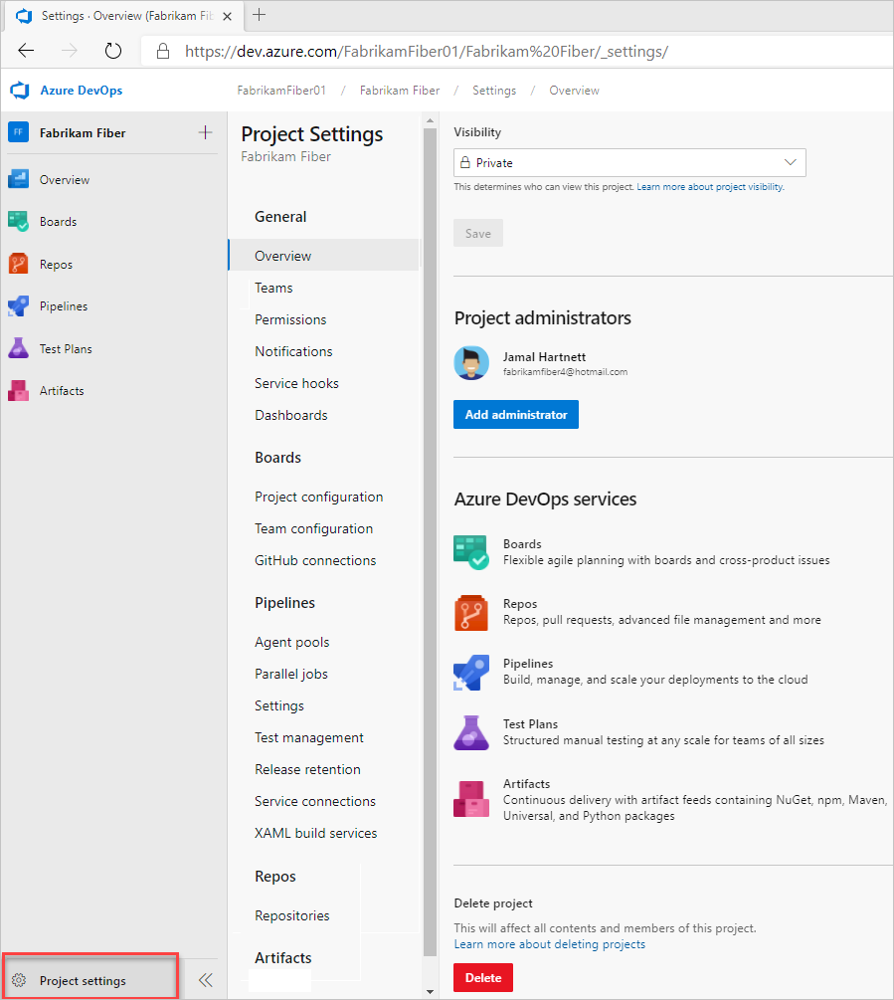
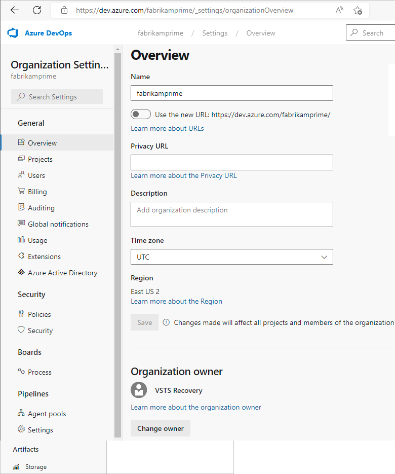

::: moniker range=">= azure-devops-2020"
:::row:::
   :::column span="1":::
      **General**
   :::column-end:::
   :::column span="2":::
      - [Set your preferences](set-your-preferences.md)
      - [Enable preview features](../../project/navigation/preview-features.md)
   :::column-end:::
   :::column span="2":::
      For an overview of default permission assignments by role, see [Default permissions and access](../security/permissions-access.md)
   :::column-end:::
:::row-end:::
---
::: moniker-end
::: moniker range="< azure-devops-2020"
:::row:::
   :::column span="1":::
      **General**
   :::column-end:::
   :::column span="2":::
      - [Set your preferences](set-your-preferences.md)
   :::column-end:::
   :::column span="2":::
      For an overview of default permission assignments by role, see [Default permissions and access](../security/permissions-access.md)
   :::column-end:::
:::row-end:::
---
::: moniker-end
:::row:::
   :::column span="1":::
      **Security**
   :::column-end:::
   :::column span="2":::
      - [View permissions](../security/view-permissions.md)
      - [Add an alternate account to your Visual Studio subscription](/visualstudio/subscriptions/vs-alternate-identity)
   :::column-end:::
   :::column span="2":::
      For an overview of default permission assignments by role, see [Default permissions and access](../security/permissions-access.md). 
   :::column-end:::
:::row-end:::
---
::: moniker range="azure-devops"
:::row:::
   :::column span="1":::
      **Authentication**
   :::column-end:::
   :::column span="2":::
      - [Authenticate access with personal access tokens](../accounts/use-personal-access-tokens-to-authenticate.md)
      - [Authorize access to REST APIs with OAuth 2.0](../../integrate/get-started/authentication/oauth.md)
      - [Use SSH key authentication](../../repos/git/use-ssh-keys-to-authenticate.md)
   :::column-end:::
   :::column span="2":::
      For an overview of supported authentication methods, see [Authentication overview](../../repos/git/auth-overview.md). 
   :::column-end:::
:::row-end:::
---
::: moniker-end
::: moniker range=">= tfs-2017 < azure-devops"
:::row:::
   :::column span="1":::
      **Authentication**
   :::column-end:::
   :::column span="2":::
      - [Authenticate access with personal access tokens](../accounts/use-personal-access-tokens-to-authenticate.md)
      - [Use SSH key authentication](../../repos/git/use-ssh-keys-to-authenticate.md)
   :::column-end:::
   :::column span="2":::
      For an overview of supported authentication methods, see [Authentication overview](../../repos/git/auth-overview.md). 
   :::column-end:::
:::row-end:::
---
::: moniker-end
::: moniker range="tfs-2015"
:::row:::
   :::column span="1":::
      **Authentication**
   :::column-end:::
   :::column span="2":::
      - [Use SSH key authentication](../../repos/git/use-ssh-keys-to-authenticate.md)
   :::column-end:::
   :::column span="2":::
      For an overview of supported authentication methods, see [Authentication overview](../../repos/git/auth-overview.md). 
   :::column-end:::
:::row-end:::
---
::: moniker-end
:::row:::
   :::column span="1":::
      **Favorites**
   :::column-end:::
   :::column span="2":::
      - [Set personal or team favorites](../../project/navigation/set-favorites.md)
   :::column-end:::
   :::column span="2":::
      For an overview of supported authentication methods, see [Authentication overview](../../repos/git/auth-overview.md). 
   :::column-end:::
:::row-end:::
---
::: moniker range=">= tfs-2015"
:::row:::
   :::column span="1":::
      **Notifications**
   :::column-end:::
   :::column span="2":::
      - [View your subscriptions, opt-out as needed](about-settings.md)
      - [Change your preferred email address](../../notifications/change-email-address.md)
      - [Manage personal notifications](../../notifications/manage-your-personal-notifications.md)
   :::column-end:::
   :::column span="2":::
      Notifications alert you through email messages when changes occur to work items, code reviews, pull requests, source control files, builds, and more. When a project is created, a number of notifications are defined. If you want to opt out of these, you can.
   :::column-end:::
:::row-end:::
---
::: moniker-end

<a id="team" />

## Team administrator role and managing teams

Team administrators configure team resources, which mostly correspond to Agile tools and dashboards. To configure team resources, you must be added as a [team administrator for the specific team](../../organizations/settings/add-team-administrator.md), or be a member of the Project Administrators or Project Collection Administrators groups.  

For a complete overview of all Agile tools that you can configure, see [Manage teams and configure team tools](manage-teams.md).

:::row:::
   :::column span="1":::
      **Area**
   :::column-end:::
   :::column span="2":::
      **Supported tasks**
   :::column-end:::
   :::column span="2":::
      **Notes**
   :::column-end:::
:::row-end:::
---
:::row:::
   :::column span="1":::
      **Team profile**
   :::column-end:::
   :::column span="2":::
      - [Add users to a project or specific team](../security/add-users-team-project.md)
      - [Add team administrators](about-settings.md)
   :::column-end:::
   :::column span="2":::
      Members of a team are included within the team group, which can be used in queries and **\@mentions** in pull requests and work item discussions.
   :::column-end:::
:::row-end:::
---
::: moniker range=">= tfs-2015"
:::row:::
   :::column span="1":::
     **Boards, Team configuration**
   :::column-end:::
   :::column span="2":::
      - [Backlog levels](select-backlog-navigation-levels.md?toc=/azure/devops/organizations/settings/toc.json&amp;bc=/azure/devops/organizations/settings/breadcrumb/toc.json)
      - [Show bugs on backlogs & boards](show-bugs-on-backlog.md)
      - [Set working days](set-working-days.md?toc=/azure/devops/organizations/settings/toc.json&amp;bc=/azure/devops/organizations/settings/breadcrumb/toc.json)
      - [Configure area paths](set-area-paths.md?toc=/azure/devops/organizations/settings/toc.json&amp;bc=/azure/devops/organizations/settings/breadcrumb/toc.json)
      - [Select active iteration paths (sprints)](set-iteration-paths-sprints.md?toc=/azure/devops/organizations/settings/toc.json&amp;bc=/azure/devops/organizations/settings/breadcrumb/toc.json)
      - [Define work item templates](../../boards/backlogs/work-item-template.md?toc=/azure/devops/organizations/settings/toc.json&amp;bc=/azure/devops/organizations/settings/breadcrumb/toc.json)
   :::column-end:::
   :::column span="2":::
      For an overview of team resources, see [About teams and Agile tools](about-teams-and-settings.md). You configure Kanban boards from the board view - [Columns](../../boards/boards/add-columns.md), [Swimlanes](../../boards/boards/expedite-work.md), [Cards](../../boards/boards/customize-cards.md), [WIP limits](../../boards/boards/wip-limits.md). 
   :::column-end:::
:::row-end:::
---
::: moniker-end
::: moniker range="tfs-2013"
:::row:::
   :::column span="1":::
      **Boards, Team configuration**
   :::column-end:::
   :::column span="2":::
      - [Show bugs on backlogs & boards](show-bugs-on-backlog.md)
      - [Set working days](set-working-days.md?toc=/azure/devops/organizations/settings/toc.json&amp;bc=/azure/devops/organizations/settings/breadcrumb/toc.json)
      - [Configure area paths](set-area-paths.md?toc=/azure/devops/organizations/settings/toc.json&amp;bc=/azure/devops/organizations/settings/breadcrumb/toc.json)
      - [Select active iteration paths (sprints)](set-iteration-paths-sprints.md?toc=/azure/devops/organizations/settings/toc.json&amp;bc=/azure/devops/organizations/settings/breadcrumb/toc.json)
      - [Define work item templates](../../boards/backlogs/work-item-template.md?toc=/azure/devops/organizations/settings/toc.json&amp;bc=/azure/devops/organizations/settings/breadcrumb/toc.json)
   :::column-end:::
   :::column span="2":::
      For an overview of team resources, see [About teams and Agile tools](about-teams-and-settings.md). You configure Kanban boards from the board view - [Columns](../../boards/boards/add-columns.md) and [WIP limits](../../boards/boards/wip-limits.md). 
   :::column-end:::
:::row-end:::
---
::: moniker-end
::: moniker range=" >= tfs-2017"
:::row:::
   :::column span="1":::
      **Dashboards**
   :::column-end:::
   :::column span="2":::
      - [Create team dashboards](../../report/dashboards/dashboards.md)
      - [Set default team dashboard permissions, manage dashboard permissions](../../report/dashboards/dashboard-permissions.md)
   :::column-end:::
   :::column span="2":::
      New dashboards added to a project are associated with a team. The default permissions allow team members to create and edit dashboards for their team.
   :::column-end:::
:::row-end:::
---
::: moniker-end
::: moniker range=" tfs-2015"
:::row:::
   :::column span="1":::
      **Dashboards**
   :::column-end:::
   :::column span="2":::
      - [Create team dashboards](../../report/dashboards/dashboards.md)
   :::column-end:::
   :::column span="2":::
      New dashboards added to a project are associated with a team. The default permissions allow team members to create and edit dashboards for their team.
   :::column-end:::
:::row-end:::
---
::: moniker-end
:::row:::
   :::column span="1":::
      **Notifications**
   :::column-end:::
   :::column span="2":::
      - [Manage team notifications](../../notifications/manage-team-group-global-organization-notifications.md)
   :::column-end:::
   :::column span="2":::
      Many team notifications are automatically defined when a team is added. For more information about how notifications are managed, see [About notifications](../../notifications/about-notifications.md).
   :::column-end:::
:::row-end:::
---

<a id="project" />

## Project Administrator role and managing projects

Members of the [Project Administrators group](../security/set-project-collection-level-permissions.md) configure resources for a project and managing permissions at the project-level. Members of the [Project Collection Administrators group](../security/set-project-collection-level-permissions.md) can configure team settings as well.

See also [Get started as an administrator](../../user-guide/project-admin-tutorial.md).

::: moniker range="azure-devops"
**Project settings**  
From the administrative **Project settings** page, you can configure settings available from the tabs shown in the following image. 
> [!div class="mx-imgBorder"]  
>  
::: moniker-end

::: moniker range="azure-devops-2019 || azure-devops-2020"
**Project-level settings**  
From the administrative **Project settings** page, you can configure settings available from the tabs shown in the following image.

  
::: moniker-end

::: moniker range="<= tfs-2018"
**Project-level settings**  
From the administrative **Project settings** page, you can configure settings available from the tabs shown in the following image.

  

> [!NOTE]  
> Project settings differ depending on your on-premises TFS version. Some settings aren't available for earlier versions of TFS. 

::: moniker-end

:::row:::
   :::column span="1":::
     **Area**
   :::column-end:::
   :::column span="2":::
      **Supported tasks**
   :::column-end:::
   :::column span="2":::
      **Notes**
   :::column-end:::
:::row-end:::
---
::: moniker range="azure-devops"
:::row:::
   :::column span="1":::
      **General**
   :::column-end:::
   :::column span="2":::
      - Set project description
      - [Change the project visibility, public or private](../public/make-project-public.md)
   :::column-end:::
   :::column span="2":::
      Update the project description or change its visibility.
   :::column-end:::
:::row-end:::
---
::: moniker-end
::: moniker range="< azure-devops"
:::row:::
   :::column span="1":::
      **General**
   :::column-end:::
   :::column span="2":::
      - Set project description
   :::column-end:::
   :::column span="2":::
      Update the project description or change its visibility.
   :::column-end:::
:::row-end:::
---
::: moniker-end
::: moniker range=">= azure-devops-2019"
:::row:::
   :::column span="1":::
      **Services**
   :::column-end:::
   :::column span="2":::
      - [Turn a service on or off](set-services.md)
   :::column-end:::
   :::column span="2":::
      Services that aren't use by project members can be disabled so that they don't appear in the web portal. Turning off a service removes the service from the user interface for all project users. However, data defined for the service is preserved and available if you later decide to turn on the service.
   :::column-end:::
:::row-end:::
---
::: moniker-end
:::row:::
   :::column span="1":::
      **Teams**
   :::column-end:::
   :::column span="2":::
      - [Add another team and team members](add-teams.md)
      - [Add a team administrator](add-team-administrator.md)
   :::column-end:::
   :::column span="2":::
      A default team is created when you create a project. You add a team when you want to provide a group of users in your organization a set of Agile tools, which they have full ownership to configure and manage. Teams have access to a product backlog, portfolio backlogs, sprint backlogs, dashboards, team-scoped widgets, and more. For an overview of all tools that support a team, see [About teams and Agile tools](about-teams-and-settings.md). 
   :::column-end:::
:::row-end:::
---
::: moniker range=">= tfs-2015"
:::row:::
   :::column span="1":::
      **Security**
   :::column-end:::
   :::column span="2":::
      - [Add user to a project](../security/add-users-team-project.md)
      - [Change individual permissions, grant select access to specific functions](../security/change-individual-permissions.md)
      - [Grant or restrict access to select features](../security/restrict-access.md)
      - [Add administrators](add-team-administrator.md)
      - [Manage project-level permissions](../security/permissions.md#project-level-permissions)
      - [Set build and release permissions](../../pipelines/policies/set-permissions.md)
   :::column-end:::
   :::column span="2":::
      Project Administrators can add users to a project or a team. When you add a user to a team, you automatically add them to the project. Users added to a project can only view and contribute to that specific project. For an overview of security concepts, see [Get started with permissions, access, and security groups](../security/about-permissions.md) and [About access levels](../security/access-levels.md). For a list of project-level permissions, see [Permissions and groups reference, Project-level permissions](../security/permissions.md#project-level-permissions).
   :::column-end:::
:::row-end:::
---
::: moniker-end
::: moniker range=" tfs-2013"
:::row:::
   :::column span="1":::
      **Security**
   :::column-end:::
   :::column span="2":::
      - [Add user to a project](../security/add-users-team-project.md)
      - [Change individual permissions, grant select access to specific functions](../security/change-individual-permissions.md)
      - [Grant or restrict access to select features](../security/restrict-access.md)
      - [Add administrators](add-team-administrator.md)
      - [Manage project-level permissions](../security/permissions.md#project-level-permissions)
   :::column-end:::
   :::column span="2":::
      Project Administrators can add users to a project or a team. When you add a user to a team, you automatically add them to the project. Users added to a project can only view and contribute to that specific project. For an overview of security concepts, see [Get started with permissions, access, and security groups](../security/about-permissions.md) and [About access levels](../security/access-levels.md). For a list of project-level permissions, see [Permissions and groups reference, Project-level permissions](../security/permissions.md#project-level-permissions).
   :::column-end:::
:::row-end:::
---
::: moniker-end
:::row:::
   :::column span="1":::
      **Notifications**
   :::column-end:::
   :::column span="2":::
      - [Manage project-level notifications](../../notifications/manage-team-group-global-organization-notifications.md)
   :::column-end:::
   :::column span="2":::
      Many project-level notifications are automatically defined when a project is added. Notifications at the project-level are managed in much the same way as they are at the [team level](../../notifications/manage-team-group-global-organization-notifications.md).
   :::column-end:::
:::row-end:::
---
::: moniker range=" >= tfs-2017"
:::row:::
   :::column span="1":::
      **Service hooks**
   :::column-end:::
   :::column span="2":::
      - [Configure service hooks](../../service-hooks/overview.md)
   :::column-end:::
   :::column span="2":::
      With service hooks, you can automate a task on other services, such as [Campfire, Flowdock, HipChat, and more](../../service-hooks/overview.md). You can use service hooks in custom apps and services to drive activities as events happen.
   :::column-end:::
:::row-end:::
---
:::row:::
   :::column span="1":::
      **Dashboards**
   :::column-end:::
   :::column span="2":::
      - [Set default dashboard permissions](../../report/dashboards/dashboard-permissions.md)
   :::column-end:::
   :::column span="2":::
      New dashboards added to a project inherit the default dashboard permissions. The default permissions allow team members to create and edit dashboards for their team.
   :::column-end:::
:::row-end:::
---
::: moniker-end
:::row:::
   :::column span="1":::
      **Boards, Project configuration**
   :::column-end:::
   :::column span="2":::
      - [Define area paths](set-area-paths.md)
      - [Define iteration paths or sprints](set-iteration-paths-sprints.md)
   :::column-end:::
   :::column span="2":::
      Area and iteration paths set at the project level are then used to set team defaults. To configure additional product backlogs, Kanban boards, and dashboards, you first [add a team](add-teams.md).
   :::column-end:::
:::row-end:::
---
::: moniker range=" >= tfs-2015"
:::row:::
   :::column span="1":::
      **Build and release (Agent Pools, Release)**
   :::column-end:::
   :::column span="2":::
      - [Manage Agent queues and agent pools](../../pipelines/agents/pools-queues.md)
      - [Manage service connections](../../pipelines/library/service-endpoints.md)
      - [Manage deployment pools and groups](../../pipelines/release/deployment-groups/index.md)
      - [Set retention policies](../../pipelines/policies/retention.md)
   :::column-end:::
   :::column span="2":::
      Area and iteration paths set at the project level are then used to set team defaults. To configure additional product backlogs, Kanban boards, and dashboards, you first [add a team](add-teams.md).
   :::column-end:::
:::row-end:::
---
::: moniker-end
:::row:::
   :::column span="1":::
      **Repos, Code version control**
   :::column-end:::
   :::column span="2":::
      - [Create additional Git repositories](../../repos/git/creatingrepo.md)
      - [Set Git repository permissions](../../repos/git/set-git-repository-permissions.md)
      - [Set TFVC repository permissions](../../repos/tfvc/set-tfvc-repository-permissions.md)
      - [Manage branch policies](../../repos/git/branch-policies.md)
      - [Add Team Foundation Version Control (TFVC) Check-In Policies](../../repos/tfvc/add-check-policies.md)
   :::column-end:::
   :::column span="2":::
      You can manage code using [Git repositories](../../repos/git/index.yml) or one [TFVC repository.](../../repos/tfvc/index.yml).
   :::column-end:::
:::row-end:::
---
::: moniker range=" >= tfs-2018"
:::row:::
   :::column span="1":::
      **Test**
   :::column-end:::
   :::column span="2":::
      - [Set test retention policies](../../test/how-long-to-keep-test-results.md)
      - [Manage test-related permissions at project level](../security/set-project-collection-level-permissions.md)
      - [Set area path-level test permissions](../security/set-permissions-access-work-tracking.md#create-child-nodes-modify-work-items-under-an-area-path)
   :::column-end:::
   :::column span="2":::
      Manual testing relies on work item types to create and manage test plans, test suites, test cases, shared steps, and shared parameters. You can customize the test plans, test suites, and test cases using an inherited process. For more information, see [Customize a process](work/customize-process.md).
   :::column-end:::
:::row-end:::
---
::: moniker-end
::: moniker range=" <= tfs-2017"
:::row:::
   :::column span="1":::
      **Test**
   :::column-end:::
   :::column span="2":::
      - [Manage test-related permissions at project level](../security/set-project-collection-level-permissions.md)
      - [Set area path-level test permissions](../security/set-permissions-access-work-tracking.md#create-child-nodes-modify-work-items-under-an-area-path)
   :::column-end:::
   :::column span="2":::
      Manual testing relies on work item types to create and manage test plans, test suites, test cases, shared steps, and shared parameters. You can customize the test plans, test suites, and test cases using an inherited process. For more information, see [Customize a process](work/customize-process.md).
   :::column-end:::
:::row-end:::
---
::: moniker-end
::: moniker range=" >= tfs-2018"
:::row:::
   :::column span="1":::
      **Wiki**
   :::column-end:::
   :::column span="2":::
      - [Create a wiki for your project](../../project/wiki/wiki-create-repo.md)
      - [Publish a Git repository to a wiki](../../project/wiki/publish-repo-to-wiki.md)
      - [Manage README and Wiki permissions](../../project/wiki/manage-readme-wiki-permissions.md)
   :::column-end:::
   :::column span="2":::
      To share information with your team, you can use Markdown format within a project Wiki, within your project README file, or other repository README file. For more information, see [About READMes and Wikis](../../project/wiki/about-readme-wiki.md).
   :::column-end:::
:::row-end:::
---
::: moniker-end
::: moniker range=" tfs-2015 || tfs-2017"
:::row:::
   :::column span="1":::
      **Wiki**
   :::column-end:::
   :::column span="2":::
      - [Manage README and Wiki permissions](../../project/wiki/manage-readme-wiki-permissions.md)
   :::column-end:::
   :::column span="2":::
      To share information with your team, you can use Markdown format within a project Wiki, within your project README file, or other repository README file. For more information, see [About READMes and Wikis](../../project/wiki/about-readme-wiki.md).
   :::column-end:::
:::row-end:::
---
::: moniker-end
::: moniker range=" >= tfs-2015"
:::row:::
   :::column span="1":::
      **Extensions**
   :::column-end:::
   :::column span="2":::
      - [Request a Marketplace extension](../../marketplace/request-extensions.md)
   :::column-end:::
   :::column span="2":::
      Individual contributors and project administrators can request a Marketplace extension is installed. Only members of the Project Collection Administrators group can respond to these requests and actually install extensions.
   :::column-end:::
:::row-end:::
---
::: moniker-end
:::row:::
   :::column span="1":::
      **Team configuration**
   :::column-end:::
   :::column span="2":::
      - [Manage and configure team tools](manage-teams.md)
      - [Manage notifications](../../notifications/manage-team-group-global-organization-notifications.md)
   :::column-end:::
   :::column span="2":::
      For more information, see [About teams and Agile tools](about-teams-and-settings.md).
   :::column-end:::
:::row-end:::
---
::: moniker range="azure-devops"
:::row:::
   :::column span="1":::
      **GitHub connections**
   :::column-end:::
   :::column span="2":::
      - [Connect Azure Boards to GitHub](../../boards/github/connect-to-github.md)
      - [Install and configure Azure Boards app for GitHub](../../boards/github/install-github-app.md)
      - [Link GitHub commits, pull requests, and issues to work items](../../boards/github/link-to-from-github.md)
   :::column-end:::
   :::column span="2":::
      By connecting your Azure Boards project with GitHub.com repositories, you support linking between GitHub commits and pull requests to work items. You can use GitHub for software development while using Azure Boards to plan and track your work.
   :::column-end:::
:::row-end:::
---
::: moniker-end
:::row:::
   :::column span="1":::
      **Service connections**
   :::column-end:::
   :::column span="2":::
      - [Manage service connections in Azure Pipelines](../../pipelines/library/service-endpoints.md#project-level-permissions)
   :::column-end:::
   :::column span="2":::
      For more information, see a [list of common service connection types](../../pipelines/library/service-endpoints.md#common-service-connection-types).
   :::column-end:::
:::row-end:::
---

<a id="admin" />

## Project Collection Administrator (PCA) role and managing collections of projects 

Members of the [Project Collection Administrators group](../security/set-project-collection-level-permissions.md) configure resources for all projects that are defined for an organization or collection. They also can do all tasks to add projects, manage projects, and manage permissions for the collection, a project, a team, or an object.   

::: moniker range="azure-devops"
  
**Organization settings**  
From the administrative **Organization settings** page, you can configure settings available from the tabs shown in the following image and table. 

> [!NOTE]  
> If the **Limit user visibility for projects** preview feature is enabled for the organization, users added to the **Project-Scoped Users** group won't be able to access **Organization Settings** other than the **Overview** and **Projects** pages. To learn more, see [About projects and scaling your organization, Limit user visibility for projects using the Project-scoped User group](../../organizations/projects/about-projects.md#project-scoped-user-group). 

> [!div class="mx-imgBorder"]  
>  

::: moniker-end

::: moniker range="azure-devops-2019 || azure-devops-2020"
**Project collection-level settings**  
From the administrative page for a collection, you can configure the settings shown in the following image. 

 

::: moniker-end

::: moniker range="<= tfs-2018"

**Collection-level settings**  
From the administrative page for a collection, you can configure the settings shown in the following image and listed in the following table. 

> [!NOTE]  
> Project collection settings differ depending on your on-premises TFS version. Some settings aren't available for earlier versions of TFS. 

 

::: moniker-end

::: moniker range="azure-devops"

For an overview of managing your organization, see [About organization management](../accounts/organization-management.md).

::: moniker-end

::: moniker range="< azure-devops" 
For an overview of managing collections, see [Configure and manage Azure DevOps Server resources](/azure/devops/server/admin/admin-quick-ref).
::: moniker-end 

:::row:::
   :::column span="1":::
      **Area**
   :::column-end:::
   :::column span="2":::
      **Supported tasks**
   :::column-end:::
   :::column span="2":::
      **Notes**
   :::column-end:::
:::row-end:::
---
::: moniker range=">= azure-devops-2020"
:::row:::
   :::column span="1":::
      **Preview features**
   :::column-end:::
   :::column span="2":::
      - [Manage and enable preview features](../../project/navigation/preview-features.md)
   :::column-end:::
   :::column span="2":::
      Organization administrators can enable or disable organization-level or collection-level features that are in preview.
   :::column-end:::
:::row-end:::
---
::: moniker-end
::: moniker range="azure-devops"
:::row:::
   :::column span="1":::
      **Overview**
   :::column-end:::
   :::column span="2":::
      - Add and manage organization information: [change organization owner](../accounts/change-organization-ownership.md), [Rename](../accounts/rename-organization.md), [Delete](../accounts/delete-your-organization.md)- [Recover](../accounts/recover-your-organization.md), [Find or change your organization location](../accounts/change-organization-location.md)
      - [Set up billing](../billing/set-up-billing-for-your-organization-vs.md)
   :::column-end:::
   :::column span="2":::
      From the **Overview** page, you can manage the time zone, owner, region, and other settings that apply to all projects.
   :::column-end:::
:::row-end:::
---
::: moniker-end
:::row:::
   :::column span="1":::
      **Projects**
   :::column-end:::
   :::column span="2":::
      - Add and manage projects: [Create](../projects/create-project.md), [Rename](../projects/rename-project.md), [Delete](../projects/delete-project.md)
      - [Add users to projects](../security/add-users-team-project.md)
      - [Save project data](../projects/save-project-data.md)
   :::column-end:::
   :::column span="2":::
      A project provides the fundamental resource for storing your code, managing your CI/CD operations, and planning and tracking work for your project. In general, minimize the number of projects you create, to keep things simple. For more information, see [About projects and scaling your organization](../projects/about-projects.md).
   :::column-end:::
:::row-end:::
---
::: moniker range="azure-devops"
:::row:::
   :::column span="1":::
      **Users**
   :::column-end:::
   :::column span="2":::
      - [Add and manage users](../accounts/add-organization-users.md)
      - [Add external users](../accounts/add-external-user.md)
      - [Remove users](../accounts/delete-organization-users.md)
   :::column-end:::
   :::column span="2":::
      For large organizations with a sizable number of users, we recommend that you [manage user access through Azure Active Directory](../accounts/access-with-azure-ad.md). For a small number of users, you can manage user access by adding their Microsoft Service Account (MSA) email. From the account-level Users page, you can also [export the set of users and their access levels](../security/export-users-audit-log.md).
   :::column-end:::
:::row-end:::
---
::: moniker-end
::: moniker range="azure-devops"
:::row:::
   :::column span="1":::
      **Billing**
   :::column-end:::
   :::column span="2":::
      - [Set up billing](../billing/set-up-billing-for-your-organization-vs.md)
      - [Try Azure Test Plans for free](../billing/try-additional-features-vs.md)
      - [Pay for users (Basic)](../billing/buy-basic-access-add-users.md)
      - [Buy parallel jobs](../../pipelines/licensing/concurrent-jobs.md#how-much-do-parallel-jobs-cost)
      - [Add a user to make purchases](../billing/add-backup-billing-managers.md)
   :::column-end:::
   :::column span="2":::
      All billing gets managed through Azure. For more information, see [Billing overview](../billing/overview.md).
   :::column-end:::
:::row-end:::
---
::: moniker-end
::: moniker range="azure-devops"
:::row:::
   :::column span="1":::
      **Auditing**
   :::column-end:::
   :::column span="2":::
      - [Access, export, and filter audit logs](../audit/azure-devops-auditing.md)
      - [Create audit streaming](../audit/auditing-streaming.md)
   :::column-end:::
   :::column span="2":::
      The auditing page provides a simple view into the audit events recorded for your organization. For more information, see [Review audit log](../audit/azure-devops-auditing.md#review-audit-log), [Export audit events](../audit/azure-devops-auditing.md#export-auditing-events), or learn more about Audit [categories](../audit/azure-devops-auditing.md#categories) and [areas](../audit/azure-devops-auditing.md#areas).
   :::column-end:::
:::row-end:::
---
::: moniker-end
:::row:::
   :::column span="1":::
      **Global notifications**
   :::column-end:::
   :::column span="2":::
      - [Manage collection-level notifications](../../notifications/manage-team-group-global-organization-notifications.md)
   :::column-end:::
   :::column span="2":::
      Many notifications are automatically defined when an organization is added. Notifications at the organization-level are managed in much the same way as they are at the [team level](../../notifications/manage-team-group-global-organization-notifications.md).
   :::column-end:::
:::row-end:::
---
::: moniker range="azure-devops"
:::row:::
   :::column span="1":::
      **Usage**
   :::column-end:::
   :::column span="2":::
      - [Monitor usage](../../integrate/concepts/rate-limits.md)
   :::column-end:::
   :::column span="2":::
      Certain rate limits are in place to ensure performance across the cloud service platform.
   :::column-end:::
:::row-end:::
---
::: moniker-end
::: moniker range=">= tfs-2015"
:::row:::
   :::column span="1":::
      **Extensions**
   :::column-end:::
   :::column span="2":::
      - [Install and manage Marketplace extensions](../../marketplace/install-extension.md)
      - [Approve extensions](../../marketplace/request-extensions.md)
      - [Grant permissions to manage extensions](../../marketplace/how-to/grant-permissions.md)
      - [Uninstall or disable extensions](../../marketplace/uninstall-disable-extensions.md)
   :::column-end:::
   :::column span="2":::
      An extension is an installable unit that contributes new capabilities to your projects. You can find extensions from within the [Visual Studio Marketplace](https://marketplace.visualstudio.com/azuredevops) in the Azure DevOps tab to support planning and tracking of work items, sprints, scrums, and so on; build and release flows; code testing and tracking; and collaboration among team members.
   :::column-end:::
:::row-end:::
---
::: moniker-end
::: moniker range="azure-devops"
:::row:::
   :::column span="1":::
      **Security: Policies**
   :::column-end:::
   :::column span="2":::
      - [Manage application access policies](../accounts/change-application-access-policies.md)
      - [Add external users](../accounts/add-external-user.md)   
      - [Disable Request Access policy](../accounts/disable-request-access-policy.md)
      - [Restrict users from creating new organizations with Azure Active Directory policy](../accounts/azure-ad-tenant-policy-restrict-org-creation.md)
      - [Restrict Team and Project Administrators from inviting new users](../security/restrict-invitations.md)
      - [Enable Conditional Access or Multi-factor Authentication](/azure/active-directory/authentication/tutorial-enable-azure-mfa)
   :::column-end:::
   :::column span="2":::
      Set policies to allow or disallow access by other applications or services to the organization.
   :::column-end:::
:::row-end:::
---
::: moniker-end
::: moniker range="azure-devops"
:::row:::
   :::column span="1":::
      **Security: Permissions**
   :::column-end:::
   :::column span="2":::
      - [Change individual permissions](../security/change-individual-permissions.md)
      - [Grant or restrict access to select features](../security/restrict-access.md)
      - [Add administrators, set organization-level permissions](../security/set-project-collection-level-permissions.md#add-a-user-or-group-to-a-security-group)
      - [Add Azure Active Directory groups](../accounts/manage-azure-active-directory-groups.md)
      - [Connect to Azure Active Directory](../accounts/connect-organization-to-azure-ad.md)
      - [Manage conditional access](../accounts/change-application-access-policies.md)
   :::column-end:::
   :::column span="2":::
      For an overview of security concepts, see [Get started with permissions, access, and security groups](../security/about-permissions.md) and [About access levels](../security/access-levels.md). For a list of collection-level permissions, see [Permissions and groups reference, Collection-level permissions](../security/permissions.md#organization-level-permissions).
   :::column-end:::
:::row-end:::
---
::: moniker-end
::: moniker range="< azure-devops"
:::row:::
   :::column span="1":::
      **Security**
   :::column-end:::
   :::column span="2":::
      - [Change individual permissions](../security/change-individual-permissions.md)
      - [Grant or restrict access to select features](../security/restrict-access.md)
      - [Add administrators, set collection-level permissions](../security/set-project-collection-level-permissions.md#add-a-user-or-group-to-a-security-group)
   :::column-end:::
   :::column span="2":::
      For an overview of security concepts, see [Get started with permissions, access, and security groups](../security/about-permissions.md) and [About access levels](../security/access-levels.md). For a list of collection-level permissions, see [Permissions and groups reference, Collection-level permissions](../security/permissions.md#organization-level-permissions).
   :::column-end:::
:::row-end:::
---
::: moniker-end
::: moniker range=">= azure-devops-2019"
:::row:::
   :::column span="1":::
      **Boards: Process**
   :::column-end:::
   :::column span="2":::
      - [Customize a project](work/customize-process.md)
      - [Add and manage processes](work/manage-process.md)
   :::column-end:::
   :::column span="2":::
      Process customization applies to Azure Boards only. You can customize the Agile tools and work tracking artifacts. Create and customize an inherited process, and then update the project to use that process. For more information, see [About process customization and inherited processes](work/inheritance-process-model.md).
   :::column-end:::
:::row-end:::
---
::: moniker-end
::: moniker range=">= tfs-2018"
:::row:::
   :::column span="1":::
      **Pipelines** **Build and release**
   :::column-end:::
   :::column span="2":::
      - [Set retention policies](../../pipelines/policies/retention.md)
      - [Set resource limits for pipelines](../../pipelines/licensing/concurrent-jobs.md)
      - [Add and manage agent pools](../../pipelines/agents/pools-queues.md)
      - [Add and manage deployment pools](../../pipelines/release/deployment-groups/index.md)
   :::column-end:::
   :::column span="2":::
     You manage resources that support CI/CD operations for all projects through the **Agent pools**, **Deployment pools**, and **Retention and limits** pages.
   :::column-end:::
:::row-end:::
---
::: moniker-end
::: moniker range=" tfs-2015 || tfs-2017"
:::row:::
   :::column span="1":::
      **Build and release**
   :::column-end:::
   :::column span="2":::
      - [Set retention policies](../../pipelines/policies/retention.md)
      - [Set resource limits for pipelines](../../pipelines/licensing/concurrent-jobs.md)
      - [Add and manage agent pools](../../pipelines/agents/pools-queues.md)
   :::column-end:::
   :::column span="2":::
     You manage resources that support CI/CD operations for all projects through the **Agent pools** page.
   :::column-end:::
:::row-end:::
---
::: moniker-end
::: moniker range="azure-devops"
:::row:::
   :::column span="1":::
      **Artifact storage**
   :::column-end:::
   :::column span="2":::
      - [Delete and recover packages in Azure Artifacts](../../artifacts/how-to/delete-and-recover-packages.md)
      - [View Artifact storage](../../artifacts/start-using-azure-artifacts.md#artifacts-free-tier-and-upgrade)
   :::column-end:::
:::row-end:::
---
::: moniker-end

::: moniker range="< azure-devops"

<a id="admin" />

## Server Administrator role 

Members of the [Team Foundation Server Administrators group](/azure/devops/server/admin/add-administrator) configure resources for all project collections. They also can do all tasks to administer projects, collections, and server instances.     

Server Administrators set access levels for a user or security group via the web portal. See [Change access levels](../security/change-access-levels.md). 

For more information, see [Team Foundation Server Administration Documentation](/azure/devops/server/server).

::: moniker-end

## Related articles

- [Resources granted to project members](../projects/resources-granted-to-project-members.md) 
- [Permissions and groups reference](../security/permissions.md) 
- [Rate limits](../../integrate/concepts/rate-limits.md)