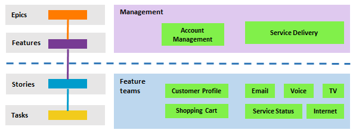
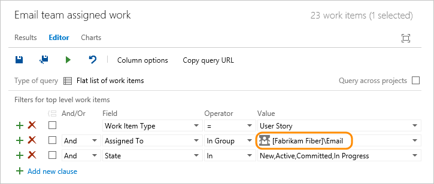
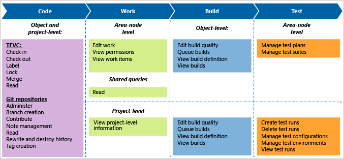

# About teams and Agile tools

[!INCLUDE [version-lt-eq-azure-devops](../../includes/version-lt-eq-azure-devops.md)]

Learn how you can structure and use your teams and Agile tools to support your growing organization. When your team grows beyond its intended size&mdash;typically anywhere from 6 to 9 members&mdash;you might consider moving from a one team structure to a two-team structure. You can then set up a hierarchical team structure, which provides several advantages to managers for tracking progress across teams. For the step-by-step procedure to add a team, see [Add another team](add-teams.md).

[!INCLUDE [temp](../../boards/includes/note-configure-customize.md)]

Depending on the size of your organization and your tracking needs, you can set up a team structure similar to the following image shown. Do so by defining teams and their associated area path(s). 

 

The following scenarios apply:
- each feature team can be associated with a single feature area path&mdash;such as *Customer Profile*, *Shopping Cart*, *Email*&mdash;or several area paths
- each management team, which focuses on a set of features, can choose several area paths to monitor
- each feature team has its distinct backlog to plan, determine priority, and track work
- portfolio or product owners can create their idea, road map, and goals for each release, monitor progress across their portfolio of projects, and manage risks and dependencies. For more information, see [Portfolio management](../../boards/plans/portfolio-management.md)

## About area paths, feature teams, and management teams 

Area paths serve the following purposes in Azure Boards:  
1. Filter the work items that appear on a team backlog or board.
2. Apply additional filtering to the work items that appear on a backlog or board, for details, see [Interactively filter backlogs, boards, queries, and plans](../../boards/backlogs/filter-backlogs-boards-plans.md).
3. Group work that shares some relationship, such as belonging to the same product, feature, or other work-level grouping. 
4. Restrict access to work by setting permissions. Permissions can be set for security groups to restrict modification of work items based on area path. 

Teams make their selections as follows: 
- Feature teams can choose one or more area paths to specify which work items will appear on their backlogs and boards. 
- Management teams typically choose all area paths that their feature teams work on.
- Additionally, management teams may only focus on Features and Epics, while Feature teams may focus only on product backlog items such as User Stories (Agile), Product Backlog Items (Scrum), and Requirements (CMMI).

> [!NOTE]  
> Teams can be assigned a maximum of 300 **Area Paths**. To learn more, see [Work tracking, process, and project limits](work/object-limits.md). 

For steps to define area paths and assign them to a team, see [Define area paths and assign to a team](set-area-paths.md). 

## The default team

Each new project is configured with a default team with the project name. For example, the *Fabrikam* project is automatically configured with the *Fabrikam* team. 

Backlogs, boards, and dashboards are automatically configured for this default team so that you can start defining work items and your backlog. 

You can rename the default team and reassign a new team as the default. 

## Each team gets their own set of tools 

Each team you create gets access to a suite of Agile tools and team assets. These tools let teams work autonomously and collaborate with other teams across the enterprise. Each team can configure and customize each tool to support how they work.  

::: moniker range=">= azure-devops-2020"

> [!NOTE] 
> In addition to team dashboards, you can add a project dashboard, which isn't specific to any one team. For more information, see [Add, rename, and delete dashboards](../../report/dashboards/dashboards.md). 

::: moniker-end

These tools automatically filter the set of work items they display by referencing the following items:
- default area path
- iteration path
- selected sprints

For more information about each tool and the configuration settings for each tool, see the following corresponding articles.

[!INCLUDE [team-configuration](../../boards/includes/team-configuration.md)]

Many of these tools are built from system queries that reference the team area path. For instance, a team's default area path filters the work items that appear on a team's backlog. Work items created using an Agile tool auto-assign the areas and iterations based on team defaults.  

<a id="team-defaults" />

## Team defaults referenced by backlogs and boards

What work items appear on team backlogs and boards? When you add work items to a backlog or board, how are team defaults used to assign field values? 

Teams are associated with one or more **Area Paths** and **Iteration Paths**. These paths determine what items appear on their backlogs and boards. 

When you define a team, you define the team's: 
- Selected Area Path(s) 
- Default Area Path
- Selected Iteration Path(s)
- Backlog Iteration Path
- Default Iteration Path 

All Agile tools reference the Area Path(s) defined for a team. The set of work items that appear on a backlog or board depend on the current **State** of a work item or its parent-child status.   

Several tools also reference the team's default and selected Iteration Path or sprints. When you add a new work item from a team's backlog or Kanban board, the system assigns the team's **Default Area Path** and **Default Iteration Path** to it.  

> [!NOTE]   
> New work items added through the **Work Items** page or the **New Work Items** widget on a team dashboard don't reference the **Default Iteration Path** assigned to the team. Instead, new work items are assigned the last **Iteration Path** selected by the user. New work items added through a team's **Sprints** backlog or taskboard are always assigned the **Iteration Path** associated with the selected sprint backlog or taskboard. 

:::row::: 
   :::column span="1":::
   **Agile tool**
   :::column-end:::
   :::column span="1":::
   **Area path  (see note 1)**
   :::column-end:::
   :::column span="1":::
   **Iteration path**
   :::column-end:::
   :::column span="1":::
   **State**
   :::column-end:::
:::row-end:::
---
:::row::: 
   :::column span="1":::
   Portfolio or product backlogs
   :::column-end:::
   :::column span="1":::
   Selected area path(s)
   :::column-end:::
   :::column span="1":::
   Equal to or under team's [backlog iteration path](../../organizations/settings/set-iteration-paths-sprints.md)
   :::column-end:::
   :::column span="1":::
   Active (corresponds to a Proposed or InProgress state category, see notes 2, 3)
   :::column-end:::
:::row-end:::

:::row::: 
   :::column span="1":::
   Kanban boards (see note 4)
   :::column-end:::
   :::column span="1":::
   Selected area path(s)
   :::column-end:::
   :::column span="1":::
   Equal to or under team's [backlog iteration path](../../organizations/settings/set-iteration-paths-sprints.md)
   :::column-end:::
   :::column span="1":::
   Any state (see notes 3, 5)
   :::column-end:::
:::row-end:::

:::row::: 
   :::column span="1":::
   Sprint backlogs (see note 4)
   :::column-end:::
   :::column span="1":::
   Selected area path(s)
   :::column-end:::
   :::column span="1":::
   Team's selected iteration paths
   :::column-end:::
   :::column span="1":::
   Any state (see notes 3, 5)
   :::column-end:::
:::row-end:::

:::row::: 
   :::column span="1":::
   Task boards (see note 4)
   :::column-end:::
   :::column span="1":::
   Selected area path(s)
   :::column-end:::
   :::column span="1":::
   Team's selected iteration paths
   :::column-end:::
   :::column span="1":::
   Any state (see notes 3, 5)
   :::column-end:::
:::row-end:::

:::row::: 
   :::column span="1":::
   New work item widget
   :::column-end:::
   :::column span="1":::
   Default area path
   :::column-end:::
   :::column span="1":::
   Default iteration path
   :::column-end:::
   :::column span="1":::
   n/a
   :::column-end:::
:::row-end:::

> [!NOTE]  
> 1. Agile tools filter items based on the team's selected area path(s). Teams can choose [whether to include or exclude items assigned to subarea paths](../../organizations/settings/set-area-paths.md#team-area-paths).  
> 2. Work items whose **State** equals *Closed*, *Done*, or *Removed* (corresponding to a *Completed* category state) don't appear on portfolio and product backlogs.  
> 3. You can add custom workflow states and assign them to one of three state categories. The [state categories](../../boards/work-items/workflow-and-state-categories.md)"> determine which work items appear on backlog and board views.   
> 4. Kanban boards, sprint backlogs, and taskboards only show the last node in a hierarchy, called the leaf node. For example, if you link items within a hierarchy that is four levels deep, only the items at the fourth level appear on the Kanban board, sprint backlog, and task board. To learn more, see [parent-child links between items](../../boards/backlogs/resolve-backlog-reorder-issues.md#leaf-nodes).  
> 5. Work items whose **State** equals *Removed* don't appear on boards.   

## Structure hierarchical teams or scale agility within an enterprise 

Although there's no concept of subteams, you can create teams whose area paths are under another team, which effectively creates a hierarchy of teams. To learn more, see [Add another team](../../organizations/settings/add-teams.md).

Also, the following articles walk you through the steps for configuring teams, area paths, and iterations to support portfolio management or enterprise organizations: 
- [Portfolio management](../../boards/plans/portfolio-management.md)
- [Implement Scaled Agile Framework to support epics, release trains, and multiple backlogs](../../boards/plans/scaled-agile-framework.md)

## Team groups 

When you add a team, a security group is automatically created with the team name. You can use this group to filter queries. The name of team groups follows the pattern **[Project Name]\Team Name**. For example, the following query finds work assigned to members of the **[Fabrikam Fiber]\Email** team group.

You can also use the **\@mention** control within discussions and pull requests to notify all members of a team. Start entering the name of a team or a security group, select the search icon, and then select from the options listed. To learn more, see [Use &#64;mentions to further discussion](../../organizations/notifications/at-mentions.md).  

## Work on more than one team

Can a user account belong to more than one team?  

Yes. You can add user accounts as members of the project or to one or more teams added to the project. If you work on two or more Scrum teams, make sure you [specify your sprint capacity for each team you work on](../../boards/sprints/set-capacity.md). 

## Team member permissions 

By default, team members inherit the permissions afforded to members of the project Contributors group. Members of this group can add and modify source code, create and delete test runs, and create and modify work items. Team members can [collaborate on a Git project](../../repos/git/gitquickstart.md) or  [check in work to the team's code base](../../repos/tfvc/check-your-work-team-codebase.md). 

  

Limit access to select features by making a user a [Stakeholder](../security/get-started-stakeholder.md) or limiting their access to read-only. For more information, see [Permissions and access for work tracking](../security/permissions-access-work-tracking.md). 

## Summary 

- Every team owns their own backlog, to create a new backlog you [create a new team](../../organizations/settings/add-teams.md) 
- Every backlog has a corresponding [Kanban board](../../boards/boards/kanban-basics.md) you can use to track progress and update status  
- The team's specified area and iteration paths determine which work items appear on the backlog and Kanban board&mdash;you can easily decide to include or exclude work items under a specific area path   
-  Each team can control how [bugs show up on their backlogs and boards](show-bugs-on-backlog.md)   
- For an overview of all team assets and how to configure them, see [Manage teams and configure team tools](manage-teams.md)   
- To have work done by several teams roll up in to a portfolio backlog, you'll want to [setup the team hierarchy](../../boards/plans/portfolio-management.md) 
- To add fields or work item types, see [Customize your work tracking experience](../../reference/customize-work.md).

## Related articles 

- [Add another team](add-teams.md)  
- [Configure team settings](manage-teams.md)      
- [Work across projects](../../project/navigation/work-across-projects.md)  

<!--- IN ADDITION: Favorites (query, build); assigned to <team> PRs, Default reviewers for PRs, @CurrentIteration, @Mention a group, team is a group  -->   

<!---
You can view these queries by choosing the **Create query** link that appears on these tools' pages. (Note that you can't change the underlying query.)  Lastly, you can set  security permissions to control who has access to create, modify, or manage test plans and test suites under an area.
-->
