# Add or remove a team administrator 

[!INCLUDE [temp](../../includes/version-vsts-tfs-all-versions.md)]


<a id="add-team-admin">  </a>  

Learn how to add or remove an administrator for your team. It's always a good idea to have more than one user with administration permissions for a team. Team administrators can [manage teams and configure team tools](manage-teams.md) and manage projects. You may want to remove a user's administration permissions, for instance if the user is no longer active. 

To add a team, see [Add teams](add-teams.md).

<a name="permissions"></a>

## Prerequisites

- To add or remove a user as a team administrator, you must be a [member of the Project Administrators group](../security/set-project-collection-level-permissions.md), or a team administrator for the team you want to update.
- To be added as a team administrator, you must be a user in the organization and granted **Basic** or higher access-level. Users granted Stakeholder access can't be added as a team administrator. 

<a id="open-admin-context">  </a>

## Add an administrator

To get added as a team administrator, ask another team administrator or a member of the [Project Administrators group](../security/set-project-collection-level-permissions.md) to add you.  

::: moniker range="azure-devops"

> [!NOTE]   
> To enable the user interface for the **New Teams Page**, see [Manage or enable features](../../project/navigation/preview-features.md).

#### [New Teams Page](#tab/preview-page) 

1. Sign in to your organization (```https://dev.azure.com/{yourorganization}```) and select a project.
2. Choose **Project settings**, and then choose **Teams**. 
    
	> [!div class="mx-imgBorder"]
    > 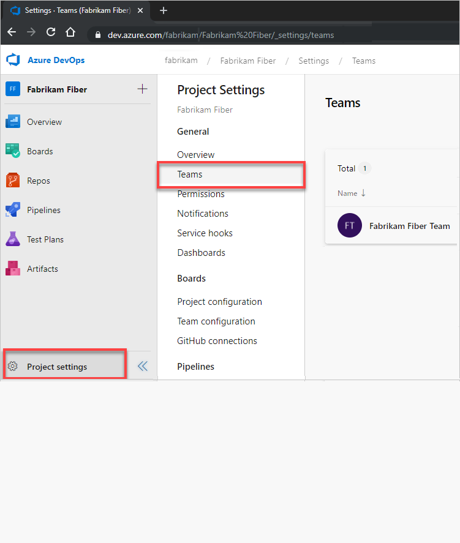

3. Select the team to configure, and then select **Settings** > **Add**. 

	> [!div class="mx-imgBorder"]
	> 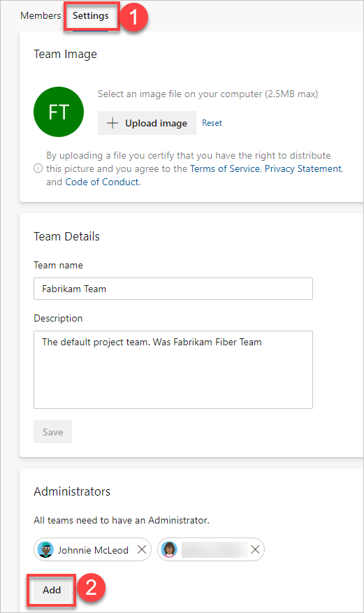  

3. Enter the user's identity you want to add to the administrator role, and then select **Save**.     
	    
	> [!div class="mx-imgBorder"]
	> 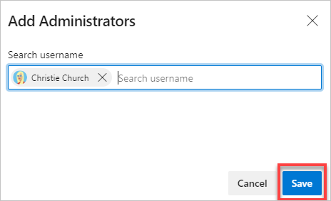

#### [Current page](#tab/current-page) 

1. Choose **Project settings**, and then choose **Teams**. 

	> [!div class="mx-imgBorder"]
    > 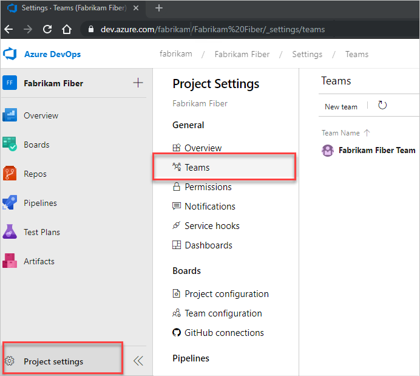

2. Select the team to configure, and then select **Settings** > **Add**. 

	> [!div class="mx-imgBorder"]
	> 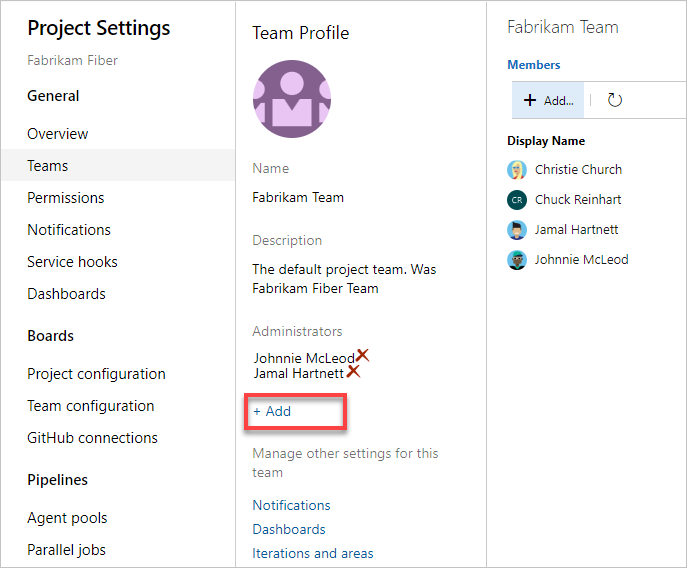  

3. Enter the user identity that you want to add to the administrator role, and then select **Save**.     
	    
	> [!div class="mx-imgBorder"]
	> 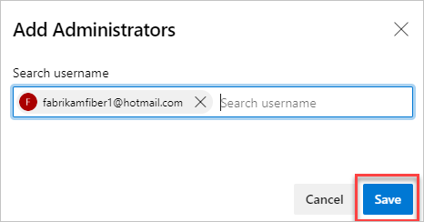

***

::: moniker-end


::: moniker range=">= azure-devops-2019 < azure-devops"

1. Choose **Project settings**, and then choose **Teams**. 

	> [!div class="mx-imgBorder"]
    > 

2. Select the team to configure, and then select **Settings** > **Add**. 

	> [!div class="mx-imgBorder"]
	>   

3. Enter the user identity that you want to add to the administrator role, and then select **Save**.     
	    
	> [!div class="mx-imgBorder"]
	> 

::: moniker-end

::: moniker range=">= tfs-2017 <= tfs-2018"

1. From the web portal and team context, choose **Team Settings** :::image type="icon" source="../../media/icons/gear_icon.png" border="false":::.

	> [!div class="mx-imgBorder"]  
	> 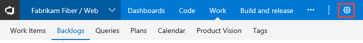

	If you choose **Project settings** :::image type="icon" source="../../media/icons/gear_icon.png" border="false":::, then choose **Overview**, and select the team you want to configure.   

2. Choose the **Add** link to open the dialog for adding user identities.  

	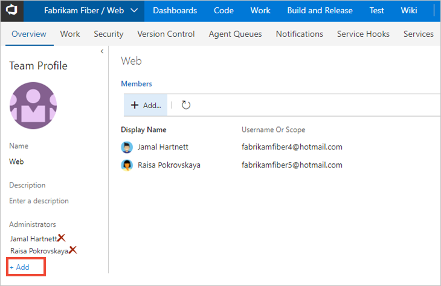  
   
3. Enter the identities you want to add to the team administrator role.   

	> [!div class="mx-imgBorder"]
	> 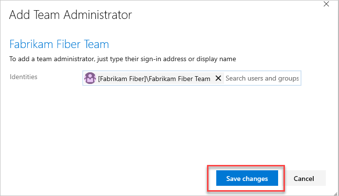
   
::: moniker-end     

::: moniker range=">= tfs-2013 <= tfs-2015"

1. From the web portal, select your project, and then select **Administration settings** :::image type="icon" source="../../media/icons/gear_icon.png" border="false"::: to open the administration page.

	> [!div class="mx-imgBorder"]  
	> 

	If you choose **Project settings** :::image type="icon" source="../../media/icons/gear_icon.png" border="false":::, then choose **Overview**, and select the team you want to add an administrator to.   

2. Choose the **Add** link to open the dialog for adding user identities.    
  
	

3. Enter the identities you want to add to the team administrator role.     

	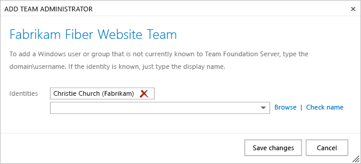    
	
::: moniker-end  

* * *

<a id="remove-admin">  </a>

## Remove an administrator

Each team must have at least one administrator. To remove an administrator, you must first add at least a second administrator. 

Open the **Teams** settings page as described in the previous section.

::: moniker range="azure-devops" 

#### [New Teams Page](#tab/preview-page) 

1. Sign in to your organization (```https://dev.azure.com/{yourorganization}```) and select a project.
2. Choose **Project settings**.
3. On the **Overview** page, choose  for the user that you want to remove as a team administrator. 

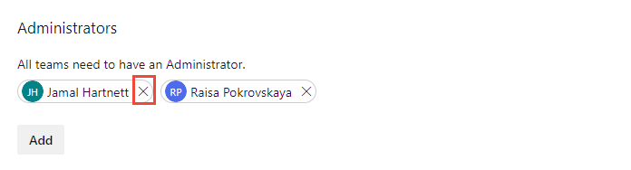


#### [Current page](#tab/current-page) 

From the Administrators section, choose  for the user that you want to remove as a team administrator. 

> [!div class="mx-imgBorder"]
>   

* * *
 
::: moniker-end

::: moniker range=">= azure-devops-2019 < azure-devops"

From the Administrators section, choose  for the user that you want to remove as a team administrator. 

> [!div class="mx-imgBorder"]
>   

::: moniker-end

::: moniker range=">= tfs-2013 < azure-devops-2019"

From the Administrators section, choose  for the user that you want to remove as a team administrator. 

> [!div class="mx-imgBorder"]
> 

::: moniker-end

## Next steps  

> [!div class="nextstepaction"]
> [Manage teams and configure team tools](manage-teams.md) 

## Related articles

- [Add teams](add-teams.md)  
- [About teams & Agile tools](../../organizations/settings/about-teams-and-settings.md)
- [Configure and customize Azure Boards](../../boards/configure-customize.md)
- [Set team favorites](../../project/navigation/set-favorites.md)

