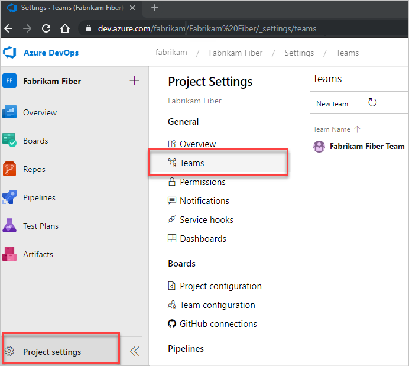
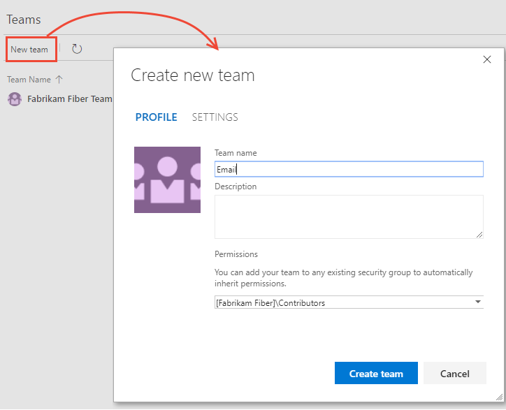
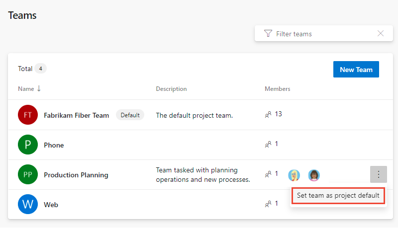
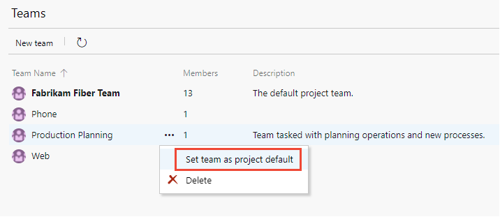

# Create or add a team 

[!INCLUDE [version-lt-eq-azure-devops](../../includes/version-lt-eq-azure-devops.md)]

This article explains how to create new teams, add members, configure team settings, and follow best practices for team management in Azure DevOps.

As your organization grows, you can add teams to manage specific products, services, or feature areas. Equip teams with tools to manage backlogs, plan sprints, configure dashboards, define alerts, and set team favorites.

Each new project includes a default team named after the project that you can rename or reassign as needed.

To maintain Agile practices while scaling teams, review [Scaling Agile to large teams](/devops/plan/scaling-agile). For more information on team-configurable tools, see [About teams and Agile tools](about-teams-and-settings.md).

> [!NOTE]
> This article explains how to add teams or team members to an Azure DevOps project. For information on Microsoft Teams or integrating it with Azure Boards, see [Introduction to Microsoft Teams for admins](/microsoftteams/teams-overview) or [Use the Azure Boards app in Microsoft Teams](../../boards/integrations/boards-teams.md).
>
> To move work items between teams, see [Move work items from one team to another](../../boards/work-items/move-work-items.md).

[!INCLUDE [ai-assistance-mcp-server-tip](../../includes/ai-assistance-mcp-server-tip.md)]

## Prerequisites

::: moniker range="azure-devops"

| Category | Requirements |
|--------------|-------------|
| Permissions | - Member of the Project Administrators security group.<br>- To add members to a team or change its configuration, be a [team administrator](add-team-administrator.md) or member of the [Project Administrators](../security/change-project-level-permissions.md) group. |
|Tools| To use Azure CLI commands: [Azure DevOps CLI](../../cli/index.md).|  

::: moniker-end

::: moniker range="< azure-devops"

| Category | Requirements |
|--------------|-------------|
| Permissions | - Member of the Project Administrators security group.<br>- To add members to a team or change its configuration, be a [team administrator](add-team-administrator.md) or member of the [Project Administrators](../security/change-project-level-permissions.md) group. |

::: moniker-end 

<a id="add-team"> </a>  

## Create a team and add team members

To create a team, do the following steps.

> [!NOTE]
> When you create a team, you can automatically generate the Area Path as a child node of the main project. To establish a hierarchical team structure, first define the Area Paths at the project level, then create your teams, and assign the appropriate Area Paths to each team. For more information, see [Configure a hierarchy of teams](../../boards/plans/configure-hierarchical-teams.md).

::: moniker range="azure-devops"

From the Azure CLI tool, you can [list teams](#list-teams), [create a team](#add-team), and [delete a team](rename-remove-team.md#delete-a-team). 

::: moniker-end

#### [Web portal](#tab/preview-page) 

::: moniker range="azure-devops"
1. Sign in to your organization (```https://dev.azure.com/{Your_Organization}```). 
2. Select Project settings > Teams.   

	:::image type="content" source="media/shared/open-project-settings-teams-preview.png" alt-text="Screenshot of Open Project settings, and then Teams button.":::

3. Select New team.   

	:::image type="content" source="media/add-team/new-team-button-new-teams-preview.png" alt-text="Screenshot of the New Team button.":::

4. Enter a team name and the names of project members who you want to assign to the team. Optionally, enter a description. Add at least one name as a team Administrator. Select Create an area path with the name of the team, or leave it unchecked and assign the Area Path for the team after it gets created. You can choose an existing area path or add a new one at that time. 

	:::image type="content" source="media/add-team/create-new-team-dialog-new-teams-preview.png" alt-text="Screenshot of Create a new team dialog.":::

	> [!NOTE] 
	> Consider adding one or more users as team administrators. Team administrators have the necessary permissions to add team members and configure all team settings, including backlogs, boards, and Taskboards. For more information, see [Manage and configure team tools](manage-teams.md).   

5. When you're ready, select Create.  

1. Select the team to add a team image, or configure other team elements.

7. Select Settings to upload an image, change the team name, add a team administrator, or delete the team.   

	:::image type="content" source="media/add-team/team-settings-dialog-new-teams-preview.png" alt-text="Screenshot of Team Settings dialog.":::

8. Choose Save. 

9. Select Iterations and areas to set the Area Paths and Iteration Paths for the team to use.   

	:::image type="content" source="media/add-team/team-settings-select-iterations-areas-new-teams-preview.png" alt-text="Screenshot of team settings, with Iterations and areas highlighted.":::

	For more information, see the following articles:  
	- [Define area paths and assign to a team](set-area-paths.md)  
	- [Define iteration paths, also known as sprints, and configure team iterations](set-iteration-paths-sprints.md).  

::: moniker-end

::: moniker range="< azure-devops"
Select the Current UI tab. The New Teams Page UI is only available for Azure DevOps Services. 
::: moniker-end

#### [Current UI](#tab/current-page)  

1. Sign in to your organization (```https://dev.azure.com/{Your_Organization}```).
2. Select Project settings > Teams.   

	

3. Select New team. Give the team a name, and optionally a description. Choose a security group to add team members to.  

	

4. When you're ready, select Create team. As the creator of the team, you automatically get added as the team administrator. You can remove yourself as an administrator and assign others to that role in the following steps.

5. Select the team to add team administrators, team members, configure iterations and areas. The Team Profile opens.   
	
  From the team profile, you can do the following tasks:
	- [Add and remove team administrators](add-team-administrator.md)
	- [Manage team notifications](../../organizations/notifications/manage-team-group-global-organization-notifications.md)
	- [Set default team dashboard permissions](../../report/dashboards/dashboard-permissions.md)
	- [Define area paths and assign to a team](set-area-paths.md)
	- [Define iteration paths, also known as sprints, and configure team iterations](set-iteration-paths-sprints.md)

::: moniker-end

[!INCLUDE [temp](../../includes/note-new-teams-not-supported.md)]

#### [Azure DevOps CLI](#tab/azure-devops-cli)

<a id="add-team-cli"></a> 

::: moniker range="azure-devops"

You can add a team by using [Azure DevOps team create](/cli/azure/devops/team#az-devops-team-create). To get started, see [Get started with Azure DevOps CLI](../../cli/index.md).  

> [!div class="tabbedCodeSnippets"]
```azurecli
az devops team create --name [--description] [--project] 
```

#### Parameters
 
- name: Required. Name of the new team.  
- description: Optional. Description of the new team enclosed within parenthesis.    
- project: Optional. Name or ID of the project. Example: `--project "Fabrikam Fiber"`.  

#### Example

The following command adds a team named Production Planning to the *fabrikamprime* organization, *Fabrikam Fiber* project, and returns many properties assigned to the team in YAML output format.  

> [!div class="tabbedCodeSnippets"]
```azurecli
az devops team create --name "Production Planning" --description "Team tasked with planning operations and new processes." --output yaml
description: Team tasked with planning operations and new processes.
```

The YAML output listed as follows provides information on each of the attributes defined for the team. 

> [!div class="tabbedCodeSnippets"]
```YAML
id: a0a0a0a0-bbbb-cccc-dddd-e1e1e1e1e1e1
identity:
  descriptor: Microsoft.TeamFoundation.Identity;S-1-9-1551374245-1732201093-1654247747-2842177119-783707289-1-3902693433-3854875975-3003387648-1936292500
  id: a0a0a0a0-bbbb-cccc-dddd-e1e1e1e1e1e1
  isActive: true
  isContainer: true
  masterId: a0a0a0a0-bbbb-cccc-dddd-e1e1e1e1e1e1
  memberOf: []
  members: []
  metaTypeId: 255
  properties:
    Account:
      $type: System.String
      $value: Production Planning
    Description:
      $type: System.String
      $value: Team tasked with planning operations and new processes.
    Domain:
      $type: System.String
      $value: vstfs:///Classification/TeamProject/b1b1b1b1-cccc-dddd-eeee-f2f2f2f2f2f2
    LocalScopeId:
      $type: System.String
      $value: b1b1b1b1-cccc-dddd-eeee-f2f2f2f2f2f2
    Microsoft.TeamFoundation.Team:
      $type: System.Boolean
      $value: true
    SchemaClassName:
      $type: System.String
      $value: Group
    ScopeId:
      $type: System.String
      $value: c2c2c2c2-dddd-eeee-ffff-a3a3a3a3a3a3
    ScopeName:
      $type: System.String
      $value: Fabrikam Fiber
    ScopeType:
      $type: System.String
      $value: TeamProject
    SecuringHostId:
      $type: System.String
      $value: d3d3d3d3-eeee-ffff-aaaa-b4b4b4b4b4b4
    SecurityGroup:
      $type: System.String
      $value: SecurityGroup
    SpecialType:
      $type: System.String
      $value: Generic
    VirtualPlugin:
      $type: System.String
      $value: ''
  providerDisplayName: '[Fabrikam Fiber]\Production Planning'
  resourceVersion: 2
  subjectDescriptor: vssgp.Uy0xLTktMTU1MTM3NDI0NS0xNzMyMjAxMDkzLTE2NTQyNDc3NDctMjg0MjE3NzExOS03ODM3MDcyODktMS0zOTAyNjkzNDMzLTM4NTQ4NzU5NzUtMzAwMzM4NzY0OC0xOTM2MjkyNTAw
identityUrl: https://spsprodeus27.vssps.visualstudio.com/e4e4e4e4-ffff-aaaa-bbbb-c5c5c5c5c5c5/_apis/Identities/a0a0a0a0-bbbb-cccc-dddd-e1e1e1e1e1e1
name: Production Plan
projectId: b1b1b1b1-cccc-dddd-eeee-f2f2f2f2f2f2
projectName: Fabrikam Fiber
url: https://fabrikamprime.visualstudio.com/_apis/projects/b1b1b1b1-cccc-dddd-eeee-f2f2f2f2f2f2/teams/a0a0a0a0-bbbb-cccc-dddd-e1e1e1e1e1e1
```
 
::: moniker-end

[!INCLUDE [note-cli-not-supported](../../includes/note-cli-not-supported.md)]

* * *

Upon creation of a team, the following items are automatically configured:  
- Security group with the team name containing the members assigned to the team, for example, [Fabrikam Fiber]\Production Planning. You can use this name to filter queries or to @mention all members of the team. 
- Default notifications assigned to the team. For more information, see [Manage notifications for a team, project, or organization](../../organizations/notifications/manage-team-group-global-organization-notifications.md).
- Default dashboard named Overview assigned to the team. To configure the dashboard, see [Add widgets to a dashboard](../../report/dashboards/add-widget-to-dashboard.md).

> [!IMPORTANT]   
> Configuring the Area Paths and Iteration Paths used by the team is essential for many of the Azure Board tools to work, such as Backlogs, Boards, Sprints, and Delivery Plans. Team tools aren't available until the team's default area path is set. Area Paths and Iteration Paths are first configured for the project and then assigned or selected by the team.  
>
> If you are moving from one team to two or more teams, you may want to review and revise the Area Paths assigned to the default project team. 

To configure other team features, see [Manage teams and configure team tools](manage-teams.md).

<a id="include-area-paths"> </a>  

## Set the default project team

Each project has a default team assigned. You can change which project is assigned as the default with the following procedures.   

#### [Web portal](#tab/preview-page) 

::: moniker range="azure-devops"
1. Open Project settings > Teams as indicated in the previous section. 

2. Choose :::image type="icon" source="../../media/icons/more-actions.png" border="false"::: More options for the team you want to designate as the default, and choose Set team as project default. 

	   
::: moniker-end

::: moniker range="< azure-devops"
Choose the Current UI tab. The New Teams Page UI is only available for Azure DevOps Services. 
::: moniker-end

#### [Current UI](#tab/current-page) 

::: moniker range="<=azure-devops"
1. Open Project settings > Teams as indicated in the previous section. 
::: moniker-end
 
2. Choose :::image type="icon" source="../../media/icons/actions-icon.png" border="false"::: to open the context menu for the team you want to designate as the default, and choose Set team as project default. 

	   

#### [Azure DevOps CLI](#tab/azure-devops-cli)

::: moniker range="azure-devops" 
There isn't an Azure CLI command to set the default team project. 
::: moniker-end 

[!INCLUDE [note-cli-not-supported](../../includes/note-cli-not-supported.md)]

* * *

<a id="list-teams"></a> 

::: moniker range="azure-devops" 

## List teams with Azure CLI

You can list teams by using [Azure DevOps team list](/cli/azure/devops/team#az-devops-team-list). To learn how to list team members, see [List team members](../security/add-users-team-project.md#list-team-members).

> [!div class="tabbedCodeSnippets"]
```azurecli
az devops team list [--project]
                    [--skip]
                    [--top]
```

> [!TIP]
> If you don't specify a top number, 100 teams are returned. To list all teams in a project, specify a number for top which is greater than the current number of teams defined.  

#### Parameters

- project: Optional. Name or ID of the project. Example: --project "Fabrikam Fiber."  You can configure the default project using `az devops configure -d project=NAME_OR_ID`. Required if not configured as default or picked up via git config.
- skip: Optional. Number of teams to skip.  
- top: Optional. Maximum number of teams to return. 

#### Example

For example, the following command returns the 11 teams defined in the Fabrikam Fiber project. For addition output formats, see [Output formats for Azure CLI commands](/cli/azure/format-output-azure-cli). 

A unique ID is assigned to each team.

> [!div class="tabbedCodeSnippets"]
```azurecli
az devops team list --project "Fabrikam Fiber" --output table
```

The following table output provides information on each of the attributes defined for the team. 

```output
ID                                    Name                Description
------------------------------------  ------------------  ----------------------------------------------------------------------------
a0a0a0a0-bbbb-cccc-dddd-e1e1e1e1e1e1  Account Management  Management team focused on creating and maintaining customer services
b1b1b1b1-cccc-dddd-eeee-f2f2f2f2f2f2  Customer Profile    Feature team focused on securing account data
c2c2c2c2-dddd-eeee-ffff-a3a3a3a3a3a3  Email               Feature team delivering email apps
d3d3d3d3-eeee-ffff-aaaa-b4b4b4b4b4b4  Fabrikam Team       The default project team. Was Fabrikam Fiber Team
e4e4e4e4-ffff-aaaa-bbbb-c5c5c5c5c5c5  Internet            Feature team developing web apps
f5f5f5f5-aaaa-bbbb-cccc-d6d6d6d6d6d6  Phone               Feature team delivering phone apps
0a0a0a0a-1111-bbbb-2222-3c3c3c3c3c3c  Service Delivery    Management team responsible for ensure high performance delivery of services
1b1b1b1b-2222-cccc-3333-4d4d4d4d4d4d  Service Status      Feature team focused on monitoring and addressing service issues
2c2c2c2c-3333-dddd-4444-5e5e5e5e5e5e  Shopping Cart       Feature team managing shopping cart apps
3d3d3d3d-4444-eeee-5555-6f6f6f6f6f6f  TV                  Feature team developing TV apps
4e4e4e4e-5555-ffff-6666-7a7a7a7a7a7a  Voice               Feature team focused on voice communications
```

::: moniker-end 

<a id="grant-add-permissions"></a>  

## Grant team members permissions  

For teams to work autonomously, give them permissions that they don't have by default. Suggested tasks include providing team administrators or team leads with permissions to:  

- [Create and edit child nodes under their default area path](../security/set-permissions-access-work-tracking.md#create-child-nodes-modify-work-items-under-an-area-or-iteration-path) 
- [Create shared queries and folders under the Shared Queries folder](../../boards/queries/set-query-permissions.md)

For more information on setting permissions and access for select users, see [Set permissions and access for work tracking](../security/set-permissions-access-work-tracking.md).

 

<a id="use-ai-assistance"></a>

## Use AI to create and manage teams

[!INCLUDE [ai-assistance-mcp-server-tip](../../includes/ai-assistance-mcp-server-tip.md)]

If you use GitHub Copilot, the [Azure DevOps MCP Server](../../mcp-server/overview.md) can help you create teams, configure their settings, and manage team membership through natural language prompts.

### Example prompts for team management

| Task | Example prompt |
|---|---|
| Bootstrap teams for a new project | `I'm setting up a new project with three Scrum teams — API, Frontend, and QA. Create each team, assign a team administrator, set up their area paths, and configure 2-week sprint iterations starting next Monday` |
| Scale from one team to many | `Our single default team has grown to 30 people working on different features. Help me split into three feature teams, redistribute existing work items based on area paths, and set up independent backlogs for each team` |
| Audit team membership | `List all teams in my project with their members and administrators. Identify any teams with no administrator, teams with members who left the organization, or teams with overlapping membership that might cause confusion` |
| Set up a virtual team for cross-cutting work | `Create a DevOps team that spans Backend and Frontend teams for infrastructure and deployment work. Configure their area path to include sub-areas from both teams so they can track cross-cutting concerns` |
| Automate team creation via CLI | `Generate Azure DevOps CLI commands to create 5 teams from a list of names, add specific members to each, and set the default team for our project` |
| Configure team defaults and permissions | `I just created a new Platform team. Walk me through setting their default area path, backlog iteration, sprint iterations, working days, and granting the team lead permissions to manage the team settings` |

> [!TIP]
> For the best results, use these prompts in agent mode with the Azure DevOps MCP Server connected. Customize the prompts with your specific team names, member lists, or project structure.

## Next steps

> [!div class="nextstepaction"]
> [Manage teams and configure team tools](manage-teams.md)

## Related content

- [Rename or remove a team](rename-remove-team.md)
- [Learn about teams and Agile tools](about-teams-and-settings.md)
- [Add users to a team or project](../security/add-users-team-project.md)

**REST API Resources**
- [Use the Azure DevOps Teams CLI](/cli/azure/devops/team)
- [Use the Teams REST API](/rest/api/azure/devops/core/teams)
- [Use the Work Items REST API](/rest/api/azure/devops/wit)
