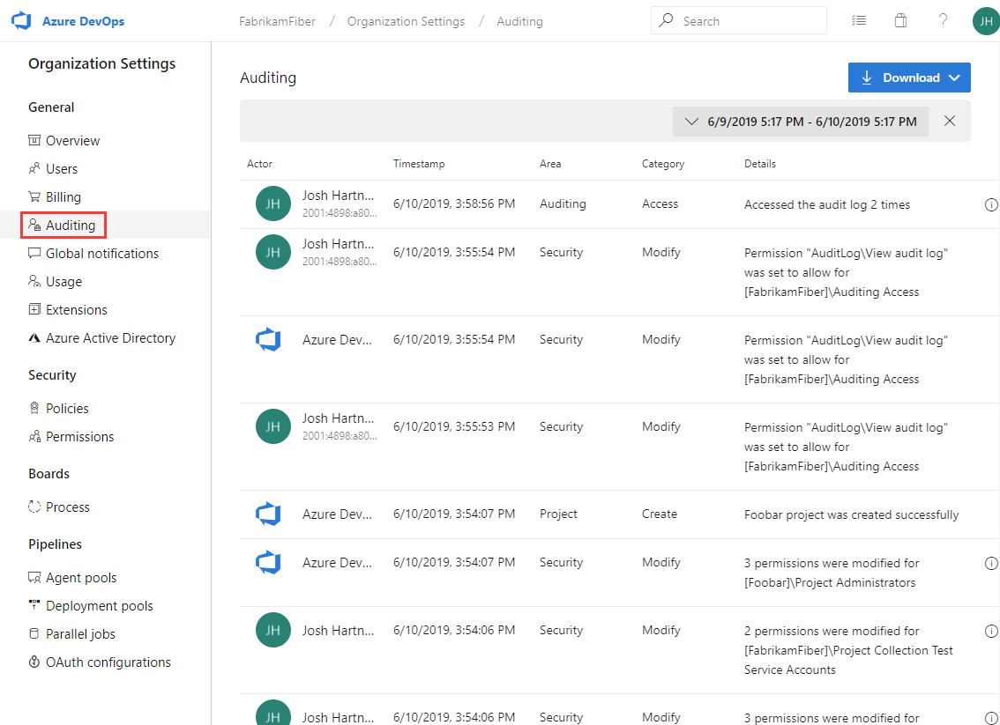
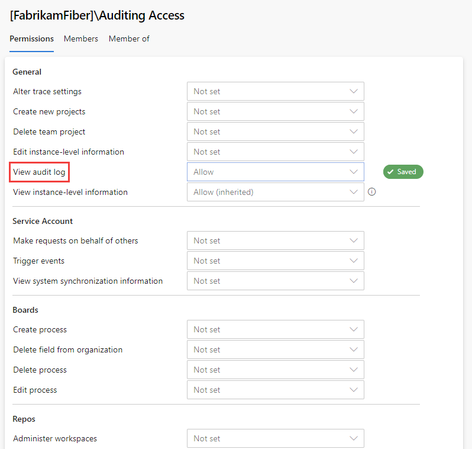
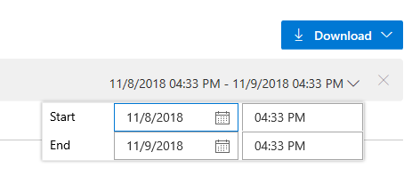
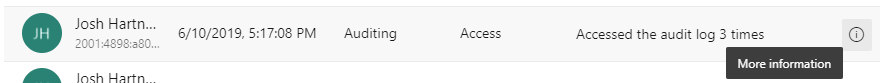

# Access, review, export, and filter audit logs

[!INCLUDE [version-vsts-only](../../_shared/version-vsts-only.md)]

> [!Note]
> Auditing is currently in a Public Preview.

Auditing contains a lot of changes that occur throughout an Azure DevOps organization. Changes occur when a user or service identity within the organization edits the state of an artifact. In some limited cases it can also include accessing an artifact. Think permissions changes, resource deletion, code download, accessing the auditing feature, and much more. 

When an audit-able event occurs, a log entry is recorded as an audit event. Events contain information such as IP, user who caused the event to be logged, what happened, and other useful pieces of data that help you answer the who, what, when, and where. 

Auditing is turned on by default for all Azure DevOps organizations and can’t be turned off, ensuring that you never miss an actionable audit event. Events are stored for 90 days and then they’re deleted. However, you can back-up audit events to an external location to keep the data for longer than the 90-day period. 

## Prerequisites

By default, Project Collection Administrators are the only group that can view the auditing feature. 

## Access auditing

Access to the auditing feature is limited to a select group of individuals in an organization. 

1. Sign in to your organization (```https://dev.azure.com/{yourorganization}```).
2. Select  **Organization settings**. 
   
3. Select **Auditing**.

   
   If you don't see Auditing in organization settings, then you don't have access to view audit events. Outside of the Project Collection Administrators group, you can give permissions to other users and groups, so they can view auditing.
4. Select **Security**, and then find the group or users for whom you're interested in providing auditing access.
5. Set **View audit log** to **allow**, and then select **Save changes**.
   

The user or group members have access to view your organization audit events. 

## Review audit log

The auditing page provides a simple view into the audit events that are recorded for your organization. For now, you can only search by a time range to find audit events that occurred within the last 90 days. 

See the following description of the information that's visible on the auditing page.

### Information and details

|Information  |Details  |
|---------|---------|
|Actor     | Display name of the individual that triggered the audit event to be recorded.       |
|IP    |  IP address of the individual that triggered the audit event to be recorded.      |
|Timestamp     | Time that the triggered event happened. Time is localized to your time zone.        |
|Area     | Location in Azure DevOps where the event took place.        |
|Category     | Description of the type of action that occurred. See the following fixed list of words:
   * Modify
   * Rename
   * Create
   * Delete
   * Remove
   * Access   | 
|Details    | Brief description of what happened during the event        |


In addition to what is viewable on the auditing page, each audit event records additional pieces of information. This information includes authentication mechanism, a correlation Id to link similar events together, user agent, and additional information that’s dependent on the type of audit event. This information can only be viewed by downloading auditing events.

To scope down the viewable audit events, select the time filter on the top right hand side of the page. 



You can select any time range over the last 90 days and scope it down to the minute. Once you’ve selected your desired time range, select anywhere off the time range selector to initiate the search. By default, the top two hundred results are returned for that time selection. If there are more results, then you can scroll down to load them onto the page. If you wish to further scope down the set of results returned, then you need to download the auditing data.

Some audit events can contain multiple actions that took place at once. These are known as bulk audit events. You can distinguish these events from others with the information icon on the far right of the event. 



Clicking on the information icon will display a flyout that contains additional information about what happened in this audit event.


## Export auditing events

In order perform a more detailed search of the auditing data, or store more than 90 days of data, you will need to export existing audit events. The exported data can then be stored in another location or service. 

Exporting can be done via the download button in the top righthand side of the auditing page. From that button, you can select to download to CSV or JSON. 

Selecting either option will initiate the download. Events will be downloaded based on the time range you have selected in the filter. If you had one day selected, then you will get that one day’s worth of data. Transversely, if you wanted all 90 days, select 90 days from the time range filter and then initiate the download. 

## Filter audit log

The auditing page in Azure DevOps currently supports searching for audit events only by setting a time range. Other, more detailed types of searches will need be done using other tools after exporting your audit event data. 

For quick investigations, its recommended that you download the logs as CSV. You can then leverage Microsoft Excel or other CSV parsers to quickly filter on the area and category columns. Longer term, it’s recommended that you place your exported audit events in a Security Incident and Event Management (SIEM) tool. That will allow you to keep greater than 90 days of events, search, generate reports, and configure alerts based on audit events. 

When filtering through audit events, it’s best to leverage the “area” and “category” columns. These allow you to quickly filter down to just the type of events that you’re interested in. The below tables contain a list of current areas and categories. 

### Categories


|Category  |Description |
|---------|---------|
|Modify     | Modify implies that an artifact in an organization was changed. This could be a state or property change.        |
|Rename     | Rename is a special type of modify event, which occurs when an artifact in an organization has its name changed.        |
|Create     | Create refers to artifacts that are newly made in an organization.        |
|Delete     | Delete refers to when an artifact is deleted or removed from an organization.        |
|Access     | Access refers to when an artifact is viewed or opened in an organization.        |
 
### Areas


|Area   |Description |
|---------|---------|
|Project    | Create, delete, change in visibility, and rename a project in an organization.        |
|Security     | Modify security permissions, create group, delete group, update group, add member to group, and remove member from group       |
|Audit    | View or download audit events.        |
|Agile     |Process, create, delete, and modify.         |
|Notification    |Create, remove, and modify a subscription         |
|Pipelines  | Create, delete, and modify build definition        |
|Extensions | Install, delete, or update an extension        |

### Filtering tips

After you download a copy of your auditing events, you can view additional pieces of information collected with each event. See the following useful tips for how to filter through events beyond using only the categories and areas fields. 

**ID & correlation ID**

Each audit event has a unique identifier called the “Id” and a correlation Id called the “CorrelationId”. The correlation Id is helpful to find related audit events. For example, a project creation can generate several dozen audit events. You can link these events together because they all have the same correlation Id. 

When an audit event’s Id matches its correlation Id, that’s an indication that the audit event is the parent or original event. So, the initial event, showing that a user created a project, will have the same Id as the correlation Id. If you want to view only the set of events that where originators and not post action events, you can set a filter for where “Id” equals the “correlation Id”. Then, if you find an event that you’re interested in investigating, you can search for just events with that correlation Id. Note, not all events have other related events. 

## Limitations

The following limitations exist for what can be audited. 

* Azure Active Directory (Azure AD) group membership changes – In the future, auditing will include changes to Azure DevOps groups, such as adding or removing a group or user. However, if you manage membership via Azure AD groups, additions and removals of users from those Azure AD groups are not audited by Azure DevOps. You need to review the Azure AD audit logs to see when a user or group was added or removed from an Azure AD group. 
* Sign-ins – Sign-ins to Azure DevOps aren't tracked. View the Azure AD audit logs to review sign-ins to your Azure AD. 


