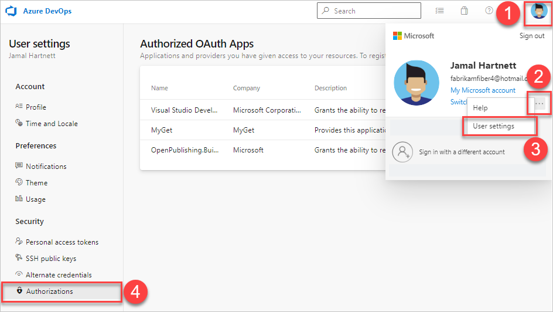

#  Authorize other services to access Azure DevOps

[!INCLUDE [temp](../../includes/version-vsts-plus-azdevserver-2019.md)]

Learn how to give a service access to Azure DevOps. The OAuth 2.0 framework provides safe, secure access to your resources. Some of these resources include work items, source code, and build results.

- A service uses the authorization, bound to your credentials, to access resources in any organization that you have access to.
- Use your Microsoft account, like ```me@live.com```, or your work account, your account in Azure AD - like ```me@my-workplace.com```, to authorize the service.
- The service that you authorize never has access to your Azure DevOps credentials.
- Revoke any authorizations that you've granted to other services.

## Authorize a service

A typical authorization flow might be similar to the following example:

1. You're using a service that uses Azure DevOps resources, so the service requests authorization.

2. If you're not already signed in, Azure DevOps prompts you for your credentials.
   
   :::image type="content" source="../../service-hooks/media/authorize/vso-sign-in.png" alt-text="Screenshot of the Visual Studio sign in prompt.":::

3. After you've signed in, you get the authorization approval page.

   :::image type="content" source="../../service-hooks/media/authorize/vso-authorize.png" alt-text="Screenshot of Accept or Deny buttons for authorization of the application.":::

   A service can only request full access through the REST APIs, so the authorization request may not be specific.

4. Review the request and approve the authorization.

5. The authorized service uses that authorization to access resources in your Azure DevOps organization.

To ensure an authorization request is legitimate, do the following actions:

- Look for the Azure DevOps branding across the upper portion of the authorization approval page.
- Ensure the authorization approval page URL begins with ```https://app.vssps.visualstudio.com/```.
- Pay attention to any HTTPS-related security warnings in your browser.
- Remember that other services don't ask for your credentials directly. They let you provide them to Azure DevOps through the authorization approval page.

## Manage authorizations

View the services that you've authorized to access your organization.

To access the Preview features options, open your profile menu. The profile menu appears based on whether the **New Account Manager** feature has been enabled or not.
For more information, see [Preview features](../../project/navigation/preview-features.md#user-level). 

#### [New Account Manager enabled](#tab/new-account-enabled)

1. Sign in to your organization (```https://dev.azure.com/{yourorganization}```).
2. Choose :::image type="icon" source="../../media/icons/user-settings-gear.png" border="false"::: **User settings**, and then choose **Profile**.
3. Choose **Authorizations**.  

   :::image type="content" source="media/profile-settings-authorizations.png" alt-text="Screenshot of profile settings with Authorizations selected, New Account Manager preview.":::


#### [New Account Manager not enabled](#tab/new-account-not-enabled)

1. Sign in to your organization (```https://dev.azure.com/{yourorganization}```).
2. Go to your profile, select  **User settings**, and then select **Authorizations**. 



---

You can revoke any authorizations so the service can no longer access your organization on your behalf.

## Next steps

> [!div class="nextstepaction"]
> [Set user preferences](set-your-preferences.md)

## Related articles

- [Change application access policies](../accounts/change-application-access-policies.md)
- [Service accounts and dependencies](/azure/devops/server/admin/service-accounts-dependencies)
- [Add users to an organization (Azure DevOps Services)](../accounts/add-organization-users.md) 
- [Add users to a team or a project](../../organizations/security/add-users-team-project.md)   
- [Add users to an administrator role](/azure/devops/server/admin/add-administrator)   
