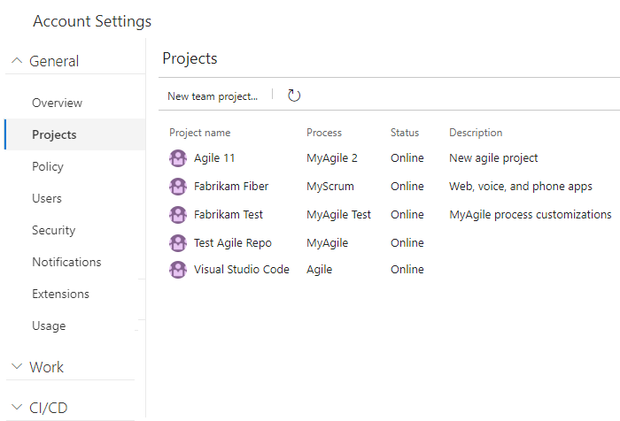

# Add and manage information banners in Azure Devops

[!INCLUDE [version-gt-eq-2019](../../includes/version-gt-eq-2019.md)]

A quick and effective way to communicate with your Azure DevOps users is through information banners. Use banners to alert users to upcoming changes or events without sending out mass emails.  

You can specify one of three types of banners: error, information, and warning. Only one banner, the last one added or updated, is displayed at a time. Banners remain in effect until their expiration date. 

The following image shows how an information message is displayed. Users can cancel the message by selecting **Close** :::image type="icon" source="../../media/icons/close-filter.png" border="false":::. 

:::image type="content" source="media/banners/show-banner-info.png" alt-text="Information banner"::: 

Banners are restricted to a length of thirty words.  Banners are prioritized by level. For example, if you have posted a warning message and an info message, the info message will only be shown after a user closes the warning message, or you delete the warning message. 


## Prerequisites 

::: moniker range="azure-devops"
- To add or manage banners, you must be a member of the **Project Collection Administrators** security group. To get added, see [Change permissions at the organization or collection-level](../security/change-organization-collection-level-permissions.md).
- To manage banners using the Banner Settings extension, you must first install it. See [Banner Settings](https://marketplace.visualstudio.com/items?itemName=ms-eswm.banner-settings-hub) and [Install extensions](../../marketplace/install-extension.md)
- To manage banners using the command line, you must install the Azure DevOps CLI extension as described in [Get started with Azure DevOps CLI](../../cli/index.md).  
	- Sign into Azure DevOps using `az login`.  
	- For the examples in this article, set the default organization using `az devops configure --defaults organization=YourOrganizationURL`.  

::: moniker-end


::: moniker range="< azure-devops"
- To add or manage banners, you must be a member of the **Project Collection Administrators** security group. To get added, see [Change permissions at the organization or collection-level](../security/change-organization-collection-level-permissions.md).
- You must install the free [Banner Settings](https://marketplace.visualstudio.com/items?itemName=ms-eswm.banner-settings-hub) marketplace extension on the project collection where you want to manage banners. See also [Install extensions for on-premises servers](../../marketplace/get-tfs-extensions.md).
::: moniker-end

## Manage banners using the Banner Settings extension 

::: moniker range="azure-devops"
The Banner Settings extension provides a settings pane under **Organization Settings** to add and manage sitewide banners. The extension supports the following features: 
::: moniker-end
::: moniker range="< azure-devops"
The Banner Settings extension provides a settings pane under **Collection Settings** to add and manage sitewide banners. The extension supports the following features: 
::: moniker-end

- Show banners on any page in Azure DevOps
- Choose between three levels of messages: Info, Warning, and Error
- Choose an expiration date for a message
- Include hyperlinks in banners using markdown syntax.

::: moniker range="azure-devops"

### Open Organization settings

To add or delete a banner, open **Organization settings**, scroll down to the **Extensions** section, and choose **Banner**. 

Organization settings configure resources for all projects or the entire organization. For an overview of all organization settings, see [Project collection administrator role and managing collections of projects](about-settings.md#admin).

1. Choose the :::image type="icon" source="../../media/icons/project-icon.png" border="false"::: Azure DevOps logo to open **Projects**, and then choose **Collection settings**.

	> [!div class="mx-imgBorder"]  
	>   

2. Select a service from the sidebar. Settings are organized based on the service they support. Expand or collapse the major sections such as **Boards** and **Pipelines** to choose a page.

	> [!div class="mx-imgBorder"]  
	>  

::: moniker-end

::: moniker range=">= azure-devops-2019 < azure-devops"

### Open Admin settings

To add or delete a banner, open **Admin settings**, scroll down to the **Extensions** section, and choose **Banner**. 

Admin settings configure resources for all projects in a project collection. For an overview of all collection settings, see [Project collection administrator role and managing collections of projects](about-settings.md#admin).

1. Choose the :::image type="icon" source="../../media/icons/project-icon.png" border="false"::: Azure DevOps logo to open **Collections**, and then choose **Admin settings**.

	> [!div class="mx-imgBorder"]  
	>   

::: moniker-end
 
### Add and manage banners 

1. If no banners have been defined, choose **Create a new banner**. 

	::: moniker range="azure-devops"
	:::image type="content" source="media/banners/open-banner-extension-cloud.png" alt-text="Create first banner, on-premises"::: 
	::: moniker-end
	::: moniker range="< azure-devops"
	:::image type="content" source="media/banners/open-banner-extension-on-premises.png" alt-text="Create first banner, on-premises"::: 
	::: moniker-end

1. Enter the banner text into the text box. Choose **Edit more** to change the message level and set the expiration date. 

	:::image type="content" source="media/banners/banner-extension-test-message.png" alt-text="Add test banner message"::: 

1. Choose :::image type="icon" source="media/banners/banner-save-icon.png" border="false"::: **Save** to save your changes.   

::: moniker range="azure-devops"

## Azure CLI admin banner commands 

> [!div class="mx-tdBreakAll"]  
> | Command | Description |
> |--------| -----------|
> | `az devops admin banner add`    | Add a new banner and immediately show it. |
> | `az devops admin banner list`   | List banners. |
> | `az devops admin banner remove` | Remove a banner. |
> | `az devops admin banner show`   | Show details for a banner. |
> | `az devops admin banner update` | Update the message, level, or expiration date for a banner. | 

The following parameters are optional for all commands, and not listed in the examples provided in this article. 

- **detect**: Automatically detect organization. Accepted values: false, true. Default is true.
- **org**: Azure DevOps organization URL. You can configure the default organization using az devops configure -d organization=ORG_URL. Required if not configured as default or picked up via git config. Example: `--org https://dev.azure.com/MyOrganizationName/`. 

## Add a banner

To add a banner, enter the `az devops admin banner add` command. 

> [!div class="tabbedCodeSnippets"]
```azurecli
az devops admin banner add --message
                           [--expiration]
                           [--id]
                           [--type {error, info, warning}]
```

### Parameters 

- **message**: Required. Text string that specifies the banner message to display. Text strings are limited to a maximum of thirty words.
- **expiration**: Optional. Date/time when the banner should no longer be displayed to users. For example, "2019-06-10 17:21:00 UTC", "2019-06-10".
- **ID**: Optional. ID of the banner to update. This identifier is needed to change or remove the message later. A unique identifier is automatically created if one isn't specified.
- **type**: Optional. Type of banner to display. Valid values: **error**, **info**, **warning**. Default is **info**.

### Example 

For example, the following command adds an information banner, which expires on September 4, 2019. When an ID isn't specified, a unique ID is automatically assigned. 

> [!div class="tabbedCodeSnippets"]
```azurecli
az devops admin banner add --message "INFORMATION: Network domain updates will occur on September 3" --expiration  2019-09-04 --type  info
{
  "3d584103-6a94-4f46-8696-f424278da072": {
    "expirationDate": "2019-09-04T00:00:00-07:00",
    "level": "info",
    "message": "INFORMATION: Network domain updates will occur on September 3"
  }
}
```
<a id="list-banners" /> 

## List banners

To determine which banners are defined, enter the `az devops admin banner list` command.

> [!div class="tabbedCodeSnippets"]
```azurecli
az devops admin banner list 
```

### Example: Default json output 

If you don't specify the output, the list displays in json format. For other output format options, see [Output formats for Azure CLI commands](/cli/azure/format-output-azure-cli).

For example, the following command indicates that two banners have been defined. 

> [!div class="tabbedCodeSnippets"]
```azurecli
az devops admin banner list
{
  "04c4d27f-1fee-4f23-9c44-57ed6a9efef8": {
    "level": "info",
    "message": "BANNER-MESSAGE-BANNER-MESSAGE"
  },
  "27f016aa-be13-4e3b-a1da-8b98d239e074": {
    "level": "warning",
    "message": "WARNING - This is a test warning message."
  }
}
```

### Example: Table output 

To list the banners in table format, use the `--output table` command option.  

> [!div class="tabbedCodeSnippets"]
```azurecli
az devops admin banner list 
ID                                    Message                            Type     Expiration Date
------------------------------------  ---------------------------------  -------  -----------------
04c4d27f-1fee-4f23-9c44-57ed6a9efef8  BANNER-MESSAGE-BANNER-MESSAGE      Info
27f016aa-be13-4e3b-a1da-8b98d239e074  WARNING - This is a test warning message. 
```

## Remove a banner

To delete a banner, use the `az devops admin banner remove` command. Specify the banner ID, which you can find by [listing the banners](#list-banners).  

> [!div class="tabbedCodeSnippets"]
```azurecli
az devops admin banner remove --id
```

### Parameters 

- **ID**: Required. ID of the banner to remove.  

### Example 

For example, the following command removes the banner with `id=e090e7b0-4499-4b8f-a09b-1eddf7fdeb44`. No response is returned. 

> [!div class="tabbedCodeSnippets"]
```azurecli
az devops admin banner remove --id e090e7b0-4499-4b8f-a09b-1eddf7fdeb44
```

## List banner details

To list information about a single banner, use the `az devops admin banner show` command. Specify the banner ID, which you can find by [listing the banners](#list-banners).    

> [!div class="tabbedCodeSnippets"]
```azurecli
az devops admin banner show --id
```

### Parameters 

- **ID**: Required. ID of the banner to list details.  

### Example 

Here we list the details for banner with `id=7653f414-3c01-424f-8f84-e51aa99b797c`.  

> [!div class="tabbedCodeSnippets"]
```azurecli
az devops admin banner show --id 7653f414-3c01-424f-8f84-e51aa99b797c
{
  "7653f414-3c01-424f-8f84-e51aa99b797c": {
    "expirationDate": "2019-09-04T07:00:00+00:00",
    "level": "info",
    "message": "Lorem ipsum dolor sit amet, consectetur adipiscing elit. Fusce ac lectus eget erat porttitor dapibus vulputate in ipsum. Etiam id faucibus nisi, at ornare tellus. Curabitur faucibus pharetra orci, id finibus leo iaculis et. Morbi nec felis facilisis, ultricies magna nec, convallis sem. Sed pharetra porta mi eu venenatis. Cras consectetur et dui a accumsan. Maecenas non dolor eu lacus mollis pulvinar. Fusce gravida id lacus sed consequat. Cras tempus ante tincidunt purus rhoncus, at consectetur tellus sollicitudin. Proin sed tellus vel libero maximus ornare. Nullam facilisis, nibh sit amet faucibus rutrum, diam massa ullamcorper purus, sed tempor est erat in sapien. Sed sit amet lectus vel massa facilisis interdum id sit amet nisi. Vestibulum eu purus et mi ultricies consequat. Lorem ipsum dolor sit amet, consectetur adipiscing elit. Vestibulum fermentum mattis rutrum. Nulla hendrerit nibh ut sapien viverra faucibus."
  }
}
```

## Update a banner

You can change the message, type, and expiration of a banner using the `az devops admin banner update` command. 

> [!div class="tabbedCodeSnippets"]
```azurecli
az devops admin banner update --id
                              [--expiration]
                              [--message]
                              [--type {error, info, warning}]
```

### Parameters 

- **ID**: Required. ID of the banner to update.
- **expiration**: Optional. Date/time when the banner should no longer be displayed to users. To unset the expiration for the banner, supply an empty value to this argument, for example, "2019-06-10 17:21:00 UTC", "2019-06-10".
- **message**: Text string that specifies the banner message to display.
- **type**: Optional. Type of banner to display. Valid values: **error**, **info**, **warning**. Default is **info**.

### Example 

For example, the following command updates the message string for the banner and updates the expiration date to the end of the year.  

> [!div class="tabbedCodeSnippets"]
```azurecli
az devops admin banner update --id 7653f414-3c01-424f-8f84-e51aa99b797c --message "Lorem ipsum dolor sit amet, consectetur adipiscing elit. Fusce ac lectus eget erat porttitor dapibus vulputate in ipsum. Etiam id faucibus nisi, at ornare tellus. Curabitur faucibus pharetra orci, id finibus leo iaculis et. Morbi nec felis facilisis, ultricies magna nec, convallis sem. Sed pharetra porta mi eu venenatis. Cras consectetur et dui a accumsan. Maecenas non dolor eu lacus mollis pulvinar. Fusce gravida id lacus sed consequat. Cras tempus ante tincidunt purus rhoncus, at consectetur tellus sollicitudin. Proin sed tellus vel libero maximus ornare. Nullam facilisis, nibh sit amet faucibus rutrum, diam massa ullamcorper purus, sed tempor est erat in sapien. Sed sit amet lectus vel massa facilisis interdum id sit amet nisi. Vestibulum eu purus et mi ultricies consequat. Lorem ipsum dolor sit amet, consectetur adipiscing elit. Vestibulum fermentum mattis rutrum. Nulla hendrerit nibh ut sapien viverra faucibus.   " --expiration  2019-12-31
{
  "7653f414-3c01-424f-8f84-e51aa99b797c": {
    "expirationDate": "2019-12-31T00:00:00-08:00",
    "level": "info",
    "message": "Lorem ipsum dolor sit amet, consectetur adipiscing elit. Fusce ac lectus eget erat porttitor dapibus vulputate in ipsum. Etiam id faucibus nisi, at ornare tellus. Curabitur faucibus pharetra orci, id finibus leo iaculis et. Morbi nec felis facilisis, ultricies magna nec, convallis sem. Sed pharetra porta mi eu venenatis. Cras consectetur et dui a accumsan. Maecenas non dolor eu lacus mollis pulvinar. Fusce gravida id lacus sed consequat. Cras tempus ante tincidunt purus rhoncus, at consectetur tellus sollicitudin. Proin sed tellus vel libero maximus ornare. Nullam facilisis, nibh sit amet faucibus rutrum, diam massa ullamcorper purus, sed tempor est erat in sapien. Sed sit amet lectus vel massa facilisis interdum id sit amet nisi. Vestibulum eu purus et mi ultricies consequat. Lorem ipsum dolor sit amet, consectetur adipiscing elit. Vestibulum fermentum mattis rutrum. Nulla hendrerit nibh ut sapien viverra faucibus.   "
  }
}
```
::: moniker-end

## Related articles

::: moniker range="azure-devops"
- [Get started managing your organization or project collection](../../user-guide/manage-organization-collection.md)
- [About projects and scaling your organization](../projects/about-projects.md) 
- [Get started with Azure DevOps CLI](../../cli/index.md)  
- [az devops admin banner commands](/cli/azure/devops/admin/banner)    
::: moniker-end
::: moniker range="< azure-devops"
- [Get started managing your organization or project collection](../../user-guide/manage-organization-collection.md)
- [About projects and scaling your organization](../projects/about-projects.md)  
::: moniker-end