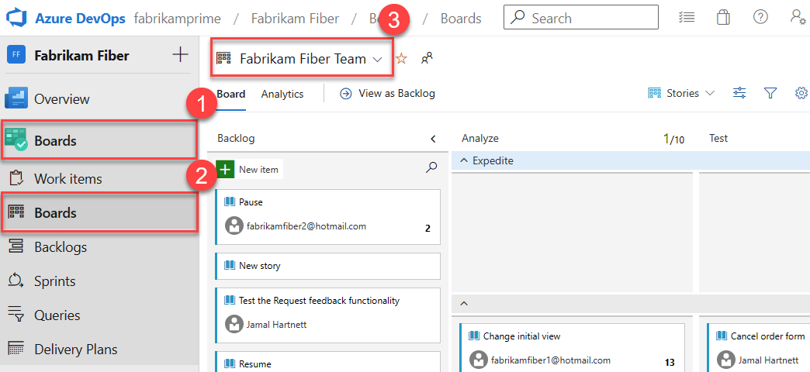
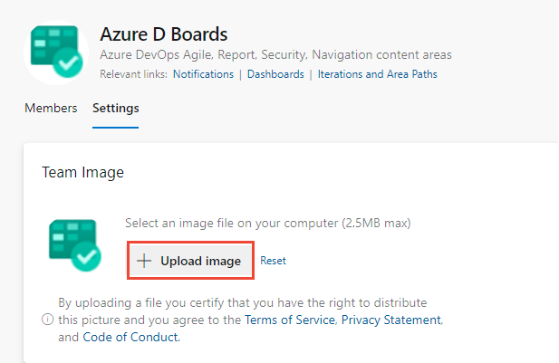

# Manage and configure team tools

[!INCLUDE [temp](../../includes/version-vsts-tfs-all-versions.md)]

As a team administrator, you can customize your backlogs and board to best meet how your team works. If you need to have a team created, request a member of your Project Administrators group do so. It only takes a minute to add a new team.    Team settings are managed by the team administrator role. Users assigned as team administrator can configure and manage all team tools.  

Team administrators should do the following tasks: 
- [Add team members](#add-users-to-a-team)
- [Add another team administrator](#add-an-administrator) 
- [Configure areas and iteration paths](#configure-team-areas-and-iterations)
- [Configure backlogs, boards, and general settings](#configure-team-backlogs)

Also, consider the following optional tasks: 
- [Configure and manage team dashboards](#add-and-manage-team-dashboards)
- [Configure team notifications](#manage-notifications) 

## Prerequisites

- To perform any team configuration task, you need to be added as a team administrator for the team to be modified, or be a member of the [Project Administrator or Project Collection Administrators group](../security/set-project-collection-level-permissions.md).
- To add a team, you must be a member of the [Project Administrator or Project Collection Administrators group](../security/set-project-collection-level-permissions.md). For more information, see [Add teams](add-teams.md).

[!INCLUDE [temp](../../boards/includes/note-configure-customize.md)]

::: moniker range=">= azure-devops-2019"

## Open your team profile

Open your team profile to quickly access items defined for your team.

1. Sign in to your organization (```https://dev.azure.com/{yourorganization}```), and then open your project.
2. Select **Project settings** > **Teams** > your team name.

   :::image type="content" source="media/open-project-settings-teams-cloud.png" alt-text="Screenshot of sequence to open a team.":::

::: moniker-end

## Add users to a team
 
Several tools, such as capacity planning, team alerts, and dashboard widgets, are team-scoped. These tools automatically reference the users that are as members of a team to support planning activities or sending alerts. 

To add users to a team, see [Add users to a project or specific team](../security/add-users-team-project.md).

:::image type="content" source="media/add-team-member.png" alt-text="Screenshot of Add button highlighted, to add team member.":::

All members of a team can favorite team artifacts and define work item templates. For more information, see: 
- [Set personal or team favorites](../../project/navigation/set-favorites.md)
- [Use templates to add and update work items](../../boards/backlogs/work-item-template.md).

If team members don't have access to all the features they want, make sure they have [the permissions needed for those features](../security/set-permissions-access-work-tracking.md).  

## Add an administrator

When you add a team to a project, a Project Administrator should [add one or more team administrators](add-team-administrator.md). 

:::image type="content" source="media/add-administrator.png" alt-text="Screenshot of Add button highlighted, to add an administrator.":::

## Configure team areas and iterations 

Many Agile tools depend on the area and iteration paths that are configured for the team. To learn more about configuring team areas and iterations, see [About teams and Agile tools](about-teams-and-settings.md). 

Once project administrators [add area paths](set-area-paths.md) and [iteration paths](set-iteration-paths-sprints.md) for a project, team administrators can select the area and iteration paths associated with their team. These settings affect many Agile tools available to the team. 

:::image type="content" source="media/manage-iterations-areas.png" alt-text="Screenshot of Iterations and areas highlighted.":::

Settings include making the following associations for each team:  

- **Select team Area Paths**   
	Can select the default area path(s) associated with the team. These settings affect many Agile tools available to the team.	
- **Select team Iteration Paths or sprints** 
	Can select the default area path(s) associated with the team. These settings affect many Agile tools available to the team. 
 
For more information, see [Define area paths and assign to a team](set-area-paths.md) and 
[Define iteration paths and configure team iterations](set-iteration-paths-sprints.md). 

<a id="configure-team-backlogs" />

## Configure team backlogs, boards, and general settings 

Team administrators can choose which backlog levels are active for a team. For example, a feature team may choose to show only the product backlog and a management team may choose to show only the feature and epic backlogs. Also, administrators can choose whether bugs are treated similar to user stories and requirements or as tasks. 

Team administrators can also choose which days are non-working days for the team. Sprint planning and tracking tools automatically consider days off when calculating capacity and sprint burndown.   

You can configure most of your team settings from the common configuration dialog. 

> [!NOTE]
> The common configuration Settings dialog is available for TFS 2015.1 and later versions.  

[!INCLUDE [temp](../../boards/includes/setup-backlogs-boards.md)]

::: moniker range="azure-devops"

1. Check that you selected the correct project, and then choose **Boards** > **Boards**, and select the correct team from the team selector dropdown menu. For more information, see [Use breadcrumbs and selectors to navigate and open artifacts](../../project/navigation/use-breadcrumbs-selectors.md).
   :::image type="content" source="media/open-kanban-board-cloud.png" alt-text="Screenshot of steps to open the kanban board.":::

2. Choose **Team settings** :::image type="icon" source="../../media/icons/blue-gear.png" border="false"::: to configure the board and set general team settings.  

   :::image type="content" source="media/general-board-settings-cloud.png" alt-text="Screenshot of gear icon selection for general board settings.":::

3. Choose a tab under any of the sections&mdash;**Cards, Board**, **Charts**, and **General**&mdash;to configure the cards or boards, the cumulative flow chart, or other team settings. When you're done configuring the settings, select **Save and close**.   

	:::image type="content" source="media/team-settings-page.png" alt-text="Screenshot of team settings page.":::

::: moniker-end

::: moniker range=" azure-devops-2019 || azure-devops-2020"

1. Check that you selected the right project, (2) choose **Boards** > **Boards**, and then (3) select the correct team from the team selector menu.

	> [!div class="mx-imgBorder"]
	> 

2. Make sure that you select the team backlog or board that you want to configure using the team selector. To learn more, see [Use breadcrumbs and selectors to navigate and open artifacts](../../project/navigation/use-breadcrumbs-selectors.md). 

3. Choose the product or portfolio backlog from the board-selection menu. 
	> [!div class="mx-imgBorder"]
	> 

4. Choose **Team settings** :::image type="icon" source="../../media/icons/blue-gear.png" border="false"::: to configure the board and set general team settings.  

	> [!div class="mx-imgBorder"]
	>   

5. Choose a tab under any of the sections&mdash;**Cards, Board**, **Charts**, and **General**&mdash;to configure the cards or boards, the cumulative flow chart, or other team settings.   

	> [!div class="mx-imgBorder"]
	> 

::: moniker-end  

::: moniker range=">= tfs-2017 <= tfs-2018"

1. Make sure that you select the team from the project/team selector. You can switch your team focus to one that you've recently viewed from the project/team selector. If you don't see the team or project you want, choose **Browse&hellip;** or choose **Azure DevOps** :::image type="icon" source="../../media/icons/project-icon.png" border="false"::: to [access the **Projects** page](../../project/navigation/work-across-projects.md).  

	

2. Open **Work** > **Backlogs** > **Board**. 

	> [!div class="mx-imgBorder"]
	>  

3. Choose the board you want to configure and then choose **Team settings** :::image type="icon" source="../../media/icons/team-settings-gear-icon.png" border="false"::: to configure the board and set general team settings.  
 
	For example, from the Kanban board ...  

	> [!div class="mx-imgBorder"]
	> 

4. Choose a tab under **Cards** or **Board** to configure the cards and Kanban board columns and swimlanes.  

	> [!div class="mx-imgBorder"]  
	> ![Common configuration dialog team settings]../.../boards/boards/media/customize-cards/common-config-141.png)

::: moniker-end  

::: moniker range="<= tfs-2015"

1. Make sure that you select the team from the project/team selector. You can switch your team focus to one that you've recently viewed from the project/team selector. If you don't see the team or project you want, choose **Browse&hellip;** or choose **Settings** :::image type="icon" source="../../media/icons/project-icon.png" border="false"::: to [access the **Projects** page](../../project/navigation/work-across-projects.md).  

	

2. Open **Work** > **Backlogs** > **Board**. 

	> [!div class="mx-imgBorder"]
	>  

3. Choose the board you want to configure and then choose **Team settings** :::image type="icon" source="../../media/icons/team-settings-gear-icon.png" border="false"::: to configure the board and set general team settings.  

	For example, from the Kanban board ...  

	


4. Choose a tab under **Cards** or **Board** to configure the cards and Kanban board columns and swimlanes.  

	

::: moniker-end  

Team administrators can fully customize the team's Kanban boards associated with the product and portfolio backlogs. You configure a Kanban board by first defining the columns and WIP limits from the common configuration dialog. For guidance, see [Kanban basics](../../boards/boards/kanban-basics.md).  
For more information on each configuration option, see the following articles: 

---
:::row:::
   :::column span="1":::
      **General**
      - [Backlogs](select-backlog-navigation-levels.md)
      - [Working days](set-working-days.md)
      - [Working with bugs](show-bugs-on-backlog.md)
            
            
      **Cards**
      ::: moniker range=">= tfs-2017"
      - [Add fields](../../boards/boards/customize-cards.md)
      - [Define styles](../../boards/boards/customize-cards.md#define-style-rules-to-highlight-cards)
      - [Add tag colors](../../boards/boards/customize-cards.md#color-code-tags)
      - [Enable annotations](../../boards/boards/customize-cards.md#enable-annotations)
      - [Configure inline tests](../../boards/boards/customize-cards.md#configure-inline-tests)
      ::: moniker-end
      ::: moniker range="< tfs-2017"
      - [Add fields](../../boards/boards/customize-cards.md)
      - [Define styles](../../boards/boards/customize-cards.md#define-style-rules-to-highlight-cards)
      - [Add tag colors](../../boards/boards/customize-cards.md#color-code-tags)
      ::: moniker-end
   :::column-end:::
   :::column span="1":::
      **Boards**
      ::: moniker range=">= azure-devops-2019"
      - [Add columns](../../boards/boards/add-columns.md)  
      - [Split columns](../../boards/boards/split-columns.md)    
      - [WIP limits](../../boards/boards/wip-limits.md)    
      - [Definition of Done](../../boards/boards/definition-of-done.md)   
      - [Add swimlanes](../../boards/boards/expedite-work.md)
      - [Card reordering](../../boards/boards/reorder-cards.md)
      - [Configure status badges](../../boards/github/configure-status-badges.md)
      ::: moniker-end
      ::: moniker range=">= tfs-2015 <= tfs-2018"
      - [Add columns](../../boards/boards/add-columns.md)
      - [Split columns](../../boards/boards/split-columns.md)    
      - [WIP limits](../../boards/boards/wip-limits.md)    
      - [Definition of Done](../../boards/boards/definition-of-done.md)  
      - [Add swimlanes](../../boards/boards/expedite-work.md)
      - [Card reordering](../../boards/boards/reorder-cards.md)
      ::: moniker-end
      ::: moniker range="tfs-2013"
      - [Add columns](../../boards/boards/add-columns.md)
      - [WIP limits](../../boards/boards/wip-limits.md)    
      - [Definition of Done](../../boards/boards/definition-of-done.md)   
      ::: moniker-end
            
            
      **Chart**
      - [Configure cumulative flow chart](../../report/dashboards/cumulative-flow.md)
   :::column-end:::
:::row-end:::
---
 
**Kanban board**

:::image type="content" source="../../boards/boards/media/quickstart/intro-view.png" alt-text="Screenshot of Kanban.":::

::: moniker range=">= tfs-2015" 

## Configure sprint Taskboards 

::: moniker-end

::: moniker range=">= azure-devops-2020" 

Similar to Kanban boards, each sprint Taskboard can be customized to support information-rich, color-coded cards as well as addition of customized columns. For details, see [Customize sprint Taskboards](../../boards/sprints/customize-taskboard.md). 

::: moniker-end

::: moniker range=">= tfs-2015 < azure-devops-2020" 

Similar to Kanban boards, each sprint Taskboard can be customized to support information-rich, color-coded cards. For details, see [Customize sprint Taskboards](../../boards/sprints/customize-taskboard.md). 

::: moniker-end

:::image type="content" source="media/configure-sprint-taskboard.png" alt-text="Screenshot of Taskboard selection.":::

::: moniker range=">= tfs-2017" 

## Add and manage team dashboards   

::: moniker-end

::: moniker range=">= azure-devops-2019"
By default, all team members can add and edit team dashboards. In addition, team administrators can manage permissions for team dashboards. For details, see [Add and manage dashboards](../../report/dashboards/dashboard-permissions.md#set-permissions).  
::: moniker-end  

::: moniker range=">= tfs-2017 <= tfs-2018"  
Team administrators can add, configure, and manage permissions for team dashboards. For details, see [Add and manage dashboards](../../report/dashboards/dashboard-permissions.md#set-permissions).   

::: moniker-end

:::image type="content" source="media/edit-team-dashboard.png" alt-text="Screenshot of team dashboard.":::

<a id="team-description" />

## Update team name, description, and image

::: moniker range="azure-devops"

Team settings also include the team name, description, and team profile image. To add a team picture, select the image icon. The maximum file size is 2.5 MB.

:::image type="content" source="media/update-team-profile-cloud.png" alt-text="Screenshot of team details and profile pic update screen.":::

::: moniker-end

::: moniker range=" azure-devops-2020"

Team settings also include the team name, description, and team profile image. To add a team picture, select the image icon. The maximum file size is 2.5 MB.



::: moniker-end

::: moniker range="<= azure-devops-2019"

Team settings also include the team name, description, and team profile image. To add a team picture. Open the Team Profile and choose the picture icon. The maximum file size is 4 MB.

::: moniker-end

## Manage notifications 

Team administrators can add and modify alerts so that the team can receive email notifications as changes occur to work items, code reviews, source control files, and builds. Many alerts are defined for each team. For details, see [Manage team alerts](../../notifications/manage-team-group-global-organization-notifications.md).

:::image type="content" source="media/manage-notifications.png" alt-text="Screenshot of highlighted Notifications button.":::

<a id="team-rooms" />

::: moniker range=">= tfs-2015 <= tfs-2017"

## Manage team rooms 

Team administrators can add users and events to team rooms, and add team rooms. Team rooms are chat rooms limited to team members. For details, see [Collaborate in a team room](/previous-versions/azure/devops/notifications/collaborate-in-a-team-room).  

> [!NOTE]  
> Team rooms are deprecated for TFS 2018 and later versions as described in [Deprecation of team rooms](https://blogs.msdn.microsoft.com/devops/2017/01/04/deprecation-of-the-team-rooms-in-team-services-and-tfs/) blog post. Several good solutions are available that integrate well with TFS that support notifications and chat, such as [Microsoft Teams](../../service-hooks/services/teams.md) and [Slack](../../service-hooks/services/slack.md).   

::: moniker-end

## Related articles

- [About projects and scaling your organization](../projects/about-projects.md)
- [About teams and Agile tools](about-teams-and-settings.md)  
- [Add teams](add-teams.md) 
- [Add a team administrator](add-team-administrator.md)
