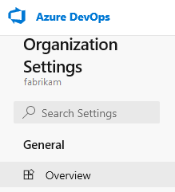
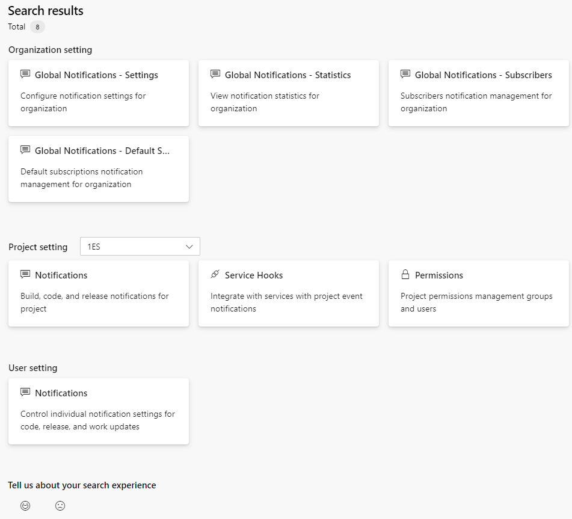

# Search organization settings

[!INCLUDE [temp](../../includes/version-vsts-only.md)]

The preview feature, **New Settings Search in the organization settings panel**, enables a search box for searching within **Organization Settings**. To enable this feature, see [Manage or enable preview features](../../project/navigation/preview-features.md).  

## Perform a search

Enter a keyword to search all settings within your organization. For example, here we search on **Notifications**.  

> [!div class="mx-imgBorder"]  
> 

Search results return findings with links to the settings. Settings include Organization, project, and user. 

> [!div class="mx-imgBorder"]  
> 

To navigate to one of the settings listed, choose the card in which it appears. 

## Keywords

Each setting is tagged with a number of keywords. These keywords capture the level of setting, such as organization, project, or user, as well as other categories. Entering a keyword with any part of a setting label or description should return it within the results. 

## Related articles

- [About settings](about-settings.md)

 