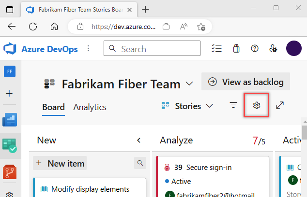
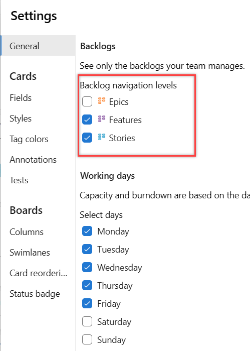

# Select backlog navigation levels

[!INCLUDE [version-lt-eq-azure-devops](../../includes/version-lt-eq-azure-devops.md)]  

Each team can select and configure the backlog levels that fit their needs.
For example, feature teams might focus on the product backlog, while management teams might enable both the feature and epic backlogs.
Configure these backlog levels through team settings to match your team's workflow.

To add more portfolio backlogs, see the following articles based on your process model:
- **Inheritance**: [Customize your backlogs or boards for a process](work/customize-process-backlogs-boards.md)
- **On-premises XML**: [Add portfolio backlogs](../../reference/add-portfolio-backlogs.md)

For an overview of process models, see [Customize your work tracking experience](../../reference/customize-work.md).

## Prerequisites

[!INCLUDE [temp](includes/prerequisites-team-settings.md)]

## Set your team's preferences for backlog levels

This setting affects the backlog and board views for all team members, ensuring a consistent experience across the team.
You can modify this setting from either the backlog or board view.
The following steps show how to adjust the setting from the board view.

1. Sign in to your organization (`https://dev.azure.com/{yourorganization}`).
1. Select **Boards**, and then open your board.
1. Select :::image type="icon" source="../../media/icons/gear-icon.png" border="false"::: **Configure team settings**.

	> [!div class="mx-imgBorder"]
	> 

1. Select the checkboxes for the backlog levels you want your team to manage.

	

1. Select **Save**.
1. To verify the changes, open or refresh your team's [backlog](../../boards/backlogs/create-your-backlog.md).

## Related content

- [Get started with Agile tools to plan and track work](../../boards/get-started/what-is-azure-boards.md)
- [Create your backlog](../../boards/backlogs/create-your-backlog.md)
- [Define features and epics](../../boards/backlogs/define-features-epics.md)
- [Organize your backlog](../../boards/backlogs/organize-backlog.md)
