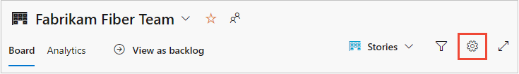
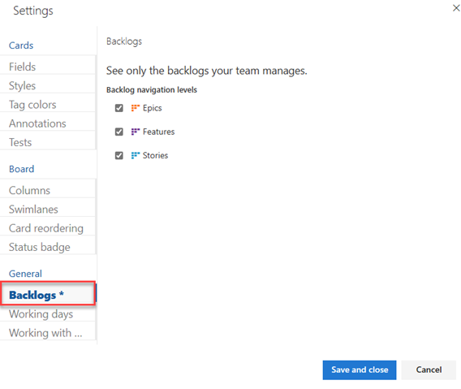

# Select backlog navigation levels for your team

[!INCLUDE [version-lt-eq-azure-devops](../../includes/version-lt-eq-azure-devops.md)]  

Teams have the flexibility to choose their preferred backlog levels. Feature teams may focus on their product backlog, while management teams may only display feature and epic backlogs (the default portfolio backlogs). You can configure backlog levels through team settings. 

::: moniker range=">= azure-devops-2019" 
If you need more portfolio backlogs, see the following articles based on the process model you use: 
- **Inheritance**: [Customize your backlogs or boards for a process](work/customize-process-backlogs-boards.md)  
- **On-premises XML**: [Add portfolio backlogs](../../reference/add-portfolio-backlogs.md).  

For an overview of process models, see [Customize your work tracking experience](../../reference/customize-work.md).
::: moniker-end

::: moniker range="< azure-devops-2019" 
If you need more portfolio backlogs, see [Add portfolio backlogs](../../reference/add-portfolio-backlogs.md).  
::: moniker-end

[!INCLUDE [temp](includes/prerequisites-team-settings.md)]

## Set your team's preferences for backlog levels

This setting impacts the backlog and board views for all team members. You have the option to modify the setting from either the backlog or board view. In this article, we show you from the board view.

::: moniker range=">= azure-devops-2019" 

1.  [Open your Kanban board](../../boards/boards/kanban-quickstart.md).

2. Select **Configure team settings** :::image type="icon" source="../../media/icons/blue-gear.png" border="false"::: to configure the board and set general team settings.  

	> [!div class="mx-imgBorder"]
	>   

3. Choose **Backlogs** and check the boxes of those backlog levels you want your team to manage. 

	  

4. When you're done with your changes, choose **Save and close**.  

5. To see the changes, open or refresh your team's [backlog](../../boards/backlogs/create-your-backlog.md). 

::: moniker-end  

::: moniker range="tfs-2018" 

1. [Open your Kanban board](../../boards/boards/kanban-quickstart.md). If you're not a team admin, [get added as one](add-team-administrator.md). Only team and project admins can customize the Kanban board.

2. Select **Configure team settings** :::image type="icon" source="../../media/icons/gear-icon.png" border="false"::: to open the  settings dialog.  

	> [!div class="mx-imgBorder"]
	>   

2. Choose **Backlogs** and check the boxes of those backlog levels you want your team to manage. 

	  

3. When you're done with your changes, choose **Save**.  

4. To see the changes, open or refresh your team's [backlog](../../boards/backlogs/create-your-backlog.md). 

::: moniker-end

## Related articles

- [Get started with Agile tools to plan and track work](../../boards/get-started/what-is-azure-boards.md)
- [Backlogs, boards, and plans](../../boards/backlogs/backlogs-boards-plans.md)
- [Create your backlog](../../boards/backlogs/create-your-backlog.md)  
- [Define features and epics](../../boards/backlogs/define-features-epics.md)
- [Organize your backlog](../../boards/backlogs/organize-backlog.md)   
