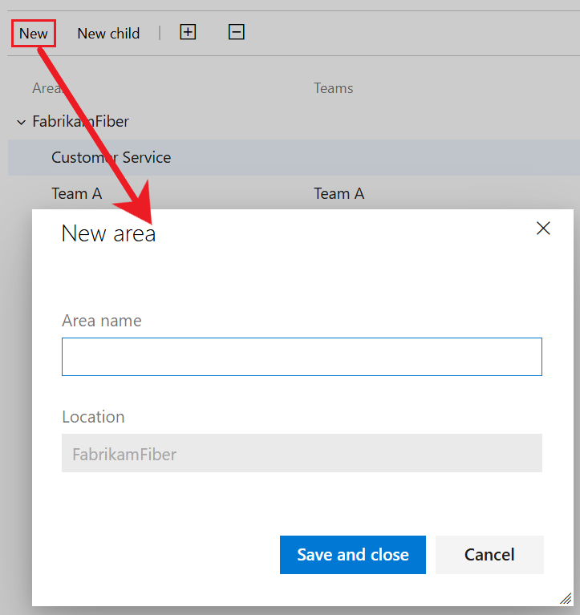

# Define area paths and assign to a team

[!INCLUDE [version-lt-eq-azure-devops](../../includes/version-lt-eq-azure-devops.md)]

Add area paths to organize teams and group work items by product, feature, or business areas. Assigning area paths to teams ensures that work items under those paths appear on the respective team's backlogs and boards. By default, all work items are assigned to the root area path and appear in the project's default team.

After you define area paths at the project level, assign them to teams within the team configuration. You can also create a hierarchical structure of area paths to support subareas, with up to 14 levels deep.

[!INCLUDE [temp](../../boards/includes/list-area-dependent-tools-tasks.md)] 

To understand how the system uses area paths, see [About area and iteration paths](about-areas-iterations.md).

## Prerequisites

| Category | Requirements |
|--------------|-------------|
|**Permissions**|- To set team area or iteration paths: [Team administrator](add-team-administrator.md) or a member of the [Project Administrators](../security/change-project-level-permissions.md) group. By default, the user who created the project has these permissions.<br>- To add an area path under the root node or edit or delete any child node: Member of the [Project Administrators](../security/change-project-level-permissions.md) group.<br>- To add, edit, and manage area paths under a node: One or more of the following permissions set to **Allow**:<br>- **Create child nodes**<br>- **Delete this node**<br>- **Edit this node**<br>- **View permissions in this node**|

For more information, see [Set permissions and access for work tracking](../security/set-permissions-access-work-tracking.md#set-permissions-area-path).

For naming restrictions on area paths, see [About areas and iterations, Naming restrictions](about-areas-iterations.md#naming-restrictions).

## Get started

Each team has access to various Agile tools, as described in [About teams and Agile tools](about-teams-and-settings.md). These tools reference the team's default area paths. Most teams use one area path and several iteration paths for work tracking, but teams can also use multiple area paths on their backlogs and boards to support different scenarios.

New projects include a single root area corresponding to the project name and a default team with the same name assigned to this root area path.

If you're new to managing projects and teams, follow these steps to configure your project and teams:

1. **Define area paths**: Determine the number and names of area paths needed to categorize your work. Add at least one area path per team. For more information, see [About areas and iterations](about-areas-iterations.md).
1. **Define teams**: Decide the number and names of teams required. For more information, see [About teams and Agile tools](about-teams-and-settings.md).
1. **Configure area paths**: Go to **Project settings** > **Project configuration** > **Areas** and define the area paths for your project. Follow the steps in [Add area paths](#add-an-area-path).
1. **Create teams**: Create the necessary teams based on step 2. For more information, see [Add a team, move from one default team to several teams](add-teams.md).
1. **Assign area paths to teams**: In the team configuration, assign the default and other area paths to each team. Do the steps in [Set team default area paths](#set-team-area-paths).
1. **Assign area paths to work items**: Assign work items to the defined area paths using [bulk modify](../../boards/backlogs/bulk-modify-work-items.md) to update multiple items at once.

> [!NOTE]
> Assigning the same area path to multiple teams may cause conflicts over work item ownership. For more information, see [Limitations of multi-team board views](../../boards/boards/kanban-overview.md).

As needed, you can do the following actions at any time:

- Add other child nodes
- Rename an area path (except the root area path)
- Move a child node under another node
- Delete a child node
- Rename a team
- Change the area path assignments made to a team

## List project areas

To list project areas, do the following steps:

#### [Browser](#tab/browser/)

From your web portal, select (1) **Project settings** > (2) **Project configuration** > (3) **Areas**.

> [!div class="mx-imgBorder"]  
> 

#### [Azure DevOps CLI](#tab/azure-devops-cli)

::: moniker range="azure-devops"

[List project area paths](#list-project-areas) | [Add a project area path](#add-an-area-path) | [List team areas paths](#list-team-area-paths) | [Set team area paths](#set-team-area-paths) | [Rename or move a project area path](#rename-or-move-an-area-path) | [Remove area path from a team](#remove-an-area-path-from-a-team)

You can list the area paths defined for a project using [az boards area project list](/cli/azure/boards/area/project#az-boards-area-project-list). To get started, see [Get started with Azure DevOps CLI](../../cli/index.md).  

> [!div class="tabbedCodeSnippets"]
```azurecli
az boards area project list [--depth]
                            [--path]
                            [--project]
```

#### Parameters 

- **depth**: Optional. Depth of child nodes to be listed. Example: `--depth 3`. When not specified, only the top-level area paths are returned.
- **path**: Optional. Absolute path of an area. `\Area\` must follow after the `\ProjectName`, which distinguishes this path from an iteration path. For example, `--path \ProjectName\Area\AreaName`. If spaces are used within a node, then enclose in double-quotes, for example, `--path "\Fabrikam Fiber\Area\Service Delivery\Performance"`. When not specified, lists area paths from the root level.  
- **project**: Optional. Name or ID of the project. Example: `--project "Fabrikam Fiber"`. 


#### Example

For example, the following command lists the area paths to a depth of 3 for the Fabrikam Fiber project. For other output format options, see [Output formats for Azure CLI commands](/cli/azure/format-output-azure-cli).

> [!div class="tabbedCodeSnippets"]
```azurecli
az boards area project list --depth 3 --project 'Fabrikam Fiber' --output table
ID     Identifier                            Name                Path                                                Has Children
-----  ------------------------------------  ------------------  --------------------------------------------------  --------------
55302  91d8644a-e430-4fd0-aa95-742ea98770a3  Fabrikam Fiber      \Fabrikam Fiber\Area                                True
55373  26be05fd-e68a-4fcb-833f-497f6bee45f2  Service Delivery    \Fabrikam Fiber\Area\Service Delivery               True
55303  637dc203-0549-4415-9663-b6358ac27d21  Internet            \Fabrikam Fiber\Area\Service Delivery\Internet      False
55306  3f2067f9-684f-4121-8004-4a4745198b39  Voice               \Fabrikam Fiber\Area\Service Delivery\Voice         False
55372  4afc9ede-db1d-4703-8be6-95899b99be44  Email               \Fabrikam Fiber\Area\Service Delivery\Email         False
55381  f96d4738-c67e-42d0-bd4e-99f6b3fdeb22  Service Status      \Fabrikam Fiber\Area\Service Delivery\Service S...  False
55384  3a0c1189-6454-4ccd-9354-d72b653b7f74  TV                  \Fabrikam Fiber\Area\Service Delivery\TV            False
55380  4ea27e90-248c-41a0-8d11-eace6c9fd90e  Account Management  \Fabrikam Fiber\Area\Account Management             True
55382  4235f40d-753b-49dd-868f-82372065ec83  Shopping Cart       \Fabrikam Fiber\Area\Account Management\Shoppin...  False
55383  49d34650-6c65-446c-aff6-79edd3a21a75  Customer Profile    \Fabrikam Fiber\Area\Account Management\Custome...  False
```
::: moniker-end

[!INCLUDE [temp](../../includes/note-cli-not-supported.md)]

---

## Add an area path

Only one root area is defined by default. Add new and child area paths under the root area path for the project, or as a child to another area path or team. New area paths are added to the root node by default.

> [!div class="mx-imgBorder"]  
> 

You can also add new and child area paths to a team. For more information, see [Set team area paths](#set-team-area-paths).

#### [Browser](#tab/browser/)

To add a new area path, do the following steps:

1. Highlight the area path and then choose **New child**. Optionally, you can select:::image type="icon" source="../../media/icons/actions-icon.png" border="false"::: for an area path and choose **New**, or select the **New** menu item at the top of the area list.

1. Enter a name (255 characters or less) for the node. For more name restrictions, see [About areas and iterations, Naming restrictions](about-areas-iterations.md#naming-restrictions).

    > [!div class="mx-imgBorder"]  
    >  

1. Select **Save and close**

All new areas are added as a child node to the root area path.

To add a child area path, do the following steps:

1. Highlight the area path and then choose **New child**. Optionally, you can select:::image type="icon" source="../../media/icons/actions-icon.png" border="false"::: for the area path and choose **New child** or select **New child** from the menu at the top of the area list.  

1. Enter a name (255 characters or less) for the node. For more name restrictions, see [About areas and iterations, Naming restrictions](about-areas-iterations.md#naming-restrictions). 

    > [!div class="mx-imgBorder"]  
    >  

1. Select **Save and close**

You can also add area paths to a team on the **Team configuration** > **Areas** page.

#### [Azure DevOps CLI](#tab/azure-devops-cli)

::: moniker range="azure-devops"

You can add area paths to a project using [az boards area project create](/cli/azure/boards/area/project#az-boards-area-project-create). To get started, see [Get started with Azure DevOps CLI](../../cli/index.md). 

If you specify the `--path` parameter, the new area path is added as a child node to the specified path. If you don't specify the `--path` parameter, the new area path is added as a child node to the root node.

> [!div class="tabbedCodeSnippets"]
```azurecli
az boards area project create --name
                              [--path]
                              [--project]
```

#### Parameters

- **name**: Required. Area path name. 
- **path**: Optional. Absolute path of an area. Example: --path \ProjectName\Area\AreaName. When not specified, adds an area at the root level.
- **project**: Optional. Name or ID of the project. Example: `--project "Fabrikam Fiber"`.  

#### Example: JSON format

For example, the following command adds the Voice area path to the Fabrikam Fiber project at the root node.  

> [!div class="tabbedCodeSnippets"]
```azurecli
az boards area project create --name Voice --project "Fabrikam Fiber"
{
  "attributes": null,
  "children": null,
  "hasChildren": false,
  "id": 55412,
  "identifier": "b00f86a2-3d49-4ad2-af01-da2537947baa",
  "name": "Voice",
  "path": "\\Fabrikam Fiber\\Area\\Voice",
  "structureType": "area",
  "url": "https://dev.azure.com/fabrikam/56af920d-393b-4236-9a07-24439ccaa85c/_apis/wit/classificationNodes/Areas/Voice"
}
```

#### Example: Table format

And, here's the same command with the table output format. 

> [!div class="tabbedCodeSnippets"]
```azurecli
az boards area project create --name Voice --project "Fabrikam Fiber" --output table
ID     Identifier                            Name    Path                         Has Children
-----  ------------------------------------  ------  ---------------------------  --------------
55413  3c16691b-160c-4498-ab42-aa77b7f354fc  Voice  \Fabrikam Fiber\Area\Voice  False
```

::: moniker-end

[!INCLUDE [temp](../../includes/note-cli-not-supported.md)]

---

## List team area paths  

You set team defaults from team settings. If you're not a team administrator, [get added as one](add-team-administrator.md). Only team or project administrators can change team settings. 

#### [Browser](#tab/browser/)

1. Open your project, and then select **Project settings** > **Team configuration** > **Areas**.

   

1. If you need to switch the team context, use the team selector within the breadcrumbs.

    > [!div class="mx-imgBorder"]  
    > 

#### [Azure DevOps CLI](#tab/azure-devops-cli)

::: moniker range="azure-devops"

You can list the area paths defined for a team using [az boards area team list](/cli/azure/boards/area/team#az-boards-area-team-list). To get started, see [Get started with Azure DevOps CLI](../../cli/index.md).  

> [!div class="tabbedCodeSnippets"]
```azurecli
az boards area team list --team
                         [--project] 
```

#### Parameters

- **team**: Required. Name or ID of the team.
- **project**: Optional. Name or ID of the project. Example: `--project "Fabrikam Fiber"`.  

For example, the following command lists the area paths for the Service Delivery team. For other output format options, see [Output formats for Azure CLI commands](/cli/azure/format-output-azure-cli)

> [!div class="tabbedCodeSnippets"]
```azurecli
az boards area team list --team "Service Delivery" --project "Fabrikam Fiber" --output table
Area                             Include sub areas    Is Default
-------------------------------  -------------------  ------------
Fabrikam Fiber\Service Delivery  True                 True
```

::: moniker-end

[!INCLUDE [temp](../../includes/note-cli-not-supported.md)]

---

## Open team settings from the team profile 

You define both areas and iterations from **Project Settings > Team configuration**. You can quickly navigate to it from a team work tracking backlog, board, or dashboard. 

1. Open a backlog or board for a team and choose **Team profile** :::image type="icon" source="../../media/icons/team.png" border="false"::: > **Team Settings**. 

   Here we open the Board for the Fabrikam Fiber team and from there the team profile. 

   > [!div class="mx-imgBorder"]  
   >   

1. Choose **Iterations and areas**. 

    > [!div class="mx-imgBorder"]  
    >    

1. If you need to switch the team context, use the team selector within the breadcrumbs.

    > [!div class="mx-imgBorder"]  
    > 

## Set team area paths

All work items that are assigned to a team area path appear on the backlogs and boards for that team. You can select one or more area paths and optionally include their subarea paths. Choose to include subarea paths when you want to support rollup views of work done across several teams or areas.

> [!NOTE]  
> Teams can be assigned a maximum of 300 **Area Paths**. For more information, see [Work tracking, process, and project limits](work/object-limits.md). 

The default area path determines the default area path assigned to work items that are created from the team context.  

> [!IMPORTANT]  
> Work items that appear on more than one team's board can yield query results that don't meet your expectations. Because each team can customize the board [columns](../../boards/boards/add-columns.md) and [swimlanes](../../boards/boards/expedite-work.md), the values assigned to work items which appear on different boards may not be the same. The primary work around for this issue is to maintain single ownership of work items by team area path.   

#### [Browser](#tab/browser/)

::: moniker range=">= azure-devops-2020"  

You can select existing area paths or create new or child area paths from the team settings. 

1. Select **Project settings** > **Team configuration** > **Areas**.  
1. Select the team you want to configure from the drop-down list at the top of the page.

   Here, we show the Areas for the Fabrikam Fiber team.  

   > [!div class="mx-imgBorder"]
   > 

1. Choose one or more area paths to be active for the team.  

    > [!div class="mx-imgBorder"]
    >   

    In this instance, we choose to activate the subarea paths for the project. The management team can now track progress across all teams.  

      

1. When you finish, refresh the product backlog page for the team, and you see those work items assigned to the team. Add area path to the columns shown to see the assignments made to work items.

   

   

::: moniker-end  

::: moniker range=" azure-devops-2019"  

1. Open **Areas** for the team context.  

   Here, we show the Areas for the Fabrikam Fiber team.  

   > [!div class="mx-imgBorder"]
   > 

1. Choose one or more area paths to be active for each team.  

    > [!div class="mx-imgBorder"]
    >   

    In this instance, we choose to activate all three subarea paths for the project. The management team can now track progress across all three teams.  

      

1. When you finish, refresh the product backlog page for the team, and you see those work items assigned to the team. Add area path to the columns shown to see the assignments made to work items.  

   > [!div class="mx-imgBorder"]  
   >   

::: moniker-end  

#### [Azure DevOps CLI](#tab/azure-devops-cli)

::: moniker range="azure-devops"

You can set the default area path for a team or add an area path, using [az boards area team add](/cli/azure/boards/area/team#az-boards-area-team-add). To get started, see [Get started with Azure DevOps CLI](../../cli/index.md). 

> [!div class="tabbedCodeSnippets"]
```azurecli
az boards area team add --path  --team
                        [--include-sub-areas {false, true}]
                        [--project]
                        [--set-as-default]
```

#### Parameters

- **path**: Required. Absolute path of an area. Example: `--path \ProjectName\AreaName`. 
- **team**: Required. Name or ID of the team.
- **include-sub-areas**: Optional. Include child nodes of the area path. Accepted values: false, true. 
- **project**: Optional. Name or ID of the project. Example: `--project "Fabrikam Fiber"`.  
- **set-as-default**: Optional. Specify as the default area path for the team. Default: False.

#### Example

For example, the following command adds the Voice area path to the Voice team for the Fabrikam Fiber project, sets it as the default and to include subareas. 

> [!div class="tabbedCodeSnippets"]
```azurecli
az boards area team add --path "\Fabrikam Fiber\Voice" --team Voice --project "Fabrikam Fiber" --include-sub-areas --set-as-default --include-sub-areas true --output table
Area                                   Include sub areas    Is Default
-------------------------------------  -------------------  ------------
Fabrikam Fiber\Service Delivery\Voice  False                False
Fabrikam Fiber\Voice                   True                 True
```
::: moniker-end

[!INCLUDE [temp](../../includes/note-cli-not-supported.md)]

---

## Rename or move an Area Path

The system automatically updates work items and queries that reference your updated area path. Each **Area Path** is associated with a unique GUID.  

#### [Browser](#tab/browser/)

1. To rename an **Area Path**, open the web portal **Project settings>Project configuration>Areas** page.

1. Choose the :::image type="icon" source="../../media/icons/actions-icon.png" border="false"::: context menu for the node, and select **Edit**.  

    :::image type="content" source="media/areas/edit-area-rename-project-configuration.png" alt-text="Screenshot of open context menu for an Area Path node, choose Edit option.":::

1. In the dialog that opens, enter the new name.

    :::image type="content" source="media/areas/edit-area-rename-dialog.png" alt-text="Screenshot of Edit area dialog.":::

1. To move the node within the hierarchy, change the **Location** field.

	> [!NOTE]
	> When you rename or change the **Location** field for a node, the system automatically updates the existing work items that reference the **Area Path**. 

#### [Azure DevOps CLI](#tab/azure-devops-cli)

::: moniker range="azure-devops" 

### Rename or move an area path from a project

You can rename or move an area path for a project, using [`az boards area project update`](/cli/azure/boards/area/project#az-boards-area-project-update) command. To get started, see [Get started with Azure DevOps CLI](../../cli/index.md). 

> [!div class="tabbedCodeSnippets"]
```azurecli
az boards area project update --path
                              [--child-id]
                              [--name]
                              [--project]
```

- **path**: Required. Absolute path of an area. Example: `--path \ProjectName\AreaName`.  
- **child-id**: Optional. Moves an existing area path and adds it as a child node for the specified path name or ID.  
- **name**: Optional. Specifies the new name of the area path.  
- **project**: Optional. Name or ID of the project. Example: `--project "Fabrikam Fiber"`.   

#### Example

For example, the following command renames the *Voice* area path to *Voice and Web* for the *Fabrikam Fiber* project. 

> [!div class="tabbedCodeSnippets"]
```azurecli
az boards area project update --path "\Fabrikam Fiber\Area\Voice" --name "Voice and Web" --project "Fabrikam Fiber" --output table
ID     Identifier                            Name           Path                                Has Children
-----  ------------------------------------  -------------  ----------------------------------  --------------
55412  b00f86a2-3d49-4ad2-af01-da2537947baa  Voice and Web  \Fabrikam Fiber\Area\Voice and Web  False
```

### Remove an area path from a team 

To remove an area path from a team, use [`az boards area team remove`](/cli/azure/boards/area/team#az-boards-area-team-remove).

> [!div class="tabbedCodeSnippets"]
```azurecli
az boards area team remove --path
                           --team
                           [--project]
```

#### Parameters

- **path**: Required. Absolute path of an area. Example: `--path \ProjectName\AreaName`.  
- **team**: Required. Name or ID of the team.
- **project**: Optional. Name or ID of the project. Example: `--project "Fabrikam Fiber"`. 


#### Example

For example, the following command removes the \Service Delivery\Voice area path from the Voice team of the Fabrikam Fiber project. 

> [!div class="tabbedCodeSnippets"]
```azurecli
az boards area team remove --path "\Fabrikam Fiber\Service Delivery\Voice" --team Voice --project "Fabrikam Fiber" --output table
```

::: moniker-end

[!INCLUDE [temp](../../includes/note-cli-not-supported.md)]

---

## Delete an Area Path

When you delete an **Area Path**, you must provide an **Area Path** to use to update the work items assigned to the **Area Path** you want to delete. 

[!INCLUDE [note-delete-area-paths](../../boards/includes/note-delete-area-paths.md)]

1. To delete an **Area Path**, open the web portal **Project settings>Project configuration>Areas** page.

1. Choose the :::image type="icon" source="../../media/icons/actions-icon.png" border="false"::: context menu for the node, and select **Delete** or **Remove**.  

2. In the dialog that opens, select the **Area Path** to reassign work items to, and then choose **Delete path**.

    :::image type="content" source="media/areas/delete-area-path-dialog.png" alt-text="Screenshot of Delete area dialog.":::

## Chart progress by area

You can quickly generate [queries](../../boards/queries/using-queries.md) to view the progress based on an area path. For example, [visualize progress of work items that are assigned to each team's area path](../../report/dashboards/charts.md), as shown in the following stacked bar chart. Choose Node Name to get the leaf node of the area path.


## Next steps

> [!div class="nextstepaction"]
> [Set iteration paths or sprints](set-iteration-paths-sprints.md)

## Related articles

As you can see, area paths play a major role in supporting Agile tools, teams, and managing work items. Learn more about working with these fields from the following articles:

- [Learn about areas and iterations](about-areas-iterations.md)
- [Add another team](../../organizations/settings/add-teams.md)
- [Configure team settings and add team administrators](manage-teams.md)
- [Use Agile tools that rely on areas or iterations](about-teams-and-settings.md)
- [Query by area or iteration path](../../boards/queries/query-by-area-iteration-path.md)
- [Set permissions and access for work tracking](../security/set-permissions-access-work-tracking.md)


### Programmatic resources

Area paths and iteration paths are also referred to as *Classification Nodes*. 

::: moniker range="azure-devops"
- [Use the az boards area (Azure DevOps CLI)](/cli/azure/boards/area).
- [Use the Teams (REST API)](/rest/api/azure/devops/core/teams) to manage team configurations.
- [Utilize the Classification Nodes (REST API)](/rest/api/azure/devops/wit/classification%20nodes) to organize work item classifications.

::: moniker-end

::: moniker range="< azure-devops"

- [Use the Teams (REST API)](/rest/api/azure/devops/core/teams) to manage team configurations.
- [Utilize the Classification Nodes (REST API)](/rest/api/azure/devops/wit/classification%20nodes) to organize work item classifications.
- [Configure the process by defining the classification plug-in (Process Template)](/previous-versions/azure/devops/reference/process-templates/define-classification-plug-in).

::: moniker-end
