# Define area paths and assign to a team

[!INCLUDE [temp](../../boards/includes/version-all.md)]


Add area paths to support teams and group work items based on product, feature, or business areas. Once you define area paths at the project level, you assign them to a team under the team configuration. You can also create a hierarchy of area paths to support sub-areas, up to 14 levels deep.

[!INCLUDE [temp](../../boards/includes/list-area-dependent-tools-tasks.md)] 

To understand how the system uses area paths, see [About area and iteration paths](about-areas-iterations.md).

## Prerequisites

<a name="permissions"></a>

- If you don't have a project yet, [create one now](../projects/create-project.md).
- Ensure you're a member of the **Project Administrators** group to add an area path under the root node or edit or delete any child node. To acquire these permissions, see [Set permissions at the project- or collection-level](../security/set-project-collection-level-permissions.md).
- Have one or more of the following permissions set to **Allow**, to add, edit, and manage area paths under a node:   
    - **Create child nodes**
    - **Delete this node**
    - **Edit this node**
    - **View permissions in this node**

  By default, the user who created the project has these permissions already set. For more information, see [Set permissions and access for work tracking](../security/set-permissions-access-work-tracking.md#set-permissions-area-path).
- Ensure you're [added as a team administrator](add-team-administrator.md) or are a member of the **Project Administrators** group to set team area paths.  

For naming restrictions on area paths, see [About areas and iterations, Naming restrictions](about-areas-iterations.md#name-restrictions).

<a id="guidance" />

## Get started

Each team has access to a number of Agile tools as described in [About teams and Agile tools](about-teams-and-settings.md). Each tool references the team's default area path(s). Most teams choose one area path and several iteration paths to support their work tracking activities. However, to support other scenarios, it's possible for teams to choose several area paths to appear on their backlogs and boards.

New projects contain a single, root area that corresponds to the project name. A team is created with the same project name and the root area path is assigned to that team.  

If you're new to managing projects and teams, the most straight forward sequence for configuring your project and teams is as follows:

1. Determine the number and names of area paths that you want to support to categorize your work. At a minimum, add one area path for each team you define. For more information, review [About areas and iterations](about-areas-iterations.md).
2. Determine the number and names of teams you want to support. For more information, review [About teams and Agile tools](about-teams-and-settings.md).
3. Open **Project settings>Project configuration** and define the area paths to support steps 1 and 2 at the project level. Follow the steps provided later in this article: [Open Project Settings, Project configuration](#open-project-settings) and [Add area paths](#add-areas).
4. Define the teams you need to support step 2. For more information, see [Add a team, move from one default team to several teams](add-teams.md).  
5. Open the team configuration and assign the default and additional area path(s) to each team. Follow the steps provided later in this article: [Open team settings](#open-team-settings) and [Set team default area path(s)](#team-area-paths).
6. Assign the area path of work items to an area path you defined. Use [bulk modify](../../boards/backlogs/bulk-modify-work-items.md) to modify several work items at once.

::: moniker range=">= tfs-2017"

> [!NOTE]
> While you can assign the same area path to more than one team, doing so can cause problems if two teams claim ownership over the same set of work items. To learn more, see [About boards and Kanban, Limitations of multi-team Kanban board views](../../boards/boards/kanban-overview.md#limits-multi-team).

::: moniker-end

As needed, you can do the following actions at any time:

- Add additional child nodes
- Rename an area path (except the root area path)
- Move a child node under another node
- Delete a child node
- Rename a team
- Change the area path assignments made to a team

<a id="open-project-settings" />
<a id="open-admin-context" />
<a id="admin-intro-team-services" />


[!INCLUDE [temp](../../includes/version-selector-minimize.md)]

## Open Project Settings, list project areas

::: moniker range=">= azure-devops-2019"

Define both areas and iterations for a project from the **Project Settings** > **Boards** > **Project configuration**.

::: moniker-end

::: moniker range="<= tfs-2018"

Define both areas and iterations from the **Work** pages of the **Project Settings** context. From the user context, open the admin context by choosing **Settings** :::image type="icon" source="../../media/icons/gear-icon.png" border="false":::.

::: moniker-end

#### [Browser](#tab/browser/)

::: moniker range=">= azure-devops-2019 "

- From your web portal, choose (1) **Project settings**, choose (2) **Project configuration** and then (3) **Areas**.

    > [!div class="mx-imgBorder"]  
    >    

::: moniker-end


<a id="admin-intro-team-services" /> 

::: moniker range=">=tfs-2017 <= tfs-2018"

1. From the web portal for the project, choose **Project settings** :::image type="icon" source="../../media/icons/gear_icon.png" border="false":::.

    > [!div class="mx-imgBorder"]  
    > 

    If you're currently working from a team context, then hover over **Settings**  and choose **Project settings**.  

    > [!div class="mx-imgBorder"]
    > 

2. Choose **Work**.  

::: moniker-end   

<a id="admin-intro-tfs-2015" />

::: moniker range="<= tfs-2015"  

- From the web portal, choose **Project settings** :::image type="icon" source="../../media/icons/gear_icon.png" border="false"::: to open project administration pages. Then choose **Areas**.

    

::: moniker-end


#### [Azure DevOps CLI](#tab/azure-devops-cli)

::: moniker range=">= azure-devops-2020"

[List project area paths](#list-areas) | [Add a project area path](#add-area) | [List team areas paths](#list-team-area-paths) | [Set team area paths](#set-team-area-paths) | [Rename or move a project area path](#rename-move-project-area-path) | [Remove area path from a team](#remove-area-path-from-team)

<a id="list-areas" /> 

You can list the area paths defined for a project using [az boards area project list](/cli/azure/boards/area/project#ext-azure-devops-az-boards-area-project-list). To get started, see [Get started with Azure DevOps CLI](../../cli/index.md).  

> [!div class="tabbedCodeSnippets"]
```azurecli
az boards area project list [--depth]
                            [--path]
                            [--project]
```

#### Parameters 

- **depth**: Optional. Depth of child nodes to be listed. Example: --depth 3. When not specified, only the top-level area paths are returned.
- **path**: Optional. Absolute path of an area.  `\Area\` must follow after the `\ProjectName`, which distinguishes this path from an iteration path. For example, --path \ProjectName\Area\AreaName. If spaces are used within a node, then enclose in double-quotes, for example, --path "\Fabrikam Fiber\Area\Service Delivery\Performance". When not specified, lists area paths from the root level.  
- **project**: Optional. Name or ID of the project. Example: --project "Fabrikam Fiber". 


::: moniker-end

[!INCLUDE [temp](../../includes/note-cli-supported-server.md)]  

::: moniker range=">= azure-devops-2020"

#### Example

For example, the following command lists the area paths to a depth of 3 for the Fabrikam Fiber project. For other output format options, see [Output formats for Azure CLI commands](/cli/azure/format-output-azure-cli).

> [!div class="tabbedCodeSnippets"]
```azurecli
az boards area project list --depth 3 --project 'Fabrikam Fiber' --output table
ID     Identifier                            Name                Path                                                Has Children
-----  ------------------------------------  ------------------  --------------------------------------------------  --------------
55302  91d8644a-e430-4fd0-aa95-742ea98770a3  Fabrikam Fiber      \Fabrikam Fiber\Area                                True
55373  26be05fd-e68a-4fcb-833f-497f6bee45f2  Service Delivery    \Fabrikam Fiber\Area\Service Delivery               True
55303  637dc203-0549-4415-9663-b6358ac27d21  Internet            \Fabrikam Fiber\Area\Service Delivery\Internet      False
55306  3f2067f9-684f-4121-8004-4a4745198b39  Voice               \Fabrikam Fiber\Area\Service Delivery\Voice         False
55372  4afc9ede-db1d-4703-8be6-95899b99be44  Email               \Fabrikam Fiber\Area\Service Delivery\Email         False
55381  f96d4738-c67e-42d0-bd4e-99f6b3fdeb22  Service Status      \Fabrikam Fiber\Area\Service Delivery\Service S...  False
55384  3a0c1189-6454-4ccd-9354-d72b653b7f74  TV                  \Fabrikam Fiber\Area\Service Delivery\TV            False
55380  4ea27e90-248c-41a0-8d11-eace6c9fd90e  Account Management  \Fabrikam Fiber\Area\Account Management             True
55382  4235f40d-753b-49dd-868f-82372065ec83  Shopping Cart       \Fabrikam Fiber\Area\Account Management\Shoppin...  False
55383  49d34650-6c65-446c-aff6-79edd3a21a75  Customer Profile    \Fabrikam Fiber\Area\Account Management\Custome...  False
```

::: moniker-end

[!INCLUDE [temp](../../includes/note-cli-not-supported.md)]

* * *

<a id="add-areas" /><br/>
<a id="add-areas-team-services" />
<a id="tfs-15-area-paths" />

## Add an area path 

Only one area is defined, by default. Add area paths under the root area path for the project, or as a child to another area path.  

> [!div class="mx-imgBorder"]  
> 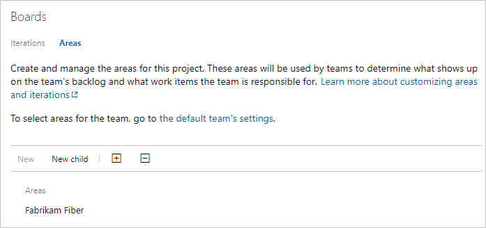


#### [Browser](#tab/browser/)

::: moniker range=">= tfs-2018"  

- To add a child node, highlight the area path and then choose **New child**. Optionally, you can select:::image type="icon" source="../../media/icons/actions-icon.png" border="false"::: for the area path and choose **New child**.   

    Enter a name (255 characters or less) for the node. For additional name restrictions, see [About areas and iterations, Naming restrictions](about-areas-iterations.md#naming-restrictions). 

    > [!div class="mx-imgBorder"]  
    > 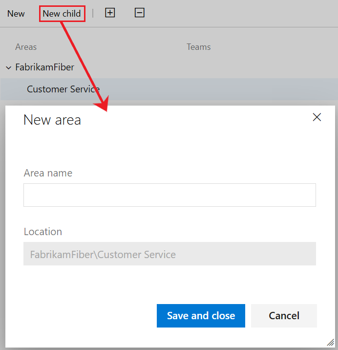 
 
::: moniker-end

::: moniker range="tfs-2017"  

- To add a child node, highlight the area path and then choose **New child**. Optionally, you can select **Settings** :::image type="icon" source="../../media/icons/actions-icon.png" border="false"::: for the area path and choose **New child**.   

    Enter a name (255 characters or less) for the node. For additional name restrictions, see [About areas and iterations, Naming restrictions](about-areas-iterations.md#naming-restrictions). 

    > [!div class="mx-imgBorder"]  
    >  

::: moniker-end

::: moniker range="<= tfs-2015"  

1. Open **Areas**.  

    

    From the areas page, you can set the default area path used to filter the backlog. The default area path is also used when new work items a user creates new work items. 

2. Add a new child node to the area you've selected.</p>

    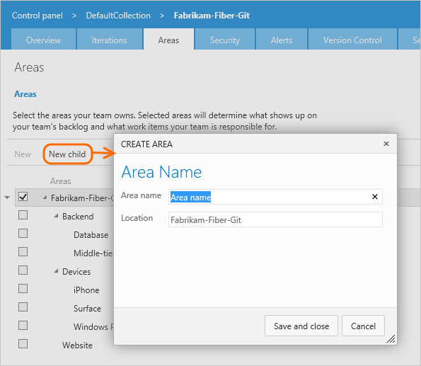 

::: moniker-end

#### [Azure DevOps CLI](#tab/azure-devops-cli)

<a id="add-area" /> 

::: moniker range=">= azure-devops-2020"  

You can add area paths to a project using [az boards area project create](/cli/azure/boards/area/project#ext-azure-devops-az-boards-area-project-create). To get started, see [Get started with Azure DevOps CLI](../../cli/index.md). 

> [!div class="tabbedCodeSnippets"]
```azurecli
az boards area project create --name
                              [--path]
                              [--project]
```

#### Parameters

- **name**: Required. Area path name. 
- **path**: Optional. Absolute path of an area. Example: --path \ProjectName\Area\AreaName. When not specified, adds an area at the root level.
- **project**: Optional. Name or ID of the project. Example: --project "Fabrikam Fiber".  

::: moniker-end

[!INCLUDE [temp](../../includes/note-cli-supported-server.md)]  

::: moniker range=">= azure-devops-2020"

#### Example: JSON format

For example, the following command adds the Voice area path to the Fabrikam Fiber project at the root node.  

> [!div class="tabbedCodeSnippets"]
```azurecli
az boards area project create --name Voice --project "Fabrikam Fiber"
{
  "attributes": null,
  "children": null,
  "hasChildren": false,
  "id": 55412,
  "identifier": "b00f86a2-3d49-4ad2-af01-da2537947baa",
  "name": "Voice",
  "path": "\\Fabrikam Fiber\\Area\\Voice",
  "structureType": "area",
  "url": "https://dev.azure.com/fabrikam/56af920d-393b-4236-9a07-24439ccaa85c/_apis/wit/classificationNodes/Areas/Voice"
}
```

#### Example: Table format

And, here is the same command with the table output format. 

> [!div class="tabbedCodeSnippets"]
```azurecli
az boards area project create --name Voice --project "Fabrikam Fiber" --output table
ID     Identifier                            Name    Path                         Has Children
-----  ------------------------------------  ------  ---------------------------  --------------
55413  3c16691b-160c-4498-ab42-aa77b7f354fc  Voice  \Fabrikam Fiber\Area\Voice  False
```

::: moniker-end

[!INCLUDE [temp](../../includes/note-cli-not-supported.md)]

* * *


<a id="open-team-settings" />

## Open team settings, list team area paths  

You set team defaults from team settings. If you're not a team administrator, [get added as one](add-team-administrator.md). Only team or project administrators can change team settings. 
 

#### [Browser](#tab/browser/)

::: moniker range=">= azure-devops-2019"

1. Open your project, and then select **Project settings** > **Team configuration** > **Areas**.

   

2. If you need to switch the team context, use the team selector within the breadcrumbs.

    > [!div class="mx-imgBorder"]  
    > 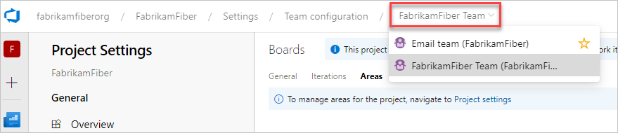 

::: moniker-end

::: moniker range="<= tfs-2018"  

You open team settings from the upper navigation bar. Select the team you want and then choose **Team settings** :::image type="icon" source="../../media/icons/gear_icon.png" border="false"::: . For more information about switching your team focus, see [Switch project, repository, team](../../project/navigation/go-to-project-repo.md#switch-team-context)

> [!div class="mx-imgBorder"]  
>  

::: moniker-end


#### [Azure DevOps CLI](#tab/azure-devops-cli)

<a id="list-team-area-paths" /> 

::: moniker range=">= azure-devops-2020"

You can list the area paths defined for a team using [az boards area team list](/cli/azure/boards/area/team#ext-azure-devops-az-boards-area-team-list). To get started, see [Get started with Azure DevOps CLI](../../cli/index.md).  

> [!div class="tabbedCodeSnippets"]
```azurecli
az boards area team list --team
                         [--project] 
```

#### Parameters

- **team**: Required. Name or ID of the team.
- **project**: Optional. Name or ID of the project. Example: --project "Fabrikam Fiber".  

For example, the following command lists the area paths for the Service Delivery team. For other output format options, see [Output formats for Azure CLI commands](/cli/azure/format-output-azure-cli)

> [!div class="tabbedCodeSnippets"]
```azurecli
az boards area team list --team "Service Delivery" --project "Fabrikam Fiber" --output table
Area                             Include sub areas    Is Default
-------------------------------  -------------------  ------------
Fabrikam Fiber\Service Delivery  True                 True
```

::: moniker-end

[!INCLUDE [temp](../../includes/note-cli-not-supported.md)]

* * *


::: moniker range=">= azure-devops-2019"  

## Open team settings from the team profile 

You define both areas and iterations from **Project Settings > Team configuration**. You can quickly navigate to it from a team work tracking backlog, board, or dashboard. 

1. Open a backlog or board for a team and choose **Team profile** :::image type="icon" source="../../media/icons/team.png" border="false"::: > **Team Settings**. 

   Here we open the Board for the Fabrikam Fiber team and from there the team profile. 

   > [!div class="mx-imgBorder"]  
   >   

2. Choose **Iterations and areas**. 

    > [!div class="mx-imgBorder"]  
    >    

3. If you need to switch the team context, use the team selector within the breadcrumbs.

    > [!div class="mx-imgBorder"]  
    >  

::: moniker-end

<a id="default-iteration">  </a>
<a id="team-area-paths">  </a>

## Set team area path(s)

::: moniker range=">= tfs-2017"  

All work items that are assigned to a team area path appear on the backlogs and boards for that team. You can select one or more area paths and optionally include their subarea paths. Choose to include subarea paths when you want to support rollup views of work done across several teams or areas.

::: moniker-end  

::: moniker range="<= tfs-2015"  

All work items assigned to the area paths selected for a team appear on the backlogs and boards for that team. You can select a single area path, and optionally include their subarea paths. Choose to include subarea paths when you want to support rollup views of work done across several teams or areas. 

::: moniker-end  

The default area path determines the default area path assigned to work items that are created from the team context.  

> [!IMPORTANT]  
> Work items that appear on more than one team's Kanban board can yield query results that don't meet your expectations. Because each team can customize the Kanban board [columns](../../boards/boards/add-columns.md) and [swimlanes](../../boards/boards/expedite-work.md), the values assigned to work items which appear on different boards may not be the same. The primary work around for this issue is to maintain single ownership of work items by team area path.   

 
#### [Browser](#tab/browser/)

::: moniker range=">= azure-devops-2020"  

1. Open **Areas** for the team context.  

   Here, we show the Areas for the Fabrikam Fiber team.  

   > [!div class="mx-imgBorder"]
   > 

2. Choose the area path(s) to be active for each team.  

    > [!div class="mx-imgBorder"]
    > 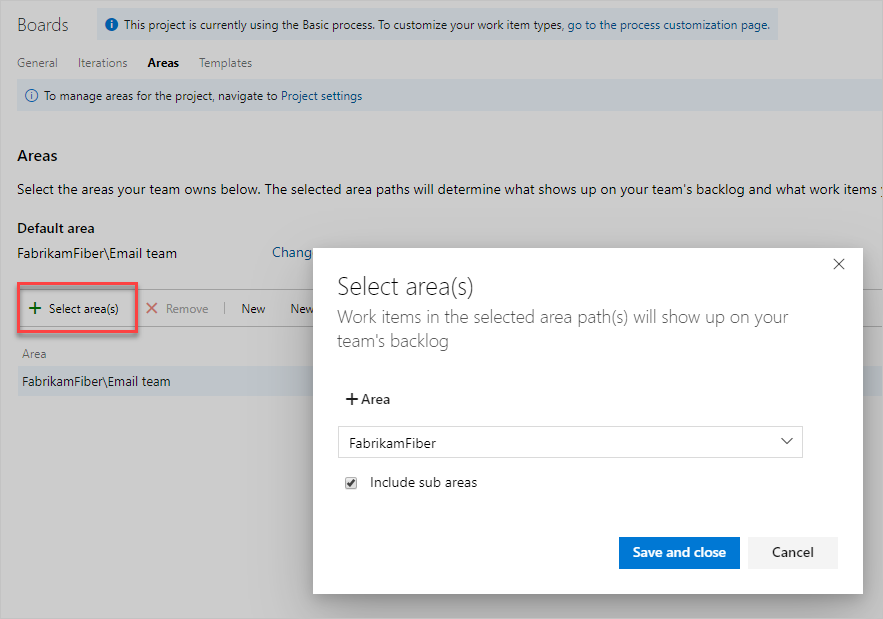  

    In this instance, we choose to activate the subarea paths for the project. The management team can now track progress across all teams.  

    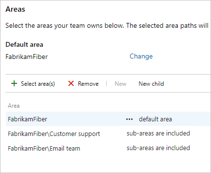  

3. When you've finished, refresh the product backlog page for the team, and you'll see those work items assigned to the team. Add area path to the columns shown to see the assignments made to work items.

   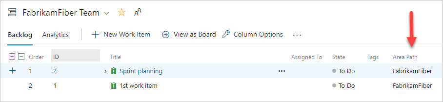

   

::: moniker-end  

::: moniker range=">= tfs-2017 < azure-devops-2020"  

1. Open **Areas** for the team context.  

   Here, we show the Areas for the Fabrikam Fiber team.  

   > [!div class="mx-imgBorder"]
   > 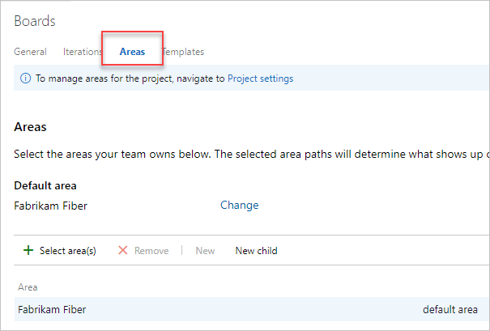

2. Choose the area path(s) to be active for each team.  

    > [!div class="mx-imgBorder"]
    > 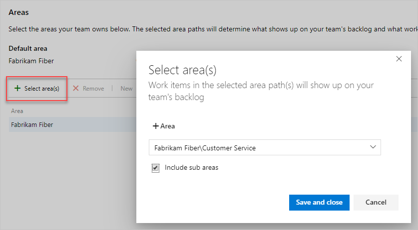  

    In this instance, we choose to activate all three subarea paths for the project. The management team can now track progress across all three teams.  

    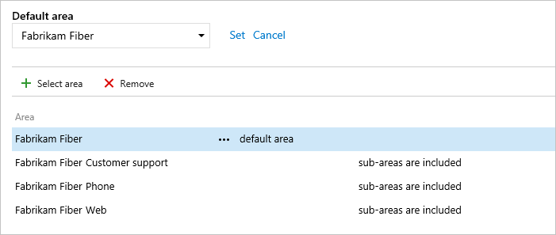  

3. When you've finished, refresh the product backlog page for the team, and you'll see those work items assigned to the team. Add area path to the columns shown to see the assignments made to work items.  

   > [!div class="mx-imgBorder"]  
   >   

::: moniker-end  

::: moniker range="<= tfs-2015"  

1. Open the Areas admin page for the team context.  

    Here, we navigate to the Fabrikam Fiber team. The checked box indicates the area paths selected for the team. To exclude sub-areas, select the option from the area path context menu.  

    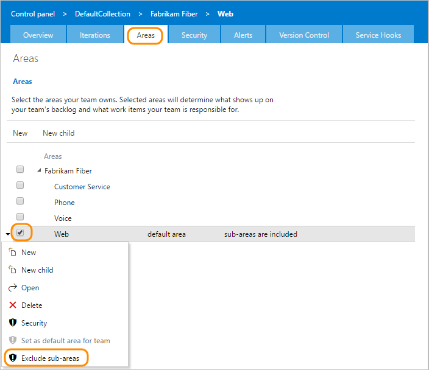  

2. Refresh the product backlog page for the team, and you'll see only those work items assigned to the Fabrikam Fiber area path.   

   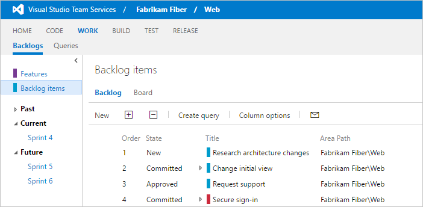  

::: moniker-end  


#### [Azure DevOps CLI](#tab/azure-devops-cli)

<a id="set-team-area-paths" /> 

::: moniker range=">= azure-devops-2020"

You can set the default area path for a team or add an area path, using [az boards area team add](/cli/azure/boards/area/team#ext-azure-devops-az-boards-area-team-add).  To get started, see [Get started with Azure DevOps CLI](../../cli/index.md). 

> [!div class="tabbedCodeSnippets"]
```azurecli
az boards area team add --path  --team
                        [--include-sub-areas {false, true}]
                        [--project]
                        [--set-as-default]
```

#### Parameters

- **path**: Required. Absolute path of an area. Example: --path \ProjectName\AreaName. 
- **team**: Required. Name or ID of the team.
- **include-sub-areas**: Optional. Include child nodes of the area path. Accepted values: false, true. 
- **project**: Optional. Name or ID of the project. Example: --project "Fabrikam Fiber".  
- **set-as-default**: Optional. Specify as the default area path for the team. Default: False.

::: moniker-end
[!INCLUDE [temp](../../includes/note-cli-supported-server.md)]  
::: moniker range=">= azure-devops-2020"

#### Example

For example, the following command adds the Voice area path to the Voice team for the Fabrikam Fiber project, sets it as the default and to include sub-areas. 

> [!div class="tabbedCodeSnippets"]
```azurecli
az boards area team add --path "\Fabrikam Fiber\Voice" --team Voice --project "Fabrikam Fiber" --include-sub-areas --set-as-default --include-sub-areas true --output table
Area                                   Include sub areas    Is Default
-------------------------------------  -------------------  ------------
Fabrikam Fiber\Service Delivery\Voice  False                False
Fabrikam Fiber\Voice                   True                 True
```
::: moniker-end


[!INCLUDE [temp](../../includes/note-cli-not-supported.md)]

* * *


<a name="rename-delete"></a>

## Rename, move, or delete an area path

The system automatically updates work items and queries that reference your updated area path.  

#### [Browser](#tab/browser/)

::: moniker range=">= azure-devops-2019"

1. To rename an area or iteration path, choose **Actions** :::image type="icon" source="../../media/icons/actions-icon.png" border="false"::: for the node, and then select **Edit**.  

    > [!div class="mx-imgBorder"]  
    > 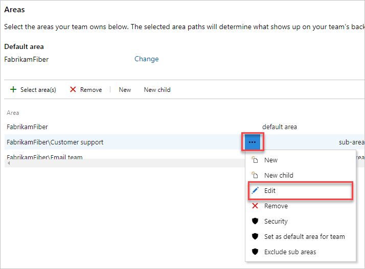  

2. In the dialog that opens, enter the new name.

    > [!div class="mx-imgBorder"]  
    > 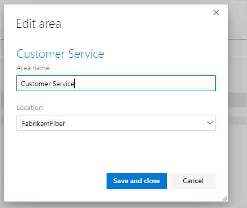

3. To move the node within the hierarchy, change the Location field.

4. To delete a node, choose the **Delete** option from the actions menu.

> [!NOTE]
> When you delete an area node or change the Location field for a node, the system automatically updates the existing work items with the node that you enter at the deletion prompt.

::: moniker-end


::: moniker range="<= tfs-2018"

1. To rename an area or iteration path, choose **Actions** :::image type="icon" source="../../media/icons/actions-icon.png" border="false"::: for the node, and then select **Edit**.  

    > [!div class="mx-imgBorder"]  
    > 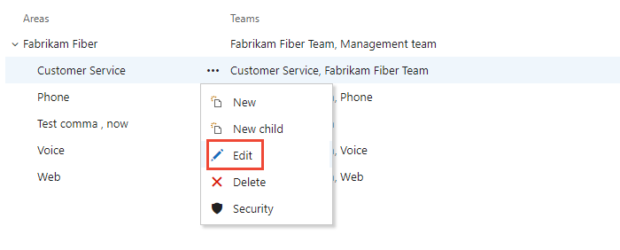  

2. In the dialog that opens, enter the new name.

    > [!div class="mx-imgBorder"]
    > [!Screenshot of Edit area dialog, TFS 2018 and earlier on-premises versions.](media/areas/edit-area-rename-dialog.png)

3. To move the node within the hierarchy, change the Location field.

4. To delete a node, choose the **Delete** option from the actions menu.

::: moniker-end


#### [Azure DevOps CLI](#tab/azure-devops-cli)

::: moniker range=">= azure-devops-2020" 

You can rename, move, or delete an area path for a project, using [az boards area team add](/cli/azure/boards/area/project#ext-azure-devops-az-boards-area-project-update). To get started, see [Get started with Azure DevOps CLI](../../cli/index.md). 

<a id="rename-move-project-area-path" /> 

### Rename or move an area path

To rename or move an area path, use the `az boards area project update` command.

> [!div class="tabbedCodeSnippets"]
```azurecli
az boards area project update --path
                              [--child-id]
                              [--name]
                              [--project]
```

- **path**: Required. Absolute path of an area. Example: --path \ProjectName\AreaName.  
- **child-id**: Optional. Moves an existing area path and adds it as a child node for the specified path name or ID.  
- **name**: Optional. Specifies the new name of the area path.  
- **project**: Optional. Name or ID of the project. Example: --project "Fabrikam Fiber".   

::: moniker-end
[!INCLUDE [temp](../../includes/note-cli-supported-server.md)]  
::: moniker range=">= azure-devops-2020"

#### Example

For example, the following command renames the Voice area path to Voice and Web for the Fabrikam Fiber project. 

> [!div class="tabbedCodeSnippets"]
```azurecli
az boards area project update --path "\Fabrikam Fiber\Area\Voice" --name "Voice and Web" --project "Fabrikam Fiber" --output table
ID     Identifier                            Name           Path                                Has Children
-----  ------------------------------------  -------------  ----------------------------------  --------------
55412  b00f86a2-3d49-4ad2-af01-da2537947baa  Voice and Web  \Fabrikam Fiber\Area\Voice and Web  False
```

<a id="remove-area-path-from-team" /> 

### Remove an area path from a team 

To remove an area path from a team, use [az boards area team remove](/cli/azure/boards/area/team#ext-azure-devops-az-boards-area-team-remove).

> [!div class="tabbedCodeSnippets"]
```azurecli
az boards area team remove --path
                           --team
                           [--project]
```

#### Parameters
- **path**: Required. Absolute path of an area. Example: --path \ProjectName\AreaName.  
- **team**: Required. Name or ID of the team.
- **project**: Optional. Name or ID of the project. Example: --project "Fabrikam Fiber". 


#### Example

For example, the following command removes the \Service Delivery\Voice area path from the Voice team of the Fabrikam Fiber project. 

> [!div class="tabbedCodeSnippets"]
```azurecli
az boards area team remove --path "\Fabrikam Fiber\Service Delivery\Voice" --team Voice --project "Fabrikam Fiber" --output table
```

::: moniker-end

[!INCLUDE [temp](../../includes/note-cli-not-supported.md)]

* * *


## Chart progress by area

You can quickly generate [queries](../../boards/queries/using-queries.md) to view the progress based on an area path. For example, [visualize progress of work items that are assigned to each team's area path](../../report/dashboards/charts.md), as shown in the following stacked bar chart. Choose Node Name to get the leaf node of the area path.

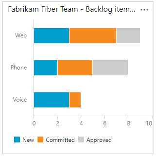

## Q & A

### Q: Do I have to assign an area path to a team?

**A:** No. You assign area paths to teams so that the work items assigned to that area path appear on the team's backlogs and boards. By default, all work items get assigned to the root area path. These work items appear in the default team that's defined for the project.

## Next steps

> [!div class="nextstepaction"]
> [Set iteration paths or sprints](set-iteration-paths-sprints.md)

## Related articles

As you can see, area paths play a major role in supporting Agile tools, teams, and managing work items. Learn more about working with these fields from the following articles:

- [About areas and iterations](about-areas-iterations.md)  
- [Add another team](../../organizations/settings/add-teams.md)  
- [Configure team settings and add team administrators](manage-teams.md)
- [Agile tools that rely on areas or iterations](about-teams-and-settings.md)
- [Query by area or iteration path](../../boards/queries/query-by-area-iteration-path.md)  
- [Set permissions and access for work tracking](../security/set-permissions-access-work-tracking.md)


### Programmatic resources

Area paths and iteration paths are also referred to as *Classification Nodes*. 

::: moniker range=">= azure-devops-2020"
- [az boards area (Azure DevOps CLI)](/cli/azure/boards/area)
- [Teams (REST API)](/rest/api/azure/devops/core/teams)
- [Classification Nodes (REST API)](/rest/api/azure/devops/wit/classification%20nodes)

::: moniker-end

::: moniker range="<= azure-devops-2019"

- [Teams (REST API)](/rest/api/azure/devops/core/teams)
- [Classification Nodes (REST API)](/rest/api/azure/devops/wit/classification%20nodes)
- [Define the classification plug-in (Process Template)](../../reference/process-templates/define-classification-plug-in.md)

::: moniker-end

