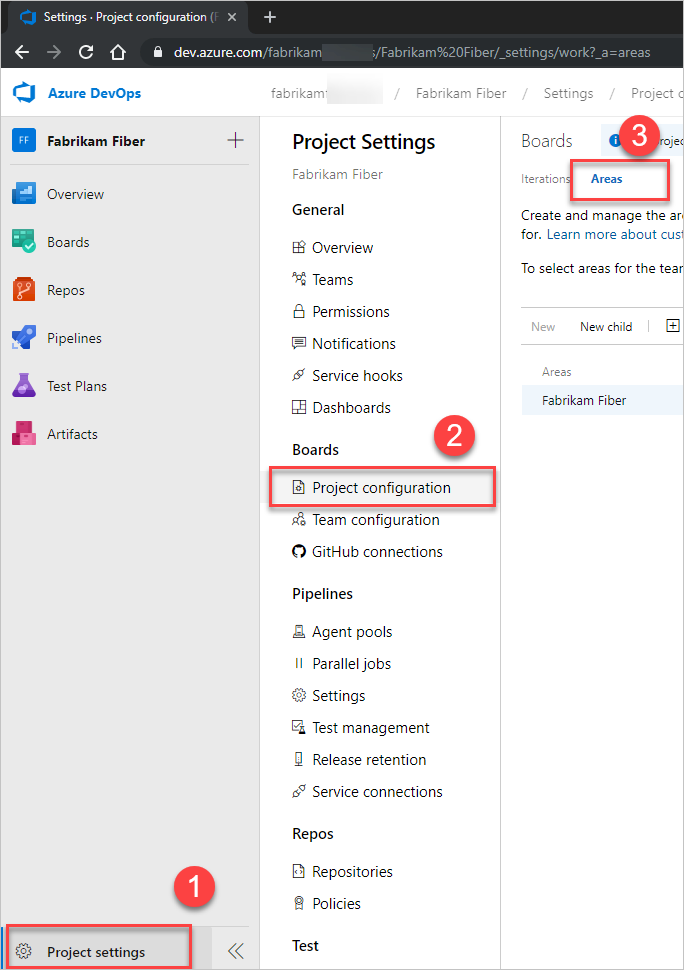
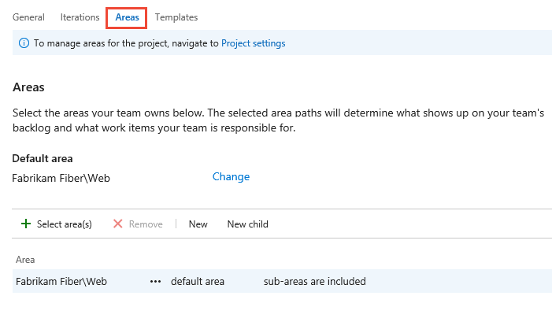

# Define area paths and assign to a team

[!INCLUDE [temp](../../boards/_shared/version-vsts-tfs-all-versions.md)]

You can add area paths to support teams and to group work items based on product, feature, or business areas. Then, define area paths at the project level and assign them to a team under the team configuration. You can also create a hierarchy of area paths to support subcategories within categories.

Each team has access to a number of Agile tools as described in [About teams and Agile tools](about-teams-and-settings.md). Each tool references the team's default area path(s). Most teams choose one area path and several iteration paths to support their work tracking activities. However, to support other scenarios, it's possible for teams to choose several area paths to appear on their backlogs and boards.

New projects contain a single, root area that corresponds to the project name. A team is created with the same project name and the root area path is assigned to that team.  

To understand how the system uses area paths, see [About area and iteration paths](about-areas-iterations.md).

[!INCLUDE [temp](../../_shared/version-selector.md)]

## Prerequisites

- Add Area Paths to a project. If you don't have a project yet, [create one now](../projects/create-project.md).
- Ensure you're a member of the **Project Administrators** group to add an Area Path under the root node or edit or delete any child node. To acquire these permissions, see [Set permissions at the project- or collection-level](../security/set-project-collection-level-permissions.md).
- Have one or more of the following permissions set to **Allow**,  to add, edit, and manage Area Paths under a node:
  
    - **Create child nodes**
    - **Delete this node**
    - **Edit this node**
    - **View permissions in this node**

  By default, the user who created the project has these permissions set. To learn more, see [Set permissions and access for work tracking](../security/set-permissions-access-work-tracking.md#set-permissions-area-path).
- Ensure you're [added as a team administrator](add-team-administrator.md) or are a member of the **Project Administrators** group to set team Area Paths.  

For naming restrictions on Area Paths, see [About areas and iterations, Naming restrictions](about-areas-iterations.md#name-restrictions).

<a id="guidance" />

## Get started sequence

If you're new to managing projects and teams, the most straight forward sequence for configuring your project and teams is as follows:

1. Determine the number and names of Area Paths that you want to support to categorize your work. At a minimum, you'll want to add one Area Path for each team that you'll define. For guidance, review [About areas and iterations](about-areas-iterations.md).
2. Determine the number and names of teams you want to support. For guidance, review [About teams and Agile tools](about-teams-and-settings.md).
3. Open **Project settings>Project configuration** and define the Area Paths to support steps 1 and 2 at the project level. Follow the steps provided later in this article: [Open Project Settings, Project configuration](#open-project-settings) and [Add area paths](#add-areas).
4. Define the teams you need to support step 2. For guidance, see [Add a team, move from one default team to several teams](add-teams.md).  
5. Open the team configuration and assign the default and additional Area Path(s) to each team. Follow the steps provided later in this article: [Open team settings](#open-team-settings) and [Set team default area path(s)](#team-area-paths).
6. Assign the Area Path of work items to an area path you defined. Use [bulk modify](../../boards/backlogs/bulk-modify-work-items.md) to modify several work items at once.

::: moniker range=">= tfs-2017"
> [!NOTE]
> While you can assign the same area path to more than one team, this can cause problems if two teams claim ownership over the same set of work items. To learn more, see [About boards and Kanban, Limitations of multi-team Kanban board views](../../boards/boards/kanban-overview.md#limits-multi-team).  
::: moniker-end

As needed, you can do the following actions at any time:

- Add additional child nodes
- Rename an Area Path (except the root area path)
- Move a child node under another node
- Delete a child node
- Rename a team
- Change the Area Path assignments made to a team

<a id="open-project-settings" />
<a id="open-admin-context" />  
<a id="admin-intro-team-services" />
## Open Project Settings   
From the web portal, open **Project Settings**.

::: moniker range=">= azure-devops-2019"
You define both areas and iterations for a project from the **Project Settings>Work>Project configuration**.

0. Choose (1) **Project Settings**, expand **Work** if needed, and choose (2) **Project configuration** and then (3) **Areas**.

	> [!div class="mx-imgBorder"]  
	>    

::: moniker-end

::: moniker range="<= tfs-2018"

You define both areas and iterations from the **Work** pages of the project admin context. From the user context, you open the admin context by choosing the  gear icon.

::: moniker-end

<a id="admin-intro-team-services" /> 
::: moniker range=">= tfs-2017 <= tfs-2018"

1. From the web portal for the project, choose the  gear icon.
	::: moniker range=">= tfs-2017 <= tfs-2018 || azure-devops"
	> [!div class="mx-imgBorder"]  
	> 

	If you're currently working from a team context, then hover over the  and choose **Project settings**.  

	> [!div class="mx-imgBorder"]
	> 
	::: moniker-end  

2. Choose **Work**.  

::: moniker-end   
<a id="admin-intro-tfs-2015" />
::: moniker range="<= tfs-2015"  

1. From the web portal, choose the  gear icon to open project administration pages. Then choose **Areas**.

	

::: moniker-end

<a id="add-areas" />  
<a id="add-areas-team-services" />   
<a id="tfs-15-area-paths" />
## Add an area path 

If you haven't added any areas or teams, you'll see that only one area is defined. You add area paths under the root area path for the project, or as a child to another area path.  
::: moniker range=">= tfs-2018"  
> [!div class="mx-imgBorder"]  
> 

* To add a child node, highlight the area path and then choose **New child**. Optionally, you can open the  context menu for the area path and choose **New child**.   

	Enter a name (255 characters or less) for the node. For additional name restrictions, see [About areas and iterations, Naming restrictions](about-areas-iterations.md#naming-restrictions). 

	> [!div class="mx-imgBorder"]  
	>  

::: moniker-end

::: moniker range="tfs-2017"  
> [!div class="mx-imgBorder"]  
> 

* To add a child node, highlight the area path and then choose **New child**. Optionally, you can open the  context menu for the area path and choose **New child**.   

	Enter a name (255 characters or less) for the node. For additional name restrictions, see [About areas and iterations, Naming restrictions](about-areas-iterations.md#naming-restrictions). 

	> [!div class="mx-imgBorder"]  
	>  

::: moniker-end

::: moniker range="<= tfs-2015"  

1. Open **Areas**.  

	

	From the areas page, you can set the default area path used to filter the backlog. The default area path is also used when new work items a user creates new work items. 

2. Add a new child node to the area you've selected.

	
 
::: moniker-end

<a id="open-team-settings" />
## Open team settings  

You set team defaults from team settings. If you're not a team administrator, [get added as one](add-team-administrator.md). Only team or project administrators can change team settings. 

From a web browser, open the web portal administrative context for your team.  

::: moniker range=">= azure-devops-2019"  
You define both areas and iterations from **Project Settings>Boards>Team configuration**. You can quickly navigate to it from a team work tracking backlog, board, or dashboard. 

0.  Open a backlog or board for a team and choose the  team profile icon. Then choose **Team Settings**. 

	Here we open the Board for the Web team and from there the team profile. 

	> [!div class="mx-imgBorder"]  
	>   

0. Choose **Iterations and areas**. 

	> [!div class="mx-imgBorder"]  
	>    

0. If you need to switch the team context, use the team selector within the breadcrumbs.
   
	> [!div class="mx-imgBorder"]  
	>  

::: moniker-end

::: moniker range="<= tfs-2018"  

You open team settings from the top navigation bar. Select the team you want and then choose the  gear icon. To learn more about switching your team focus, see [Switch project, repository, team](../../project/navigation/go-to-project-repo.md#switch-team-context)

> [!div class="mx-imgBorder"]  
>  

::: moniker-end

## Set team default area path(s)

::: moniker range=">= tfs-2017"  
All work items assigned to the area paths selected for a team appear on the backlogs and boards for that team. You can select one or more area paths and optionally include their sub-area paths.  Choose to include sub-area paths when you want to support rollup views of work performed across several teams or areas.
::: moniker-end  

::: moniker range="<= tfs-2015"  
All work items assigned to the area paths selected for a team appear on the backlogs and boards for that team. You can select a single area path, and optionally include their sub-area paths. Choose to include sub-area paths when you want to support rollup views of work performed across several teams or areas. 
::: moniker-end  

The default area path determines the default area path assigned to work items that are created from the team context.  

> [!IMPORTANT]  
> Work items that appear on more then one team's Kanban board can yield query results that don't meet your expectations. Because each team can customize the Kanban board [columns](../../boards/boards/add-columns.md) and [swimlanes](../../boards/boards/expedite-work.md), the values assigned to work items which appear on different boards may not be the same. The primary work around for this issue is to maintain single ownership of work items by team area path.   

::: moniker range=">= tfs-2017"  

0.	Open **Areas** for the team context.  

	Here, we show the Areas for the Web team.  

	> [!div class="mx-imgBorder"]
	> 

2. Choose the area path(s) to be active for each team.  

	> [!div class="mx-imgBorder"]
	>   

	In this instance, we choose to activate all three sub-area paths for the project. The management team can now track progress across all three teams.  

	  

0.	When you've finished, refresh the product backlog page for the team, and you'll see those work items assigned to the team. Add Area Path to the columns shown to see the assignments made to work items.  

	> [!div class="mx-imgBorder"]  
	>   

::: moniker-end  

::: moniker range="<= tfs-2015"  
0. Open the Areas admin page for the team context.  

	Here, we navigate to the Web team. The checked box indicates the area paths selected for the team. To exclude sub-areas, select the option from the area path context menu.  

	  

0.	Refresh the product backlog page for the team, and you'll see only those work items assigned to the Fabrikam Fiber\Web area path.   

	  

::: moniker-end  

## Rename, move, or delete an area path

When you rename an area or an iteration, or move the node within the tree hierarchy, the system automatically updates the work items and queries that reference the existing path or paths.  

1. To rename an area or iteration path, choose the  actions icon for the node, and select **Edit**.  

	> [!div class="mx-imgBorder"]  
	>   

2. In the dialog that opens, enter the new name.

	> [!div class="mx-imgBorder"]  
	> 

3. To move the node within the hierarchy, change the Location field.

4. To delete a node, choose the **Delete** option from the actions menu.

::: moniker range=">= tfs-2017"
> [!NOTE]
> When you delete an area node or change the Location field for a node, the system automatically updates the existing work items with the node that you enter at the deletion prompt.

::: moniker-end

## Chart progress by area

You can quickly generate [queries](../../boards/queries/using-queries.md) to view the progress based on an area path. For example, [visualize progress of work items that are assigned to each team's area path](../../report/dashboards/charts.md), as shown in the following stacked bar chart. Choose Node Name to get the leaf node of the Area Path.

## Q & A

### Q: Do I have to assign an area path to a team?

**A:** No. You assign area paths to teams so that the work items assigned to that area path appear on the team's backlogs and boards. By default, all work items are assigned to the root area path and show up in the default team that's defined for the project.

## Next steps

> [!div class="nextstepaction"]
> [Set iteration paths or sprints](set-iteration-paths-sprints.md)

## Related articles

As you can see, areas play a major role in supporting Agile tools and managing work items. Learn more about working with these fields from the following articles:

- [About areas and iterations](about-areas-iterations.md)  
- [Add another team](../../organizations/settings/add-teams.md)  
- [Configure team settings and add team administrators](manage-teams.md)
- [Agile tools that rely on areas or iterations](about-teams-and-settings.md)
- [Query by area or iteration path](../../boards/queries/query-by-area-iteration-path.md)  
- [Set permissions and access for work tracking](../security/set-permissions-access-work-tracking.md)
