# Define iteration paths (sprints) and configure team iterations 

[!INCLUDE [temp](../../boards/includes/version-all.md)]

Iteration Paths, also referred to as *sprints*, support assignment of work items to time-box intervals. You define iteration paths at the project level, and then each team selects the paths that they want to use. Iteration paths are a shared resource used by all teams that select them. You can create a flat set of iteration paths or a hierarchy of paths to support releases, sub-releases, and sprints. 

[!INCLUDE [temp](../../boards/includes/list-sprint-dependent-tools.md)] 


For information about naming restrictions and limits placed on addition of Iteration Paths, see [About areas and iterations, Naming restrictions](about-areas-iterations.md#name-restrictions).

> [!TIP]
> If all you need to do is change the iteration dates, you can do that quickly as shown in [Change sprint dates](../../boards/sprints/define-sprints.md). However, if you need to define the iteration paths and tree structure, then follow the guidance provided in this article. 

<a name="permissions"></a>

## Prerequisites

- To add an iteration path to a project, you must be a member of the **Project Administrators** group. If you don't have a project yet, [create one now](../projects/create-project.md). By default, the user who created the project has these permissions set.  
- To add, edit, and manage iteration paths under a node, you must have one or more of the following permissions set to **Allow** for the node that you want to manage: **Create child nodes**, **Delete this node**, **Edit this node**, and **View permissions for this node**. 
- To set team iteration paths, you must be [added as the team administrator](add-team-administrator.md) or be a member of the **Project Administrators** group.  

For more information about acquiring permissions, see [Set permissions at the project- or collection-level](../security/set-project-collection-level-permissions.md) or [Set permissions and access for work tracking](../security/set-permissions-access-work-tracking.md#set-permissions-area-path).  

## Get started

Newly created projects contain a single, root area path that corresponds to the project name. You add area paths under this root. Also, each project typically specifies a predefined set of iteration paths to help you get started tracking your work. You only need to specify the dates. 

If you're new to managing projects and teams, complete the following steps.

1. Review [Configure and customize Azure Boards](../../boards/configure-customize.md).
1. Define the area paths and teams following the guidance provided in [Define area paths and assign to a team](set-area-paths.md#guidance).  
1. Determine the length of the iteration you want to support. Recommended practice is to have all teams use the same sprint cadence. For guidance, review [About areas and iterations](about-areas-iterations.md).
1. Determine if you want a flat structure or hierarchy of sprints and releases.
1. Open **Project settings>Project configuration** and define the iteration paths to support steps 2 and 3 at the project level. Follow the steps provided later in this article: [Open Project Settings, Project configuration](#open-project-settings) and [Add iterations and set iteration dates](#iterations). 
1. Open the team configuration and assign the default and additional area path(s) to each team. Follow the steps provided later in this article: [Open team settings](#open-team-settings) and [Set team default iteration path(s)](#activate).
1. Each team should assign the default iteration path they selected to their work items. Do so for those work items to show up on their product backlogs and boards. Use [bulk modify](../../boards/backlogs/bulk-modify-work-items.md) to modify several work items at once. See also [Assign backlog items to a sprint](../../boards/sprints/assign-work-sprint.md). 

As needed, you can do the following tasks at any time: 

- Add additional child iteration nodes
- Rename an iteration path (except the root path)
- Move a child iteration path under another node 
- Delete a child iteration path 
- Change the default and selected iteration paths assigned to a team

<a id="default_path">  </a>

### Team backlog iteration versus default iteration 

Each team has access to many Agile tools, as described in [About teams and Agile tools](about-teams-and-settings.md). Each tool references the team's default area path(s). Several tools reference the team's default and selected iteration paths or sprints. Most teams choose one area path and several iteration paths to support their work tracking activities. However, to support other scenarios, it's possible for teams to choose several area paths to appear on their backlogs and boards. 

::: moniker range=">= tfs-2017" 

Teams can set a default iteration different from the backlog iteration. The backlog iteration determines which items appear on the team's backlogs and boards. And, the default iteration determines what value is assigned to work items created from the team context. 

All work items that you create from your team context are automatically assigned both the team's default area path and default iteration path.

::: moniker-end

::: moniker range="<= tfs-2015"

For TFS 2015 and earlier versions, the default iteration is the same as the backlog iteration. The selected value filters items that appear on the team's backlogs and boards, and it's assigned to work items created from the team context.

::: moniker-end

[!INCLUDE [temp](../../includes/version-selector-minimize.md)]


<a id="open-project-settings" />
<a id="open-admin-context" />  

## Open Project Settings, list project iterations    

::: moniker range=">= azure-devops-2019"

You define both areas and iterations for a project from the **Project Settings > Boards > Project configuration**.

::: moniker-end

::: moniker range="<= tfs-2018"

You define both areas and iterations from the **Work** pages of the **Project Settings** context. From the user context, you open the admin context by choosing **Settings** :::image type="icon" source="../../media/icons/gear-icon.png" border="false":::.

::: moniker-end

#### [Browser](#tab/browser/)

::: moniker range=">= azure-devops-2020" 

From the web portal, open **Project Settings**.

Define both areas and iterations for a project from the **Project settings** > **Boards** > **Project configuration**. 

1. Choose (1) **Project Settings**, expand **Boards** if needed, and then choose (2) **Project configuration** and (3) **Iterations**.   

	> [!div class="mx-imgBorder"]  
	> 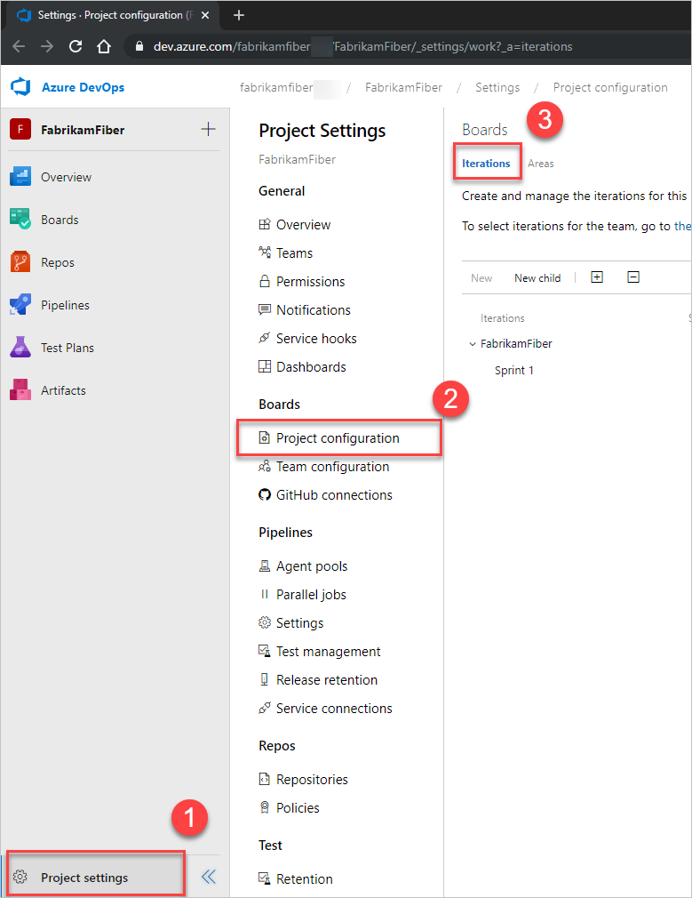   

::: moniker-end

::: moniker range="azure-devops-2019"

From the web portal, open **Project Settings**.

Define both areas and iterations for a project from the **Project configuration > Iterations**. 

1. From the web portal, choose **Project settings**(1), select **Project configuration**(2), and then **Iterations**(3).   

	> [!div class="mx-imgBorder"]  
	>    

::: moniker-end

<a id="admin-intro-tfs-2015" />

::: moniker range="<= tfs-2018"

From the web portal, choose **Project settings** :::image type="icon" source="../../media/icons/gear_icon.png" border="false"::: to open project administration pages. Then, choose **Iterations**.  


::: moniker-end

#### [Azure DevOps CLI](#tab/azure-devops-cli)

::: moniker range=">= azure-devops-2020"

[List project iteration paths](#iteration-project-list) | [Add a project iteration](#add-project-iteration) | [List team iteration paths](#list-team-iteration-paths) | [Set team iteration paths](#set-team-iteration-paths) | [Delete or update a project iteration path](#delete-update-iteration-paths)

<a id="iteration-project-list" />

List the iterations defined for a project using [az boards iteration project list](/cli/azure/boards/iteration/project#ext-azure-devops-az-boards-iteration-project-list). To get started, see [Get started with Azure DevOps CLI](../../cli/index.md).  

> [!div class="tabbedCodeSnippets"]
```azurecli
az boards iteration project list [--depth]
                                 [--path]
                                 [--project]
```

#### Parameters

- **depth**: Optional. Depth of child nodes to be listed. Example: --depth 3.
- **path**: Optional. Absolute path of an iteration. `\Iteration\` must follow after the `\ProjectName`, which distinguishes it from an area path.  Example: --path \ProjectName\Iteration\IterationName. If spaces are used within a node, then enclose in double-quotes, for example,--path "\Fabrikam Fiber\Iteration\Sprint 1". When not specified, lists iteration paths from the root level.  
- **project**: Optional. Name or ID of the project. Example: --project "Fabrikam Fiber".  

::: moniker-end

[!INCLUDE [temp](../../includes/note-cli-supported-server.md)]  

::: moniker range=">= azure-devops-2020"

#### Example

For example, the following command lists the area paths to a depth of 3 for the Fabrikam Fiber project. For more information on other output format options, see [Output formats for Azure CLI commands](/cli/azure/format-output-azure-cli)

> [!div class="tabbedCodeSnippets"]
```azurecli
az boards iteration project list --depth 3 --project "Fabrikam Fiber" --output table
ID     Identifier                            Name            Path                                           Has Children    Start Date            Finish Date
-----  ------------------------------------  --------------  ---------------------------------------------  --------------  --------------------  --------------------
55290  d77820e9-6bda-4deb-8052-cc519bc12ecc  Fabrikam Fiber  \Fabrikam Fiber\Iteration                      True
55292  5938b25d-7235-499e-815f-4fc19d95d24c  Release 1       \Fabrikam Fiber\Iteration\Release 1            True
55297  c7063041-ff3a-4d7f-bb46-c433c7030d59  Sprint 1        \Fabrikam Fiber\Iteration\Release 1\Sprint 1   False           2019-01-01T00:00:00Z  2019-01-18T00:00:00Z
55298  dd10f1bf-bedd-4c6f-926f-b2abea81bb50  Sprint 2        \Fabrikam Fiber\Iteration\Release 1\Sprint 2   False           2019-01-21T00:00:00Z  2019-02-08T00:00:00Z
55340  862e961a-ac7a-4fcc-9ebc-8afd0c12fed5  Sprint 3        \Fabrikam Fiber\Iteration\Release 1\Sprint 3   False           2019-03-11T00:00:00Z  2019-03-29T00:00:00Z
55341  8548898e-4dfd-4515-9d6e-d476d90033a3  Sprint 4        \Fabrikam Fiber\Iteration\Release 1\Sprint 4   False
55342  d130534c-05dc-434b-a7f3-85689d11c36f  Sprint 5        \Fabrikam Fiber\Iteration\Release 1\Sprint 5   False
55343  738f5c0b-c62b-4ba5-96ab-026e606b0cef  Sprint 6        \Fabrikam Fiber\Iteration\Release 1\Sprint 6   False           2018-07-16T00:00:00Z  2018-08-03T00:00:00Z
55299  a0554e98-b1f1-4230-8500-733c739a0113  Release 2       \Fabrikam Fiber\Iteration\Release 2            False
55300  5c3a5d56-f860-4ebc-8838-7701256c88a4  Release 3       \Fabrikam Fiber\Iteration\Release 3            False
55301  ad722430-042b-4c45-87e5-8d67572d4fc1  Release 4       \Fabrikam Fiber\Iteration\Release 4            False
55364  8b738736-fef6-49f5-be2a-31c86add6589  Future          \Fabrikam Fiber\Iteration\Future               False
```

::: moniker-end

[!INCLUDE [temp](../../includes/note-cli-not-supported.md)]

* * *


<a id="iterations"></a>  

## Add iterations and set iteration dates

You can add iterations in the same way that you add areas. For more information about working within a sprint cadence, see [Scrum and sprint planning tools](../../boards/sprints/scrum-key-concepts.md).   

#### [Browser](#tab/browser/)

::: moniker range=">= azure-devops-2020" 

1. Add and modify area paths from **Project settings** > **Project configuration** > **Iterations**.   

   For Scrum-based projects, you see the following set of sprints. 

   :::image type="content" source="media/areas/modify-areas-its-iterations-preview.png" alt-text="Screenshot of Project Settings context, project configuration, Iterations page.":::

2. To schedule the start and end dates for each sprint that your teams use, highlight the sprint and choose **Set dates**. Or, you can select **Actions** :::image type="icon" source="../../media/icons/actions-icon.png" border="false"::: for the iteration path and choose **Edit**.  

   :::image type="content" source="media/iterations/set-dates-preview.png" alt-text="Set dates, preview page.":::

3. Choose the calendar icon to select new dates. 

   :::image type="content" source="media/iterations/schedule-sprints-calendar-preview.png" alt-text="Screenshot of Work, Iterations page, and calendar icon for selecting new dates for Azure DevOps 2020 and on.":::	

4. When you're finished, you have a set of sprints scheduled - similar to the following image: 

   :::image type="content" source="media/areas/modify-areas-its-iterations-preview.png" alt-text="Screenshot of Work, Iterations page, scheduled set of sprints for Azure DevOps 2020 and on.":::

   Your next step is to [choose the sprints each team uses](#activate-team-services). 

::: moniker-end

::: moniker range="azure-devops-2019"

From **Iterations**, you can add iterations that teams can then select for their use.

<a id="define-sprints-team-services" />

1. Add and modify area paths from the **Work** > **Iterations** page from the project admin or settings context.   

   For Scrum-based projects, you see the following set of sprints. 

   :::image type="content" source="media/areas/modify-areas-its-iterations-ts.png" alt-text="Project Settings Context, Work, Iterations page":::

2. To schedule the start and end dates for each sprint your teams use,  Highlight the sprint and choose **Set dates**. Or, you can select **Actions** :::image type="icon" source="../../media/icons/actions-icon.png" border="false"::: context menu for the iteration path and choose **Edit**.
	
   Choose the calendar icon to choose new dates. 

   :::image type="content" source="media/iterations/schedule-sprints-calendar.png" alt-text="Screenshot of Work, Iterations page, and calendar icon to choose for new dates for Azure DevOps Server 2019.":::

3. When you're finished, you have a set of sprints scheduled - like this: 

   :::image type="content" source="media/areas/modify-areas-its-iterations-ts.png" alt-text="Screenshot of Work, Iterations page, scheduled set of sprints for Azure DevOps Server 2019.":::

   Your next step is to [choose the sprints each team uses](#activate-team-services).

::: moniker-end

::: moniker range=">= tfs-2017 <= tfs-2018"

<a id="define-sprints-team-services" />

Add and modify area paths from the **Work** > **Iterations** page from the project admin or settings context.   

For Scrum-based projects, you see the following set of sprints. 

> [!div class="mx-imgBorder"]  
> 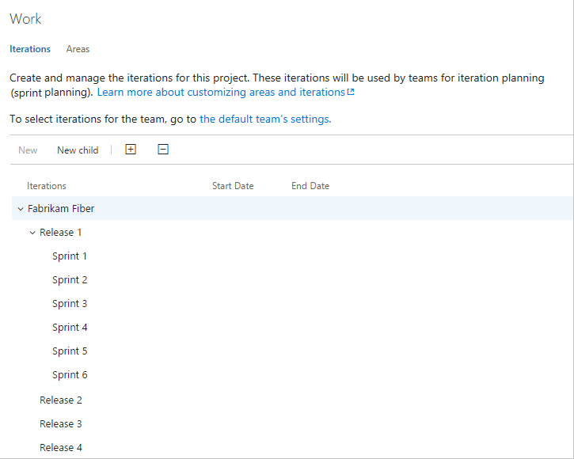 

1. To schedule the start and end dates for each sprint your teams use,  Highlight the sprint and choose **Set dates**. Or, you can select **Actions** :::image type="icon" source="../../media/icons/actions-icon.png" border="false"::: for the iteration path and choose **Edit**.
	
   Choose the calendar icon to choose new dates. 

	> [!div class="mx-imgBorder"]  
	> 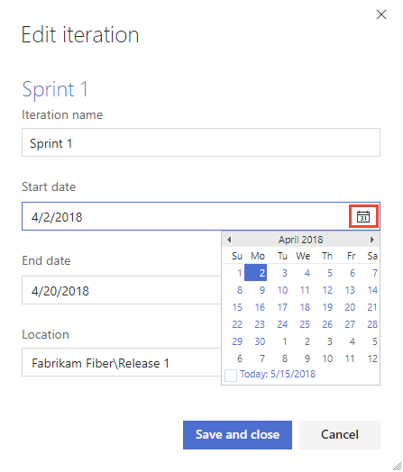 	

2. When you're finished, you have a set of sprints scheduled - like this: 

   :::image type="content" source="media/areas/modify-areas-its-iterations-scheduled-ts.png" alt-text="Screenshot of Work, Iterations page, scheduled set of sprints for TFS 2017 through 2018.":::

   Your next step is to [choose the sprints each team uses](#activate-team-services). 

::: moniker-end

::: moniker range="<= tfs-2015"

<a id="tfs-2015-iteration-paths" />

1. Open the **Iterations** tab for the project context. 

	For Scrum-based projects, you'll see the following set of sprints. 

	

	You can change the name and location within the tree hierarchy, or set dates for any sprint. Open it (double-click or press Enter key) and specify the information that you want.

2. Schedule the start and end dates for those sprints you plan to use. 

	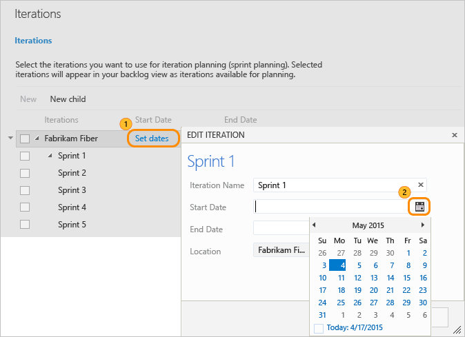  

	After you set the start and end dates for one iteration, the calendar tool automatically attempts to set the next set of dates. The calendar bases the next set of dates on the same iteration length you specified for the first. For example, if you set Sprint 1 as three-weeks long, then when you select the start date for Sprint 2, the calendar tool automatically determines the start and end dates, based on the next three weeks. You can accept or change these dates.  

3. To add another sprint, select **New child** and name it. Here, we call it Sprint 7.  

	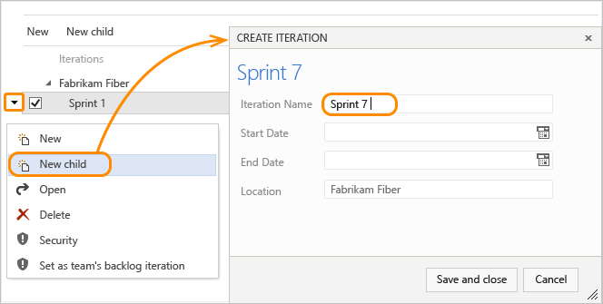  

	Your next step is to [select the sprints each team uses](#activate-sprints-tfs).
 
::: moniker-end

#### [Azure DevOps CLI](#tab/azure-devops-cli)

<a id="add-project-iteration" />

::: moniker range=">= azure-devops-2020"

You can add iteration paths to a project using [az boards iteration project create](/cli/azure/boards/iteration/project#ext-azure-devops-az-boards-iteration-project-create). To get started, see [Get started with Azure DevOps CLI](../../cli/index.md).  

> [!div class="tabbedCodeSnippets"]
```azurecli
az boards iteration project create --name
                                   [--finish-date]
                                   [--path]
                                   [--project]
                                   [--start-date]
```

#### Parameters

- **name**: Required. Enter the name of the iteration path.
- **finish-date**: Optional. Finish date of the iteration. Example: "2019-06-21".
- **path**: Optional. Absolute path of an iteration. Example: \ProjectName\Iteration\IterationName. When not specified, adds an iteration at the root level.
- **project**: Optional. Name or ID of the project. Example: --project "Fabrikam Fiber". 
- **start-date**: Optional. Enter the start date of the iteration path. Example: "2019-06-03". Must be earlier than the finish-date.

::: moniker-end
[!INCLUDE [temp](../../includes/note-cli-supported-server.md)]  
::: moniker range=">= azure-devops-2020"

#### Example

For example, the following command adds Sprint 36, which starts on September 1, 2019 and ends September 30, 2019 as an iteration path to the default project at the root node.  

> [!div class="tabbedCodeSnippets"]
```azurecli
az boards iteration project create --name "Sprint 36" --start-date 2019-09-01 --finish-date 2019-09-30
{
  "attributes": {
    "finishDate": "2019-09-30T00:00:00Z",
    "startDate": "2019-09-01T00:00:00Z"
  },
  "children": null,
  "hasChildren": false,
  "id": 55411,
  "identifier": "af3ef6a7-6551-451b-8f9f-63af7a60fc55",
  "name": "Sprint 36",
  "path": "\\Fabrikam Fiber\\Iteration\\Sprint 36",
  "structureType": "iteration",
  "url": "https://dev.azure.com/fabrikam/56af920d-393b-4236-9a07-24439ccaa85c/_apis/wit/classificationNodes/Iterations/Sprint%2036"
}
```

::: moniker-end

[!INCLUDE [temp](../../includes/note-cli-not-supported.md)]

* * *


<a id="open-team-settings" />

## Open team settings, list team iterations  

You can set team defaults from team settings. If you're not a team administrator, [get added as one](add-team-administrator.md). Only team or project administrators can change team settings. 

#### [Browser](#tab/browser) 

::: moniker range=">= azure-devops-2019"

You define both areas and iterations from **Project settings > Boards > Team configuration**. You can quickly navigate to it from a team work tracking backlog, board, or dashboard. 

1.  Open a backlog or board for a team and choose **Team profile** :::image type="icon" source="../../media/icons/team.png" border="false"::: > **Team Settings**. 

	Here we open the Board for the Web team and from there the team profile. 

	> [!div class="mx-imgBorder"]  
	>   

2. Choose **Iterations and areas**. 

	> [!div class="mx-imgBorder"]  
	>    

3. If you need to switch the team context, use the team selector within the breadcrumbs.
   
	> [!div class="mx-imgBorder"]  
	>  

::: moniker-end

::: moniker range="<= tfs-2018"  

You open team settings from the upper navigation bar. Select the team you want and then choose **Team settings** :::image type="icon" source="../../media/icons/gear_icon.png" border="false":::. For more information about switching your team focus, see [Switch project, repository, team](../../project/navigation/go-to-project-repo.md#switch-team-context)

> [!div class="mx-imgBorder"]  
>  

::: moniker-end

#### [Azure DevOps CLI](#tab/azure-devops-cli)

<a id="list-team-iteration-paths" />

::: moniker range=">= azure-devops-2020"

You can list the iteration paths defined for a team using [az boards area team list](/cli/azure/boards/area/team#ext-azure-devops-az-boards-area-team-list). To get started, see [Get started with Azure DevOps CLI](../../cli/index.md).  

> [!div class="tabbedCodeSnippets"]
```azurecli
az boards iteration team list --team
                              [--project]
                              [--timeframe]
```

#### Parameters

- **team**: Required. Name or ID of the team.
- **project**: Optional. Name or ID of the project.
- **timeframe**: Optional. A filter for which iterations are returned based on relative time. Only *Current* is supported. 

::: moniker-end

[!INCLUDE [temp](../../includes/note-cli-supported-server.md)]  

::: moniker range=">= azure-devops-2020"

#### Example

For example, the following command lists the area paths for the Service Delivery team. For other output format options, see [Output formats for Azure CLI commands](/cli/azure/format-output-azure-cli)

> [!div class="tabbedCodeSnippets"]
```azurecli
az boards iteration team list  --team "Service Delivery"  --project "Fabrikam Fiber" --output table
ID                                    Name       Start Date                 Finish Date                Time Frame    Path
------------------------------------  ---------  -------------------------  -------------------------  ------------  ---------------------------------
c7063041-ff3a-4d7f-bb46-c433c7030d59  Sprint 1   2019-01-01T00:00:00+00:00  2019-01-18T00:00:00+00:00  past          Fabrikam Fiber\Release 1\Sprint 1
dd10f1bf-bedd-4c6f-926f-b2abea81bb50  Sprint 2   2019-01-21T00:00:00+00:00  2019-02-08T00:00:00+00:00  past          Fabrikam Fiber\Release 1\Sprint 2
862e961a-ac7a-4fcc-9ebc-8afd0c12fed5  Sprint 3   2019-03-11T00:00:00+00:00  2019-03-29T00:00:00+00:00  current       Fabrikam Fiber\Release 1\Sprint 3
```

::: moniker-end

[!INCLUDE [temp](../../includes/note-cli-not-supported.md)]

* * *

<a id="activate">  </a>

## Select team sprints and set the default iteration path

You [define sprints for the project](../../boards/sprints/define-sprints.md) and then select them to be active for each team. You assign the default iteration to use when creating new work items. 

<a id="activate-team-services">  </a>

#### [Browser](#tab/browser/)

::: moniker range=">= azure-devops-2019" 

1. Open **Project settings > Boards > Team Configuration > Iterations** for a team.  

   Here, we navigate to the Fabrikam Fiber Team.  

   > [!div class="mx-imgBorder"]
   > 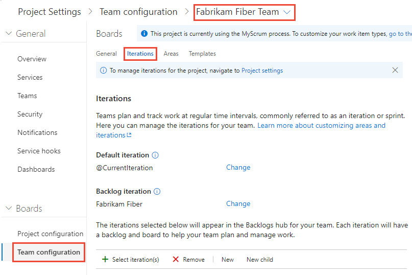  

2. **Backlog iteration**. Only work items assigned to an iteration equal to or under this backlog iteration appear in the team's backlogs and boards. 

	

	Also, all work items added through a team's backlog or board are assigned the backlog iteration. 

3. **Default iteration**. The default iteration defines the iteration that's used when you create a work item from the team dashboard and queries page. You can use an explicit value or use <strong>@CurrentIteration</strong> to assign new work items to the team's current iteration. The same macro used in [queries to list work items assigned to the currently active iteration assigned to the team](../../boards/queries/query-by-date-or-current-iteration.md#current-iteration) is used.  

	For example, you might want all new work items added to a future iteration path, which you use to triage and assign to specific sprints at periodic intervals.  

	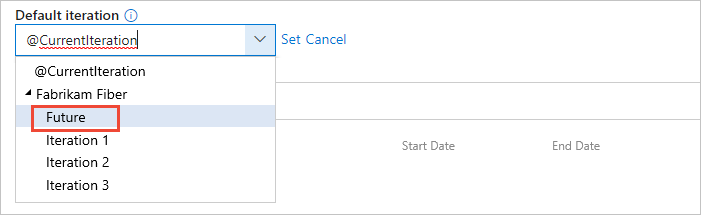

4. **Active sprints**. Add an iteration for each sprint backlog you want active for the team. Add each sprint, one by one, by selecting it from the menu.  

	> [!div class="mx-imgBorder"]
	> 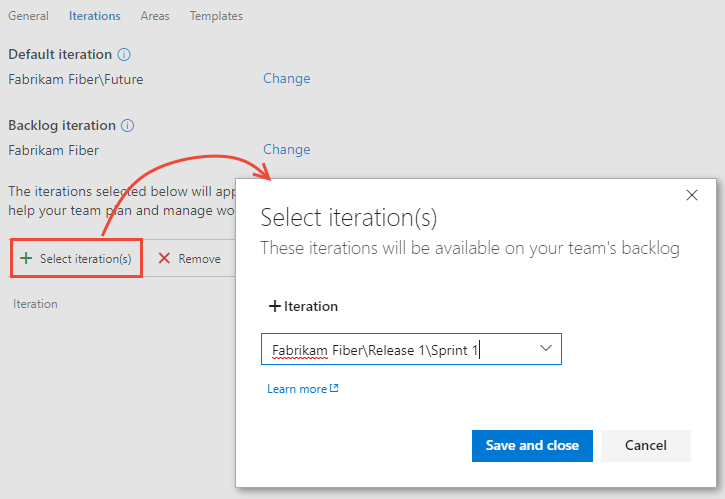

	When you're done, you should see a list of sprints, similar to the following.  

	> [!div class="mx-imgBorder"]
	> 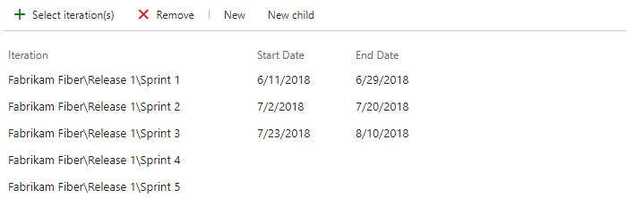 

	If you don't see the sprints or dates that you need, you can add or edit iterations for the project, provided you have the required permissions. For more information, see [Define iteration (sprint) paths](set-iteration-paths-sprints.md).   

5. To see the newly activated sprint backlogs, refresh your team's [product backlog page](../../boards/backlogs/create-your-backlog.md).  

::: moniker-end

::: moniker range=">= tfs-2017 <= tfs-2018"  

1.	Open **Work** > **Iterations** for a team.  

	Here, we navigate to the Fabrikam Fiber Team.  

	  

    <a id="set-backlog-iteration">  </a>
2. **Backlog iteration**. Only work items assigned to an iteration equal to or under this backlog iteration appear in the team's backlogs and boards. 

    

    Also, all work items added through a team's backlog or board are assigned the backlog iteration. 

3. **Default iteration**. The default iteration defines the iteration that's used when you create a work item from the team dashboard and queries page. You can use an explicit value or use <strong>@CurrentIteration</strong> to assign new work items to the team's current iteration. The same macro used in [queries to list work items assigned to the currently active iteration assigned to the team](../../boards/queries/query-by-date-or-current-iteration.md#current-iteration) is used.  

	For example, you might want all new work items added to a future iteration path, which you use to triage and assign to specific sprints at periodic intervals.  

	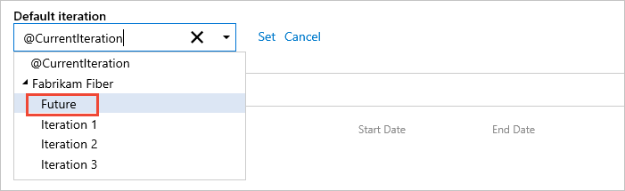

4. **Active sprints**. Add an iteration for each sprint backlog you want active for the team. Add each sprint, one by one, by selecting it from the menu.  

 	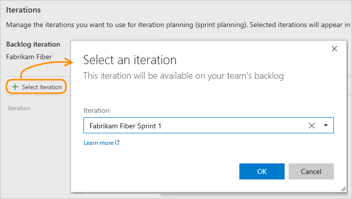

	When you're done, you should see a list of sprints, similar to the following.  

	 

	If you don't see the sprints or dates that you need, then [return to the project administration context and define them there](set-iteration-paths-sprints.md#define-sprints-team-services).  

5. To see the newly activated sprint backlogs, refresh your team's [product backlog page](../../boards/backlogs/create-your-backlog.md).  

::: moniker-end

<a id="activate-sprints-tfs">  </a>

::: moniker range="<= tfs-2015" 

1.	Open the Iterations page for the team context.  

	Here we open the Iterations page for the Web team.  

	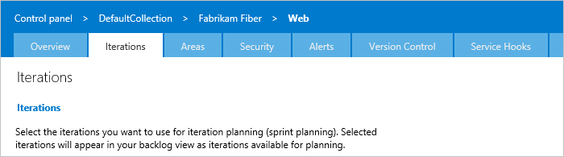  

	If your team isn't listed in the navigation row, open the Overview tab, select your team, and then return to the Iterations tab.  

1. **Default iteration**. Only work items assigned to an iteration equal to or under the default iteration appear in the team's backlogs and boards. The default iteration also defines the iteration that's used when you create a work item from the team dashboard and queries page. 
	
	Open the context menu for the iteration path you want.

	Here we set the P1 1 path.  Only child iterations of the backlog iteration can be active for a team. 

	  

	This path determines which work items appear in your team backlogs and boards. The path also determines [the default assigned-to](#default_path) work items that get created from any area under your team's context.  

2. **Active sprints**. Check each box under the default iteration that you want active for the team.  

	Here, the Fabrikam Fiber Web team activates Sprints 1 through 7. 

	   

	Check boxes only appear for sprints defined under the default iteration path.  

4.	To see the newly activated sprint backlogs, refresh your team's [product backlog page](../../boards/backlogs/create-your-backlog.md).  

::: moniker-end

#### [Azure DevOps CLI](#tab/azure-devops-cli)

<a id="set-team-iteration-paths" /> 

::: moniker range=">= azure-devops-2020" 

Add iteration paths, set the default iteration path, or set the backlog iteration path for a team using one of the following [az boards iteration team](/cli/azure/boards/iteration/team)[Azure DevOps CLI](../../cli/index.md) commands. To get started, see [Get started with Azure DevOps CLI](../../cli/index.md).   

> [!div class="tabbedCodeSnippets"]
```azurecli
az boards iteration team add --id --team
                             [--project]

az boards iteration team set-default-iteration --team
                                               [--default-iteration-macro]
                                               [--id]
                                               [--project]

az boards iteration team set-backlog-iteration --id --team
                                               [--project]
```

#### Parameters

- **team**: Required. Name or ID of the team.
- **default-iteration-macro**: Optional. Default iteration macro, the only valid entry is @CurrentIteration.  
- **id**: Optional. Enter the ID of an iteration path. To determine the ID, list the iteration paths using [az boards iteration project list](#iteration-project-list).  
- **project**: Optional. Name or ID of the project. Example: --project "Fabrikam Fiber".  

::: moniker-end
[!INCLUDE [temp](../../includes/note-cli-supported-server.md)]  
::: moniker range=">= azure-devops-2020"

#### Example 

For example, the following command adds \Fabrikam Fiber\Iteration\Release 2 path to the Service Delivery team for the Fabrikam Fiber project. 

> [!div class="tabbedCodeSnippets"]
```azurecli
az boards iteration team add --id a0554e98-b1f1-4230-8500-733c739a0113 --team "Service Delivery" --project "Fabrikam Fiber"
{
  "attributes": {
    "finishDate": null,
    "startDate": null,
    "timeFrame": "future"
  },
  "id": "a0554e98-b1f1-4230-8500-733c739a0113",
  "name": "Release 2",
  "path": "Fabrikam Fiber\\Release 2",
  "url": "https://dev.azure.com/fabrikam/56af920d-393b-4236-9a07-24439ccaa85c/43e6bd2e-696f-492c-bbf7-9cde9cd420ea/_apis/work/teamsettings/iterations/a0554e98-b1f1-4230-8500-733c739a0113"
}
```

::: moniker-end

[!INCLUDE [temp](../../includes/note-cli-not-supported.md)]

* * *

<a name="rename-delete"></a>

## Rename, move, or delete an iteration 

When you rename an iteration, or move the node within the tree hierarchy, the system automatically updates the work items and queries that reference the existing path(s). 

#### [Browser](#tab/browser/)

1. To rename an iteration path, choose **Actions** :::image type="icon" source="../../media/icons/actions-icon.png" border="false"::: for the node, and then select **Edit**.  

	> [!div class="mx-imgBorder"]  
	>   

2. In the dialog that opens, enter the new name. 

	> [!div class="mx-imgBorder"]  
	> 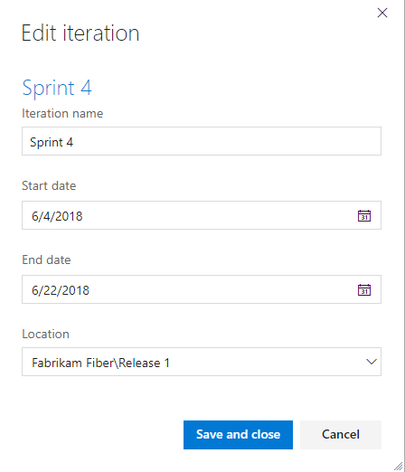

3. To move the node within the hierarchy, change the Location field. 

4. To delete a node, choose the **Delete** option from the actions menu. 

	> [!NOTE]   
	> When you delete an iteration node, the system automatically updates the existing work items with the node that you enter at the deletion prompt. 

#### [Azure DevOps CLI](#tab/azure-devops-cli)

::: moniker range=">= azure-devops-2020"

You can rename, move, or delete an iteration path for a project, using the following [az boards iteration project](/cli/azure/boards/iteration/project) commands. To get started, see [Get started with Azure DevOps CLI](../../cli/index.md).  

<a id="delete-update-iteration-paths" /> 

### Rename or move a project iteration path 

To rename or move a project iteration path, use the `az boards area project update` command.

> [!div class="tabbedCodeSnippets"]
```azurecli
az boards iteration project delete --path
                                   [--project]
                                   [--yes]

az boards iteration project update --path
                                   [--child-id]
                                   [--finish-date]
                                   [--name]
                                   [--project]
                                   [--start-date]

```

#### Parameters
 
- **path**: Required. Absolute path of an iteration. Example: \ProjectName\Iteration\IterationName.  
- **child-id**: Optional. Moves an existing iteration path and adds it as a child node for the specified path name or path ID.  
- **name**: Optional. New name of the iteration path.  
- **project**: Optional. Name or ID of the project. Example: --project "Fabrikam Fiber".  
- **finish-date**: Optional. Finish date of the iteration. Example: "2019-06-21".
- **start-date**: Optional. Start date of the iteration path. Example: "2019-06-03". Must be earlier than the finish-date.
- **yes**: Optional. Do not prompt for confirmation.
 
::: moniker-end

[!INCLUDE [temp](../../includes/note-cli-supported-server.md)]

::: moniker range=">= azure-devops-2020"

#### Example 

For example, the following command updates the start and end dates of the Sprint 3 iteration path for the Fabrikam Fiber project. 

> [!div class="tabbedCodeSnippets"]
```azurecli
az boards iteration project update --path "\Fabrikam Fiber\Iteration\Release 1\Sprint 3" --finish-date 2019-08-31 --start-date 2019-08-01 --project "Fabrikam Fiber" --output table
ID     Identifier                            Name      Start Date            Finish Date           Path                                          Has Children
-----  ------------------------------------  --------  --------------------  --------------------  --------------------------------------------  --------------
55340  862e961a-ac7a-4fcc-9ebc-8afd0c12fed5  Sprint 3  2019-08-01T00:00:00Z  2019-08-31T00:00:00Z  \Fabrikam Fiber\Iteration\Release 1\Sprint 3  False

```

::: moniker-end

[!INCLUDE [temp](../../includes/note-cli-not-supported.md)]

* * *
<a name="export"></a>

### Export/import iteration paths  

You can't export or import the structure of tree paths for one project to use with another project. 

::: moniker range=">= azure-devops-2020"

However, using the `az boards iteration` commands you can list the iterations defined for one project and then add them to another project. Once they are added, you can then use the `az boards iteration team` commands to add them to a team and set the default and backlog iteration path for the team. Using the [Classification Nodes (REST API)](/rest/api/azure/devops/wit/classification%20nodes) and [Teams (REST API)](/rest/api/azure/devops/core/teams), you can perform similar actions.

::: moniker-end

::: moniker range=">= tfs-2017"

## Archive iteration paths 

After a while, you may want to archive iteration paths that were used for sprints that are a year or more out of date. You can do that by moving the iteration path under a node that you label "Archive". All work items are updated with the moved iteration path. Also, teams can de-select those sprints that have past. All data is maintained in the data store with the new iteration path assignments. 

<!--- Implications for reporting --> 
Before you archive the iterations, consider if you've captured all the reports that you may want. 

::: moniker-end

## Chart progress by iteration

You can quickly generate [queries](../../boards/queries/using-queries.md) to view the progress for those areas. For example, you can [visualize progress of work items that are assigned to sprints](../../report/dashboards/charts.md), as shown in the following stacked bar chart.  

 

## Q & A 

### Q: Do I have to assign iteration paths to a team?  

**A:** If your team doesn't use sprints to plan and track work, then no. You can leave the defaults assigned to the team as they are. You can then use the product and portfolio backlogs and boards, however you can't gain much use of sprint planning tools. 

## Related articles 

* [About areas and iterations](about-areas-iterations.md)  
* [Add another team](../../organizations/settings/add-teams.md)  
* [Configure team settings and add team administrators](manage-teams.md) 
* [Assign backlog items to a sprint](../../boards/sprints/assign-work-sprint.md)
* [Agile tools that rely on areas or iterations](about-teams-and-settings.md)

### Programmatic resources

Area paths and iteration paths are also referred to as *Classification Nodes*. 

::: moniker range=">= azure-devops-2020"

- [az boards iteration (Azure DevOps CLI)](/cli/azure/boards/iteration)
- [Teams (REST API)](/rest/api/azure/devops/core/teams)
- [Classification Nodes (REST API)](/rest/api/azure/devops/wit/classification%20nodes)

::: moniker-end

::: moniker range=">= tfs-2017 <= azure-devops-2019"

- [Teams (REST API)](/rest/api/azure/devops/core/teams)
- [Classification Nodes (REST API)](/rest/api/azure/devops/wit/classification%20nodes)
- [Define the classification plug-in (Process Template)](../../reference/process-templates/define-classification-plug-in.md)

::: moniker-end
