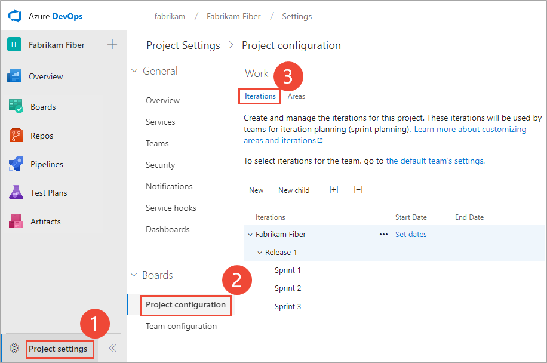

# Define iteration paths (aka sprints) 

[!INCLUDE [temp](../../_shared/version-vsts-tfs-all-versions.md)]

Newly created projects contain a single, root area that corresponds to the project name. Each project typically specifies a predefined set of iterations to help you get started tracking your work. All you need to do is specify the dates. 

You add iteration paths under this root. To understand how the system uses area paths, see [About area and iteration paths](about-areas-iterations.md). 

## Prerequisites

::: moniker range="vsts"
* You must be a member of a project. If you don't have a project yet, [create one](../projects/create-project.md). 
::: moniker-end
::: moniker range=">= tfs-2013 <= tfs-2018"
* You must be a member of a project. If you don't have a project yet, [create one](../projects/create-project.md).
::: moniker-end
* To create or modify areas or iterations, you must either be a member of the **Project Administrators** group, or your **Create and order child nodes**, **Delete this node**, and **Edit this node** permissions must be set to **Allow** for the area or iteration node that you want to modify.

	If you aren't a project administrator, [get added as one](../security/set-project-collection-level-permissions.md) or have someone provide you with explicit permissions to **Edit project-level information**.   

For naming restrictions on area and iteration paths, see [About areas and iterations, Naming restrictions](about-areas-iterations.md#name-restrictions).

## Open Project Settings, Project configuration    

From the web portal, open **Project Settings**.

[!INCLUDE [temp](../../_shared/new-navigation.md)]  

# [New navigation](#tab/new-nav)

::: moniker range="vsts"  
You define both areas and iterations for a project from the **Project Settings>Work>Project configuration**. 

0. Choose (1) **Project Settings**, expand **Work** if needed, and choose (2) **Project configuration** and then (3) **Iterations**.   

	> [!div class="mx-imgBorder"]  
	>    

::: moniker-end

::: moniker range=">= tfs-2013 <= tfs-2018"  
[!INCLUDE [temp](../../_shared/new-navigation-not-supported.md)]   
::: moniker-end

# [Previous navigation](#tab/previous-nav) 

You define both areas and iterations from the **Work** pages of the project admin context. From the user context, you open the admin context by choosing the  gear icon. 
<a id="admin-intro-team-services" /> 
::: moniker range=">= tfs-2017"  
From the web portal, open **Project settings**. 

<a id="admin-intro-team-services" /> 

1. From the web portal for the project context, choose the  gear icon..  

	> [!div class="mx-imgBorder"]  
	>   
	
	If you're currently working from a team context, then hover over the  and choose **Project settings**.  

	> [!div class="mx-imgBorder"]
	> 
	::: moniker-end

2. Choose **Work**.   

::: moniker-end 
<a id="admin-intro-tfs-2015" />
::: moniker range=">= tfs-2013 <= tfs-2015"  

From the web portal, choose the  gear icon to open project administration pages. Then, choose **Iterations**.  

::: moniker-end

---

  
## Add iterations and set iteration dates

From **Iterations**, you can add iterations that teams can then select for their use. You add iterations in the same way you add areas. For more information about working within a sprint cadence, see [Scrum and sprint planning tools](../../boards/sprints/scrum-sprint-planning-tools.md).  

::: moniker range=">= tfs-2017"

You add and modify area paths from the **Work, Iterations** page from the project admin or settings context.   

For Scrum-based projects, you'll see the following set of sprints. 

> [!div class="mx-imgBorder"]  
>  

0. To schedule the start and end dates for each sprint your teams will use,  Highlight the sprint and choose **Set dates**. Or, you can open the  context menu for the iteration path and choose **Edit**.  

	Choose the calendar icon to choose new dates. 

	> [!div class="mx-imgBorder"]  
	>  	

0. When you're finished, you'll have a set of sprints scheduled - like this: 

	> [!div class="mx-imgBorder"]  
	> 

	Your next step is to [choose the sprints each team will use](../../organizations/settings/set-team-defaults.md#activate-team-services). 
::: moniker-end

::: moniker range=">= tfs-2013 <= tfs-2015"

<a id="tfs-2015-iteration-paths" />

1. Open the **Iterations** tab for the project context. 

	For Scrum-based projects, you'll see these set of sprints. 

	  

	You can change the name, location within the tree hierarchy, or set dates for any sprint. Simply open it (double-click or press Enter key) and specify the info you want.

2. Schedule the start and end dates for those sprints you plan to use. 

	  

	After you set the start and end dates for one iteration, the calendar tool automatically attempts to set the next set of dates, based on the same iteration length you specified for the first. For example, if you set a three week sprint for Sprint 1, then when you select the start date for Sprint 2, the calendar tool automatically determines the start and end dates based on the next three weeks. You can accept or change these dates.  

3. To add another sprint, select <b>New child</b> and name it what you want. Here, we call it Sprint 7.  

	

	Your next step is to [select the sprints each team will use](../../organizations/settings/set-team-defaults.md#activate-sprints-tfs). 
 
::: moniker-end

::: moniker range=">= tfs-2017"

## Rename, move, or delete an iteration 

When you rename an iteration, or move the node within the tree hierarchy, the system will automatically update the work items and queries that reference the existing path or paths. 

0. To rename an iteration path, choose the  actions icon for the node, and select **Edit**.  

	> [!div class="mx-imgBorder"]  
	>   

0. In the dialog that opens, enter the new name. 

	> [!div class="mx-imgBorder"]  
	> 

0.  To move the node within the hierarchy, change the Location field. 

0. To delete a node, choose the **Delete** option from the actions menu. 

	> [!NOTE]   
	> When you delete an iteration node, the system automatically updates the existing work items with the node that you enter at the deletion prompt. 

::: moniker-end

## Chart progress by iteration

You can quickly generate [queries](../../boards/queries/using-queries.md) to view the progress for those areas and iterations. As an example, you can [visualize progress of work items assigned to sprints](../../report/dashboards/charts.md) as shown in the following stacked bar chart.  

 

## Related articles 
As you can see, iterations play a major role in supporting Agile tools and managing work items. You can learn more about working with these fields from these topics: 
 
*	[Set team defaults](set-team-defaults.md)  
*	[Agile tools and sprint definitions ](../../boards/sprints/define-sprints.md)  
*	[Query by date or current iteration](../../boards/queries/query-by-date-or-current-iteration.md)  
*	 [Set permissions and access for work tracking](../security/set-permissions-access-work-tracking.md)
 
 