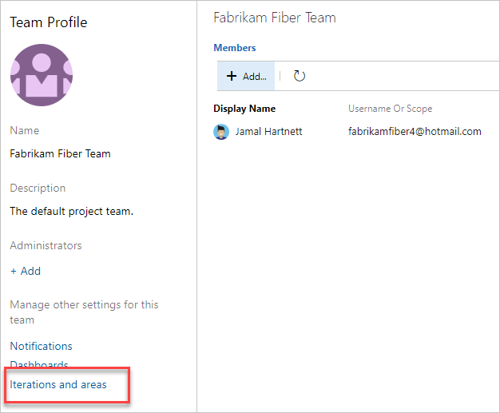

# Define iteration paths (aka sprints) and configure team iterations 

[!INCLUDE [temp](../../boards/_shared/version-vsts-tfs-all-versions.md)]

You add iteration paths to support teams perform sprint planning and to group work items based on a time-box interval or sprint. You define iteration paths at the project level and then each team selects the one to be active for them under the team configuration. You can create a flat iteration path structure or a hierarchy of it paths to support releases, sub-releases, and sprints. 

Each team has access to a number of Agile tools as described in [About teams and Agile tools](about-teams-and-settings.md). Each tool references the team's default area path(s). Several tools reference the team's default and active iteration paths or sprints. Most teams choose one area path and several iteration paths to support their work tracking activities. However, to support other scenarios, it's possible for teams to choose several area paths to appear on their backlogs and boards. 

Newly created projects contain a single, root area that corresponds to the project name. You add iteration paths under this root. Each project typically specifies a predefined set of iterations to help you get started tracking your work. All you need to do is specify the dates. 

[!INCLUDE [temp](../../_shared/version-selector.md)]

## Prerequisites

- You add Iteration Paths to a project. If you don't have a project yet, [create one now](../projects/create-project.md).
- To add an Iteration Path under the root node or edit or delete any child node, you must be a member of the **Project Administrators** group. To acquire these permissions, see [Set permissions at the project- or collection-level](../security/set-project-collection-level-permissions.md).  
- Or, to add, edit, and manage Iteration Paths under a node, you must have one or more of the following permissions set to **Allow** for the node you want to manage: **Create child nodes**, **Delete this node**, and **Edit this node**, and **View permissions for this node**.  By default, the user who created the project has these permissions set. To learn more, see [Set permissions and access for work tracking](../security/set-permissions-access-work-tracking.md#set-permissions-area-path).  
- To set team Iteration Paths, you must be [added as the team administrator](add-team-administrator.md) or be a member of the **Project Administrators** group.  

For naming restrictions on Iteration Paths, see [About areas and iterations, Naming restrictions](about-areas-iterations.md#name-restrictions).

## Get started sequence

If you are new to managing projects and teams, the most straight forward sequence for configuring iterations for your project and teams is as follows:  

1. First, define the Area Paths and teams following the guidance provided in [Define area paths and assign to a team](set-area-paths.md#guidance).  
2. Determine the length of the iteration you want to support. Recommended practice is to have all teams use the same sprint cadence. For guidance, review [About areas and iterations](about-areas-iterations.md).
3. Determine if you want a flat structure or hierarchy of sprints and releases.
4. Open **Project settings>Project configuration** and define the Iteration Paths to support steps 2 and 3 at the project level. Follow the steps provided later in this article: [Open Project Settings, Project configuration](#open-project-settings) and [Add iterations and set iteration dates](#iterations). 
5. Open the team configuration and assign the default and additional Area Path(s) to each team. Follow the steps provided later in this article: [Open team settings](#open-team-settings) and [Set team default iteration path(s)](#activate).
6. Each team should assign the default Iteration Path they selected to their work items. This is needed in order for those work items to show up on their product backlogs and boards. Use [bulk modify](../../boards/backlogs/bulk-modify-work-items.md) to modify several work items at once. See also [Assign backlog items to a sprint](../../boards/sprints/assign-work-sprint.md). 
As needed, you can perform the following actions at any time: 

- Add additional child iteration nodes
- Rename an Iteration Path (except the root path)
- Move a child Iteration Path under another node 
- Delete a child Iteration Path 
- Change the default and selected Iteration Paths assigned to a team

## Backlog iteration versus default iteration 

::: moniker range=">= tfs-2017"
Teams can set a default iteration different from the backlog iteration. The backlog iteration determines which items appear on the team's backlogs and boards. And, the default iteration determines what value is assigned to work items created from the team context. 

All work items that you create from your team context are automatically assigned both the team's default area path and default iteration path. 
::: moniker-end

::: moniker range="<= tfs-2015"
For TFS 2015 and earlier versions, the default iteration is the same as the backlog iteration. The one value selected both filters items that appear on the team's backlogs and boards, and is assigned to work items created from the team context.  
::: moniker-end

<a id="open-project-settings" />
<a id="open-admin-context" />  

## Open Project Settings    

From the web portal, open **Project Settings**.

::: moniker range=">= azure-devops-2019"

You define both areas and iterations for a project from the **Project Settings>Work>Project configuration**. 

0. Choose (1) **Project Settings**, expand **Boards** if needed, and choose (2) **Project configuration** and then (3) **Iterations**.   

	> [!div class="mx-imgBorder"]  
	>    

::: moniker-end

::: moniker range="<= tfs-2018"

You define both areas and iterations from the **Work** pages of the project admin context. From the user context, you open the admin context by choosing the  gear icon. 
::: moniker-end

<a id="admin-intro-team-services" /> 
::: moniker range=">= tfs-2017 <= tfs-2018" 

0. From the web portal, open **Project settings**. 

0. From the web portal for the project context, choose the  gear icon..  

	> [!div class="mx-imgBorder"]  
	>   
	
	If you're currently working from a team context, then hover over the  and choose **Project settings**.  

	> [!div class="mx-imgBorder"]
	>   

0. Choose **Work**.   

::: moniker-end 

<a id="admin-intro-tfs-2015" />
::: moniker range="<= tfs-2015"  

From the web portal, choose the  gear icon to open project administration pages. Then, choose **Iterations**.  

::: moniker-end

  
## Add iterations and set iteration dates

From **Iterations**, you can add iterations that teams can then select for their use. You add iterations in the same way you add areas. For more information about working within a sprint cadence, see [Scrum and sprint planning tools](../../boards/sprints/scrum-sprint-planning-tools.md).  

::: moniker range=">= tfs-2017"

You add and modify area paths from the **Work, Iterations** page from the project admin or settings context.   

For Scrum-based projects, you'll see the following set of sprints. 

> [!div class="mx-imgBorder"]  
>  

1. To schedule the start and end dates for each sprint your teams use,  Highlight the sprint and choose **Set dates**. Or, you can open the  context menu for the iteration path and choose **Edit**.  

	Choose the calendar icon to choose new dates. 

	> [!div class="mx-imgBorder"]  
	>  	

0. When you're finished, you'll have a set of sprints scheduled - like this: 

	> [!div class="mx-imgBorder"]  
	> 

	Your next step is to [choose the sprints each team uses](#activate-team-services). 

::: moniker-end

::: moniker range="<= tfs-2015"

<a id="tfs-2015-iteration-paths" />

1. Open the **Iterations** tab for the project context. 

	For Scrum-based projects, you'll see these set of sprints. 

	  

	You can change the name, location within the tree hierarchy, or set dates for any sprint. Simply open it (double-click or press Enter key) and specify the info you want.

2. Schedule the start and end dates for those sprints you plan to use. 

	  

	After you set the start and end dates for one iteration, the calendar tool automatically attempts to set the next set of dates, based on the same iteration length you specified for the first. For example, if you set a three week sprint for Sprint 1, then when you select the start date for Sprint 2, the calendar tool automatically determines the start and end dates based on the next three weeks. You can accept or change these dates.  

3. To add another sprint, select **New child** and name it what you want. Here, we call it Sprint 7.  

	  

	Your next step is to [select the sprints each team uses](#activate-sprints-tfs).
 
::: moniker-end

<a id="open-team-settings" />
## Open team settings  

You set team defaults from team settings. If you're not a team administrator, [get added as one](add-team-administrator.md). Only team or project administrators can change team settings. 

From a web browser, open the web portal administrative context for your team.  

::: moniker range=">= azure-devops-2019"  
You define both areas and iterations from **Project Settings>Boards>Team configuration**. You can quickly navigate to it from a team work tracking backlog, board, or dashboard. 

1.  Open a backlog or board for a team and choose the  team profile icon. Then choose **Team Settings**. 

	Here we open the Board for the Web team and from there the team profile. 

	> [!div class="mx-imgBorder"]  
	>   

0. Choose **Iterations and areas**. 

	> [!div class="mx-imgBorder"]  
	>    

0. If you need to switch the team context, use the team selector within the breadcrumbs.
   
	> [!div class="mx-imgBorder"]  
	>  

::: moniker-end

::: moniker range="<= tfs-2018"  

You open team settings from the top navigation bar. Select the team you want and then choose the  gear icon. To learn more about switching your team focus, see [Switch project, repository, team](../../project/navigation/go-to-project-repo.md#switch-team-context)

> [!div class="mx-imgBorder"]  
>  

::: moniker-end

## Select team sprints and default iteration path  

You [define sprints for the project](../../boards/sprints/define-sprints.md) and then select them to be active for each team. You assign the default iteration to use when creating new work items. 

::: moniker range=">= azure-devops-2019"  

0.	Open **Project settings>Boards>Team Configuration>Iterations** for a team.  

	Here, we navigate to the Fabrikam Fiber Team.  

	> [!div class="mx-imgBorder"]
	>   

0. **Backlog iteration**. Only work items assigned to an iteration equal to or under this backlog iteration appear in the team's backlogs and boards. 

	

	Also, all work items added through a team's backlog or board are assigned the backlog iteration. 

0. **Default iteration**. The default iteration defines the iteration used when a work item is created from the team dashboard (new work item widget) and queries page. You can use an explicit value or use **@CurrentIteration** to assign new work items to the team's current iteration. This is the same macro used in [queries to list work items assigned to the currently active iteration assigned to the team](../../boards/queries/query-by-date-or-current-iteration.md#current-iteration).  

	For example, you might want all new work items to be added to a future iteration path which you use to triage and assign to specific sprints at periodic intervals.  

	

0. **Active sprints**. Add an iteration for each sprint backlog you want active for the team. Add each sprint, one by one, by selecting it from the menu.  

	> [!div class="mx-imgBorder"]
	> 

	When you're done, you should see a list of sprints, similar to the following.  

	> [!div class="mx-imgBorder"]
	>  

	If you don't see the sprints you need, or the dates aren't set, you can add or edit iterations for the project, provided you have the required permissions. To learn more, see [Define iteration paths (aka sprints)](set-iteration-paths-sprints.md).   

3.	To see the newly activated sprint backlogs, refresh your team's [product backlog page](../../boards/backlogs/create-your-backlog.md).  

::: moniker-end

::: moniker range=">= tfs-2017 <= tfs-2018"  

1.	Open **Work>Iterations** for a team.  

	Here, we navigate to the Fabrikam Fiber Team.  

	  

2. **Backlog iteration**. Only work items assigned to an iteration equal to or under this backlog iteration appear in the team's backlogs and boards. 

	

	Also, all work items added through a team's backlog or board are assigned the backlog iteration. 

3. **Default iteration**. The default iteration defines the iteration used when a work item is created from the team dashboard (new work item widget) and queries page. You can use an explicit value or use **@CurrentIteration** to assign new work items to the team's current iteration. This is the same macro used in [queries to list work items assigned to the currently active iteration assigned to the team](../../boards/queries/query-by-date-or-current-iteration.md#current-iteration).  

	For example, you might want all new work items to be added to a future iteration path which you use to triage and assign to specific sprints at periodic intervals.  

	

4. **Active sprints**. Add an iteration for each sprint backlog you want active for the team. Add each sprint, one by one, by selecting it from the menu.  

 	

	When you're done, you should see a list of sprints, similar to the following.  

	 

	If you don't see the sprints you need, or the dates aren't set, then [return to the project admin context and define them there](set-iteration-paths-sprints.md#define-sprints-team-services).  

3.	To see the newly activated sprint backlogs, refresh your team's [product backlog page](../../boards/backlogs/create-your-backlog.md).  

::: moniker-end

::: moniker range="<= tfs-2015" 

1.	Open the Iterations page for the team context.  

	Here we open the Iterations page for the Web team.  

	  

	If your team isn't listed in the navigation row, open the Overview tab, select your team, and then return to the Iterations tab.  

2.	**Default iteration**. Only work items assigned to an iteration equal to or under the default iteration appear in the team's backlogs and boards. Also, the default iteration defines the iteration used when a work item is created from the team dashboard (new work item widget) and queries page. 
	
	Open the context menu for the iteration path you want.

	Here we set the P1 1 path.  Only child iterations of the backlog iteration can be active for a team. 

	  

	This path determines which work items appear in your team backlogs and boards, and [the default assigned to](#default_path) work items created from any area under your team's context.  

3.	**Active sprints**. Check each box under the default iteration that you want active for the team.  

	Here, the Fabrikam Fiber Web team activates Sprints 1 through 7. 

	   

	Check boxes only appear for sprints defined under the default iteration path.  

4.	To see the newly activated sprint backlogs, refresh your team's [product backlog page](../../boards/backlogs/create-your-backlog.md).  

::: moniker-end

::: moniker range=">= tfs-2017"

## Rename, move, or delete an iteration 

When you rename an iteration, or move the node within the tree hierarchy, the system automatically updates the work items and queries that reference the existing path or paths. 

1. To rename an iteration path, choose the  actions icon for the node, and select **Edit**.  

	> [!div class="mx-imgBorder"]  
	>   

0. In the dialog that opens, enter the new name. 

	> [!div class="mx-imgBorder"]  
	> 

0. To move the node within the hierarchy, change the Location field. 

0. To delete a node, choose the **Delete** option from the actions menu. 

	> [!NOTE]   
	> When you delete an iteration node, the system automatically updates the existing work items with the node that you enter at the deletion prompt. 

::: moniker-end

::: moniker range=">= tfs-2017"
## Archive iteration paths 

After a while, you may want to archive iteration paths that were used for sprints that are a year or more out of date. You can do that by moving the iteration path under a node that you label "Archive". All work items are updated with the moved iteration path. Also, teams can de-select those sprints that have past. All data is maintained in the data store with the new iteration path assignments. 

<!--- Implications for reporting --> 
Prior to archiving the iterations, consider if you have captured all the reports that you may want. 

::: moniker-end

## Chart progress by iteration

You can quickly generate [queries](../../boards/queries/using-queries.md) to view the progress for those areas. As an example, you can [visualize progress of work items assigned to sprints](../../report/dashboards/charts.md) as shown in the following stacked bar chart.  

 

## Q & A 

### Q: Do I have to assign iteration paths to a team?  
**A:** If your team doesn't use sprints to plan and track work, then no. You can leave the defaults assigned to the team as they are. You can then use the product and portfolio backlogs and boards, however you won't be able to gain much use of sprint planning tools. 

## Related articles 
As you can see, iterations play a major role in supporting Agile tools and managing work items. You can learn more about working with these fields from these articles: 

*	[About areas and iterations](about-areas-iterations.md)  
*	[Add another team](../../organizations/settings/add-teams.md)  
*	[Configure team settings and add team administrators](manage-teams.md) 
*	[Assign backlog items to a sprint](../../boards/sprints/assign-work-sprint.md)
*	[Agile tools that rely on areas or iterations](about-teams-and-settings.md)
*	[Query by date or current iteration](../../boards/queries/query-by-date-or-current-iteration.md)  
*	[Query by area or iteration path](../../boards/queries/query-by-area-iteration-path.md)  
*	 [Set permissions and access for work tracking](../security/set-permissions-access-work-tracking.md)