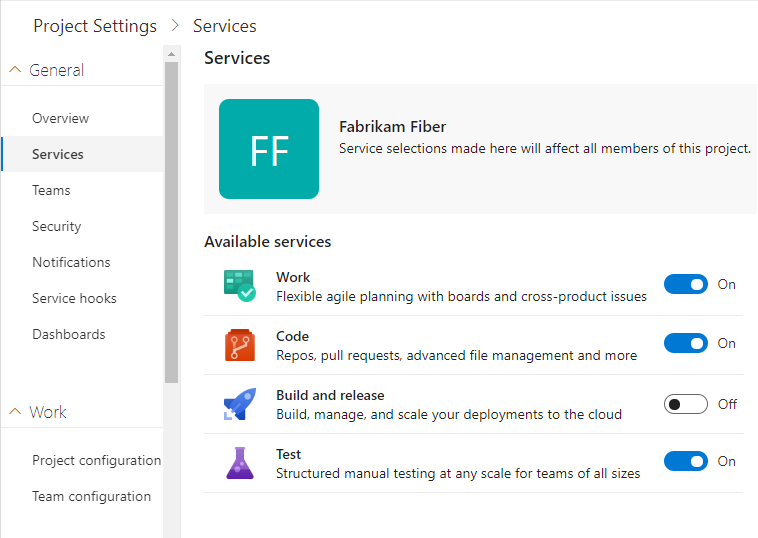
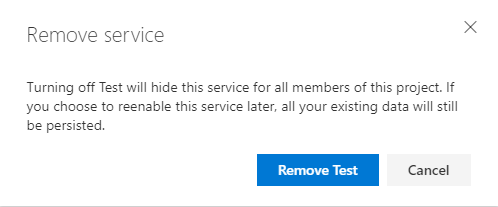

# Turn a service on or off

[!INCLUDE [temp](../../_shared/version-vsts-only.md)]

You can control which services are available through the web portal by turning a service on or off. Turning a service off removes the service from the user interface for all project users. However, data defined for the service is preserved and available if you later decide to turn the service on.  

## Prerequisites

- You must have an organization in Azure DevOps. If you don't have one, [do that now](../../user-guide/sign-up-invite-teammates.md).
- As an organization owner or member of the Project Administrators group, you can change policies and change project information. If you're not [a member get added as one](../security/set-project-collection-level-permissions.md#project-level).

## Change the visibility for a service  

The ability to turn services on or off is supported when you [enable **New Navigation** preview feature](../../project/navigation/preview-features.md).

[!INCLUDE [temp](../../_shared/new-navigation-cloud.md)]

# [New navigation](#tab/new-nav)  

1. Choose **Project Settings** in the sidebar.

	> [!div class="mx-imgBorder"]  
	>   

0. Choose **Services** under **General**.

	> [!div class="mx-imgBorder"]  
	>   

0. Choose the slider for the service that you want to enable or disable.  

	When turning a service off, confirm that you want to disable the service.

	> [!div class="mx-imgBorder"]  
	> 

0. Refresh your web browser to view the updates.

# [Previous navigation](#tab/previous-nav)

This feature isn't available from the previous navigation settings. However, you can enable **New Navigation**, change the service visibility, and then disable **New Navigation** to return to previous navigation. The services you change will be added or removed from the previous navigation user interface.

---

## Disabled objects and features

If you disable a service, dashboard widgets specific to that service are disabled. For example, if **Boards** is disabled, all work item tracking widgets and all Analytics widgets are disabled and won't appear in the [widget catalog](../../report/dashboards/widget-catalog.md).

If you disable **Boards**, you also disable [**Analytics views**](../../report/analytics/what-are-analytics-views.md).

## Related articles

- [About projects and scaling the organization](../projects/about-projects.md)  
- [Change the project visibility, public or private](../public/make-project-public.md)