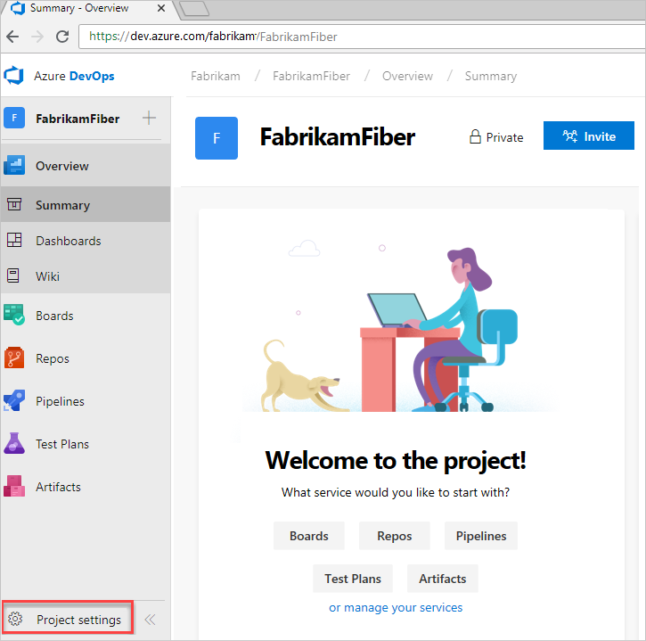
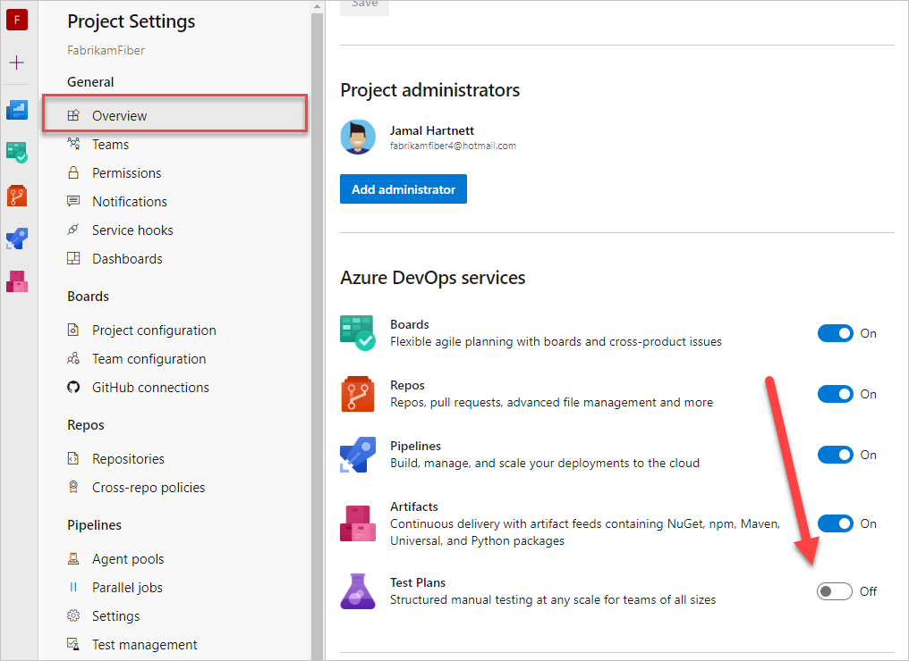
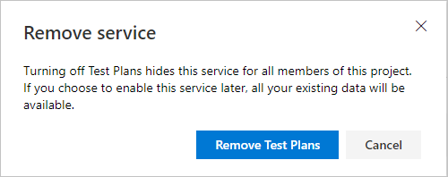

# Turn a service on or off

[!INCLUDE [version-vsts-plus-azdevserver-2019](../../includes/version-vsts-plus-azdevserver-2019.md)]

You can control which services are available through the web portal, by turning a service on or off. Turning off a service removes the service from the user interface for all project users. However, service data's preserved and available if you decide to turn on the service.  

## Prerequisites

::: moniker range="azure-devops"

- You must have an organization in Azure DevOps. If you don't have one, [do that now](../../user-guide/sign-up-invite-teammates.md).
- As an organization owner or member of the Project Administrators group, you can change policies and change project information. If you're not a member, [get added as one](../security/set-project-collection-level-permissions.md#project-level).
::: moniker-end

::: moniker range="azure-devops-2019 || azure-devops-2020"
- You must have a project defined. If you don't have one, [add one now](../projects/create-project.md).
- As a member of the Project Administrators group, you can change policies and change project information. If you're not a member, [get added as one](../security/set-project-collection-level-permissions.md#project-level).
- 
  ::: moniker-end

## Change the visibility for a service  

::: moniker range=">= azure-devops-2019"

1. Sign in to your organization (```https://dev.azure.com/{yourorganization}```) and select a project.
2. Choose **Project settings** in the sidebar.

	> [!div class="mx-imgBorder"]  
	>   

3. Select **Overview**, and then choose the slider for the service that you want to enable or disable.

	> [!div class="mx-imgBorder"]  
	>   

4. Confirm that you want to disable the service.

	> [!div class="mx-imgBorder"]  
	> 

5. Refresh your web browser to view the updates.

::: moniker-end

## Disabled objects and features

If you disable a service, dashboard widgets specific to that service are disabled. For example, if **Boards** is disabled, all work item tracking widgets and all Analytics widgets are disabled. They don't appear in the [widget catalog](../../report/dashboards/widget-catalog.md).

If you disable **Boards**, you also disable [**Analytics views**](../../report/powerbi/what-are-analytics-views.md).

## Related articles

::: moniker range="azure-devops"
- [About projects and scaling the organization](../projects/about-projects.md)  
- [Change the project visibility, public or private](../public/make-project-public.md)
- [About user, team, project, and organization-level settings](about-settings.md)
::: moniker-end

::: moniker range="azure-devops-2019 || azure-devops-2020"
- [About projects and scaling the organization](../projects/about-projects.md)  
- [About user, team, project, and collection-level settings](about-settings.md)
::: moniker-end