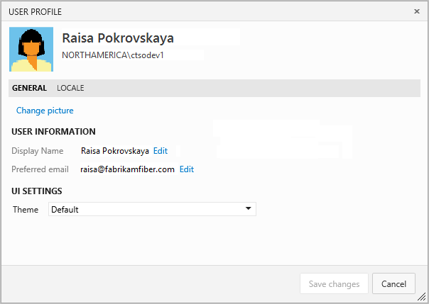

# Set your preferences

[!INCLUDE [temp](../../_shared/version-ts-tfs-2015-2016.md)]

From your profile page, you can change your picture or other account preferences. Specifically, you can set the following:

> [!div class="mx-tdBreakAll"]
> |Profile | Security  | Other |
> |-------------|----------|---------|
> |- Your picture - Your display name - Your preferred email - Locale settings |- [Personal access tokens](../../accounts/use-personal-access-tokens-to-authenticate.md) - [Alternate authentication credentials](../../git/auth-overview.md#alternate-credentials) - [OAuth authorizations](../../integrate/get-started/authentication/oauth.md) - [SSH public keys](../../git/use-ssh-keys-to-authenticate.md) |- [Manage personal notifications](../../notifications/manage-personal-notifications.md) - [Enable preview features](../../user-guide/work-web-portal.md#admin-context) |

Locale settings include language, date and time pattern, time zone, and user interface theme.

## Change profile settings 

::: moniker range="vsts"

To change your your account information, open your profile menu.

From the Profile/Information page, choose **Edit profile** to change the picture, display name, or preferred email. Open the Preferences page to change a locale preference.

::: moniker-end

::: moniker range=">= tfs-2015 <= tfs-2018"

Choose **edit** to change a setting. Choose the Locale tab to change a locale preference.

::: moniker-end

## Try this next

> [!div class="nextstepaction"]
> [Work effectively from your organizational hub](../../user-guide/account-home-pages.md)
> or
> [Set favorites](../../project/navigation/set-favorites.md)

  
