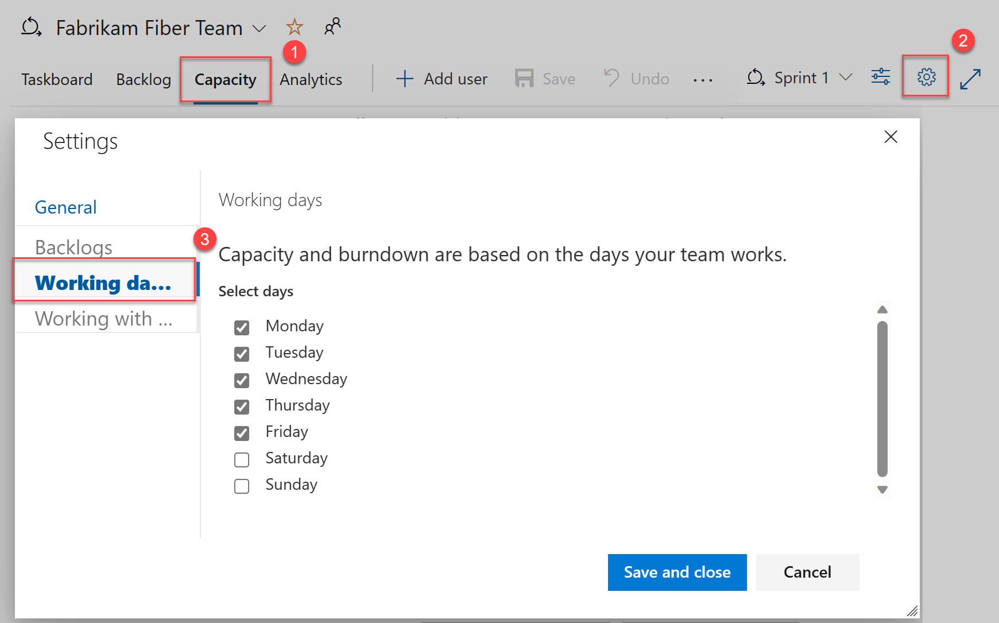
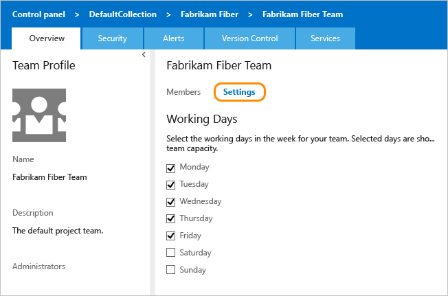

# Configure working days  

[!INCLUDE [temp](../../boards/includes/version-all.md)]

Configure the days that your team works. Your team's working days aid in capacity planning purposes and when you're using sprint and scrum methods in Azure Boards. Each team's sprint planning and tracking tools automatically consider days off when calculating capacity and sprint burndown. Leave those days of the week that your team doesn't work unchecked.

> [!NOTE]   
> The **Working days** setting specifies the days that teams regularly take off each week. To specify additional non-working days off, such as holidays or a team day off, set these through the **Capacity** page as described in [Set sprint capacity, Set capacity for the team and team members](../../boards/sprints/set-capacity.md#set-team-capacity).

[!INCLUDE [temp](includes/prerequisites-team-settings.md)]

<a id="team-services-work-days" />  

## Set working days  

::: moniker range="azure-devops"

1. In **Azure Boards**, select the **Sprints** tab.

   :::image type="content" source="media/configure-team/azure-boards-sprints-tab-selection.png" alt-text="Screenshot of selection of Azure Boards, and then the Sprints tab, with red boxes.":::

2. Select **Capacity** > Settings :::image type="icon" source="../../media/icons/team-settings-gear-icon.png" border="false"::: > **Working days**.

   

3. Select the checkbox next to the appropriate working days, and then select **Save and close**.

   Your team's working days are updated.

::: moniker-end

::: moniker range=">= tfs-2017 < azure-devops" 

1. From Azure Boards, select **Capacity** > :::image type="icon" source="../../media/icons/team-settings-gear-icon.png" border="false"::: > **Working days**.

     

2. Select the checkbox next to the appropriate working days, and then select **Save and close**.

   Your team's working days are updated.

::: moniker-end

::: moniker range="tfs-2015"   

<a  id="tfs-2015-work-days" />  

Open your team settings from the **Overview** tab of your team's admin context. Check or uncheck one or more days.

     

   Your changes are automatically saved.

::: moniker-end

::: moniker range="tfs-2013" 

To set non-working days, modify the **ProcessConfiguration** file. For details, see [Process configuration XML element reference, Set non-working days](../../reference/xml/process-configuration-xml-element.md#weekend_days). 

::: moniker-end

## Related articles

- [About Sprints, Scrum and project management](../../boards/sprints/scrum-overview.md) 
- [Scrum and sprint planning tools](../../boards/sprints/scrum-key-concepts.md)
- [Manage teams and configure team tools](manage-teams.md)
