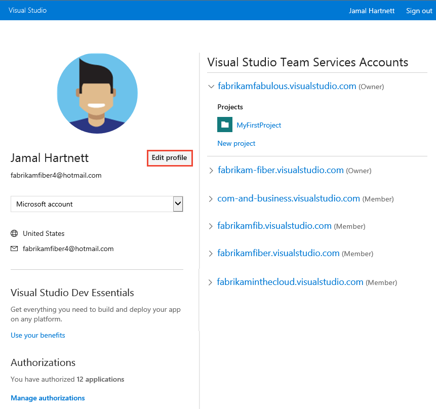

# Set user preferences

[!INCLUDE [temp](../../_shared/version-ts-tfs-2015-2016.md)]

From your profile page, you can change your picture or other account preferences. Specifically, you can set the following:

<table width="80%">
<tbody valign="top">
<tr>
<th width="35%">Area</th>
<th width="65%">Task</th>
</tr>
<tr>
<td>Profile </td>
<td>
<ul>
<li>Change your picture</li>
<li>Change your display name</li>
<li>Change your preferred email</li>
<li>Change your locale settings</li> 
</ul>
</td>
</tr>
<tr>
<td>Security</td>
<td>
<ul>
<li>[Personal access tokens](../../accounts/use-personal-access-tokens-to-authenticate.md)</li>
<li>[Alternate authentication credentials](../../repos/git/auth-overview.md#alternate-credentials)</li>
<li>[OAuth authorizations](../../integrate/get-started/authentication/oauth.md)</li>
<li>[SSH public keys](../../repos/git/use-ssh-keys-to-authenticate.md)</li> 
</ul>
</td>
</tr>
<tr>
<td>Other</td>
<td>
<ul>
<li>[Manage personal notifications](../../notifications/howto-manage-personal-notifications.md)</li>
<li>[Usage](../../integrate/concepts/rate-limits.md)</li>
<li>[Enable preview features](../../project/navigation/preview-features.md)</li> 
</ul>
</td>
</tr>
</tbody>
</table>

Locale settings include language, date and time pattern, time zone, and user interface theme.

::: moniker range=">= azure-devops-2019"  
## Change profile settings  

1. To change your user preferences, open your profile menu.

	> [!div class="mx-imgBorder"]  
	> 

0. Choose **Edit profile**. 

	> [!div class="mx-imgBorder"]  
	> 

0. From the **About** page, you can change your profile picture, change your display name, contact information, and country. 

	> [!div class="mx-imgBorder"]  
	> 

0. From the **Preferences** page, you can change your preferred language, date and time pattern, time zone, UI theme, and whether or not borders appear on work item forms for fields.

	> [!div class="mx-imgBorder"]  
	> 

::: moniker-end  

::: moniker range="<= tfs-2018"  
## Change profile settings  

1. To change your user preferences, open your profile menu.

	

0. Choose **Edit profile**. 

	> [!div class="mx-imgBorder"]  
	> 

0. From the **About** page, you can change your profile picture, change your display name, contact information, and country. 

	> [!div class="mx-imgBorder"]  
	> 

0. From the **Preferences** page, you can change your preferred language, date and time pattern, time zone, UI theme, and whether or not borders appear on work item forms for fields.

	> [!div class="mx-imgBorder"]  
	> 

::: moniker-end  

## Related articles

- [Set favorites](../../project/navigation/set-favorites.md)

