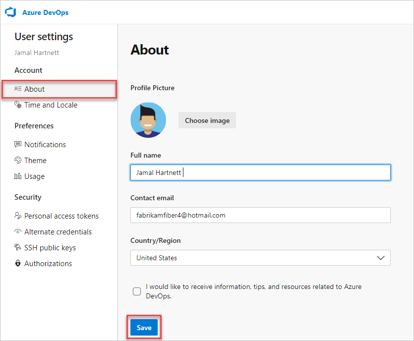
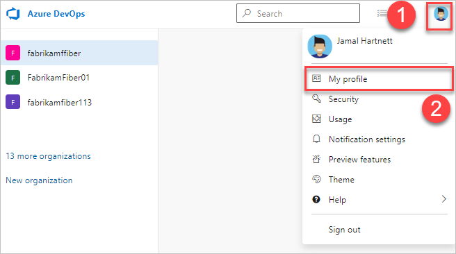
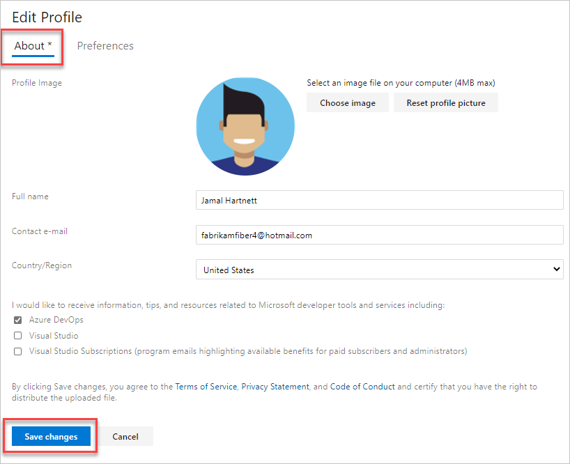
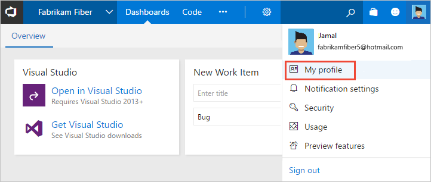

# Set your preferences

[!INCLUDE [version-all](../../includes/version-all.md)]

::: moniker range="azure-devops"

From your Azure DevOps user profile page, you can change your picture, display name, and preferred email. 

Other tools for setting your Azure DevOps preferences include:

- **[Time and Locale](../accounts/change-time-zone.md#change-your-user-profile-time-zone)**: Change your preferred language, date and time patterns, and time zone. 
- **[Notifications](../../notifications/manage-your-personal-notifications.md)**: Add or review subscriptions to event changes. 
- **Permissions**: Use to refresh your permissions to cause any recent changes to take effect.
- **[Preview features](../../project/navigation/preview-features.md)**: Enable or disable a preview feature for your user account.
- **Theme**: Choose the user interface theme to use with your Azure DevOps web portal. 

::: moniker-end

::: moniker range=">= azure-devops-2019 < azure-devops"

From your Azure DevOps user profile, you can change your picture, display name, preferred email, language, date and time pattern, time zone, and other user interface preferences. 

Other tools for setting your Azure DevOps preferences include: 

- [Use personal access tokens](../accounts/use-personal-access-tokens-to-authenticate.md) 
- [Use SSH key authentication](../../repos/git/use-ssh-keys-to-authenticate.md) 
- [Manage personal notifications](../../notifications/manage-your-personal-notifications.md)  

::: moniker-end

::: moniker range="< azure-devops-2019"

From your user profile, you can change your picture, display name, preferred email, language, date and time pattern, time zone, and other user interface preferences. 

Other tools for setting your Azure DevOps preferences include **[Notifications](../../notifications/manage-your-personal-notifications.md)** to add or review subscriptions to event changes. 

::: moniker-end

> [!NOTE]
> You can't change your Azure DevOps  user interface (UI) theme if you're using Internet Explorer (IE).

## Change profile settings  

::: moniker range="azure-devops"

> [!NOTE]   
> To enable the new user interface for the **New account manager**, see [Manage or enable features](../../project/navigation/preview-features.md).

#### [Preview page](#tab/preview-page) 

1. From your home page, select :::image type="icon" source="../../media/icons/user-settings-gear.png" border="false"::: **User settings**, and then select **Profile**.

   

2. From the **Profile** page, you can change your profile picture, change your display name, contact information, and country. Select **Save**. Select the **Time and Locale** tab to change more settings, like language, date and time pattern, time zone, and UI.

   

#### [Current page](#tab/current-page) 

1. To change your user preferences, open your profile menu, and then select **User settings**.

   

2. Select **Edit profile**.

   :::image type="content" source="media/select-edit-no-preview.png" alt-text="Select Edit profile no preview":::

1. You can change your profile picture, display name, contact information, and country. Select **Save**. Select the **Preferences** tab to change more settings, like language, date and time pattern, time zone, and UI.

   

::: moniker-end

* * *

::: moniker range="azure-devops-2019 || azure-devops-2020" 

1. To change your user preferences, open your profile menu, and then select **My profile**.

	:::image type="content" source="media/user-preferences/open-profile-menu-2020.png" alt-text="Select your profile menu, and then My profile":::

2. From the **General** tab, you can change the following information:
   - Profile picture
   - Display name
   - Preferred email 
   - Whether borders appear for fields on work item forms.

	:::image type="content" source="media/user-preferences/user-profile-dialog-general-tab.png" alt-text="User Profile dialog, General tab":::

3. From the **Locale** tab, you can change your preferred language, date and time pattern, and time zone. 

	:::image type="content" source="media/user-preferences/user-profile-dialog-locale-tab.png" alt-text="User Profile dialog, Locale tab":::

4. To change your UI theme, go back to your profile menu and select **Theme**. Choose between **Dark** and **Light**.

::: moniker-end

::: moniker range="<= tfs-2018" 

1. To change your user preferences, open your profile menu.

	

2. Choose **Edit profile**. 

	> [!div class="mx-imgBorder"]  
	> 

3. From the **About** page, you can change your profile picture, change your display name, contact information, and country. 

	> [!div class="mx-imgBorder"]  
	> 

4. From the **Preferences** page, you can change the following information:
    - preferred language
    - date and time pattern
    - time zone
    - UI theme
    - whether borders appear for fields on work item forms

	> [!div class="mx-imgBorder"]  
	> 

::: moniker-end

Your profile settings are updated.

## Related articles

- [Time zone settings and usage](../settings/timezone-settings-usage.md)
- [Manage personal notifications](../../notifications/manage-your-personal-notifications.md)  
- [Usage](../../integrate/concepts/rate-limits.md)  
- [Set favorites](../../notifications/manage-your-personal-notifications.md)  
- [Personal access tokens](../accounts/use-personal-access-tokens-to-authenticate.md)