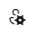

# Set user preferences

[!INCLUDE [version-all](../../includes/version-all.md)]

From your profile page, you can change your information and  account preferences. In this article, learn how to complete the following tasks:

- Change your picture
- Change your display name
- Change your preferred email
- Change your directory
- Change your locale settings - Locale settings include language, date and time pattern, time zone, and user interface theme.

> [!IMPORTANT]
> You can't change your user interface theme in Azure DevOps if you're using Internet Explorer (IE).

## Change profile settings  

::: moniker range="azure-devops"

> [!NOTE]   
> To enable the new user interface for the **New account manager**, see [Manage or enable features](../../project/navigation/preview-features.md).

#### [Preview page](#tab/preview-page) 

1. From your home page, select the user settings icon , and then select **Profile**.

   

2. From the **About** page, you can change your profile picture, change your display name, contact information, and country. Select **Save**.

   

#### [Current page](#tab/current-page) 

1. To change your user preferences, open your profile menu, and then select **User settings**.

   

2. You can change your profile picture, display name, contact information, and country. Select **Save**.

   

::: moniker-end

* * *

::: moniker range="azure-devops-2019 || azure-devops-2020" 

1. To change your user preferences, open your profile menu, and then select **My profile**.

    

2. From the **General** tab, you can change the following information:
   - profile picture
   - display name
   - contact information
   - whether borders appear for fields on work item forms

	

3. From the **Locale** tab, you can change your preferred language, date and time pattern, and time zone. 

   

4. To change your UI theme, go back to your profile menu and select **Theme**. Choose between **Dark** and **Light**.

   

::: moniker-end

::: moniker range="<= tfs-2018" 

1. To change your user preferences, open your profile menu.

	

2. Choose **Edit profile**. 

	> [!div class="mx-imgBorder"]  
	> 

3. From the **About** page, you can change your profile picture, change your display name, contact information, and country. 

	> [!div class="mx-imgBorder"]  
	> 

4. From the **Preferences** page, you can change the following information:
    - preferred language
    - date and time pattern
    - time zone
    - UI theme
    - whether borders appear for fields on work item forms

	> [!div class="mx-imgBorder"]  
	> 

::: moniker-end

## Related articles

- [Manage personal notifications](../../notifications/howto-manage-personal-notifications.md)  
- [Usage](../../integrate/concepts/rate-limits.md)  
- [Manage or enable features](../../project/navigation/preview-features.md)  
- [Set favorites](../../notifications/howto-manage-personal-notifications.md)  
- [Personal access tokens](../../accounts/use-personal-access-tokens-to-authenticate.md)  
- [Alternate authentication credentials](../../repos/git/auth-overview.md#alternate-credentials)  
- [OAuth authorizations](../../integrate/get-started/authentication/oauth.md)  
- [SSH public keys](../../repos/git/use-ssh-keys-to-authenticate.md)  
- [Manage authorizations](manage-authorizations.md)  

