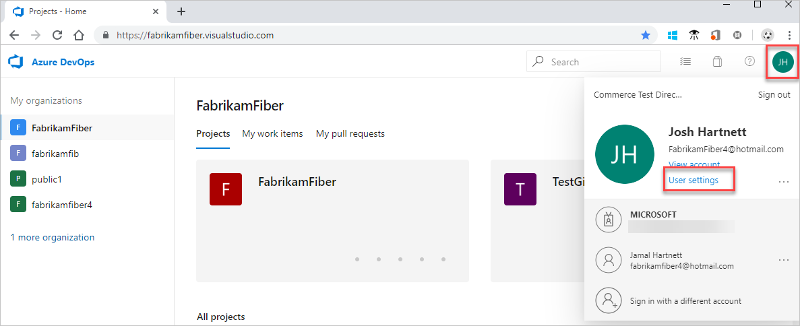

# Set user preferences

[!INCLUDE [version-vsts-tfs-all-versions](../../_shared/version-vsts-tfs-all-versions.md)]

From your profile page, you can change your picture or other account preferences. In this article, learn how to set the following. 

<table width="80%">
<tbody valign="top">
<tr>
<th width="35%">Area</th>
<th width="65%">Task</th>
</tr>
<tr>
<td>Profile </td>
<td>
<ul>
<li>Change your picture</li>
<li>Change your display name</li>
<li>Change your preferred email</li>
<li>Change your locale settings</li> 
</ul>
</td>
</tr>
</tbody>
</table>

Locale settings include language, date and time pattern, time zone, and user interface theme.

## Change profile settings 

::: moniker range="azure-devops"

1. To change your user preferences, open your profile menu, and then select **User settings**.

   

2. From the **About** page, you can change your profile picture, change your display name, contact information, and country. 

   

3. From the **Time and Locale** page, you can change your preferred language, date and time pattern, and time zone.

   
  
  If you can't find a setting, like the UI theme setting, visit your complete [Azure DevOps profile page](https://aex.dev.azure.com/go/profile/?campaign=o~msft~old~vsts~profile) and then select **Edit profile** > **Preferences**.

::: moniker-end

::: moniker range="azure-devops-2019"    

1. To change your user preferences, open your profile menu, and then select **My profile**.

    

2. From the **General** tab, you can change your profile picture, change your display name, contact information, and whether or not borders appear on work item forms for fields.

	

3. From the **Locale** tab, you can change your preferred language, date and time pattern, and time zone. 

   

4. To change your UI theme, go back to your profile menu and select **Theme**. Choose between **Dark** and **Light**.

   

::: moniker-end

::: moniker range="<= tfs-2018" 

1. To change your user preferences, open your profile menu.

	

2. Choose **Edit profile**. 

	> [!div class="mx-imgBorder"]  
	> 

3. From the **About** page, you can change your profile picture, change your display name, contact information, and country. 

	> [!div class="mx-imgBorder"]  
	> 

4. From the **Preferences** page, you can change your preferred language, date and time pattern, time zone, UI theme, and whether or not borders appear on work item forms for fields.

	> [!div class="mx-imgBorder"]  
	> 

::: moniker-end

For more information on setting your preferences, see the following articles.

<table width="80%">
<tbody valign="top">
<tr>
<th width="35%">Area</th>
<th width="65%">Task</th>
</tr>
<tr>
<td>Security</td>
<td>
<ul>
<li><a href="../../accounts/use-personal-access-tokens-to-authenticate.md" data-raw-source="[Personal access tokens](../../accounts/use-personal-access-tokens-to-authenticate.md)">Personal access tokens</a></li>
<li><a href="../../repos/git/auth-overview.md#alternate-credentials" data-raw-source="[Alternate authentication credentials](../../repos/git/auth-overview.md#alternate-credentials)">Alternate authentication credentials</a></li>
<li><a href="../../integrate/get-started/authentication/oauth.md" data-raw-source="[OAuth authorizations](../../integrate/get-started/authentication/oauth.md)">OAuth authorizations</a></li>
<li><a href="../../repos/git/use-ssh-keys-to-authenticate.md" data-raw-source="[SSH public keys](../../repos/git/use-ssh-keys-to-authenticate.md)">SSH public keys</a></li>
 <li><a href="manage-authorizations.md" data-raw-source="[Manage authorizations](manage-authorizations.md)">Manage authorizations</a></li>
</ul>
</td>
</tr>
<tr>
<td>Other</td>
<td>
<ul>
<li><a href="../../notifications/howto-manage-personal-notifications.md" data-raw-source="[Manage personal notifications](../../notifications/howto-manage-personal-notifications.md)">Manage personal notifications</a></li>
<li><a href="../../integrate/concepts/rate-limits.md" data-raw-source="[Usage](../../integrate/concepts/rate-limits.md)">Usage</a></li>
<li><a href="../../project/navigation/preview-features.md" data-raw-source="[Enable preview features](../../project/navigation/preview-features.md)">Enable preview features</a></li> 
</ul>
</td>
</tr>
</tbody>
</table>

## Related articles

- [Set favorites](../../project/navigation/set-favorites.md)

