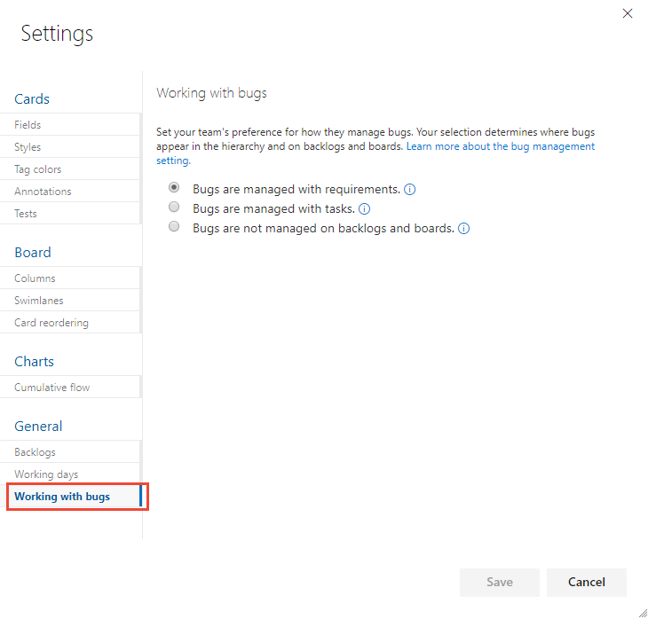

# Show bugs on backlogs and boards  

[!INCLUDE [version-lt-eq-azure-devops](../../includes/version-lt-eq-azure-devops.md)]

As your team identifies code defects or bugs, they can add them to the backlog and track them similar to tracking requirements. Or, they can schedule bugs to be fixed within a sprint along with other tasks.

When you *track bugs as **requirements***, they appear on the product Backlogs and Kanban boards. When you *track bugs as **tasks***, the bugs appear on Sprint Backlogs and Taskboards. For more information about other work item types, see [Add other work item types to backlogs or boards](#add-other-wits).

::: moniker range=">= azure-devops-2019"

You can define your team's tracking setting for the [Agile](../../boards/work-items/guidance/agile-process.md), [Scrum](../../boards/work-items/guidance/scrum-process.md), and [CMMI](../../boards/work-items/guidance/cmmi-process.md) processes. The Bug work item type isn't defined for the [Basic](../../boards/get-started/plan-track-work.md) process, so there isn't a team setting for Basic. Instead, you should track bugs and code defects using the Issue work item type. 
::: moniker-end

[!INCLUDE [requirements-term](../../boards/includes/note-requirements-terms.md)]

[!INCLUDE [temp](includes/prerequisites-team-settings.md)]

## Choose from options for bug tracking

The following table summarizes the options teams have for tracking bugs. Before you make your choice, we recommend you review the information provided in [Define, capture, triage, and manage bugs](../../boards/backlogs/manage-bugs.md), which provides an overview of the Bug work item type and supported tools for managing bugs.   

[!INCLUDE [temp](../../boards/includes/show-bugs-matrix-options.md)] 

## Set your team's preference for bug tracking

You can change settings from a backlog or board view, or from **Project settings** > **Team configuration**. 

:::image type="content" source="media/working-with-bugs-navigation.png" alt-text="Screenshot showing sequence of navigation selection for working with bugs from project settings.":::

In the following steps, we show how to change it from the board view.
 
::: moniker range=">= azure-devops-2019"  

1.  Sign in to your organization (```https://dev.azure.com/{yourorganization}```) and select your project.
2.  [Open your Kanban board](../../boards/boards/kanban-quickstart.md). If you're not a team admin, [get added as one](add-team-administrator.md). Only team and project admins can customize the Kanban board.
3. Choose **Board settings** :::image type="icon" source="../../media/icons/blue-gear.png" border="false"::: to configure the board and set general team settings.  

	> [!div class="mx-imgBorder"]
	>   

4. Choose **Working with bugs** and then choose the option that best meets your team's way of working.

	> [!div class="mx-imgBorder"]
	>   

5. When you're done with your changes, choose **Save**.  

6. To see the changes, open or refresh the team's [backlog](../../boards/backlogs/create-your-backlog.md) or [Kanban board](../../boards/boards/kanban-overview.md). 

::: moniker-end

::: moniker range="tfs-2018"

1. [Open your Kanban board](../../boards/boards/kanban-quickstart.md). If you're not a team admin, [get added as one](add-team-administrator.md). Only team and project admins can customize the Kanban board.

2. Choose **Board settings** :::image type="icon" source="../../media/icons/gear-icon.png" border="false"::: to open the settings dialog.  

	> [!div class="mx-imgBorder"]
	>   

3. Choose **Working with bugs** and then choose the option that best meets your team's way of working.

	> [!div class="mx-imgBorder"]
	>   

4. When done with your changes, choose **Save**.  

5. To see the changes, open or refresh your team's [backlog](../../boards/backlogs/create-your-backlog.md) or [Kanban board](../../boards/boards/kanban-overview.md).

::: moniker-end


## Nest items   

When you manage bugs with requirements or tasks, they appear on one or more of your Agile tool backlogs and boards. However, if you nest items&mdash;create parent-child links of items that belong in either the Requirements or Task categories&mdash;not all items may appear on your backlogs and boards. To learn more about how nested items are treated, see [How backlogs and boards display hierarchical (nested) items](../../boards/backlogs/resolve-backlog-reorder-issues.md).

> [!TIP]  
> If, after refreshing a backlog or board, you don't see bugs where you expect to see them, review [How backlogs and boards display hierarchical (nested) items](../../boards/backlogs/resolve-backlog-reorder-issues.md). Only leaf nodes of nested items appear on the Kanban or task boards.  
> 
<a id="add-other-wits" /> 

## Add other work item types to your backlogs or boards

Bugs are a common item that teams want to track, and choose how they track them. For more information, see [Manage bugs](../../boards/backlogs/manage-bugs.md). 

However, what if you want to track other work item types on your backlogs and boards?  

::: moniker range=">= azure-devops-2019"  

You can add other work item types&#8212;such as change requests, issues, or impediments—by customizing your process or project, based on the process model you use. For details,  
- For the Inheritance process model, see [Customize your backlogs or boards for a process](work/customize-process-backlogs-boards.md).   
- For Hosted XML and On-premises XML process models, see [Add a work item type to a backlog and board](../../reference/add-wits-to-backlogs-and-boards.md).

::: moniker-end

::: moniker range="tfs-2018"    

You can add other work item types&#8212;such as change requests, issues, or impediments—by customizing your process or project, based on the process model you use. For details, see [Add a work item type to a backlog and board](../../reference/add-wits-to-backlogs-and-boards.md).

::: moniker-end

For an overview of process models, see [Customize your work tracking experience](../../reference/customize-work.md).  

## Create, list, and manage bugs 

Bugs that are managed with requirements can be added through the [product backlog](../../boards/backlogs/create-your-backlog.md) or [Kanban board](../../boards/boards/kanban-quickstart.md). When bugs are managed along with tasks, you can add them to a [sprint backlog or task board](../../boards/sprints/add-tasks.md). Or, capture them using other tools. For more information, see [Define, triage, and manage bugs](../../boards/backlogs/manage-bugs.md).

> [!TIP]
> Effort should automatically be part of a bug, but if you don't see it, customize the bug work item type for it to appear.

You can review bugs defined for your project by creating a query and specifying the **Work Item Type=Bug**. Or, open a predefined query, **Active Bugs** (Agile and CMMI), or **Work in Progress** (Scrum).  

## Related articles


- [Define, capture, triage, and manage bugs](../../boards/backlogs/manage-bugs.md)
- [Enable backlog levels of interest to your team](select-backlog-navigation-levels.md) 
- [Manage teams and configure team tools](manage-teams.md)
- [View, run, or email a work item query](../../boards/queries/view-run-query.md)
- [Query by assignment or workflow changes](../../boards/queries/query-by-workflow-changes.md)
