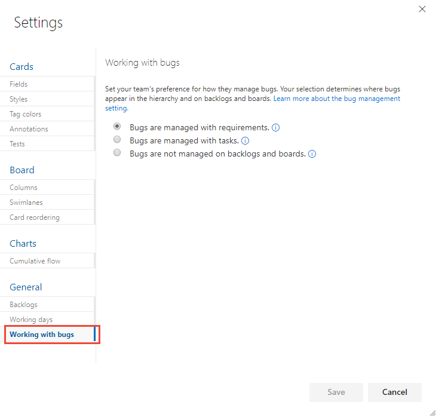
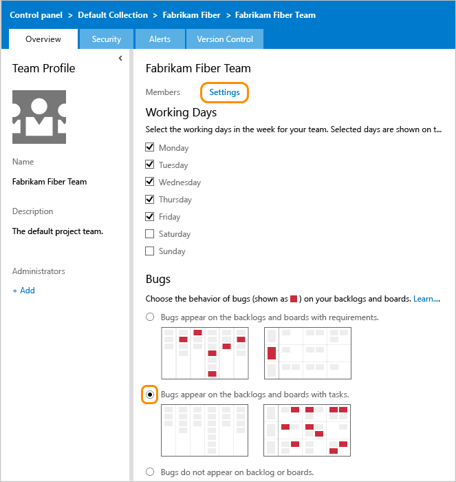

# Show bugs on backlogs and boards  

[!INCLUDE [temp](../../boards/_shared/version-vsts-tfs-all-versions.md)]

As your team identifies code defects or bugs, they can add them to the backlog and track them similar to requirements. Or, they can schedule them to be fixed within a sprint along with other tasks. 

::: moniker range="azure-devops"

> [!NOTE]   
You can define this team setting for the [Agile](/azure/devops/boards/work-items/guidance/agile-process), [Scrum](/azure/devops/boards/work-items/guidance/scrum-process), and [CMMI](/azure/devops/boards/work-items/guidance/cmmi-process) processes. The Bug work item type isn't defined for the [Basic](../../boards/get-started/track-issues-tasks.md) process, so there isn't a team setting for Basic. Instead, you should track bugs and code defects using the Issue work item type. 

::: moniker-end

When you track bugs as requirements, they'll show up on the product backlog and Kanban board. When you track bugs similar to tasks, they'll show up on the sprint backlogs and task boards. If you want to track additional work item types (WITs) or custom WITs on your backlogs or boards, you can. See [Add other work item types to backlogs or boards](#add-other-wits) later in this topic.

[!INCLUDE [temp](_shared/prerequisites-team-settings.md)]

## Set your team's preferences for tracking bugs  

You can change the setting from a backlog or board view. Here we show how to change it from the board view.

In the **Working with bugs** dialog, you can select from the following three options.

* Choose the first option when your team wants to manage bugs similar to requirements. Bugs can be estimated and tracked against team velocity and cumulative flow. Bugs are associated with the Requirements category.  

* Choose the second option when your team wants to manage bugs similar to tasks. Remaining work can be tracked for bugs and tracked against the sprint capacity and burndown. Bugs are associated with the Task category. 

* Choose the last option if your team manages bugs separate from requirements or tasks. Bugs are associated with the Bugs category and won't appear on either backlogs or boards.  

::: moniker range=">= azure-devops-2019"  

1.  [Open your Kanban board](../../boards/boards/kanban-quickstart.md). If you're not a team admin, [get added as one](add-team-administrator.md). Only team and project admins can customize the Kanban board.

2. Choose the  gear icon to configure the board and set general team settings.  

	> [!div class="mx-imgBorder"]
	>   

0. Choose **Working with bugs** and then choose the option that best meets your team's way of working.

	> [!div class="mx-imgBorder"]
	>   

0. When done with your changes, choose **Save**.  

0. To see the changes, open or refresh the team's [backlog](../../boards/backlogs/create-your-backlog.md) or [Kanban board](../../boards/boards/kanban-basics.md). 

::: moniker-end

::: moniker range=">= tfs-2017 <= tfs-2018"

0.  [Open your Kanban board](../../boards/boards/kanban-quickstart.md). If you're not a team admin, [get added as one](add-team-administrator.md). Only team and project admins can customize the Kanban board.

0. Choose the  gear icon to open the  settings dialog.  

	> [!div class="mx-imgBorder"]
	>   

0. Choose **Working with bugs** and then choose the option that best meets your team's way of working.

	> [!div class="mx-imgBorder"]
	>   

0. When done with your changes, choose **Save**.  

0. To see the changes, open or refresh your team's [backlog](../../boards/backlogs/create-your-backlog.md) or [Kanban board](../../boards/boards/kanban-basics.md).

::: moniker-end

::: moniker range="<= tfs-2015"

Requires TFS 2013.4 or later version. 

0. Open your team settings from the **Overview** tab of your team's admin context. Your changes are automatically saved. 

0. Choose the , (gear icon) to open the administration page.  

	

0. From the **Overview** tab, choose the team whose settings you want to configure, and then choose **Settings**. Select the option you want. Your changes are automatically saved.   

	  

0. To see the changes, open or refresh the team's [backlog](../../boards/backlogs/create-your-backlog.md) or [Kanban board](../../boards/boards/kanban-basics.md).

::: moniker-end

## Nested items  

> [!TIP]  
> If, after refreshing a backlog or board, and you don't see bugs where you expect them, review [How backlogs and boards display hierarchical (nested) items](../../boards/backlogs/resolve-backlog-reorder-issues.md). Only leaf nodes of nested items appear on the Kanban or task boards.   

When you manage bugs with requirements or with tasks, they'll show up on one or more of your Agile tool backlogs and boards. However, if you nest items&mdash;create parent-child links of items that belong in either the Requirements or Task categories&mdash;then not all items may appear on your backlogs and boards. To learn more about how nested items are treated, see [How backlogs and boards display hierarchical (nested) items](../../boards/backlogs/resolve-backlog-reorder-issues.md). 

<a id="add-other-wits" /> 
## Add other work item types to your backlogs or boards

Bugs are a common item that teams want to track, and choose how they track it. See [Manage bugs](../../boards/backlogs/manage-bugs.md) for more guidance. 

However, what if you want to track other work item types (WITs) on your backlogs and boards?  

::: moniker range=">= azure-devops-2019"  
You can add other WITs&#8212;such as change requests, issues, or impediments&#8212; by customizing your process or project, based on the process model you use. For details,  
- For the Inheritance process model, see [Customize your backlogs or boards for a process](work/customize-process-backlogs-boards.md).   
- For Hosted XML and On-premises XML process models, see [Add a work item type to a backlog and board](../../reference/add-wits-to-backlogs-and-boards.md).
::: moniker-end

::: moniker range="<= tfs-2018"    
You can add other WITs&#8212;such as change requests, issues, or impediments&#8212; by customizing your process or project, based on the process model you use. For details, see [Add a work item type to a backlog and board](../../reference/add-wits-to-backlogs-and-boards.md).
::: moniker-end
For an overview of process models, see [Customize your work tracking experience](../../reference/customize-work.md).  

## Create, list, and manage bugs 

When bugs are managed along with requirements, you can add them through the [product backlog](../../boards/backlogs/create-your-backlog.md) or [Kanban board](../../boards/boards/kanban-quickstart.md). When bugs are managed along with tasks, you can add them to a [sprint backlog or taskboard](../../boards/sprints/add-tasks.md). Or, you can capture them using other tools as indicated in [Define, triage, and manage bugs](../../boards/backlogs/manage-bugs.md).

You can review bugs defined for your project by creating a query and specifying the **Work Item Type=Bug**. Or, open a predefined query, **Active Bugs** (Agile and CMMI) or **Work in Progress** (Scrum). For other bug related tasks, see the following articles:  

::: moniker range=">= azure-devops-2019"
- [View, run, or email a work item query](../../boards/queries/view-run-query.md)
- [View and add work items using the Work Items page](../../boards/work-items/view-add-work-items.md)
- [Triage work items](../../boards/queries/triage-work-items.md)
- [Query by assignment or workflow changes](../../boards/queries/query-by-workflow-changes.md)

::: moniker-end

::: moniker range="<= tfs-2018"
- [View, run, or email a work item query](../../boards/queries/view-run-query.md)
- [Triage work items](../../boards/queries/triage-work-items.md)
- [Query by assignment or workflow changes](../../boards/queries/query-by-workflow-changes.md)

::: moniker-end

## Related articles
- [Enable backlog levels of interest to your team](select-backlog-navigation-levels.md) 
- [Manage teams and configure team tools](manage-teams.md)  

