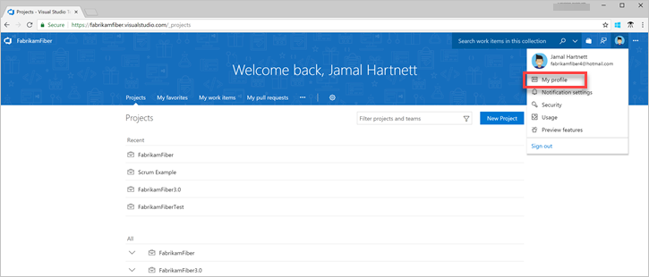
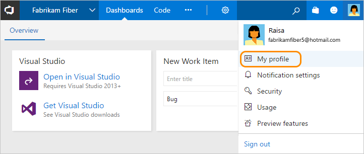

# Set your user preferences

**VSTS | TFS 2015**

From your profile page, you can change your picture or other user preferences. Specifically, you can set the following:

> [!div class="mx-tdBreakAll"]
> |Profile | Security  | Other |
> |-------------|----------|---------|
> |- Your picture - Your display name - Your preferred email - Locale settings |- [Personal access tokens][Authenticate access with personal access tokens for VSTS and TFS](../accounts/use-personal-access-tokens-to-authenticate.md) - [Alternate authentication credentials](../../git/auth-overview.md#alternate-credentials) - [OAuth authorizations](../../integrate/get-started/authentication/oauth.md) - [SSH public keys](../../git/use-ssh-keys-to-authenticate.md) |- [Manage personal notifications](../../notifications/manage-personal-notifications.md) - [Enable preview features](../../user-guide/work-web-portal.md#admin-context) |

Locale settings include language, date and time pattern, time zone, and user interface theme.

## Change profile settings (VSTS)

To change your your organization information, open your organization menu.

From the Profile/Information page, choose **Edit profile** to change the picture, display name, or preferred email. Open the Preferences page to change a locale preference.

![VSTS, edit profile]!(_img/user-prefs-vsts-edit-profile.png)

## Change profile settings (TFS)

Choose **edit** to change a setting. Choose the Locale tab to change a locale preference.

## Try this next

> [!div class="nextstepaction"]
> [Work effectively from your organization hub](../../user-guide/organization-home-pages.md)
> or
> [Set favorites](../../project/navigation/set-favorites.md)

  
