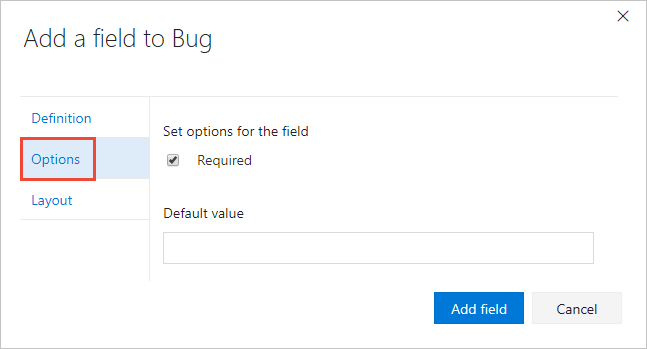
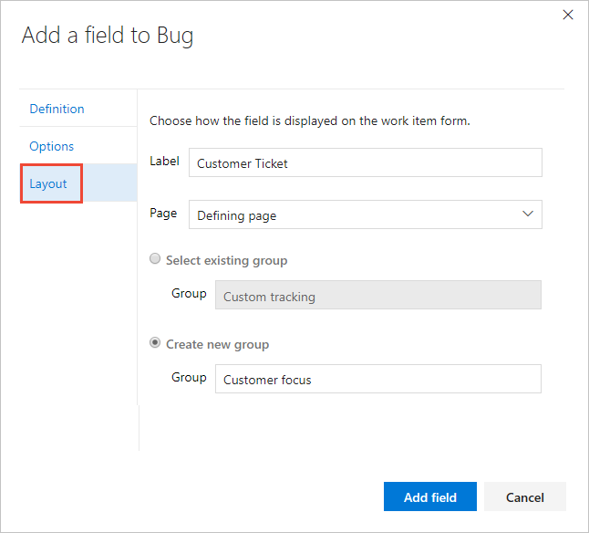
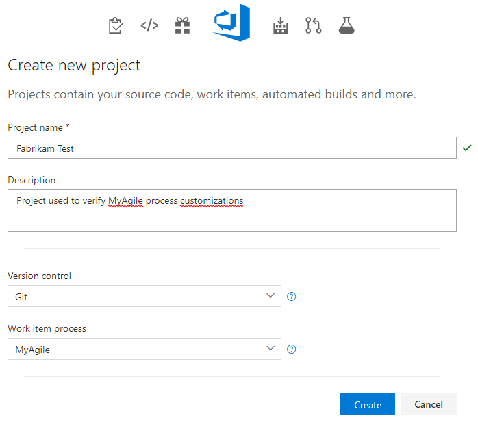
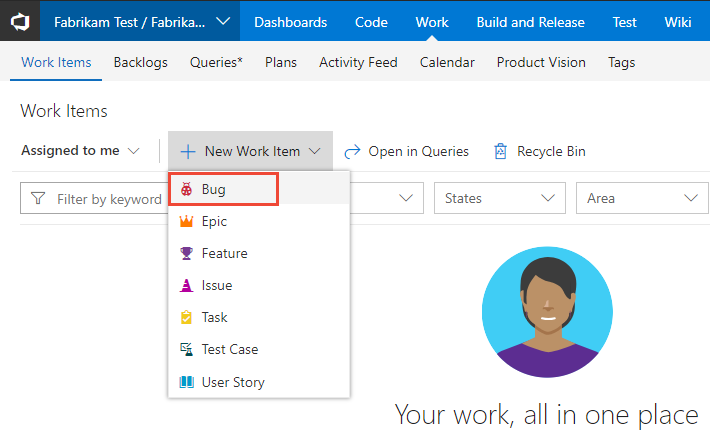
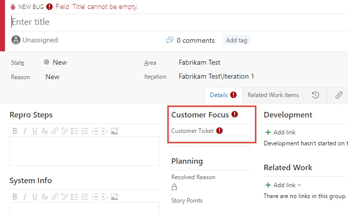

# Add a custom field to a work item type (Inheritance process)    

[!INCLUDE [temp](../../../boards/_shared/version-vsts-plus-azdevserver-2019.md)]

You add a custom field to support tracking data requirements you have that aren't met with the existing set of fields. For example, you can add a custom field to track a customer ticket number. For a list of all fields defined for your organization&mdash;which includes all fields defined for system and inherited processes&mdash;see [Review fields](customize-process-field.md#review-fields).  

[!INCLUDE [temp](../_shared/note-on-prem-link.md)]

To learn more about what you can customize, see [About process customization and inherited processes](inheritance-process-model.md). 

> [!TIP]    
> To customize a single project, always start by [creating an inherited process and updating your project to that process](manage-process.md). Then, all the customizations that you make to the inherited process automatically appear for the project you migrated.

[!INCLUDE [temp](../_shared/process-prerequisites.md)] 

[!INCLUDE [temp](../_shared/open-process-admin-context-ts.md)]

[!INCLUDE [temp](../_shared/create-inherited-process.md)]

## Add a field 

You always add a field to an existing work item type.  

0. From the **Process** page of the selected  inherited process, choose the work item type you want to add the custom field to. 

	Here we choose the Bug WIT. Note the breadcrumb links that allow you to move back to the **All Processes** and **MyAgile** process page. 

	> [!div class="mx-imgBorder"]  
	>  
	
0. With the WIT selected, choose the  (**New Field** icon).  

	> [!div class="mx-imgBorder"]  
	>  

0. Name the field and select the field type from one of the supported data types. Field names must be unique and no more than 128 characters. For additional restrictions, see [What is a field? How are field names used?](inheritance-process-model.md#field-reference). Optionally, add a description.  

	> [!NOTE]   
	> Once created, you can't change the field name or data type. 

	Here we add an Integer field labeled Customer Ticket. 

     

	Additional data types you can add include: [Picklist](customize-process-field.md#add-a-picklist)(customize-process-field.md#add-a-pick-list), [Identity](customize-process-field.md#add-an-identity-field), [Rich-text, HTML](customize-process-field.md#add-a-rich-text-html-field), [Checkbox](customize-process-field.md#add-a-checkbox-field).  
	  
0.	(Optional) On the **Options** tab, indicate if the field is required and specify a default value. Or leave these blank. 

	  

	By making a field Required, users must specify a value for the field in order to save it. The default value you specify is set when you create a work item as well as every time a work item is opened and the field is empty.

	
0.	(Optional) On the **Layout** tab, you can enter a different form label than the name of the field. Also, you can choose the page and group where the field appears on the form. 

	Here, we add the Customer Ticket field to a new group labeled Customer focus. 

	  

0.	Click **Add field** to complete adding the field. If you haven't specified it's layout location, it is added to the first group of fields on the layout form.  

	> [!TIP]    
	> Once you've added a field, you can drag-and-drop it within a page to relocate it on the form. If you have several fields you want to add to a custom page or group, then you may want to [add those elements first](customize-process-form.md) and then add your fields. 

## Verify the customization you made 

We recommend that you create a test project and apply your customized  inherited process to it to verify the changes you've made. 

1. Open the **All processes** page, and choose the &hellip; context menu for the process you want to use, and then select **New team project**.  

	> [!div class="mx-imgBorder"]  
	>  

0. The Create new project page opens. Fill out the form. 

	> [!div class="mx-imgBorder"]  
	>  

0.  Open **Work Items**. (1) Check that you have selected the right project, then (2) choose **Work>Work Items**. 

	> [!div class="mx-imgBorder"]  
	> 

0. Select the WIT you customized. Here we choose **Bug**. 

	> [!div class="mx-imgBorder"]  
	>  

0.  Verify that the field you added appears on the form. Note that the  (exclamation mark) icon indicates the field is required.  

	> [!div class="mx-imgBorder"]  
	>  
	

[!INCLUDE [temp](../_shared/change-project-to-inherited-process.md)] 

## Try this next
> [!div class="nextstepaction"]
> [Add a custom work item type](add-custom-wit.md) 
> Or
> [Add or manage fields](customize-process-wit.md)

## Related articles  

- [Add and manage fields for an inherited process](customize-process-field.md#show-hide-field) 
- [Customize a project using an inherited process](customize-process.md)
- [Create and manage inherited processes](manage-process.md)

