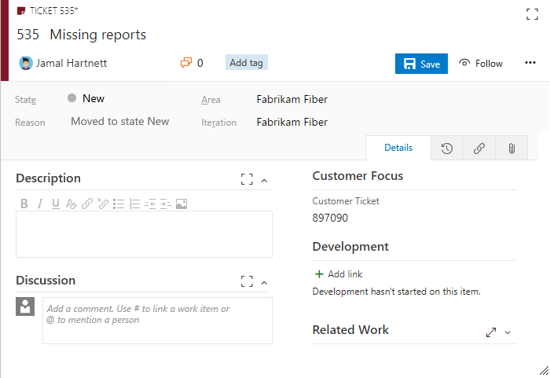
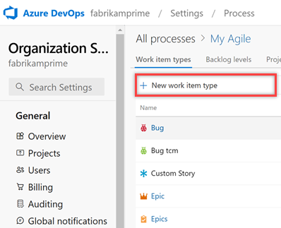
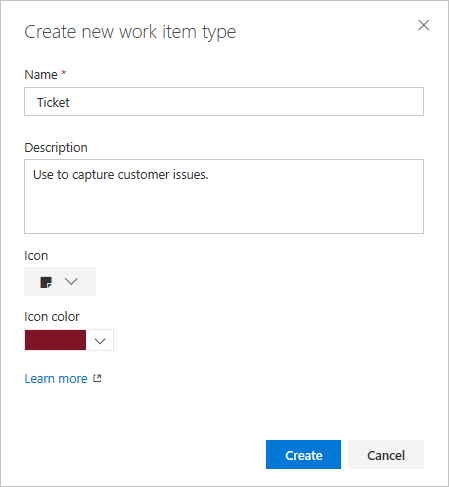
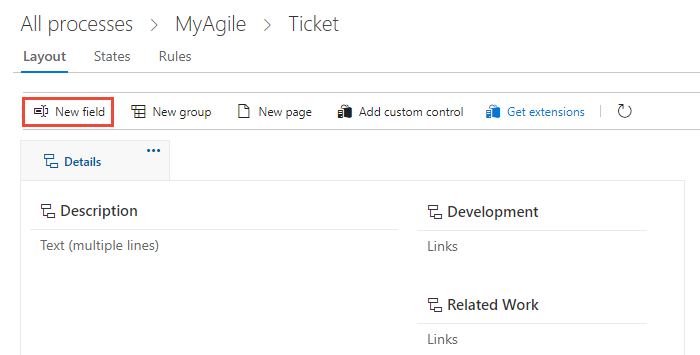
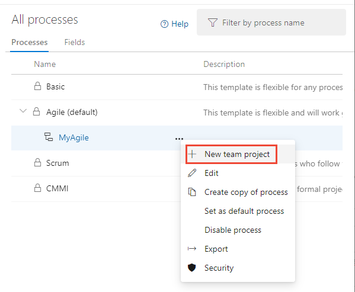
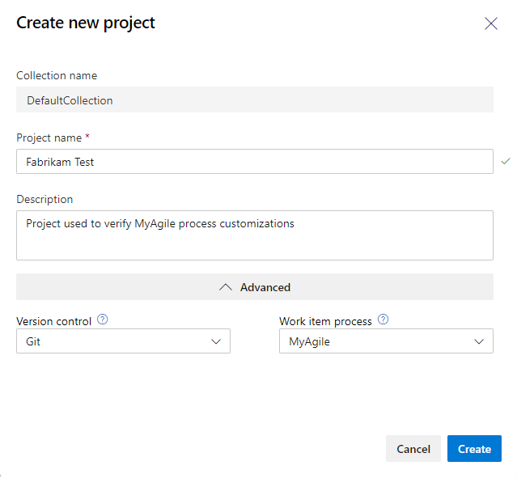
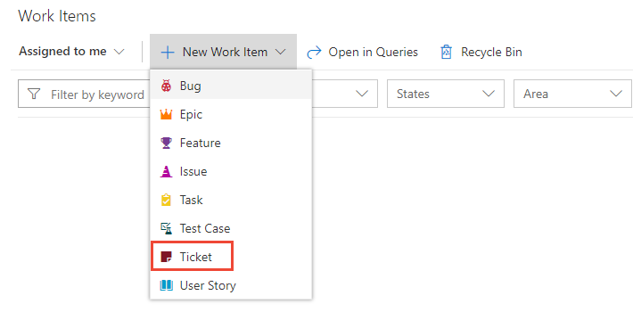
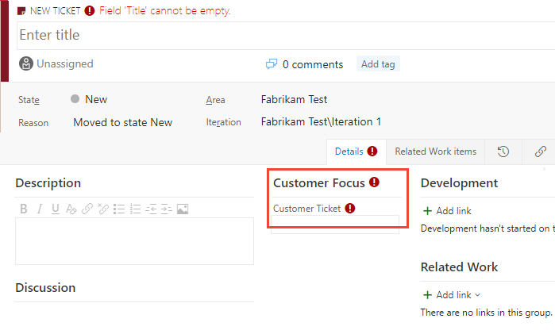

# Add a custom work item type (Inheritance process)     

[!INCLUDE [temp](../../../boards/includes/version-vsts-plus-azdevserver-2019.md)]

You use different work item types (WITs) to plan and track different types of work. The main reason you add a custom WIT is to customize the web form and workflow states to meet specific business use cases. Or, you can customize an existing WIT. Your project contains 9 or more WITs that you can customize, based on the process used to create your project.  

[!INCLUDE [temp](../includes/note-on-prem-link.md)]

For example, you may want to capture customer issues in a custom WIT labeled Ticket.   

> [!div class="mx-imgBorder"]  
> 

To learn more about what you can customize, see [About process customization and inherited processes](inheritance-process-model.md). 

> [!TIP]    
> To customize a single project, always start by [creating an inherited process and migrating project(s) to that process](manage-process.md). Then, all the customizations that you make to the inherited process automatically appear for the project you migrated.

[!INCLUDE [temp](../includes/process-prerequisites.md)] 

[!INCLUDE [temp](../includes/open-process-admin-context-ts.md)]

[!INCLUDE [temp](../includes/create-inherited-process.md)] 

## Add a work item type

1. From the **Work Item Types** page, choose the :::image type="icon" source="../../../media/icons/blue-add-icon.png" border="false"::: **New work item type**.

	
 
1. Name the WIT and optionally specify a description, icon and color. The icon and color you specify appear throughout the web portal, including on the work item form and when associated work items appear on a backlog, boards, query results, and more. 

	

	Choose **Create** to save. 

	Each new WIT comes predefined with a Details page with the Description field, and Discussion, Development, and Related Work groups. Also added, but not shown nor editable, are the standard elements included with the header of the form as shown in the following image, as well as the history, links, and attachment pages. To learn more, see [About work items](../../../boards/work-items/about-work-items.md).
 
	

2. Name the field and select the field type from one of the supported data types. Field names must be unique and no more than 128 characters. For additional restrictions, see [What is a field? How are field names used?](inheritance-process-model.md#field-reference). Optionally, add a description.  
	
	Here we add an Integer field labeled Customer Ticket. 

     

	Additional data types you can add include: [Picklist](customize-process-field.md#pick-list), [Identity](customize-process-field.md#identity), [Rich-text, HTML](customize-process-field.md#html), and [Checkbox](customize-process-field.md#boolean-field).  
	  
3. (Optional) On the **Options** tab, indicate if the field is required and specify a default value. Or leave these blank. 

   

   By making a field Required, users must specify a value for the field in order to save it. The default value you specify is set when you create a work item as well as every time a work item is opened and the field is empty.

   
4. (Optional) On the **Layout** tab, you can enter a different form label than the name of the field. Also, you can choose the page and group where the field appears on the form.  

   Here we choose to add a new field. Choose the :::image type="icon" source="media/process/new-field-icon.png" border="false"::: (**New Field** icon).  

   > [!div class="mx-imgBorder"]  
   >     

5. Here, we add the Customer Ticket field to a new group labeled Customer focus. 

    

6. Choose **Add field** to complete adding the field. If you haven't specified it's layout location, it is added to the first group of fields on the layout form.  

   > [!TIP]    
   > Once you've added a field, you can drag-and-drop it within a page to relocate it on the form. If you have several fields you want to add to a custom page or group, then you may want to [add those elements first](customize-process-form.md) and then add your fields. 

## Verify the customization you made 

We recommend that you create a test project and apply your customized  inherited process to it to verify the changes you've made. 

1. Open the **All processes** page, and choose the &hellip; context menu for the process you want to use, and then select **New team project**.  

	::: moniker range="azure-devops"
	> [!div class="mx-imgBorder"]  
	>  
	::: moniker-end
	::: moniker range="azure-devops-2020"
	> [!div class="mx-imgBorder"]  
	>  
	::: moniker-end
	::: moniker range="azure-devops-2019"
	> [!div class="mx-imgBorder"]  
	>  
	::: moniker-end

1. The Create new project page opens. Fill out the form. 

	::: moniker range="azure-devops"
	> [!div class="mx-imgBorder"]  
	>  
	::: moniker-end
	::: moniker range="azure-devops-2020"
	> [!div class="mx-imgBorder"]  
	>  
	::: moniker-end
	::: moniker range="azure-devops-2019"
	> [!div class="mx-imgBorder"]  
	>  
	::: moniker-end

2. Open **Work Items**. (1) Check that you have selected the right project, then (2) choose **Work>Work Items**. 

   > [!div class="mx-imgBorder"]  
   >   

3. Select the WIT you customized. Here we choose **Ticket**. 

	> [!div class="mx-imgBorder"]  
	>  

	If you don't see the custom WIT, refresh your browser to make sure it registers all the custom changes you've made. 

4. Verify that the field you added appears on the form. Note that the :::image type="icon" source="../../../media/icons/required-icon.png" border="false"::: (exclamation mark) icon indicates the field is required.  

   > [!div class="mx-imgBorder"]  
   >   

[!INCLUDE [temp](../includes/change-project-to-inherited-process.md)] 

## Custom item created shows as unparented in Sprint section on Boards. 

Custom item created called ‘Goals’ and assigned ‘Task’ as their child on his Process,  Sprint section on Boards shows all items as unparented. See image for reference:
 

1. Go to Organization Settings > Process > Select your Process where you created your custom item, for example:  
	> [!div class="mx-imgBorder"]  
	

2. Go to Backlog levels tab > Requirement backlog; click on the three dots option and click on Edit/Rename option:
	> [!div class="mx-imgBorder"]  
	

3. Check your custom item(s) created and click on Save: 
	> [!div class="mx-imgBorder"]  
        

4. Once you follow this instructions, you will see the items with their respective parents on your sprints: 
	> [!div class="mx-imgBorder"]  
	

[!INCLUDE [temp](../includes/change-project-to-inherited-process.md)] 
## Try this next
> [!div class="nextstepaction"]
> [Customize the web layout](customize-process-form.md) 
> Or
> [Customize the workflow](customize-process-workflow.md)

## Related articles 

[!INCLUDE [temp](../includes/note-audit-log-support-process.md)]

- [Customize a project using an inherited process](customize-process.md)
- [Create and manage inherited processes](manage-process.md)
- [Customize the workflow states](customize-process-workflow.md). 
- [Customize your backlogs or boards for a process](customize-process-backlogs-boards.md).  

 

  

