# Apply rules to workflow states (Inheritance process)   

[!INCLUDE [version-gt-eq-2019](../../../includes/version-gt-eq-2019.md)]

After you add or modify your workflow states for a work item type, define rules that apply based on the workflow state change. Adding rules to workflow states supports the following scenarios: 

::: moniker range="azure-devops"
- Support an approval process 
- Prevent unauthorized users from setting an invalid state 
- Make a field required or read-only or another value based on State changes
- Restrict transition from one state to another
- Restrict or allow State transitions to specific users or groups  
- Maintain a controlled workflow process, supporting auditing requirements 
- Automate closure of parent work items
::: moniker-end

::: moniker range=">= azure-devops-2020 < azure-devops"
- Support an approval process 
- Prevent unauthorized users from setting an invalid state 
- Make a field required or read-only or another value based on State changes
- Restrict transition from one state to another
- Automate closure of parent work items 
::: moniker-end

::: moniker range="azure-devops-2019"
- Support an approval process 
- Make a field required or read-only or another value based on State changes
- Automate closure of parent work items
::: moniker-end

[!INCLUDE [temp](../includes/note-on-prem-link.md)]

## Prerequisites

| Category | Requirements |
|--------------|-------------|
| **Permissions** | - To manage security groups and permissions at the project level, which includes setting rules for workflow states: **Project Administrator**. - To manage the work tracking area: **Project Administrator** or specifically assigned the **Work Item Tracking** permission. |
| **Access levels** | **Basic** access, which is typically sufficient for most users who need to manage work items and apply rules to workflow states. |

## Understand workflow rules 

::: moniker range="azure-devops"
The following table outlines the three groups of workflow rules you can define:

1. **Standard actions:**
   - Apply when a work item is created, in a selected state, or moved from one state to another.
   - Actions include setting the value of a field, making a field read-only, or making a field required.
   - You can specify one or two conditions and several actions.

2. **Restricting state transitions (group 1):**
   - Specify one condition indicating the state a work item moved from.
   - Define actions to restrict transitions from that state to other states.

3. **Restricting state transitions (group 2):**
   - Similar to the first group, specify one condition indicating the state a work item moved from.
   - Define actions to restrict transitions from that state to other states.
::: moniker-end

::: moniker range=">= azure-devops-2020 < azure-devops"
The following table outlines the two groups of workflow rules you can define:

1. **Standard actions:**
   - Apply when a work item is created, in a selected state, or moved from one state to another.
   - Actions include setting the value of a field, making a field read-only, or making a field required.
   - You can specify one or two conditions and several actions.

2. **Restricting state transitions:**
   - Specify one condition indicating the state a work item moved from.
   - Define one or more actions to restrict transitions from that state to other states.
::: moniker-end

[!INCLUDE [temp](../../../boards/includes/note-azure-devops-2020-1-updates.md)]

::: moniker range="azure-devops-2019"
Workflow conditions and actions you can set are illustrated in the following images. You can apply standard actions when a work item is created, in a selected state, or is moved from one state to another. These standard actions set the value of a field or make a field read-only or required. For this set of rules, you can specify one or two conditions and several actions. 
::: moniker-end

---
:::row:::
   :::column span="2":::
      **Condition**
   :::column-end:::
   :::column span="2":::
      **Supported Actions**
   :::column-end:::
:::row-end:::  
---  
:::row:::  
   :::column span="4":::
      **Set field value or make read-only/required based on State**
   :::column-end:::
:::row-end:::
:::row:::  
   :::column span="2":::
      > [!div class="mx-imgBorder"]  
      > 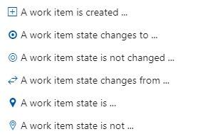
   :::column-end:::
   :::column span="2":::
      > [!div class="mx-imgBorder"]  
      > 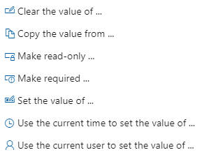
   :::column-end:::
:::row-end:::
---  
::: moniker range=">= azure-devops-2020 < azure-devops"
:::row:::  
   :::column span="4":::
      **Restrict a transition based on State**
   :::column-end:::
:::row-end:::
:::row:::  
   :::column span="2":::
      > [!div class="mx-imgBorder"]  
      > 
   :::column-end:::
   :::column span="2":::
      > [!div class="mx-imgBorder"]  
      > 
:::row-end:::
---  
::: moniker-end
::: moniker range=">= azure-devops-2020 < azure-devops"
:::row:::  
   :::column span="4":::
      **Hide field or make field read-only or required based on State and user or group membership**
   :::column-end:::
:::row-end:::
:::row:::  
   :::column span="2":::
      > [!div class="mx-imgBorder"]  
      > 
   :::column-end:::
   :::column span="2":::
      > [!div class="mx-imgBorder"]  
      > 
   :::column-end:::
:::row-end:::
--- 
::: moniker-end
::: moniker range="azure-devops"
:::row:::  
   :::column span="4":::
      **Based on and user or group membership, set a field attribute or restrict a State transition**
   :::column-end:::
:::row-end:::
:::row:::  
   :::column span="2":::
      > [!div class="mx-imgBorder"]  
      > 
   :::column-end:::
   :::column span="2":::
      > [!div class="mx-imgBorder"]  
      > 
   :::column-end:::
:::row-end:::
--- 
::: moniker-end

[!INCLUDE [temp](../includes/automatic-update-project.md)]

## Understand workflow state and rule limits 

Workflow rules get applied when you add or modify work items through any of the following interfaces: 
- **Web portal:** Work item form, bulk updates, updates in query view  ​
- **Web portal:** Board or Taskboard, move work item to column​
- **Visual Studio 2017** and earlier versions, work item form 
- **CSV file format:** Bulk import or update 
- **Excel​:** Bulk import or update 
- **REST API​:** Add or modify work items 

The following table summarizes the workflow state and rule limits for the Inheritance process. 

|Object|Inheritance limit|  
|------|-----------------|  
| Work item types defined for a process | 64 |
| Workflow states defined for a work item type | 32 |
| Rules defined for a work item type | 1024 |

When you define workflow states and rules, follow these guidelines to minimize performance issues:
- **Limit the number of rules for a WIT:** While you can create multiple rules for a work item type (WIT), more rules can negatively affect performance when users add or modify work items. The system validates all rules associated with the fields for the work item type when users save work items. In some cases, the rule validation expression might become too complex for SQL to evaluate.
- **Limit the number of custom work item types:** Reducing the number of custom work item types can help maintain optimal performance.

## Define a rule  

Before you define a rule based on workflow states, ensure the following elements are in place:

- **Workflow states:** Define the workflow states as described in [Customize a workflow](customize-process-workflow.md).
- **Custom fields:** If your rule requires a custom field, add it to the work item type as described in [Add and manage fields](customize-process-field.md).
- **Security groups:** If your rule requires a security group to grant or restrict changes that are based on user or group membership, define the security group as described in [Add or remove users or groups, manage security groups](../../security/add-remove-manage-user-group-security-group.md).

For more information about defining rules, see [Add a custom rule](custom-rules.md).

## Set field value or make field read-only or required  

With the first grouping of rules, you can specify one or two conditions and up to 10 actions per rule.  

#### Example of ensuring team lead approval before active work 

In this example, development teams want to ensure that no User Story gets worked on until approved by a team lead. The default workflow states are used, with the addition of a custom field, *Approved By*, and a security group, *Team Leads Group*.

#### Default workflow states 

> [!div class="mx-imgBorder"]  
> 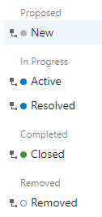

#### Rule requirements 

To ensure approval before active work, define the following rules:  

- Require the *Approved By* field to be filled in when the State moves from *New* to *Active*  
- Restrict users who aren't in the *Team Leads Group* from filling in the *Approved By* field  
- Clear the *Approved By* field when the State moves to *New* or *Removed*   

#### Rule definitions  

The rule requirements translate to the following four rule definitions. 

---
:::row:::
   :::column span="":::
      **Rule name**
   :::column-end:::
   :::column span="":::
      **Condition**
   :::column-end:::
   :::column span="2":::
      **Actions**
   :::column-end:::
:::row-end:::  
---  
:::row:::
   :::column span="":::
      **Approved By cleared when New** 
   :::column-end:::
   :::column span="":::
      When `A work item state changes to New`
   :::column-end:::
   :::column span="2":::
      Then `Clear the value of Approved By`  
   :::column-end:::
:::row-end:::  
:::row:::
   :::column span="":::
      **Approved By cleared when Removed** 
   :::column-end:::
   :::column span="":::
      When `A work item state changes to Removed`
   :::column-end:::
   :::column span="2":::
      Then `Clear the value of Approved By`  
   :::column-end:::
:::row-end:::  
:::row:::
   :::column span="":::
      **Approved By Read-only** 
   :::column-end:::
   :::column span="":::
      When `Current user is not member of group Team Leads Group`
   :::column-end:::
   :::column span="2":::
      Then `Make read-only Approved By`  
   :::column-end:::
:::row-end:::  
:::row:::
   :::column span="":::
      **Approved By required** 
   :::column-end:::
   :::column span="":::
      When `A work item state changes from New to Active`
   :::column-end:::
   :::column span="2":::
      Then `Make required Approved By`  
   :::column-end:::
:::row-end:::  

---

::: moniker range=">= azure-devops-2020"

## Restrict state transitions 

When you specify the condition, `A work item state moved from ...`, you can specify only that condition. You can specify up to 10 actions.  
::: moniker-end
::: moniker range="azure-devops-2020"
> [!NOTE]   
> This feature requires Azure DevOps Server 2020.1 update or later version.
::: moniker-end

::: moniker range=">= azure-devops-2020"

#### Example of restricting state transitions and Approved state

The following workflow states are defined for the User Story. The *New*, *Resolved*, and *Removed* inherited states are hidden. Instead, *Proposed*, *In Review*, and *Cut* States are used. In addition, three more States are defined: *Investigate*, *Design*, and *Approved*. These States should follow the sequence as shown in the following image. 

> [!div class="mx-imgBorder"]  
> 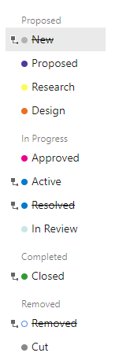

Without any restrictions, users can move from one State to any other State, both forward and backward within the sequence. 

#### Rule requirements 

To support a more controlled workflow, the business group decided to institute rules that support the following forward and reverse state transitions on the User Story work item type.

|State |Transition rule |
|---------|---------|
|Proposed  | Can only move to *Research* and *Cut*         |
|Research  | Can only move to *Design* and *Cut*         |
|Design    | Can only move to *Research*, *Approved*, and *Cut*         |
|Approved    | Can only move to *Design*, *Active*, and *Cut*        |
|Active    | Can only move to *In Review*         |
|In Review     | Can only move to *Active* (More work found), *Closed* or *Cut*         |
|Closed    | Can move to *Research*, *Design*, *Active*, *In Review* (Allows for cases where user closed the work item in error)        |
|Cut   | can only move to *Proposed*        |

> [!NOTE]   
> When you restrict state transitions, account for cases where a user might move a state in error. Ensure users can recover gracefully.

Additionally, the business group wants to apply the following rules for required fields:

- Require the *Approved By* field to be filled in when the state moves from *Approved* to *Active*.
- Allow only users in the *Authorized Approvers* group to fill in the *Approved By* field.
- Clear the *Approved By* field when the state moves to *Cut*.
- Require the *Acceptance Criteria* field to be filled in when the state moves to *Active*.
 
#### Rule definitions 

To implement the previously mentioned restrictions, the process administrator adds a custom *Approved By* identity field, an *Authorized Approvers* security group, and the following rules. 

---
:::row:::
   :::column span="":::
      **Rule name**
   :::column-end:::
   :::column span="":::
      **Condition**
   :::column-end:::
   :::column span="2":::
      **Actions**
   :::column-end:::
:::row-end:::  
---  
:::row:::
   :::column span="":::
      **Proposed state** 
   :::column-end:::
   :::column span="":::
      When `A work item state moved from Proposed`
   :::column-end:::
   :::column span="2":::
      Then `Restrict the state transition to Design`  
      And `Restrict the state transition to Approved`  
      And `Restrict the state transition to Active`  
      And `Restrict the state transition to In Review`  
      And `Restrict the state transition to Closed`  
   :::column-end:::
:::row-end:::  
:::row:::
   :::column span="":::
      **Research state** 
   :::column-end:::
   :::column span="":::
      When `A work item state moved from Research`
   :::column-end:::
   :::column span="2":::
      Then `Restrict the state transition to Proposed`  
      And `Restrict the state transition to Approved`  
      And `Restrict the state transition to Active`  
      And `Restrict the state transition to In Review`  
      And `Restrict the state transition to Closed`  
   :::column-end:::
:::row-end:::  
:::row:::
   :::column span="":::
      **Design state** 
   :::column-end:::
   :::column span="":::
      When `A work item state moved from Design`
   :::column-end:::
   :::column span="2":::
      Then `Restrict the state transition to Proposed`  
      And `Restrict the state transition to Research`  
      And `Restrict the state transition to Active`  
      And `Restrict the state transition to In Review`  
      And `Restrict the state transition to Closed`  
   :::column-end:::
:::row-end:::  
:::row:::
   :::column span="":::
      **Approved state** 
   :::column-end:::
   :::column span="":::
      When `A work item state moved from Approved`  
   :::column-end:::
   :::column span="2":::
      Then `Restrict the state transition to Proposed`  
      And `Restrict the state transition to Research`  
      And `Restrict the state transition to Design`  
      And `Restrict the state transition to In Review`  
      And `Restrict the state transition to Closed`  
   :::column-end:::
:::row-end:::  
:::row:::
   :::column span="":::
      **Active state**
   :::column-end:::
   :::column span="":::
      When `A work item state moved from Active`  
   :::column-end:::
   :::column span="2":::
      Then `Restrict the state transition to Proposed`  
      And `Restrict the state transition to Research`  
      And `Restrict the state transition to Design`  
      And `Restrict the state transition to Approved`  
      And `Restrict the state transition to Closed`  
   :::column-end:::
:::row-end:::  
:::row:::
   :::column span="":::
      **In Review state** 
   :::column-end:::
   :::column span="":::
      When `A work item state moved from In Review`  
   :::column-end:::
   :::column span="2":::
      Then `Restrict the state transition to Proposed`  
      And `Restrict the state transition to Research`  
      And `Restrict the state transition to Design`  
      And `Restrict the state transition to Approved`  
   :::column-end:::
:::row-end:::  
:::row:::
   :::column span="":::
      **Closed state** 
   :::column-end:::
   :::column span="":::
      When `A work item state moved from Closed`  
   :::column-end:::
   :::column span="2":::
      Then `Restrict the state transition to Proposed`  
      And `Restrict the state transition to Cut`  
   :::column-end:::
:::row-end:::  
:::row:::
   :::column span="":::
      **Cut state** 
   :::column-end:::
   :::column span="":::
      When `A work item state moved from Cut`  
   :::column-end:::
   :::column span="2":::
      Then `Restrict the state transition to Research`  
      And `Restrict the state transition to Design`  
      And `Restrict the state transition to Approved`  
      And `Restrict the state transition to Active`  
      And `Restrict the state transition to In Review`  
      And `Restrict the state transition to Closed`  
   :::column-end:::
:::row-end::: 
:::row:::
   :::column span="":::
      **Approved state required fields**
   :::column-end:::
   :::column span="":::
      When `A work item changes from Approved to Active`  
   :::column-end:::
   :::column span="2":::
      Then `Make required Acceptance Criteria`  
      And `Make required Approved By`  
   :::column-end:::
:::row-end:::  
:::row:::
   :::column span="":::
      **Authorized Approvers**
   :::column-end:::
   :::column span="":::
      When `Current user is not a member of Authorized Approvers`  
   :::column-end:::
   :::column span="2":::
      Then `Make read-only Approved By`  
   :::column-end:::
:::row-end:::  
:::row:::
   :::column span="":::
      **Clear Approved By field**
   :::column-end:::
   :::column span="":::
      When `A work item state changes to Cut`  
   :::column-end:::
   :::column span="2":::
      Then `Clear the value of Approved By`  
   :::column-end:::
:::row-end:::  
---

#### Verify state transition restrictions 

Once you define the rules for the process and update the project, refresh your browser. Verify the operations through the work item form and the browser.

For the rules defined in the previous table, check the State drop-down menus. Open the board and ensure you can move from one state to another.

|**Proposed**|**Research**|**Design**|**Approved**|    
|:----------:|:----------:|:--------:|:--------:|    
|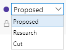 |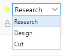 |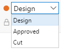 |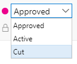 |
|**Active**|**In Review**|**Closed**|**Cut**|   
|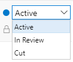 |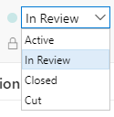 |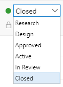|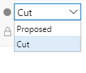 |

::: moniker-end

::: moniker range="azure-devops"

## Restrict state transition based on user or group membership 

When you specify one of the two conditions based on user or group membership, `Current user is member of group ...` or `Current user is not member of group ...`, you can only specify one condition. Additionally, if you specify the action `Restrict the transition to state...`, you can only specify one action. 

[!INCLUDE [temp](../../../boards/includes/note-work-item-caching-rules-simple.md)]

::: moniker-end

## Automate state transitions of parent work items 

To automate State transitions for parent work items that are based on the State assignments of their child work items, see [Automate work item state transitions](../../../boards/backlogs/automate-work-item-state-transitions.md).

::: moniker range=">= azure-devops-2020"

## Automate reassignment based on state change 

The Agile process bug work item type previously had a rule that reassigned the bug to its creator. We removed this rule from the default system process. You can reinstate the rule or add a similar rule to other work item types using the following condition and action: 

**When** `A work item state changes to` *Resolved* **Then** `Copy the value from `*Created By* **to** *Assigned To*.

::: moniker-end

## Related articles

- [Add a custom rule](custom-rules.md)  
- [Work item form caching](troubleshoot-work-item-form-caching-issues.md)  
- [Access, export, and filter audit logs](../../audit/azure-devops-auditing.md)
- [Customize a workflow](customize-process-workflow.md) 

<!---
VS1640113: It is not allowed to have multiple rules with the same action type using the same conditions. The rules ['Transition restriction', 'Active state'] have the action type 'ProhibitedValues' using the same conditions. Change the conditions of the rule to fix this error.
--> 
