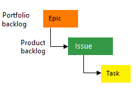
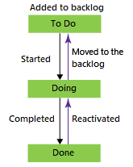

# Change a project process from Basic to Agile

[!INCLUDE [version-gt-eq-2020](../../../includes/version-gt-eq-2020.md)]

If you want to switch from the Basic process to an inherited Agile process for your project, follow the steps in this article.

Before you change your process, you should learn about the new process you're switching to. The Basic and Agile processes have the same Task and Epic work item types, but most of the values for the State and Reason fields are different.

|  Process | Work item types | Workflow |
|------|---------|---------|
|**Basic** | ||
|**Agile** | ||

Some of the benefits of changing your process from Basic to Agile are:

- You can use separate bugs to track code defects, instead of issues and user stories
- You can follow the Agile workflow states, which are different from the Basic process states
- You can access both Feature and Epic portfolio backlogs, which help you organize your work items
- You can comply with your organization’s requirement to use a customized inherited process based on the Agile process

For more information, see [About processes and process templates](../../../boards/work-items/guidance/choose-process.md).

<!--- QUESTION: What happens to Analytics data when you do this change?  -->

[!INCLUDE [temp](../includes/prerequisites-change-process.md)]

[!INCLUDE [image-differences](../../../includes/image-differences.md)]

## Change the process

1. Sign in to your organization: ```https://dev.azure.com/{yourorganization}```.

2. Select :::image type="icon" source="../../../media/icons/gear-icon.png" border="false"::: **Organization settings**.

   :::image type="content" source="../../../media/open-organization-settings.png" alt-text="Screenshot of highlighted Organization settings button.":::
3. Select **Process**, and then choose **Basic**.

   :::image type="content" source="../../../media/settings/open-process-page-basic.png" alt-text="Screenshot of highlighted Process tab.":::

4. Choose **Projects**.

   :::image type="content" source="media/change-process/choose-basic-process-projects.png" alt-text="Screenshot of highlighted Projects tab.":::

5. For the project you want to change, select the :::image type="icon" source="../../../media/icons/actions-icon.png" border="false"::: actions icon and select **Change process** and follow the steps in the wizard.

   :::image type="content" source="media/change-process/change-process-basic-to-agile.png" alt-text="Screenshot of highlighted Change process selection.":::

6. Choose **Agile** from the dropdown menu, and then select **Save**.

   :::image type="content" source="media/change-process/change-process-basic-to-agile-wizard-choose-agile.png" alt-text="Screenshot of Agile process selection.":::

   The wizard displays the following information. Notice the steps to manually update your work items and board settings and **Close** the window when you're done.

   :::image type="content" source="media/change-process/change-process-basic-to-agile-wizard-choose-agile-complete.png" alt-text="Screenshot of completion page.":::

7. (Optional) If you had existing work items, manually update work items and board settings.
   1. Update the column to state mapping for each team Kanban board.
   2. Update existing work items using the work item types set by the target process.
   3. Update existing work items using the correct state model of the target process.

## Update Kanban board column-to-state settings

You can customize Kanban boards to display intermediate columns. For each column added, you must choose a valid workflow state for the work item types displayed on the board. To learn more, see [Workflow states & state categories](../../../boards/work-items/workflow-and-state-categories.md).

1. For each team, [open your Kanban board](../../../boards/get-started/plan-track-work.md), and then select **Correct this now** or select the :::image type="icon" source="../../../media/icons/blue-gear.png" border="false"::: gear icon to configure the board settings.

   :::image type="content" source="media/change-process/open-kanban-board.png" alt-text="Screenshot of opened Kanban board.":::

   The Settings dialog opens. Those tabs that display a :::image type="icon" source="../../../media/icons/required-icon.png" border="false"::: required icon need correction.

   :::image type="content" source="media/change-process/kanban-stories-column-settings-to-correct.png" alt-text="Screenshot of Column dialog with settings to correct.":::

2. Rename each column and choose the correct state for each column so that the column-to-state mapping is correct. As needed, add one or more columns. **Save** your work when you're done. For more information, see [Manage columns on your Kanban board.](../../../boards/boards/add-columns.md)

## Update work items

1. [Create a query](../../../boards/queries/using-queries.md) to get a list of all Issues, Tasks, and Epics.

   :::image type="content" source="media/change-process/query-basic-items.png" alt-text="Screenshot of querying all items.":::

2. Edit your columns to be sure you show the State and Reason fields. Select the **Sorting** tab, and then set it to sort the list by work item type and state value.

   :::image type="content" source="media/change-process/query-column-sort.png" alt-text="Screenshot of column options dialog, sort tab.":::

   For more information, see [Bulk add and modify work items in Excel](../../../boards/boards/add-columns.md).

3. Select **Results** to show the list of work items.

4. Highlight all Issues, choose the :::image type="icon" source="../../../media/icons/actions-icon.png" border="false"::: actions icon, select **Change type**, and change the type to User Story and **Save**.

   :::image type="content" source="media/change-process/change-type-to-user-story.png" alt-text="Screenshot of the Change type dialog.":::

   You might receive errors where the work item type and the state are mismatched. In that case, you can't save your changes until you update the state, which is described in the next step.

   :::image type="content" source="media/change-process/edit-doing-work-item-state.png" alt-text="Screenshot showing error state of changed work item type.":::

5. Sort the work items by the State column, highlight all work items of the same State, such as Doing, choose the :::image type="icon" source="../../../media/icons/actions-icon.png" border="false"::: actions icon, and then select **Edit**. Add the State field and select Active for the value. For more information, see [Bulk edit work items](../../../boards/backlogs/bulk-modify-work-items.md).

   :::image type="content" source="media/change-process/edit-doing-work-item-state.png" alt-text="Screenshot of editing a work item state.":::

6. Repeat these steps for the Done state, changing it to Closed; and the To Do state, changing it to New.

7.  When you're done, **Save** your changes.

## Verify your changes

1. Go to your team backlog and review the user stories.

   :::image type="content" source="media/change-process/backlog-basic-to-agile.png" alt-text="Screenshot of team backlog.":::

   To change any user stories to bugs, do so now using [bulk update](../../../boards/boards/add-columns.md) and update the **Change type**. If you want to show bugs at the same level as user stories, make that change now. For more information, see [Show bugs on backlogs and boards](../show-bugs-on-backlog.md).

2. Go to your team board and verify that the column settings are valid.

    :::image type="content" source="media/change-process/board-user-story.png" alt-text="Screenshot of board columns.":::

## Related articles

- [Bulk modify work items](../../../boards/backlogs/bulk-modify-work-items.md)
- [Create an inherited process](./manage-process.md#create-an-inherited-process)
- [Add and manage work item types](./customize-process-work-item-type.md)
- [Show bugs on backlogs and boards](../show-bugs-on-backlog.md)
- [Create and saved managed queries with the query editor](../../../boards/queries/using-queries.md)
