# Change a project process from Basic to Agile

[!INCLUDE [temp](../../../_shared/version-vsts-only.md)]

You can change a project based on the Basic process to use to use an inherited Agile process.  This article provides the steps needed to make this change. 

[!INCLUDE [temp](../_shared/cloud-only-feature.md)]

Prior to making this change, we recommend you familiarize yourself with the process you are changing to. The Task and Epic work item types are the same for both Basic and Agile processes. Most State and Reason field values, however, are different.

|  Process | Work item types | Workflow |
|------|---------|---------|
|**Basic** | ||
|**Agile** | 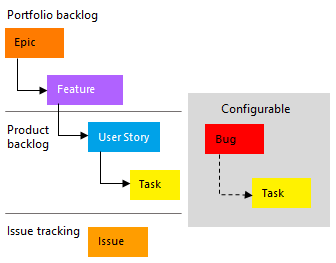|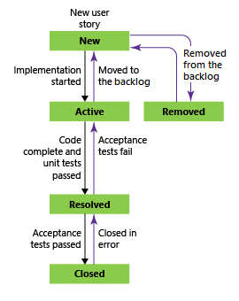|

For an overview of all processes, see [Choose a process](../../../boards/work-items/guidance/choose-process.md).

Reasons you might want to change your process from Basic to Agile:

- You want to track code defects using bugs separate from issues and user stories
- You want to use the Agile workflow states in place of those defined for the Basic process
- You want access to both Feature and Epic portfolio backlogs to organize your work items
- Your organization is requiring everyone to standardize their tracking with a customized inherited process based on the Agile process.

[!INCLUDE [temp](../_shared/change-process-manual-steps.md)]

<!--- QUESTION: What happens to Analytics data when you do this change?  -->

[!INCLUDE [temp](../_shared/prerequisites-change-process.md)]

[!INCLUDE [temp](../_shared/open-process-admin-context-ts-only.md)]

## Change the process

1. Choose the process that contains the project you want to change. To change from Basic to Agile, choose **Basic**.

> [!div class="mx-imgBorder"]  
> 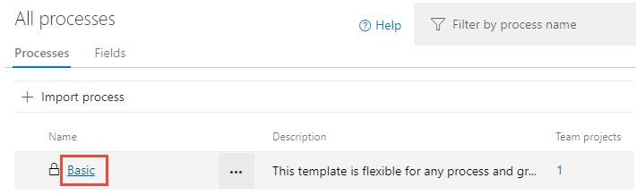

1. Choose **Projects**.

> [!div class="mx-imgBorder"]  
> 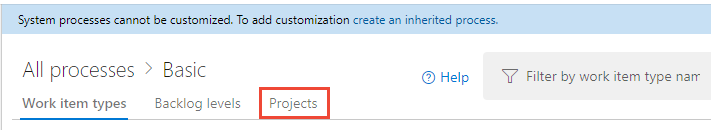

1. For the project you want to change, choose the  actions icon and select **Change process** and follow the steps in the wizard.

> [!div class="mx-imgBorder"]  
> 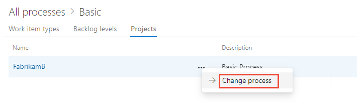

1. Choose the Agile process that you want to change to and then choose **Save**. You can select the system Agile process or an inherited Agile process.

> [!div class="mx-imgBorder"]  
> 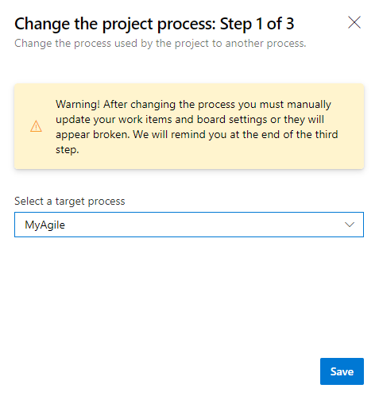

1. Upon completion, the wizard displays the following information. Make a note of the steps to follow and then choose **Close**.

    > [!div class="mx-imgBorder"]  
    > 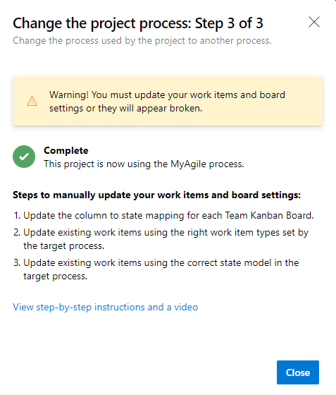

    Steps to manually update your work items and board settings:
    - Update the column to state mapping for each team Kanban board.
    - Update existing work items using the work item types set by the target process.
    - Update existing work items using the correct state model of the target process.

## Update Kanban board column-to-state settings

You can customize Kanban boards to display intermediate columns. For each column added, you must choose a valid workflow state for the work item types displayed on the board. To learn more, see [Workflow states & state categories](../../../boards/work-items/workflow-and-state-categories.md).

1. For each team, [open your Kanban board](../../../boards/get-started/plan-track-work.md).

   > [!div class="mx-imgBorder"]  
   > 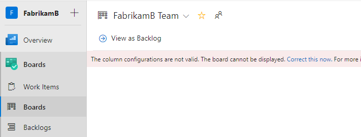

1. Choose the **Correct this now** link or the  gear icon to configure the board settings.

   The Settings dialog opens. Those tabs that display a  required icon need correction.

   > [!div class="mx-imgBorder"]  
   > 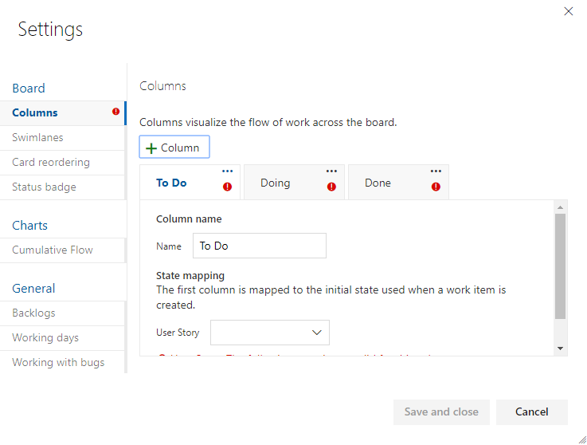

   Rename each column and choose the correct state for each column so that the column-to-state mapping is correct. As needed, add one or more columns. When done, choose **Save and close**.

   > [!div class="mx-imgBorder"]  
   > 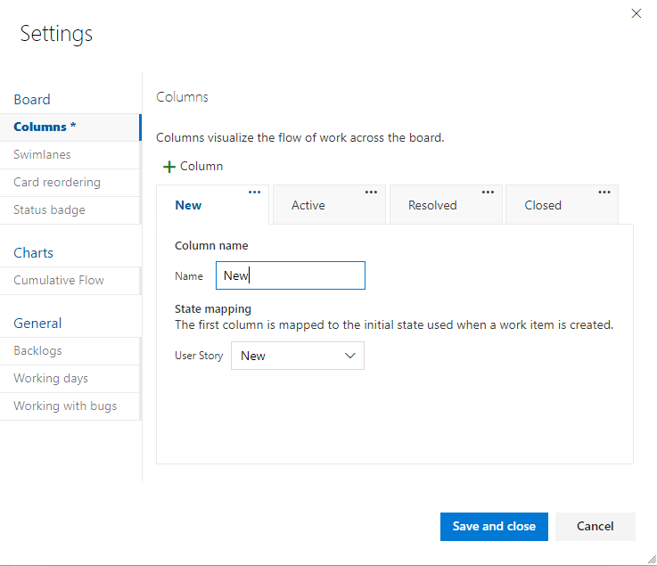

<!---
  > [!div class="mx-imgBorder"]
  > 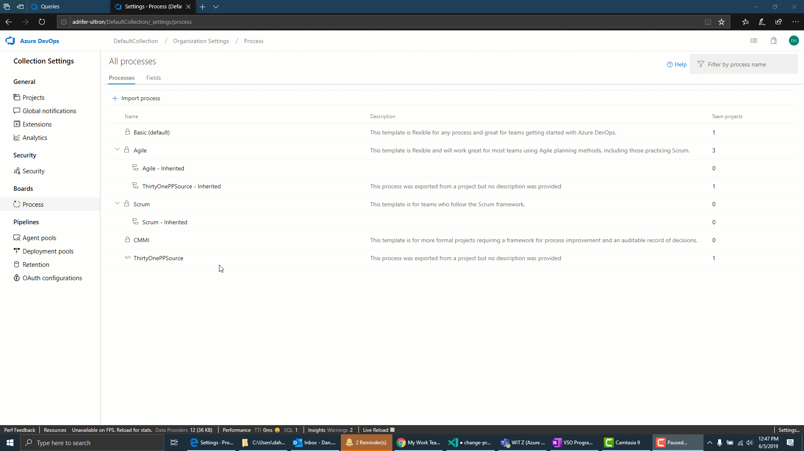

5. Update the [board settings](../../../boards/get-started/customize-boards.md) for each board so that the column to state mapping is correct.

  > [!div class="mx-imgBorder"]
  > 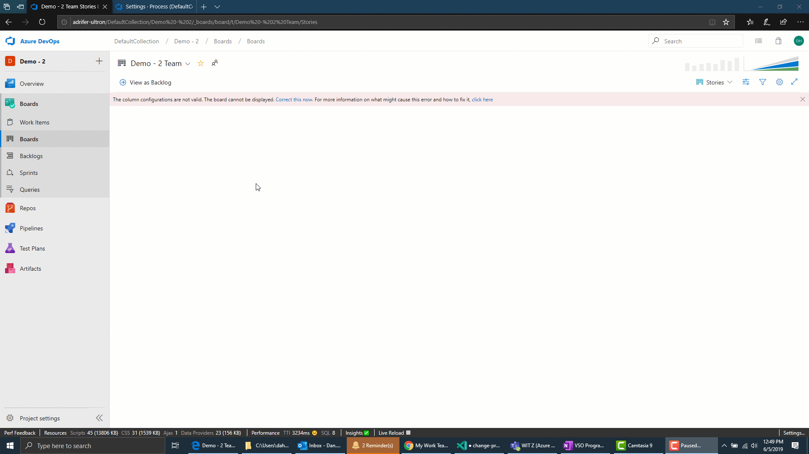

-->

## Update work items

Your next step is to bulk update work items. The recommended sequence is:

- Create a work item query that displays all work items
- Perform a bulk update to change the work item type of Issue work items to User Story
- Perform a bulk update on all States to change from Basic states&mdash;To Do, Doing, and Done&mdash;to Agile process states&mdash;New, Active, and Closed.

1. [Create a query](../../../boards/queries/using-queries.md) to get a list of all Issues, Tasks, and Epics.

   > [!div class="mx-imgBorder"]  
   > 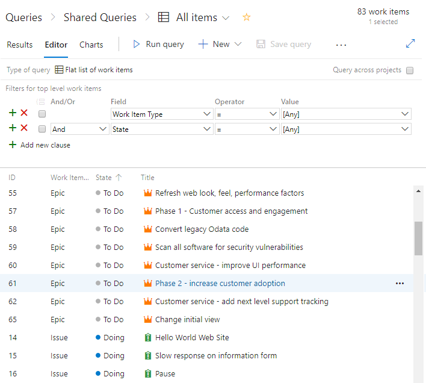

1. Choose the  actions icon and then select **Column options**. Choose to show the State and Reason fields. Choose the **Sort** tab, and set it to sort the list by work item type and state value.

   > [!div class="mx-imgBorder"]  
   > 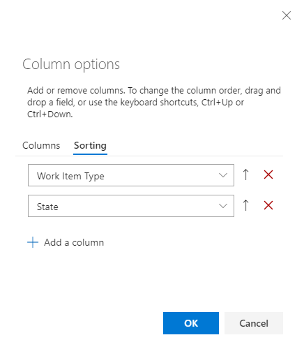

1. Choose **Results** to just show the list of work items.

1. Highlight all Issues, choose the  actions icon, select **Change type**, and change the type to User Story.

   > [!div class="mx-imgBorder"]  
   > 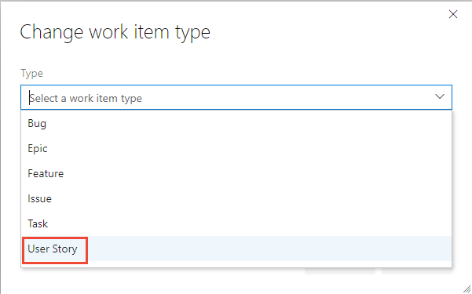

   For more details, see [Move, change, or delete work items, Change the work item type](../../../boards/backlogs/remove-delete-work-items.md#change-the-work-item-type).

   Choose the  actions icon and select **Save items**.

   It's possible that you will receive errors where the work item type and the state are mismatched. In that case, you can't save your changes until you update the state as described in the next step.

   > [!div class="mx-imgBorder"]  
   > 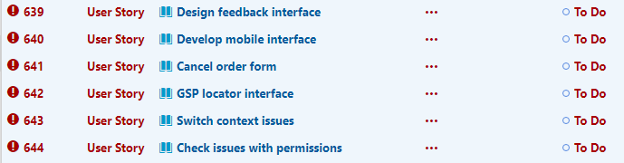

1. Sort the work items by the State column, highlight all work items of the same State, such as Doing, choose the  actions icon, and then select **Edit**. Add the State field and select Active for the value. For details, see [Bulk edit work items](../../../boards/backlogs/bulk-modify-work-items.md).

   > [!div class="mx-imgBorder"]  
   > 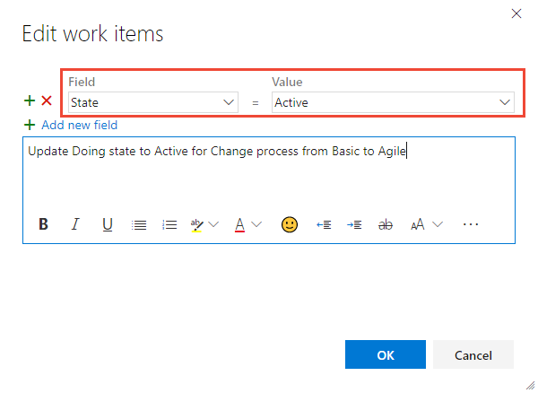

1. Choose the  actions icon and select **Save items**.

1. Repeat these steps for the Done state, changing to Closed; and the To Do state, changing to New.

1. When done, make sure you save all your changes. Choose the  actions icon and select **Save items**.

<!---

  > [!div class="mx-imgBorder"]  
  > 

-->

## Verify your changes

1. Go to your team backlog and review the user stories.

   > [!div class="mx-imgBorder"]  
   > 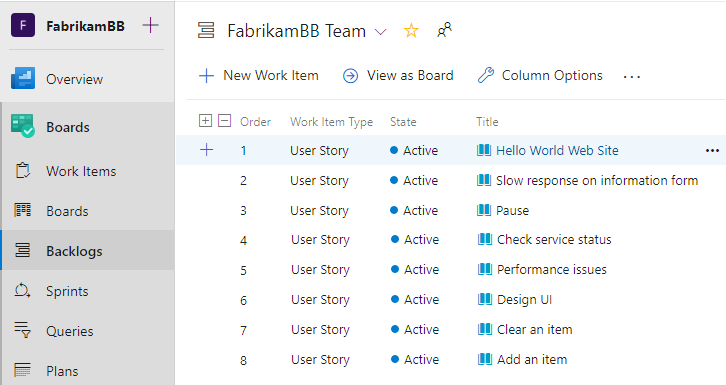

   If you want to change any user stories to bugs, do that now using bulk update and **Change type**. If you want to show bugs at the same level as user stories, then make that change now. For details, see [Show bugs on backlogs and boards](../show-bugs-on-backlog.md).

1. Go to your team board and verify that the column settings are valid.

   > [!div class="mx-imgBorder"]  
   > 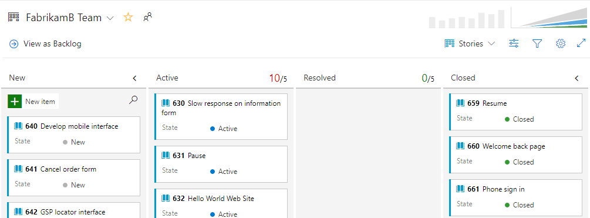

   To add columns or change column names, see [Add columns to your Kanban board](../../../boards/boards/add-columns.md).

## Optional updates

After changing the process, you may want to make additional updates as follows:

- [Change the project name](../../../organizations/projects/rename-project.md)
- [Update your project summary or vision](../../../organizations/projects/project-vision-status.md)

## Related articles

- [Bulk modify work items](../../../boards/backlogs/bulk-modify-work-items.md)
- [Change the process used by a project](./manage-process.md#change-the-process-used-by-a-project)
- [Create an inherited process](./manage-process.md#create-an-inherited-process)
- [Add and manage work item types](./customize-process-wit.md)
- [Show bugs on backlogs and boards](../show-bugs-on-backlog.md)
- [Customize your boards](../../../boards/get-started/customize-boards.md)
- [Create and saved managed queries with the query editor](../../../boards/queries/using-queries.md)
