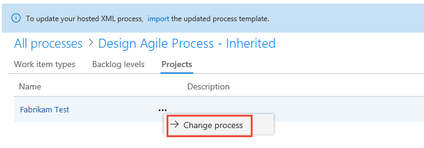

# Change a project from Hosted XML to an inherited process 

[!INCLUDE [temp](../../../boards/_shared/version-vsts-only.md)]

Once you've [cloned your Hosted XML process to an inherited process](upgrade-hosted-to-inherited.md), you can change the project(s) from the Hosted XML process to the inherited process. You change a project from a Hosted XML process to its derived inherited process to start customizing the process through the user interface.  

> [!CAUTION] 
> Choosing to clone a project from a Hosted XML process model to an inherited process is an irreversible operation. Before you change the process of an existing project from Hosted XML to the cloned inherited process, review [Supported operations when moving from Hosted XML process to inherited process](upgrade-support-hosted-to-inherited.md) to understand which customizations are preserved and which are not before you change the process of a project from Hosted XML to an inherited process. Also, [create a test project](upgrade-hosted-to-inherited.md#verify) to verify the customizations preserved or reapplied to a process.

## Prerequisites 
- You must be a member of the Project Administrators group for the project you want to change, or a member of the Project Collection Administrators group.

[!INCLUDE [temp](../_shared/open-process-admin-context-ts-only.md)]

## Change the project process to an inherited process 

After you've verified your customizations, you can now apply the inherited process to your existing project. 

0. From **Process**, choose the original Hosted XML process, then choose the **Projects** page. 

	> [!div class="mx-imgBorder"]  
	> 

0. Open the &hellip; context menu for the project and choose the **Change process**&hellip; option. 

	Here we open the menu for the Fabrikam Test project. 

	> [!div class="mx-imgBorder"]  
	> 
	
0. Choose the inherited process that you created. The system lists only those processes that are valid for the selected project.	
  
	> [!div class="mx-imgBorder"]  
	>  

0. Choose **Ok**. 

## Related articles
- [Supported operations when moving from Hosted XML process to an inherited process](upgrade-support-hosted-to-inherited.md)
- [Clone a Hosted XML process to an Inheritance process](upgrade-hosted-to-inherited.md) 

