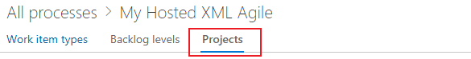
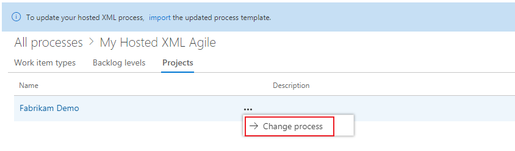
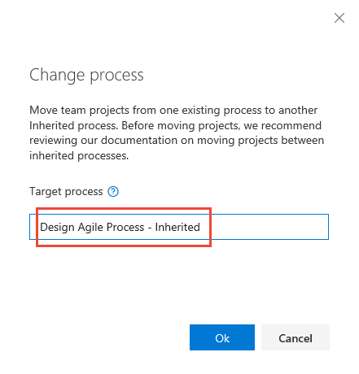

# Change a project from Hosted XML to an inherited process 

[!INCLUDE [version-eq-azure-devops](../../../includes/version-eq-azure-devops.md)]

Once you [clone your Hosted XML process to an inherited process](upgrade-hosted-to-inherited.md), you can change the project from the Hosted XML process to the inherited process. You change a project from a Hosted XML process to its derived inherited process to start customizing the process through the user interface.  

> [!CAUTION] 
> Choosing to clone a project from a Hosted XML process model to an inherited process is an irreversible operation. Before you change the process of an existing project from Hosted XML to the cloned inherited process, review [Supported operations for moving from Hosted XML to an inherited process](#supported-operations-for-moving-from-hosted-xml-to-an-inherited-process), further in this article, to understand which customizations get preserved and which aren't before you change the process of a project from Hosted XML to an inherited process. Also, [create a test project](upgrade-hosted-to-inherited.md#verify) to verify the customizations preserved or reapplied to a process.

## Prerequisites 

[!INCLUDE [prerequisites-change-process](../includes/prerequisites-change-process.md)]

<a id="hosted-xml-process-model">  </a>

## Supported operations for moving from Hosted XML to an inherited process

Upgrading a Hosted XML process model to an inherited process allows you to customize your work tracking system through the user interface. For details on supported customizations, see [About process customization and inherited processes](inheritance-process-model.md).

While the clone process preserves most work tracking customizations, some advanced customizations from the Hosted XML process might not be supported. Additionally, certain customizations must be manually recreated in the inherited process.

### Customizations preserved during clone

When you clone a Hosted XML process to an inherited process, the customizations listed in the following table are preserved.  

|Artifact| Description |
|------|---------|
| Work item types (WITs) | All system and custom WITs are preserved. Customizations made to WIT color and icon are preserved.   | 
| Work item fields  | All custom fields are preserved. Fields that reference global lists are updated with picklists. All default values are ignored. To learn more about supported field customizations, see [About process customization and inherited processes, Field customizations](inheritance-process-model.md#field-customizations). |  
| Workflow states | All system and custom workflow states are preserved. |
| Workflow state categories | All customizations made to the ProcessConfiguration XML file to map a workflow state to a state category (*Proposed, In Progress, Resolved, Completed*) are preserved. Only one workflow state can be assigned to the *Completed* state category. If you assigned a custom workflow state to the *Completed* state category, it is preserved upon clone.<br/><br/>Any workflow state for a work item type that isn't included in a backlog level gets assigned to the *In Progress* state category. Check all custom workflow states post clone. For more information, see [Workflow states and state categories](../../../boards/work-items/workflow-and-state-categories.md). |
| Work item form layout  | A best effort is made to preserve the customizations made to the web form layout. However, any customizations made to the header area are ignored. Specifically, the **Weblayout** `ShowEmptyReadOnlyFields` attribute assignment is ignored. | 
| Backlog levels | Additions and customizations made to the product backlog and  portfolio backlog levels are preserved.  |
| Global lists | Global lists are converted to picklists for individual fields. |  
| Default properties | The default properties set for teams that you add to a project are preserved as documented in [Process configuration XML element reference, Specify properties, and behaviors](../../../reference/xml/process-configuration-xml-element.md#specify-properties-and-behaviors). | 

### Customizations ignored during clone

|Artifact| Description |
|------|---------|
| Header area customization  | Any customizations made to the header area within the work item form are ignored. The header area, as shown in the following image, gets managed by the system. Any customizations made within the **SystemControls** section of the **WebLayout** are ignored. <br/><br/> |
| Four column layout  and size | The inherited process supports a [a fixed relative sizing of three columns](inheritance-process-model.md#resizing) to a WIT layout, while the Hosted XML process supports up to four columns and allows you to set the first column as equal sized with the rest of the columns.  |
| Hide Details page in layout  | The inherited process ignores any customizations made to hide the Details page in a WIT layout. | 
| Workflow restriction | The inherited process follows an any-to-any workflow state transition. Any customizations that restrict the transition from one workflow state to another are ignored.  |
| Workflow state reasons  | Customized reasons added to workflow states are ignored. |
| Conditional picklists | Conditional picklists, also referred to as dependent or cascading picklists, are ignored. Multiple sets of allowed values per field are ignored. Picklists are defined for a field at the collection level and shared across processes and WITs.  | 
| Custom rules | All custom rules to fields and workflow are ignored.   | 
| Custom link controls  | Custom link controls are ignored. |
| Extensions | The inherited process supports an opt-out model for custom control extensions, while the Hosted XML process supports an opt-in model. This means that work item types defined within the cloned inherited process show all contributions from all installed and enabled extensions. You can selectively hide or remove them as needed. |
| Categories | Changes made to a [default category](/previous-versions/azure/devops/reference/xml/use-categories-to-group-work-item-types#process) are preserved, but any custom categories are ignored. Also note that system work item types such as Issue or Impediment aren't supported on a backlog level. | 
| Identity fields with string values | Lists that contain an identity value in ALLOWEDVALUES or PROHIBITEDVALUES are automatically converted into the Identity field type. Any other string values in the list are ignored. | 
| Test Steps | Test steps aren't supported in any work item type other than Test Case. | 

<a id="change-inherited-process"></a>

## Change the project process to an inherited process 

After you verify your customizations, you can apply the inherited process to your existing project. Do the following steps: 

1. Sign in to your organization (```https://dev.azure.com/{Your_Organization}```).
2. Select  **Organization settings**.
  
   	> [!div class="mx-imgBorder"]  
	> 

3. Select **Process** and choose the original Hosted XML process.
4. Select the **Projects** page. 

	> [!div class="mx-imgBorder"]  
	> 

5. Open the &hellip; context menu for the project and choose the **Change process**&hellip; option. 

	Here we open the menu for the Fabrikam Test project. 

	> [!div class="mx-imgBorder"]  
	> 
	
6. Choose the inherited process that you created. The system lists only those processes that are valid for the selected project.    
  
	> [!div class="mx-imgBorder"]  
	>  

7. Select **Ok**. 

[!INCLUDE [temp](../includes/post-upgrade-steps.md)]

## Related articles

- [About process customization and inherited processes](inheritance-process-model.md)  
